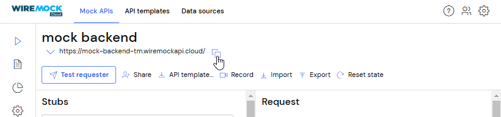
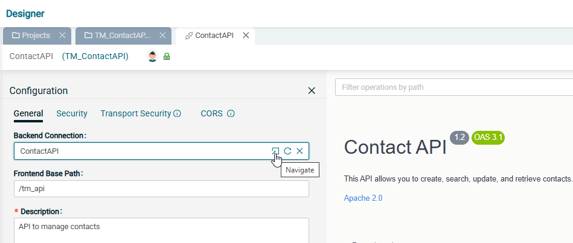
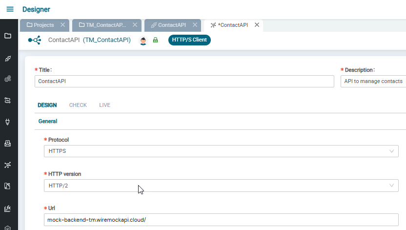
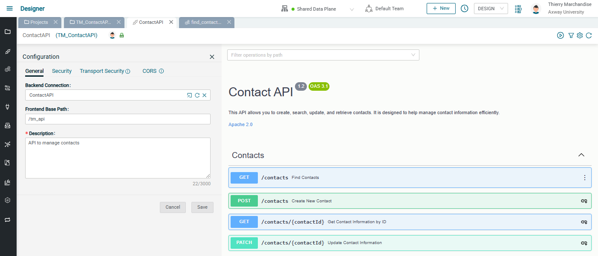
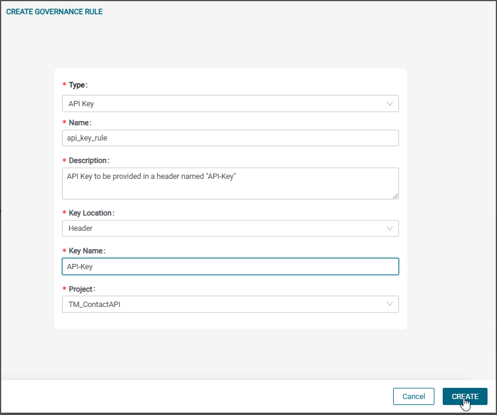

# Contact API Management Lab

## Introduction

In these labs, we'll create a Contact API to proxy a backend API. We will set up an API proxy that will handle both backend and frontend security. Also, we will implement one of the API operations with a custom integration, making the API operate in hybrid mode, mixing proxy mode and apification.

The API we are building will support the following operations:

* GET /contacts: Find Contacts (will be linked to an integration)
* POST /contacts: Create New Contact (proxy mode)
* GET /contacts/{contactId}: Get Contact Information by ID (proxy mode)
* PATCH /contacts/{contactId}: Update Contact Information (proxy mode)

This data flow is illustrated below:


In this set of labs, you will learn the following:

* How to proxy an existing backend API
* How to test backend connection and set backend API security to be used
* How to implement one of the API operations with a customized integration flow (apification)
* How to secure your API with an API Key
* How to manage consumer applications with API access and keys.

## Prerequisites

* Access to Amplify Fusion
  > If you do not have an account and need one, please send an email to **[amplify-integration-training@axway.com](mailto:amplify-integration-training@axway.com?subject=Amplify%20Integration%20-%20Training%20Environment%20Access%20Request&body=Hi%2C%0D%0A%0D%0ACould%20you%20provide%20me%20with%20access%20to%20an%20environment%20where%20I%20can%20practice%20the%20Amplify%20Integration%20e-Learning%20labs%20%3F%0D%0A%0D%0ABest%20Regards.%0D%0A)** with the subject line `Amplify Fusion Training Environment Access Request`
* Access the free [**WireMock**](https://login.wiremock.cloud/) to simulate backend APIs, or any other tool that can expose a test or mock backend API.

## Lab 1

Let's create a mock backend API in WireMock.

* Start creating a Mock API at <https://app.wiremock.cloud/mock-apis/create>
  * Choose the "Unstructured" option and click on "Create Mock API"
  * Set "mock backend" as the API name and click Save
* Click on Import and paste the content of this file **[ContactAPI.yaml](assets\ContactAPI.yaml)**.
  .

* Copy the generated base URL of the mock backend API
  

Now the mock backend API is ready.

## Lab 2

In this lab, we will proxy our backend API.

* Create a new project in Amplify Fusion to manage this API. Use a unique name in case you're not the only one doing this lab on your Amplify Fusion tenant (e.g., XX_ContactAPI with XX being your name or initials).\
  

* Create a new API (e.g., ContactAPI) by uploading this sample OpenAPI specification (OAS): **ContactAPI.yaml**.\
  

* Update the Backend Server URL to your mock backend API created in the previous lab
  

* Edit the API settings to set a front-end base path. Use a unique name in case you're not the only one doing this lab on your Amplify Fusion tenant (e.g., XX_api)
  

Your API proxy should look like this: \
  

Now, activate your API and test it:

* Enable your API on the data plane
  

* Copy the API base URL
  
  > Mouse over the link icon to see the URL and copy the link
  > Note that the URL corresponds to the API server of the selected data plane, followed by the base path you chose in one of the steps above

* Test every method from Postman or curl as follows:
  > Test the following operations after replacing `{{api_base_url}}` with the base URL you've just copied:
  * `curl --request GET   {{api_base_url}}/contacts --write-out "\n%{http_code}"`
  * `curl --request GET   {{api_base_url}}/contacts/142 --write-out "\n%{http_code}"`
  * `curl --request POST  {{api_base_url}}/contacts --data '{ "email": "bob.fellow@gmail.com", "firstName": "Bob", "lastName": "Fellow"}' --write-out "\n%{http_code}"`
  * `curl --request PATCH {{api_base_url}}/contacts/13 --data '{ "emailVerified": true }' --write-out "\n%{http_code}"`

## Lab 3

In this lab, we will see how we can handle backend security.

* Modify the mock backend API to add some security:
  * Open your mock API on WireMock
  * Click on settings and in "Mock API security", set:
    * Security type = `Header match`
    * Header = "`apikey`"
    * Predicate = `Equal to`
    * Value = "`Access2backend`"

    * Click on "save" just below.
* Test every method again from Postman or curl as follows, and make sure you get a security error (401).
* Go back to your API in your Amplify Fusion project in the Designer
* Deactivate the API from the data plane
* Navigate to the backend HTTP/S client connection from your API

* You see all details of the backend connection. Set the HTTP version to `HTTP/2`

* Set the client authentication to `API key` and provide the backend security API key details (location, key name, and value)

* Set a safe resource path to `/contacts` to be able to test the backend connection
* Click update
* Click on the Test button and make sure it is a success

* Go back to the API and activate it
* Test every method again from Postman or curl as follows, and make sure you now get success responses from the backend

## Lab 4

In this lab, we will see how to implement an API operation instead of simply proxying the backend. The implementation of the "Find Contacts" operation will consist of:

1. Enforcing a functional check of the input request: making sure at least one query parameter is provided
2. Calling the backend API only if the input request is functionally valid
3. Building customized responses based on the backend response, if any

Let's update the API to implement the "Find Contacts" operation:

* Go back to your API in your Amplify Fusion project in the Designer
* Deactivate the API from the data plane

* For the "GET /contacts - Find contacts" endpoint, use the button link integration on the right side of the operation title\
  
  * Choose to create a new Integration, give it a name and a description, and click on "Link Integration"
  
* The integration tab should open by itself. Click on the API Server component and check that the linked API operation is "GET /contacts"
* Expand the Operations component and its Status component to see the integration flow. You can add some labels to them.
  
* Click the first `+` button in Operations and add an If-Else component. Expand the If-Else and label it "check input query params"
  
* Click on Expression and add conditions to make sure at least one query parameter is provided (i.e., it is not null)
  
  > Make sure to select OR operators between each expression (leaving the AND operator would make all query parameters mandatory, while we just want at least one).
* Add an HTTP/S Client GET component if the expression is true
  
  * Expand the bottom panel
  * Select the `ContactAPI` backend connection (with WireMock details)
  * Expand the `HTTPSGetInput` and `HTTPSGetOutput` flyouts in the ACTION PROPERTIES section
  * On the input side (left side) of the pipeline:
    * Set the value of `HTTPSGetInput/basePath` to "`/contacts`"
    * Link query parameters from the input API request `find-contactsAPIServerRequest/queryParams` to the backend input request `HTTPSGetInput/queryParams`
  * On the output side (right side) of the pipeline:
    * Link backend output statusCode `HTTPSGetOutput/statusCode` to the output `status` variable
    * Right-click anywhere in the right-hand panel and select Extract, then paste in the following JSON that describes the currency converter API response object and click on Copy Node button:

        ```json
        {
            "contacts": [
                {
                    "id": 142,
                    "firstName": "Alice",
                    "lastName": "Smith",
                    "email": "alice.smith@gmail.com",
                    "emailVerified": true,
                    "creationDate": "2024-08-24"
                }
            ]
        }
        ```

      * Right-click again anywhere in the right-hand panel and select Paste, then name your variable `backendResponse`.
      * Drag a line from ACTION PROPERTIES `HTTPSGetOutput->response` to the `backendResponse` extract variable.
      * Right-click again anywhere in the right-hand panel and select Extract, then paste in the following JSON that describes the currency converter API response object and click on Copy Node button:

        ```json
        { 
          "code":"400", 
          "message":"Invalid date"
        }
        ```

      * Right-click again anywhere in the right-hand and select Paste, then name your variable `backendResponse`.
      * Drag a line from ACTION PROPERTIES `HTTPSGetOutput->response` to the `backendResponse` extract variable.
    * Right-click `HTTPSGetOutput` on the very right side and choose drop (to get rid of data that we don't need later in the integration).

  
  * Press Save and close the "HTTP/S Client GET" panel
* Add a Map component in the else route
  
  * Expand the bottom panel
  * Set values for the following output variables:
    * `find-contactsAPIServerResponse/400/code` = `400-Q`
    * `find-contactsAPIServerResponse/400/message` = `Missing at least one query parameter for your research`
    * `find-contactsAPIServerResponse/400/responseHeaders/Content-Type` = `application/json`
    * `status` = `400`
  
  * Press Save and close the map panel
* Add another Map component in the status=200 case
  
  * Expand the bottom panel
  * Set values for the following output variables:
  

Your API in hybrid mode (1 operation is apified, the others are simply proxied) should look like this: \
  

The integration linked to the first operation should look like this: \
  

* Go back to the API and activate it
* Test the GET /contacts with and without a query parameter and find out the results matching your implementation:
  > Test the following operations after replacing the `{{api_base_url}}` with the base URL of the API:

  * `curl --request GET   {{api_base_url}}/contacts?createdSince='2024-01-01' --write-out "\n%{http_code}"`
  * `curl --request GET   {{api_base_url}}/contacts --write-out "\n%{http_code}"`

## Lab 5

In this lab, we are going to see how we can set front-end security on our API and manage consumer application access and credentials.

Let's update the API to add front-end security:

* Go back to your API in your Amplify Fusion project in the Designer
* Deactivate the API from the data plane
* Open the Security tab in the API configuration
* Select API Key and add a new governance rule

* Create a Governance Rule for API key to be provided in a header named "api_key"

* Save the changes of the API configuration
* Activate your API on the data plane

Now that the API is secured, let's declare a consumer application, give access to our API, and generate an API key

> **Note**: For this part, you will need specific Manager privileges. You need to be able to access the Applications in the Manager Module and create a new application in DESIGN mode. If you can't do the following steps, please reach out to your environment administrator to either get your role updated accordingly if possible, or to have them do the following steps and give you the API key at the end.

* Open the Manager module and select Application in the left menu

* Create a new Application:
  * Give it a name and a description. Make sure the name is unique if other applications are created
  * Select your API to give access to it
  * Select the data plane where the API is deployed
  * Click on Add API Key

* Click on Save so that the key is generated and pushed to the linked data plane.
* Copy the API Key


Let's use our API Key and test our secure API:

* Test some of the API operations with the API Key and make sure you have success:
  > Use the following commands in Postman or curl and replace `{{api_base_url}}` with the base URL of the API and `{{api_key}}` with the key you just copied:
  * `curl --request GET   {{api_base_url}}/contacts?createdSince='2024-01-01' --header 'API-Key: {{api_key}}' --write-out "\n%{http_code}"`
  * `curl --request GET   {{api_base_url}}/contacts/142 --header 'API-Key: {{api_key}}' --write-out "\n%{http_code}"`
  * `curl --request POST  {{api_base_url}}/contacts --header 'API-Key: {{api_key}}' --data '{ "email": "bob.fellow@gmail.com", "firstName": "Bob", "lastName": "Fellow"}' --write-out "\n%{http_code}"`
  * `curl --request PATCH {{api_base_url}}/contacts/13 --header 'API-Key: {{api_key}}' --data '{ "emailVerified": true }' --write-out "\n%{http_code}"`

* Change the key value in your tests and make sure you get a security error (403)
