# Invoices APIfication Lab

## Introduction

In these labs, we'll implement an OpenAPI Specification with an integration to expose  invoices in a database. The integration will also orchestrate and aggregate the invoice data with a currency conversion service to convert the invoice amount to the desired currency as well as calculate a grand total amount of all the invoices that are in a given state.

The API we are building will support the following method

`GET /invoices?state=Overdue&currencycode=EUR`

and will have to provide responses like this:

```json
{   
    "success": true,
    "invoices": [
        {
            "invnum": "IN4001",
            "invdate": "2022-11-05",
            "businessname": "ACME Corp",
            "billtoname": "Cesar Bowman",
            "vat": "15%",
            "state": "Overdue",
            "currency": "EUR",
            "totalamt": 462.47
        },
        {
            "invnum": "IN4003",
            "invdate": "2023-01-04",
            "businessname": "Crypto Corp",
            "billtoname": "Jane Doe",
            "vat": "15%",
            "state": "Overdue",
            "currency": "EUR",
            "totalamt": 601.21
        }
    ],
    "currency": "EUR",
    "state": "Overdue",
    "grandTotal": 1063.68
}
```

A demo is shown below:


The integration linked to this API method will do the following:

* Parse the OpenAPI request with query parameters
* Query a PostgreSql Database for invoices with requested state
* Loop over the invoices
  * Make a REST API call to a currency conversion service to convert each invoice total amount to a desired currency
  * Total the amounts of each invoice
* Return an array of invoices with converted total amount as well as a grand total amount for all invoices

This data flow is illustrated below:

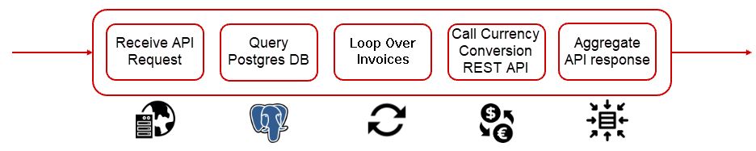

In this set of labs, you will learn the following:

* How to import an OpenAPI specifications to describe API methods to expose
* How to link an API method to an integration
* How to to configure a PostgreSql Database Connection
* How to use a PostgreSql Database Select component and plug to query a table with a where clause
* How to loop over an array (of invoices)
* How to configure an HTTP/S Client Connection (to a currency converter REST API that doesn't provide OpenAPI specifictions)
* How to use an HTTP/S Client Get component to call a currency conversion REST API
* How to use the Map component to:
  * Map data between objects
  * Use Map functions to set decimal precision and append to a JSON array object
* Set the response to the API we are exposing

The final integration is shown below:

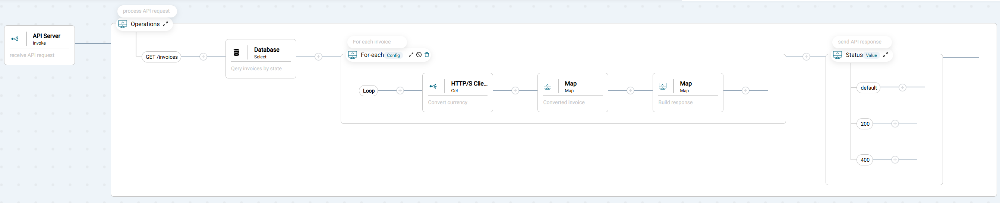

## Prerequisites

* Access to Amplify Fusion
  > If you do not have an account and need one, please send an email to **[amplify-integration-training@axway.com](mailto:amplify-integration-training@axway.com?subject=Amplify%20Integration%20-%20Training%20Environment%20Access%20Request&body=Hi%2C%0D%0A%0D%0ACould%20you%20provide%20me%20with%20access%20to%20an%20environment%20where%20I%20can%20practice%20the%20Amplify%20Integration%20e-Learning%20labs%20%3F%0D%0A%0D%0ABest%20Regards.%0D%0A)** with the subject line `Amplify Fusion Training Environment Access Request`
* A Postgres Database for storing our invoice records. In this lab, we have used [**Neon**](https://neon.tech)
* Access to the free [**API Layer Exchange Rates Data API**](https://apilayer.com/marketplace/exchangerates_data-api).
  > Make sure that you subscribe to the API and test the API in Postman so that you are familiar with how to call the API and see its response.

## Lab 1

Let's create the Postgres Database to hold our invoice records.

* Create an account at [**Neon**](https://neon.tech). 
* Create a project and write down the connection details from the psql URL "postgres://_`username`_:_`password`_@_`server`_/_`databaseName`_" for later 
* Select your project and navigate to the SQL Editor tab to run the following 3 database requests: 
  * Create an invoice table:

  ```sql
  CREATE TABLE Invoice (
    created_at      TIMESTAMPTZ NOT NULL DEFAULT NOW(),
    updated_at      TIMESTAMPTZ NOT NULL DEFAULT NOW(),
    invid           SERIAL PRIMARY KEY,
    invnum          VARCHAR(100) NOT NULL,
    invdate         DATE NOT NULL DEFAULT CURRENT_DATE,
    duedate         DATE NOT NULL DEFAULT CURRENT_DATE,
    businessname    VARCHAR(100) NOT NULL,
    businessaddress VARCHAR(100) NOT NULL,
    businessphone   VARCHAR(100) NOT NULL,
    billtoname      VARCHAR(100) NOT NULL,
    billtoaddress   VARCHAR(100) NOT NULL,
    vat             VARCHAR(100) NOT NULL,
    totalamt        MONEY NOT NULL,
    currency        VARCHAR(100) NOT NULL,
    state           VARCHAR(100) NOT NULL,
    notes           VARCHAR(100)
  );
  ```

  * Create multiple sample invoices (You can modify the values as you wish)

  ```sql
  INSERT INTO Invoice
    ( invnum,businessName,businessAddress,businessPhone,
      billToName,billToAddress,
      totalAmt,currency,vat,invdate,duedate,state
    )
  VALUES
    ( 'IN4001','ACME Corp','3734 Jacobs Street,Pittsburgh, PA, 15201 , USA','412-297-3188',
      'Cesar Bowman','3734 Jacobs Street,Pittsburgh, PA, 15201 , USA',
      500.00,'USD','15%',(select current_date - 90),(select current_date - 60),'Overdue'
    ),
    ( 'IN4002','Hillside Inc','144 Main St,NY, NY, 10021 , USA','212-444-1122',
      'John Smith','144 Main St,NY, BY, 10021 , USA',
      700.00,'USD','15%',(select current_date - 30),(select current_date - 1),'Paid'
    ),
    ( 'IN4003','Crypto Corp','19 Summer Ave,Miami, FL, 88088 , USA','212-444-1122',
      'Jane Doe','19 Summer Ave,Miami, FL, 88088 , USA',
      650.00,'USD','15%',(select current_date - 30),(select current_date -1),'Overdue'
    ),
    ( 'IN4004','Jamee Corp','111 French St,New Orelans, LA, 79890 , USA','212-444-1122',
      'John Smith','144 Main St,NY, BY, 10021 , USA',
      900.00,'USD','15%',(select current_date - 1),(select current_date + 30),'Sent'
    );
  ```

  * Check that invoices are available in the database :

  ```sql
  Select * from invoice
  ```

  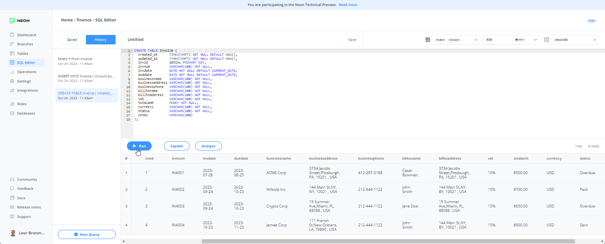

Now the database is ready.

## Lab 2

In this lab, we'll import our Invoice API, create our integration for the API endpoint and then we'll query our database for invoices with the given state.

* Create a new project in Amplify Fusion for this apificiation use-case. Use a unique name in case your not the only one to do this lab on your Amplify Fusion tenant (e.g. XX_apification with XX being your name or initials).\
  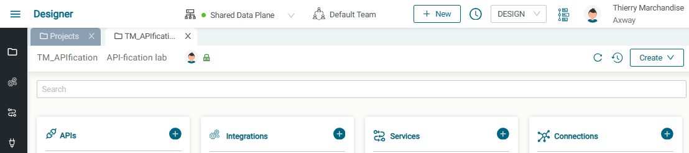
* Create a new API (e.g. InvoiceAPI) by uploading this sample OpenAPI specification (OAS) : **[InvoiceAPI-OAS.yaml](assets\InvoiceAPI-OAS.yaml)**.\
  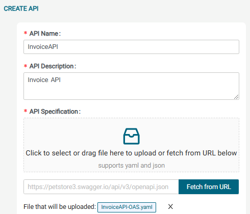
* Edit the API settings to set a unique API base path (e.g. XX_api)
* For the "GET /invoices" endpoint, use the button link integration on the right side of the method title\
  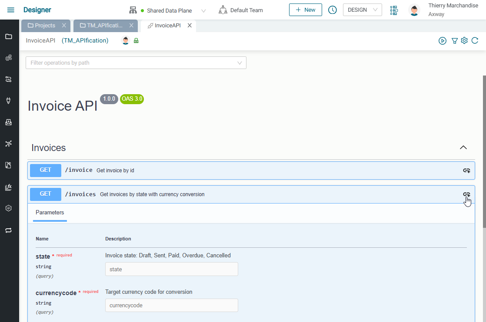
  * Choose to create a new Integration (e.g. GetInvoicesByState)
* The integration tab should open by itself, click on API Server component and check that linked API operation is  "GET /invoices"
* Expand Operations component and its Status component to see the integration flow\
  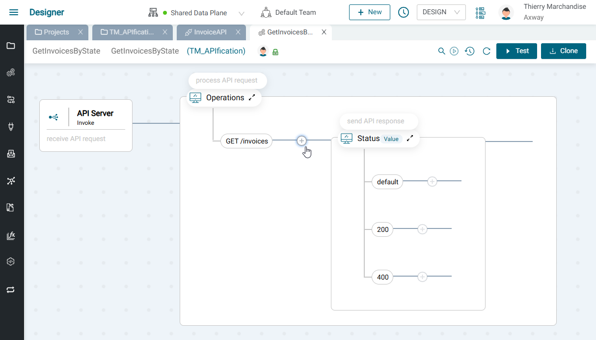
* Click the first `+` button in Operations to add a Database Select component and expand the bottom panel
  * We need to create a database connection for our Postgres database so click Add next to the Connection picker and give your connection a name and description (e.g. Neon Postgres DB)
    * Select PostgreSQL as Database Type and set the version you used for the database creation (default is 15.x)
    * Update the connection URL with jdbc:postgresql://_`server`_/_`databaseName`_ with `host` and `database name` that you wrote down after database creation (default postgresql port 5432 is not required in the URL)
    * Enter your User Name and Passwordthat you wrote down after database creation
    * click on Update and then on Test \
    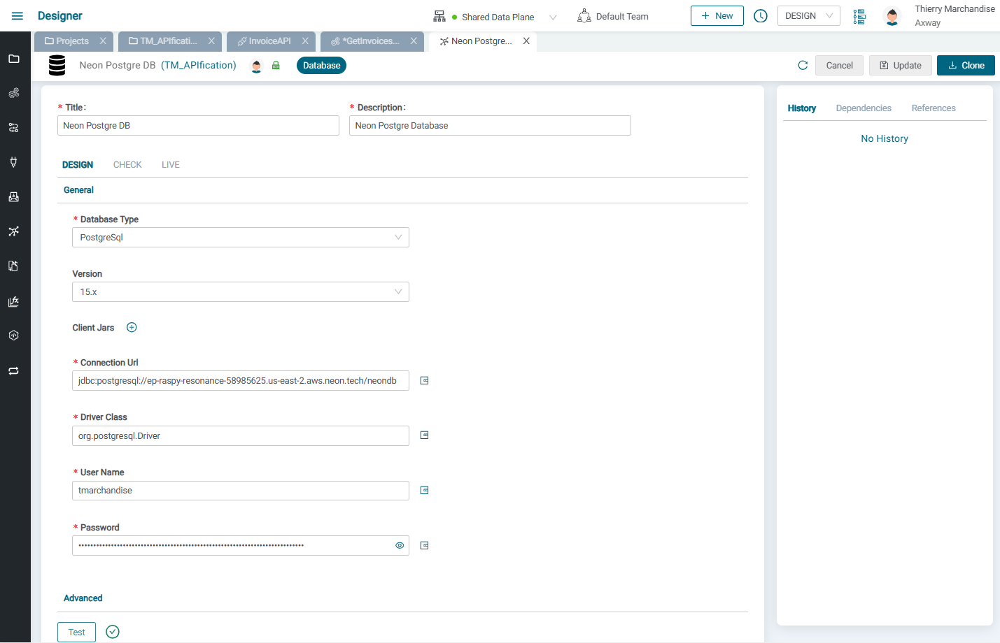
      > Note that if you get any Connection Timeout errors with the connection then you may want to expand the Advanced section and set `Connection Wait Timeout` to 1000. Don't forget to click update.
    * Close your connection sub tab and return to the Database Select component in your integration
  * Click refresh in the Connections tab and select the database connection you just created
  * We need a plug for selecting invoices by State so click Add next to the Plug picker and give your plug a name and description (e.g. GetInvoicesByState) and click on the Configure button
    * Select the database connector you just created and select `Select` for the Actions and `public` for the schemas
    * Check the box next to your invoice table, and select all the fields
    * Click the Where tab and select `invoice.state` field and the `=` operator and press Generate and click save
    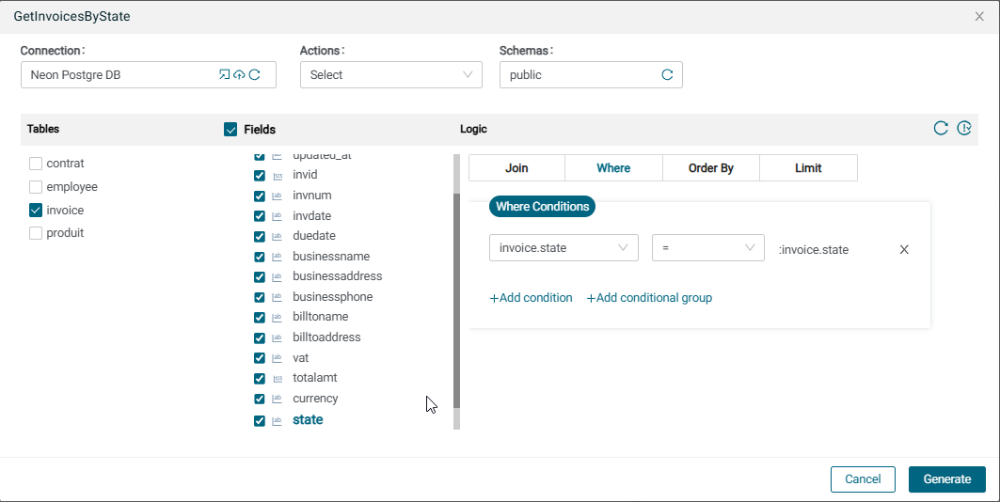
    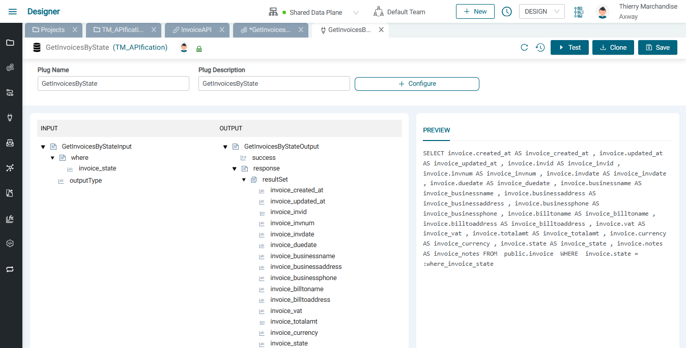
    * Close the plug sub tab and return to the Database Select component in your integration and click the refresh button in the Plug picker and select the newly created plug
  * Expand `get-invoices-by-stateAPIServerRequest` in the left hand panel to expose the `queryParams->state` and drag a line from state to `GetInvoicesBystateInput->where->invoice_state` in the ACTION PROPERTIES in the center panel
  * In the right hand panel set the value of the response `status` variable to `200` for now.
  * Expand `get-invoices-by-stateAPIServerResponse` in the right hand panel to see response body format of the `200` case and set its `grandTotal`  to the value `0` (this will be the default response if no invoices are found for the requested state)
  * Expand `get-invoices-by-stateAPIServerResponse->200->responseHeaders` to see the `200` response headers and set its `Content-Type` to the value `application/json`
  * Click the Save button \
  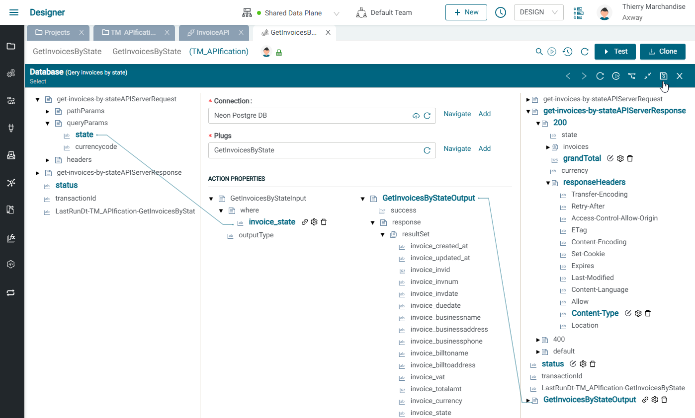

Your integration should look like this: \
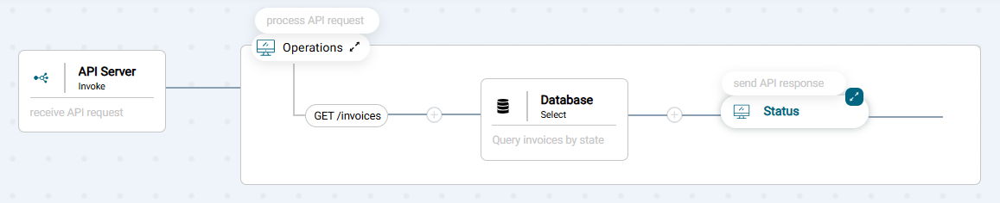

* Enable your API and make an API call from your Browser, Postman or curl as follows:
  
  > Mouse over the link icon to see the URL you need for the API call and copy the link
  
  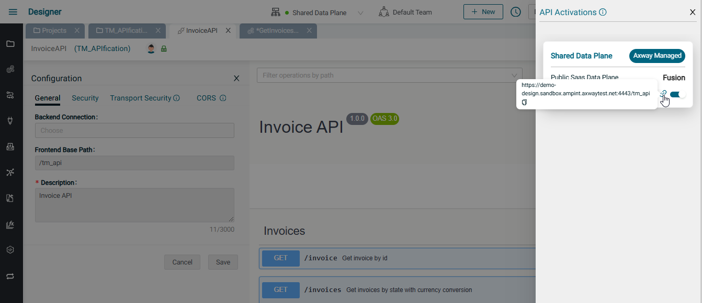
  
  > Note that the url corresponds to the API server of the selected dataplane, followed by the base path you chose at the sbeginign of this lab.

  > Paste the URL you copy in your Browser, or in Postman or in a curl command. Add the method path and the query parameter values for our use case ("/invoices?state=Overdue&currencycode=EUR") before sending the request
  
    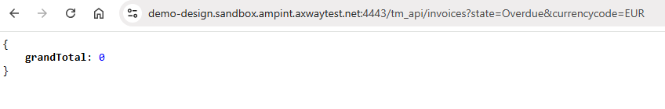  

* Find your API transaction in the Monitor, click on the `+` sign next to Operations and click on the Database Select step and expand `GetInvoicesByStateOutput->resultSet` and see that you are retrieving invoices
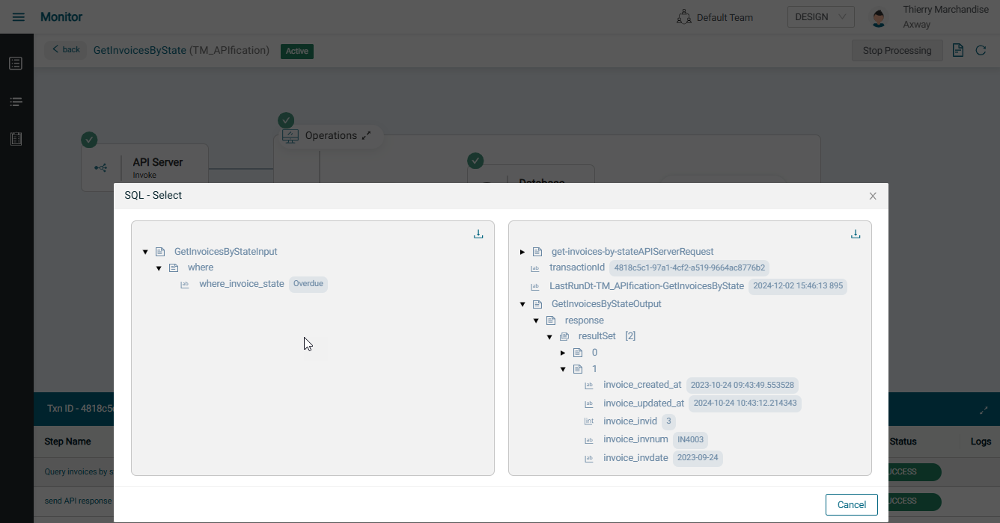

## Lab 3

In this lab, we'll loop over the invoices, parse each one to a JSON object and do a currency conversion on the invoice amount to a desired currency passed into the API call as a query parameter.

* Disable the API so the integration can be modified
* Click the `+` button after the database component and add a For-each component, expand it and click on Config
* Click the down arrow and select the `GetInvoicesByStateOutput->response->resultSet` array to loop over and click Save

* Let's convert the invoice total amount to the desired currency using the APILayer currency conversion API. 
  * Add an HTTP/S Client Get component inside the loop and expand the bottom panel
  * Click Add next to the Connection picker and give your connection a name and description (e.g. Exchange Rates Data API) and do the following:
  * Select HTTPS for the Protocol
  * Select HTTP/2 for the HTTP Version
  * Enter `api.apilayer.com/exchangerates_data` for Url
  * Select API Key for Client Authentication
  * Select Header for API Key Location
  * Set `apikey` for API Key Name
  * Enter your APILayer API Key
  * Set `/symbols` for Safe Resource path (used for the test)
  * Click Update and Test
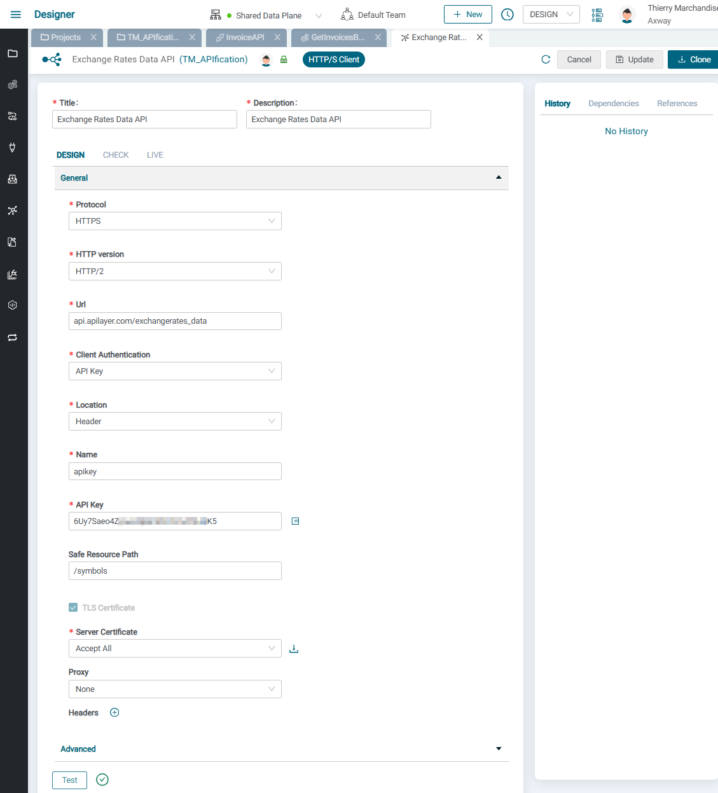
* Go back to your HTTP/S Client Get component, click refresh in the Connection picker and select the connection you just created
* In the center panel under ACTION PROPERTIES, expand `HTTPSGetInput` and:
  * Right click on basePath and setValue to `/convert`
  * Right click on `queryParams` and add 3 string variables inside (`amount`, `from` and `to` )  
  * Drag a line from the left hand panel `GetInvoicesByStateOutput->response->resultSet->invoice_totalamt` to the center panel `HTTPSGetInput->queryParams->amount` to set the amount for the APILayer API
  * Drag a line from the left hand panel `GetInvoicesByStateOutput->response->resultSet->invoice_currency` to the center panel `HTTPSGetInput->queryParams->from` to set the source currency code for the APILayer API
  * Drag a line from the left hand panel `get-invoices-by-stateAPIServerRequest->queryParams->currencycode` to the center panel `HTTPSGetInput->queryParams->to` to set the target currency code for the APILayer API
  * Right click anywhere in the right hand panel and select Extract and paste in the following JSON that describes the currency converter API response object and click on Copy Node button

    ```json
    {
        "success": true,
        "query": {
            "from": "USD",
            "to": "EUR",
            "amount": 100
        },
        "info": {
            "timestamp": 1683656343,
            "rate": 0.91192
        },
        "date": "2023-05-09",
        "result": 91.192
    }
    ```

    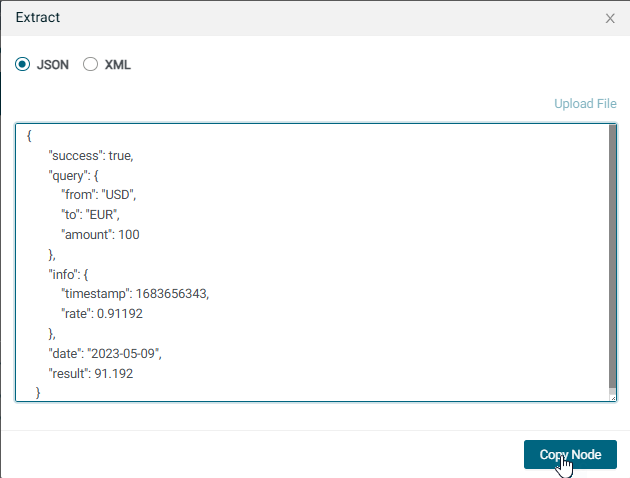
  * Right click again and select Paste and name your variable `currencyConvertResponse`
  * Drag a line from ACTION PROPERTIES `HTTPSGetOutput->response` to the `currencyConvertResponse` extract variable
  * Press Save
  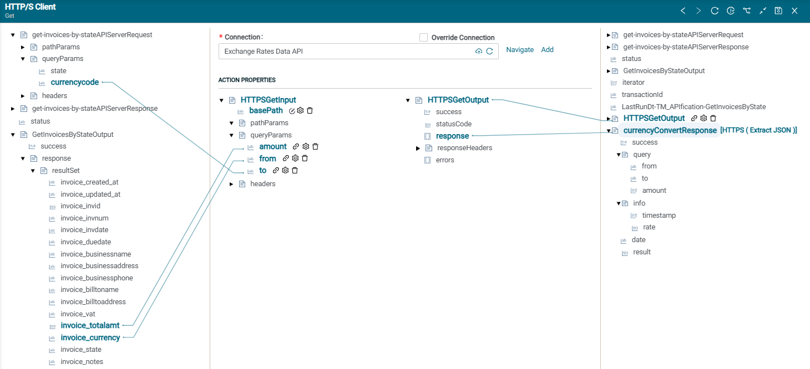

* Your integration should look like this:
  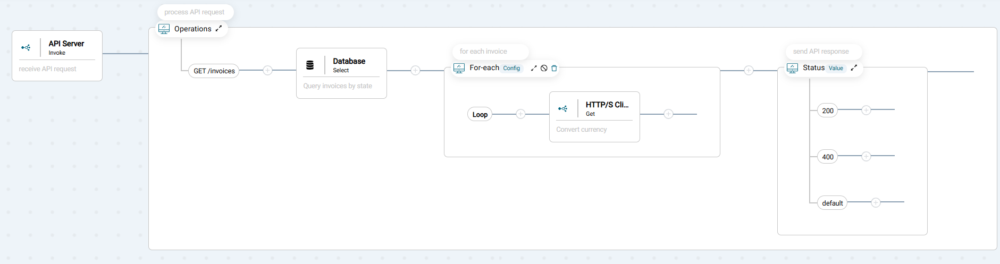

* Enable your API and make the same API call from your Browser, Postman or curl again.
  
   

* Find your API transaction in the Monitor, click on the `+` sign next to Operations. You should see the For-each with some number inside indicating the number of invoices
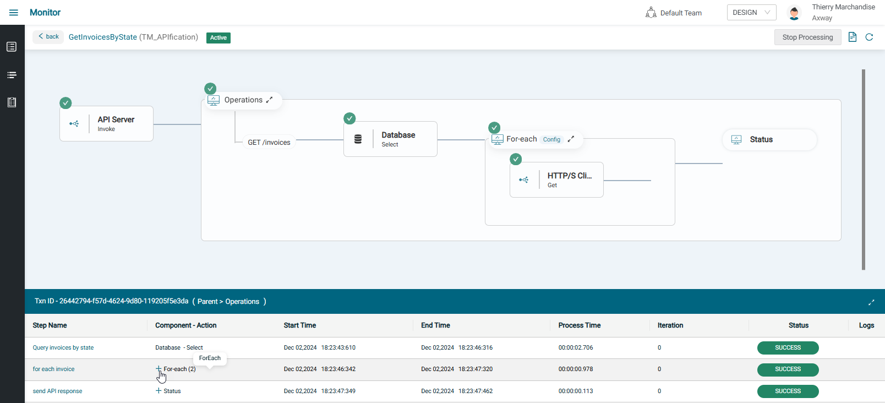
* Click the `+` sign next to the For-each and again on one of the iterations
* Click on the HTTP/S Client Get and then expand the HTTPSGetOutput to see the currency conversion API response
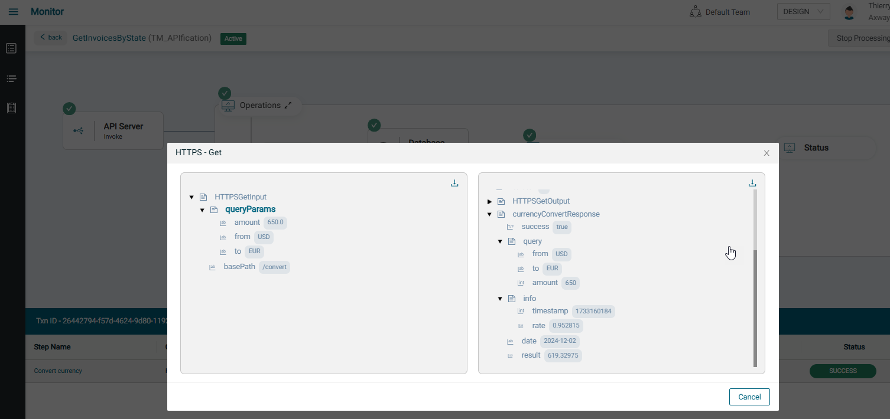

## Lab 4

In this lab, we'll map our invoice and currency converted amount to the response invoice array and calculate a grand total.

* Disable the API so the integration can be modified
* First we need to create our converted invoice with using the result of the conversion and setting its decimal precision to 2 digits since it is returned with more decimal digits.
  * Add a Map component inside the loop after the currency conversion and expand the bottom panel.
  * Add a temporary variable to map the current invoice, by doing the following:
    * Right click on anywhere on the right hand panel and select Extract and paste in the following JSON that represents what we want our resulting invoice looks like and click on Copy Node button

    ```json
    {
      "invnum": "IN4001",
      "invdate": "2023-01-26",
      "businessname": "ACME Corp",
      "billtoname": "Cesar Bowman",
      "vat": "15%",
      "totalamt": 500.00,
      "currency": "USD",
      "state": "Paid"
    }
    ```
  * Right click on any variable on the right hand panel and select Paste and name the variable `invoiceResponse`
  * Click on it to expand this variable
  * Expand `currencyConvertResponse` in the left hand panel
    * Add a map function using the '+fx' button, select DecimalPrecision in the Math category.
      * Drag a line from `currencyConvertResponse->result` to `decimal`
      * Set `precision` to 2
      * Drag a line from `output` to `invoiceResponse->totalamt`
      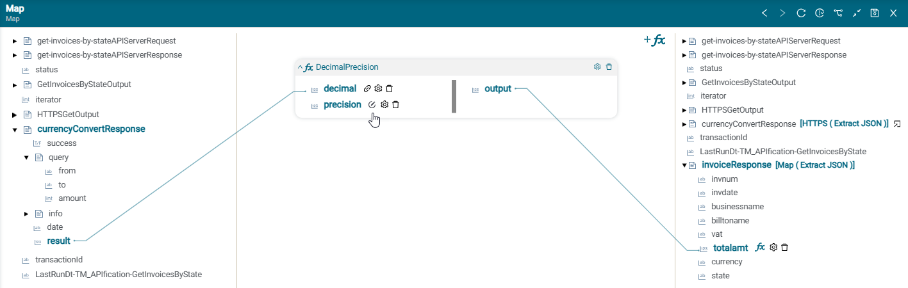
      * Click on the DecimalPrecision function title to minimize and continue the mapping
    * Drag a line from `currencyConvertResponse->query->to` to `invoiceResponse->currency` in the right hand panel
  * Expand `GetInvoicesByStateOutput->response_resultSet` in the left hand panel and drag lines from:
    * `invoice_invnum` to `invoiceResponse->invnum` in the right hand panel
    * `invoice_invdate` to `invoiceResponse->invdate` in the right hand panel
    * `invoice_businessname` to `invoiceResponse->businessname` in the right hand panel
    * `invoice_billtoname` to `invoiceResponse->billtoname` in the right hand panel
    * `invoice_vat` to `invoiceResponse->vat` in the right hand panel
    * `invoice_state` to `invoiceResponse->state` in the right hand panel
  * Click Save
  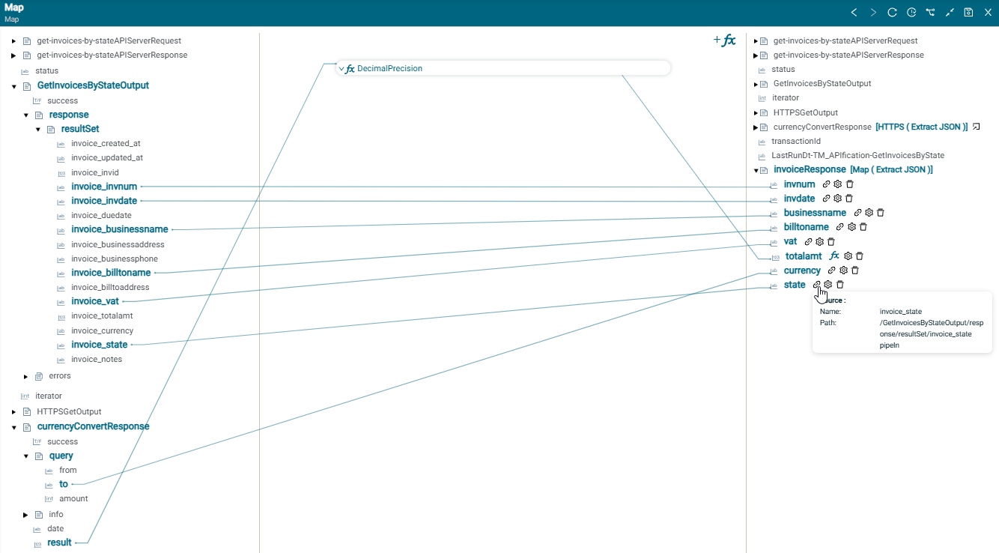
* Then we add the converted invoice to the response list and calculate the response grand total.
  * Add another Map component after the previous one and expand the bottom panel.
  * Add an AppendList map function from the List catagory
    * Drag a line from `get-invoices-by-stateAPIServerResponse->200->invoices[]` on the left to `docList`
    * Drag a line from `invoiceResponse` to `docIn`
    * Drag a line from `docList` to `get-invoices-by-stateAPIServerResponse->200->invoices[]` on the right
    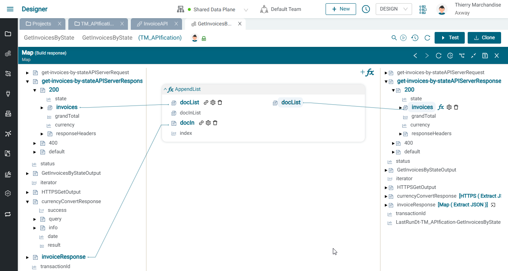
  * Add an AddFloats function
    * Drag a line from `get-invoices-by-stateAPIServerResponse->200->grandTotal` to `num1`
    * Drag a line from `invoiceResponse->totalamt` to `num2`
    * Drag a line from `output` to `response->grandTotal`
    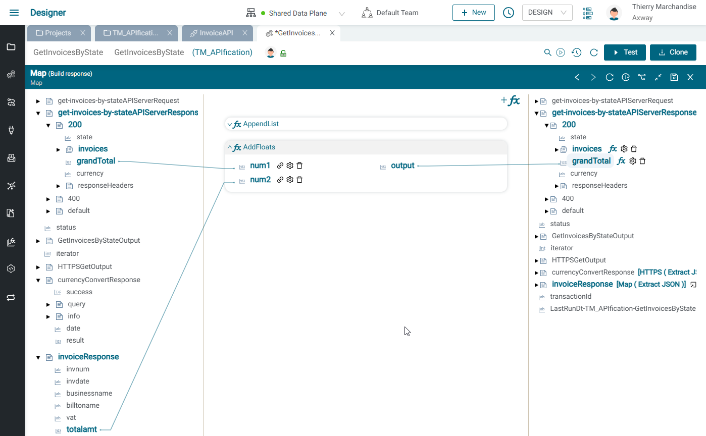
  * Complete the response fields
    * Drag a line from `get-invoices-by-stateAPIServerRequest->queryParams->state` on the left to `get-invoices-by-stateAPIServerResponse->200->state` on the right
    * Drag a line from `get-invoices-by-stateAPIServerRequest->queryParams->currencycode` on the left to `get-invoices-by-stateAPIServerResponse->200->currency` on the right
    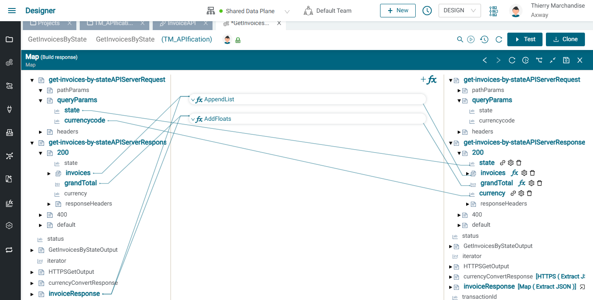
  * Click Save

Your integration is complete and should look like this:
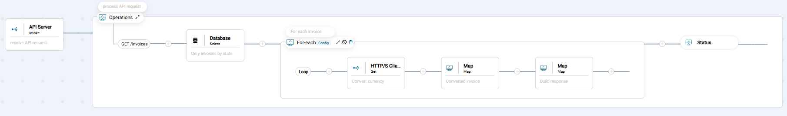

* Enable your API and make the same API call from your Browser, Postman or curl again.

  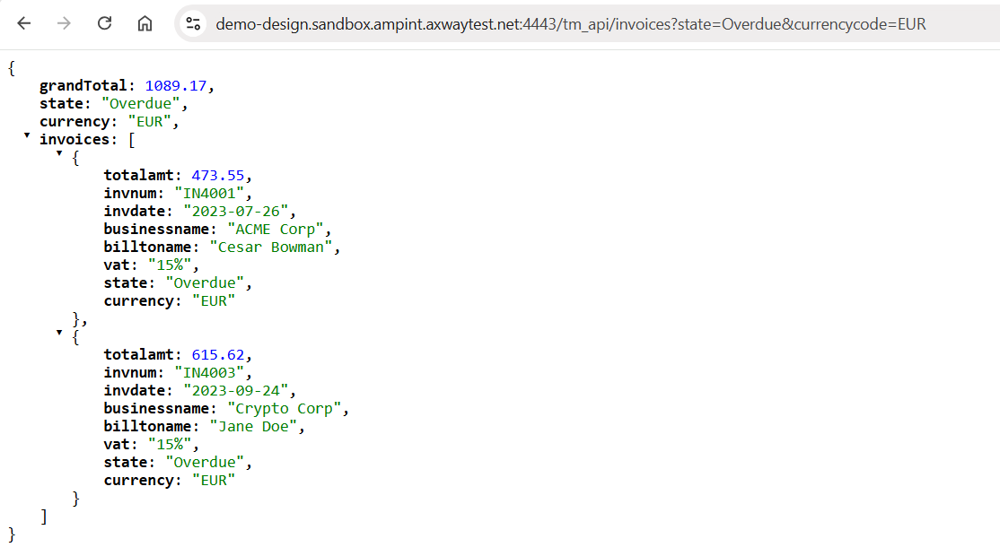

Your result should look similar to the following:

  ```json
  {
      "grandTotal": 1072.19,
      "state": "Overdue",
      "currency": "EUR",
      "invoices": [
          {
              "invnum": "IN4001",
              "invdate": "2023-07-26",
              "businessname": "ACME Corp",
              "billtoname": "Cesar Bowman",
              "vat": "15%",
              "state": "Overdue",
              "currency": "EUR",
              "totalamt": 466.17
          },
          {
              "invnum": "IN4003",
              "invdate": "2023-09-24",
              "businessname": "Crypto Corp",
              "billtoname": "Jane Doe",
              "vat": "15%",
              "state": "Overdue",
              "currency": "EUR",
              "totalamt": 606.02
          }
      ]
  }
  ```

## Lab 5 - Challenge yourself!

1. Add API Key Authentication to your API and test it again.
2. Handle 400 response in case of conversion error (when wrong currency code is used in the request for instance)
