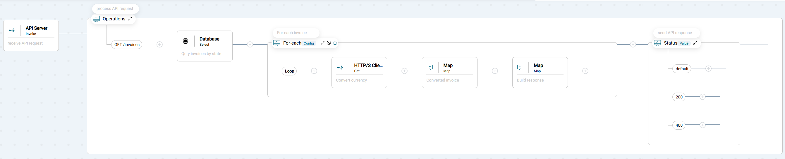
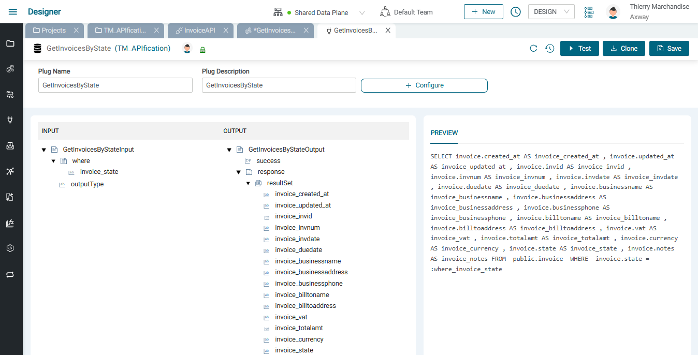
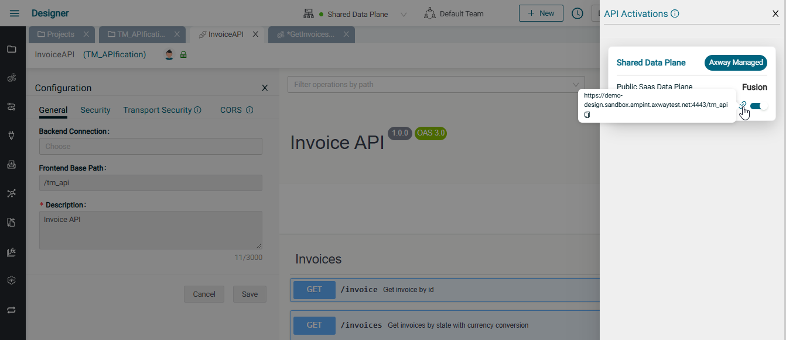
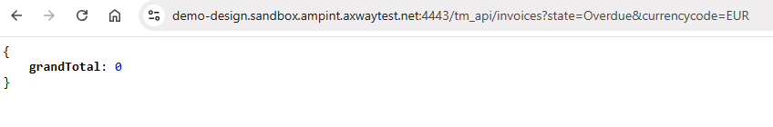
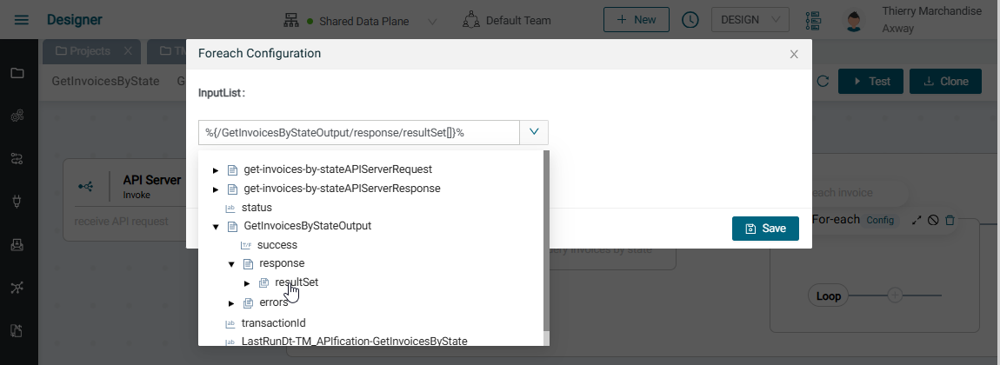
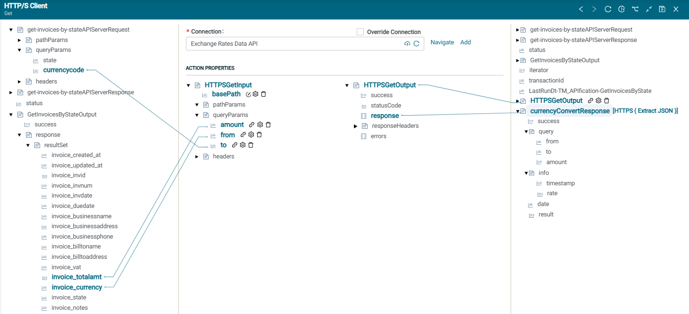
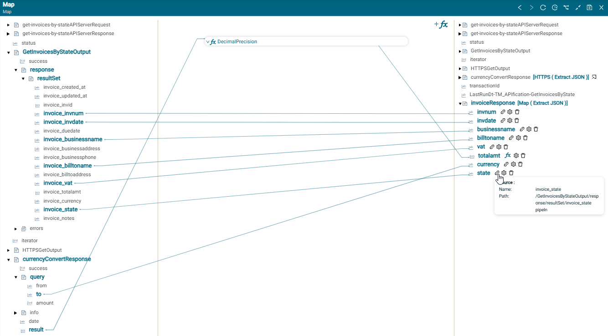
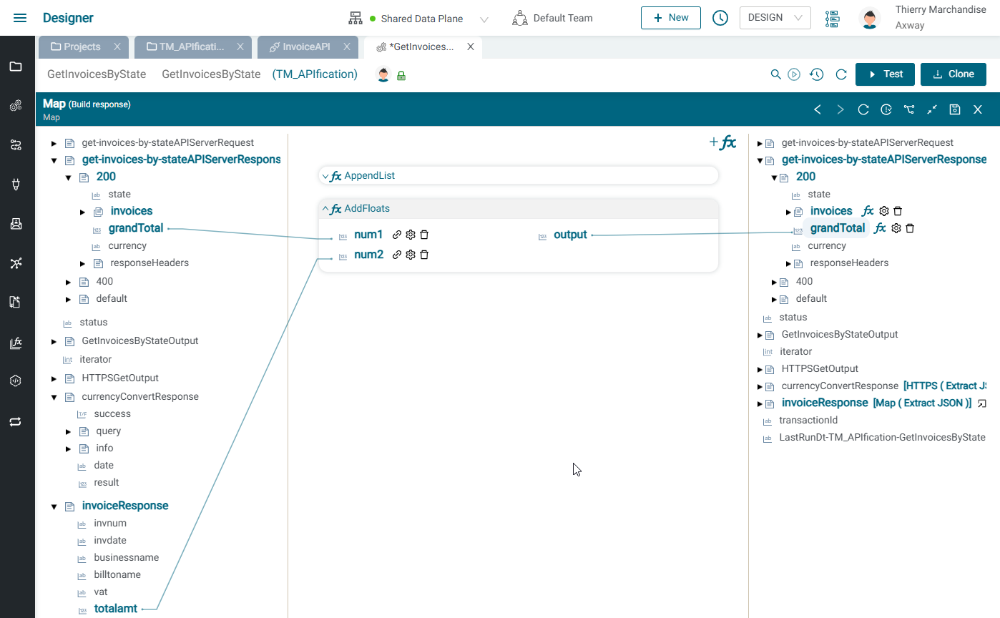
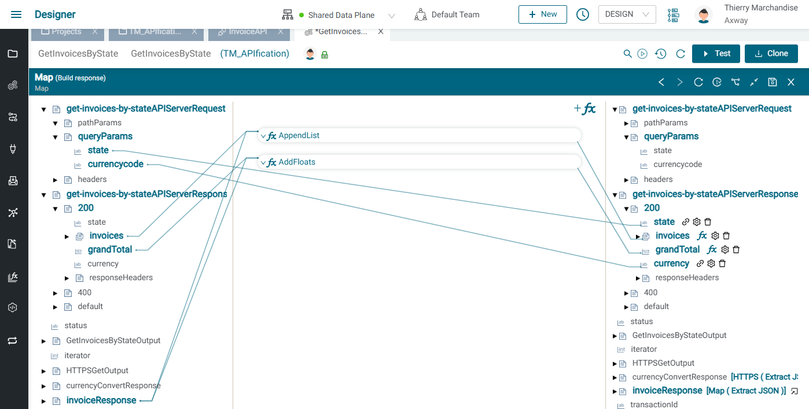

# APIsation de factures

## Introduction

Dans cet exercice, nous allons implémenter une OpenAPI avec une intégration pour exposer des factures présentes dans une base de données. L'intégration permettra également d'orchestrer et d'agréger les données des factures avec un service de conversion de devises afin de convertir le montant de la facture dans la devise souhaitée et de calculer le montant total des factures qui sont dans un état donné.

L'API que nous construirons supportera cette la méthode suivant:

`GET /invoices?state=Overdue&currencycode=EUR`

et devra fournir ce type de réponse:

```json
{   
    "success": true,
    "invoices": [
        {
            "invnum": "IN4001",
            "invdate": "2022-11-05",
            "businessname": "ACME Corp",
            "billtoname": "Cesar Bowman",
            "vat": "15%",
            "state": "Overdue",
            "currency": "EUR",
            "totalamt": 462.47
        },
        {
            "invnum": "IN4003",
            "invdate": "2023-01-04",
            "businessname": "Crypto Corp",
            "billtoname": "Jane Doe",
            "vat": "15%",
            "state": "Overdue",
            "currency": "EUR",
            "totalamt": 601.21
        }
    ],
    "currency": "EUR",
    "state": "Overdue",
    "grandTotal": 1063.68
}
```

Un exemple est illustré ci-dessous:


L'intégration associée à cette méthode d'API fera ce qui suit:

* Parser la requête OpenAPI avec des paramètres de requête (query parameters)
* Interroger une base de données PostgreSql pour récupérer les factures avec le état demandé
* Interroger une base de données PostgreSql
* Passer en revue les factures
  * Faire un appel API REST à un service de conversion de devises pour convertir le montant total de chaque facture dans la devise souhaitée
  * Faire le total des montants de chaque facture
* Renvoyer un tableau (array) de factures avec le montant total converti ainsi qu'un montant total général pour toutes les factures

Le flux de données (data-flow est illustré ci-dessous):


Dans cet exercice, nous apprendrons à:

* Omporter un specification d'OpenAPI (OAS) qui décrit les méthodes à exposer
* Lier une méthode d'API à une intégration
* Configurer une connexion PostgreSql Database 
* Utiliser un composant PostgreSql Database Select et le branchement (plug) associé pour interroger une table avec une clause Where
* Parcourir un array (de factures)
* Configurer une connexion HTTP/S Client (à un API REST de conversion de devises qui ne fournit de spécifications OpenAPI)
* Utiliser le composant Map pour:
  * Mapper les données entre elles
  * Utiliser des fonctions de Map pour régler la précision décimale et ajouter à un Json array 
* Définir la réponse pour l'API que nous exposons

L'intégration finale est illustrée ci-dessous:



## Pré-requis

* Accès à Amplify Fusion
  > Si vous n'avez pas de compte, veuillez contacter **[amplify-integration-training@axway.com](mailto:amplify-integration-training@axway.com?subject=Amplify%20Integration%20-%20Training%20Environment%20Access%20Request&body=Hi%2C%0D%0A%0D%0ACould%20you%20provide%20me%20with%20access%20to%20an%20environment%20where%20I%20can%20practice%20the%20Amplify%20Integration%20e-Learning%20labs%20%3F%0D%0A%0D%0ABest%20Regards.%0D%0A)** par mail avec en objet `Amplify Fusion Training Environment Access Request`
* Une base de données Postgres pour stocker nos enregistrements de facturation. Dans cet exercice nous avons utilisé [**Neon**](https://neon.tech)
* Un accès gratuit à [**API Layer Exchange Rates Data API**](https://apilayer.com/marketplace/exchangerates_data-api).
  > Assurez-vous d'être bien inscrit et testez l'API dans POSTMAN afin de vous familiariser avec les appels d'API et la visualisation de réponses

## Étape 1

Créons une base de données Postgres qui contiendra nos factures

* Créer un compte [**Neon**](https://neon.tech). 
* Créer un projet et noter les détails de connexion de l'URL Postgres "postgres://_`username`_:_`password`_@_`server`_/_`databaseName`_" pour plus tard
* Sélectionner le projet et accéder à l'éditeur SQL pour effectuer ces 3 requêtes de base de données:
  * Créer une table de factures:

  ```sql
  CREATE TABLE Invoice (
    created_at      TIMESTAMPTZ NOT NULL DEFAULT NOW(),
    updated_at      TIMESTAMPTZ NOT NULL DEFAULT NOW(),
    invid           SERIAL PRIMARY KEY,
    invnum          VARCHAR(100) NOT NULL,
    invdate         DATE NOT NULL DEFAULT CURRENT_DATE,
    duedate         DATE NOT NULL DEFAULT CURRENT_DATE,
    businessname    VARCHAR(100) NOT NULL,
    businessaddress VARCHAR(100) NOT NULL,
    businessphone   VARCHAR(100) NOT NULL,
    billtoname      VARCHAR(100) NOT NULL,
    billtoaddress   VARCHAR(100) NOT NULL,
    vat             VARCHAR(100) NOT NULL,
    totalamt        MONEY NOT NULL,
    currency        VARCHAR(100) NOT NULL,
    state           VARCHAR(100) NOT NULL,
    notes           VARCHAR(100)
  );
  ```

  * Insérer plusieurs exemples de factures (Vous pouvez modifier les données comme vous le souhaitez)

  ```sql
  INSERT INTO Invoice
    ( invnum,businessName,businessAddress,businessPhone,
      billToName,billToAddress,
      totalAmt,currency,vat,invdate,duedate,state
    )
  VALUES
    ( 'IN4001','ACME Corp','3734 Jacobs Street,Pittsburgh, PA, 15201 , USA','412-297-3188',
      'Cesar Bowman','3734 Jacobs Street,Pittsburgh, PA, 15201 , USA',
      500.00,'USD','15%',(select current_date - 90),(select current_date - 60),'Overdue'
    ),
    ( 'IN4002','Hillside Inc','144 Main St,NY, NY, 10021 , USA','212-444-1122',
      'John Smith','144 Main St,NY, BY, 10021 , USA',
      700.00,'USD','15%',(select current_date - 30),(select current_date - 1),'Paid'
    ),
    ( 'IN4003','Crypto Corp','19 Summer Ave,Miami, FL, 88088 , USA','212-444-1122',
      'Jane Doe','19 Summer Ave,Miami, FL, 88088 , USA',
      650.00,'USD','15%',(select current_date - 30),(select current_date -1),'Overdue'
    ),
    ( 'IN4004','Jamee Corp','111 French St,New Orelans, LA, 79890 , USA','212-444-1122',
      'John Smith','144 Main St,NY, BY, 10021 , USA',
      900.00,'USD','15%',(select current_date - 1),(select current_date + 30),'Sent'
    );
  ```

  * Vérifier que ces factures soient bien dans la base de données:

  ```sql
  Select * from invoice
  ```

  

La base de données est maintenant prête

## Étape 2

Dans cette étape, nous allons importer notre API de facture, créer notre intégration pour le méthode d'API puis nous interrogerons notre base de données pour récupérer les factures étant dans un état particulier

* Créer un nouveau projet dans Amplify Fusion pour cet example d'APIsation. Utilisez un nom unique au cas où vous ne seriez pas le seul à faire cet exercice sur votre tenant Amplify Fusion (par ex: XX_apification, XX étant votre nom ou vos initiales).\
  
* Créer une nouvelle API (par exemple, InvoiceAPI) en chargeant cet exemple de spécification OpenAPI (OAS) : **[InvoiceAPI-OAS.yaml](..\N-assets\InvoiceAPI-OAS.yaml)**.\
  
* Modifier les paramètres de l'API pour définir un chemin de base unique pour l'API (par ex: XX_api).
* Pour la méthode « GET /invoices », utiliser le bouton "Link integration" sur le côté droit du titre de la méthode.\
  
* Choisir de créer une nouvelle intégration (par ex: GetInvoicesByStatus)
* L'onglet de l'intégration devrait s'ouvrir automatiquement, cliquer sur le composant API Server et vérifier que la methode liée est « GET /invoices »
* Ouvrir le composant Opérations et son composant Status pour voir le flux d'intégration.\
  

* Cliquer sur le premier bouton `+` pour ajouter un composant Database Select puis agrandir le panneau inférieur
  * Nous devons créer une connexion Database pour notre Database Postgres. Pour cela cliquer sur Add à côté du sélecteur de connexion et donner à la connexion un nom et une description (par ex: Neon Postgres DB)
    * Sélectionner PostgreSQL comme Database Type et choisir la version utilisée lors de la création de votre DatabaseSelect (la version par défaut est 15.x)
    * Mettre à jour l'URL de connexion jdbc:postgresql://_`server`_/_`databaseName`_ avec `host` et `database name` que vous avez noté à l'étape précèdente après la création de la database (le port PostgreSQL par défaut 5432 n'est pas requis dans l'URL)
    * Entrer le nom d'utilisateur et le mot de passe que vous avez noté après la création de votre Database
    * Cliquer sur Update puis sur Test \
    
      > Notez que si vous obtenez des erreurs de délai de connexion, vous pouvez développer la section Advanced et régler le `Connection Wait Timeout` à 1000. N'oubliez pas de cliquer sur update.
    * Fermer l'onglet de la connexion et retourner au composant Database Select dans votre intégration
  * Cliquer sur Refresh dans le panneau de la Connexion et sélectionner la connexion de Database tout juste créée
  * Nous avons besoin d'un plug pour sélectionner les factures par état. Pour cela cliquer sur Add à côté du sélecteur de plug et donner au plug un nom et une description (par ex: GetInvoicesByState) puis cliquer sur le bouton Configure
    * Sélectionner le connecteur de database tout juste créée et sélectionner `Select` pour Actions et `public` pour schemas
    * Cocher la case à côté de Invoice et sélectionner tous les champs
    * Cliquer sur Where et sélectionner le champ `invoice.state` et l'opérateur `=` puis cliquer sur Generate et ensuite sur Save
    
    
    * Fermer l'onglet du plug et retourner au composant Database Select de l'intégration. Cliquer sur Refresh dans le selecteur de plug et choisir le plug tout juste créé
  * Dérouler `get-invoices-by-stateAPIServerRequest` dans le panneau de gauche et afficher`queryParams->state`. Tirer une ligne de `state` à `GetInvoicesBystateInput->where->invoice_state` dans ACTION PROPERTIES sur le panneau central
  * Dans le panneau de droite, mettre la valeur de la variable `status` de la réponse à `200` pour l'instant.
  * Développee `get-invoices-by-stateAPIServerResponse` dans le panneau de droite pour voir le format de la réponse en cas de `200` et mettre la valeur de  `grandTotal` à `0` (ce sera la réponse par défaut si aucune facture n'est trouvée pour l'état demandé).
  * Etendre `get-invoices-by-stateAPIServerResponse->200->responseHeaders` pour voir les ent^tes de réponse en case de `200` et mettre la valeur de `Content-Type` à `application/json`.
  * Cliquer sur Save \
  

L'intégration doit ressembler à ceci: \


* Activer l'API et faire un appel API depuis un navigateur, Postman ou curl comme suit:

   > Passer la souris sur l'icône du lien pour voir l'URL nécessaire à l'appel API et copier le lien.
  
  
  
  > A noter que l'url correspond au serveur d'API du dataplane sélectionné et de chemin de base que vous avez choisi au début de cette étape
  > Coller l'URL copiée dans le navigateur, ou dans Postman, ou dans une commande curl. Ajouter le chemin de la méthod et les query parameters correspondant à notre besoin ("/invoices?state=Overdue&currencycode=EUR"). Puis envoyer la requête.
  
   
  

* Retrouver la transaction d'API dans le Monitor et cliquer sur le `+` de l'étape Operations puis cliquer sur l'étape Database Select et dérouler `GetInvoicesByStateOutput->resultSet`pour voir que les factures ont bien été récupérées


## Étape 3

Dans cette étape, nous allons parcourir les factures, parser chacune d'entre elles dans un format JSON et effectuer une conversion du montant de la facture dans la devise souhaitée, qui sera transmise à l'appel API sous la forme d'un paramètre de requête

* Désactiver l'API afin de pouvoir modifer l'intégration
* Cliquer sur le bouton `+` après le comosant Database et ajouter un composant For-each, l'agrandir et cliquer sur Config
* Sélectionner `GetInvoicesByStateOutput->response->resultSet` en déroulant GetInvoicesByStatusOutput puis response, afin de boucler sur chaque élément du resultSet. Cliquer sur Save

* Convertissons le montant total des factures dans la devise désirée en utilisant l'API de conversion de devises APILayer 
  * Ajouter un composant HTTP/S Client Get dans la boucle et agrandir le panneau inférieur 
  * Cliquer sur Add à côté du sélecteur Connection et donner un nom et une description à la connexion (e.g. Exchange Rates Data API) puis suivre ces étapes:
    * Sélectionner HTTPS pour le Protocol 
    * Sélectionner HTTP/2 pour la version 
    * Entrer `api.apilayer.com/exchangerates_data` pour l'Url
    * Selectionner API Key pour l'authentification client
    * Selectionner Header pour l'API Key Location
    * Entrer `apikey` pour le nom de l'API Key
    * Entrer la valeur de la clé d'API pour utuiliser APILayer
    * Entrer `/symbols` pour le  Safe Resource Path
    * Cliquer sur Update puis sur Test
      
* Retourner au composant HTTP/S Client Get, cliquer sur raffraîchir dans le sélecteur de connexion et choisir la connexion tout juste créée 
* Dans le panneau central, sous ACTION PROPERTIES, dérouler `HTTPSGetInput` puis :
  * Faire un clic droit sur basePath et entrer `/convert` comme value 
  * Faire un clic droit sur `queryParams` et ajouter 3 variables de type String dans queryparams (`amount`, `from` et `to` )  
  * Tirer une ligne de `GetInvoicesByStateOutput->response->resultSet->invoice_totalamt` sur le panneau de gauche vers `HTTPSGetInput->queryParams->amount` sur le panneau central pour définir le montant à convertir par l'API d'APILayer 
  * Tirer une ligne de `GetInvoicesByStateOutput->response->resultSet->invoice_currency` sur le panneau de gauche vers `HTTPSGetInput->queryParams->from` sur le panneau central pour définir le code devise source à utiliser par l'API d'APILayer
  * Tirer une ligne de `/get-invoices-by-stateAPIServerRequest->queryParams->currencycode` sur le panneau de gauche vers `HTTPSGetInput->queryParams->to` sur le panneau central et configurer pour définir le code devise cible à utiliser par l'API APILayer
  * Faire un clic droit sur n'importe quelle variable dans le panneau de droite, sélectionner Extract et coller le texte JSON suivant qui décrit la réponse API du convertisseur de devises. Cliquer ensuite sur Copy Node

    ```json
    {
        "success": true,
        "query": {
            "from": "USD",
            "to": "EUR",
            "amount": 100
        },
        "info": {
            "timestamp": 1683656343,
            "rate": 0.91192
        },
        "date": "2023-05-09",
        "result": 91.192
    }
    ```

  
  * Refaire un clic droit sur le panneau de droite et sélectionner Paste puis nommmer la variable `currencyConvertResponse`
  * Tirer une ligne depuis ACTION PROPERTIES `HTTPSGetOutput->response` vers `currencyConvertResponse` 
  * Cliquer sur Save
  

* L'intégration doit ressembler à ceci:
  

* Activer l'API et faire le même appel API depuis le navigateur, Postman ou curl  
  
   

* * Retrouver la transaction d'API dans le Monitor et cliquer sur le `+` de l'étape Operations. Un numéro doit apparaître dans le For-each indiquant le nombre de factures

* Cliquer sur le signe `+` à côté du composant For-each puis cliquer sur une des itérations
* Cliquer sur HTTP/S Client Get puis dérouler la variable HTTPSGetOutput pour voir la réponse API de la conversion de devise


## Étape 4

Dans cette étape, nous allons mettre en correspondance (mapping) notre facture et le montant converti dans la devise souhaitée avec l'array de factures de la réponse, et calculer le motant total

* Désactiver l'API afin de pouvoir modifer l'intégration
* Nous devons d'abord créer notre facture en utilisant le résultat de la conversion pour mettre à jour la devise et le montant, et fixer la précision décimale à deux chiffres après la virgule.
  * Ajouter un composant Map dans la boucle for-Each après la conversion de devise, puis agrandir le panneau inférieur
  * Ajouter une variable temporaire pour faire le mapping de la facture actuelle, en faisant ce qui suit:
    * Faire un clic droit sur n'importe quelle variable du panneau de droite et sélectionner Extract puis coller le texte JSON suivant qui représente le résultat désiré pour notre facture. Cliquer ensuite sur Copy Node

    ```json
    {
      "invnum": "IN4001",
      "invdate": "2023-01-26",
      "businessname": "ACME Corp",
      "billtoname": "Cesar Bowman",
      "vat": "15%",
      "totalamt": 500.00,
      "currency": "USD",
      "state": "Paid"
    }
    ```
    * Faire un Clic droit sur n'importe quelle variable du panneau de droite et sélectionner Paste. Donner un nom à la variable `invoiceResponse`
  * Cliquer dessus et dérouler cette variable
  * Dérouler `currencyConvertResponse` du panneau de gauche
    * Ajouter une fonction de mapping en utilisant le bouton '+fx', sélectionner DecimalPrecision dans la catégorie Math
    * Tirer une ligne de  `currencyConvertResponse->result` vers `decimal`
    * Régler (Set value) la `precision` à 2
    * Tirer une ligne de `output` à `invoiceResponse->totalamt`
      
    * Cliquer sur la fonction DecimalPrecision pour réduire sa taille et continuer le mapping
    * Tirer une ligne de `currencyConvertResponse->query->to` vers `invoiceResponse->currency` sur le panneau de droite 
  * Dérouler `GetInvoicesByStateOutput->response_resultSet` dans le panneau de gauche et tirer des lignes de :
    * `invoice_invnum` vers `invoiceResponse->invnum` dans le panneau de droite
    * `invoice_invdate` vers `invoiceResponse->invdate` dans le panneau de droite
    * `invoice_businessname` vers `invoiceResponse->businessname` dans le panneau de droite
    * `invoice_billtoname` vers `invoiceResponse->billtoname` dans le panneau de droite
    * `invoice_vat` vers `invoiceResponse->vat` dans le panneau de droite
    * `invoice_state` vers `invoiceResponse->state` dans le panneau de droite
  * Cliquer sur Save
  
* Ajoutons ensuite la facture convertie à la liste des réponses et calculons le total global des réponses.
  * Ajouter un autre composant Map après le précédent et développer le panneau inférieur.
  * Ajouter une fonction AppendList de la catégorie List.
    * Tirer une ligne de `get-invoices-by-stateAPIServerResponse->200->invoices[]` sur la gauche, vers `docList`
    * Tirer une ligne de `invoiceResponse` à `docIn`
    * Tirer une ligne de `docList` à `get-invoices-by-stateAPIServerResponse->200->invoices[]` sur la droite
    
  * Ajouter une fonction AddFloats
    * Tirer une ligne de `get-invoices-by-stateAPIServerResponse->200->grandTotal` à `num1`
    * Tirer une ligne de `InvoiceResponse->totalamt` à `num2`
    * Tirer une ligne de `output` à `response->grandTotal`
    
  * Compléter le champ de réponse
    * Tirer une ligne de `get-invoices-by-stateAPIServerRequest->queryParams->status` sur la gauche, vers  `get-invoices-by-stateAPIServerResponse->200->state` sur la droite
    * Tirer une ligne de `get-invoices-by-stateAPIServerRequest->queryParams->currencycode` sur la gauche, vers `get-invoices-by-stateAPIServerResponse->200->currency` sur la droite
    
  * Cliquer sur Save

L'intégration doit ressembler à ceci:


* Activer l'API et faire le même appel API depuis le navigateur, Postman ou curl
   

Le résultat devrait ressembler à:

  ```json
  {
      "grandTotal": 1072.19,
      "state": "Overdue",
      "currency": "EUR",
      "invoices": [
          {
              "invnum": "IN4001",
              "invdate": "2023-07-26",
              "businessname": "ACME Corp",
              "billtoname": "Cesar Bowman",
              "vat": "15%",
              "state": "Overdue",
              "currency": "EUR",
              "totalamt": 466.17
          },
          {
              "invnum": "IN4003",
              "invdate": "2023-09-24",
              "businessname": "Crypto Corp",
              "billtoname": "Jane Doe",
              "vat": "15%",
              "statue": "Overdue",
              "currency": "EUR",
              "totalamt": 606.02
          }
      ]
  }
  ```

## Étape 5 - Relevez le défi!

1. Ajouter une Authentification par clé d'API à votre API puis la tester de nouveau
2. Gérer la réponse 400 en cas d'erreur de conversion (lorsqu'un mauvais code devise est utilisé dans la requête par exemple)
