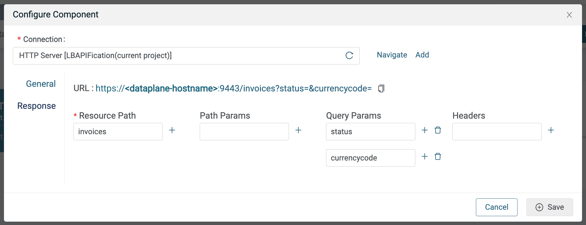
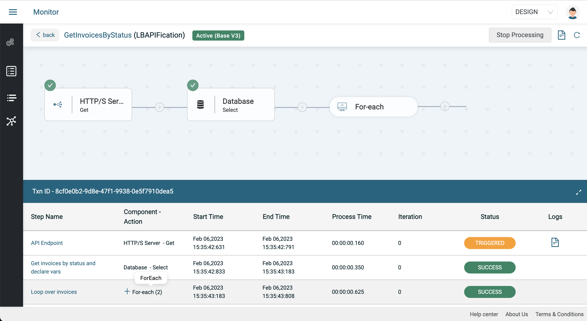
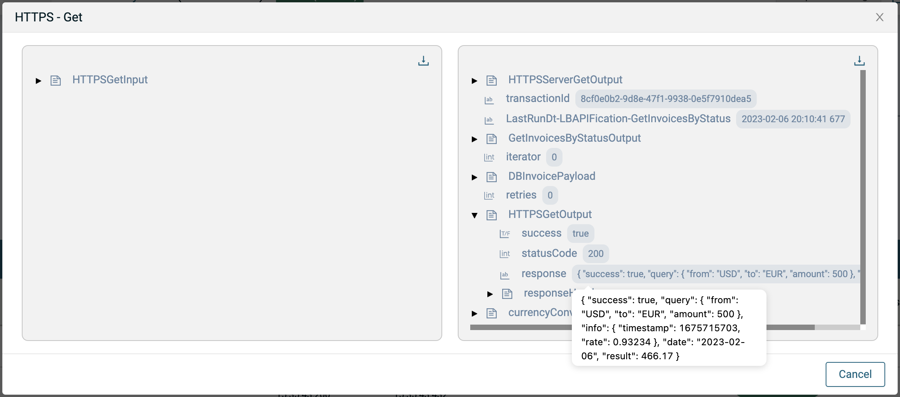
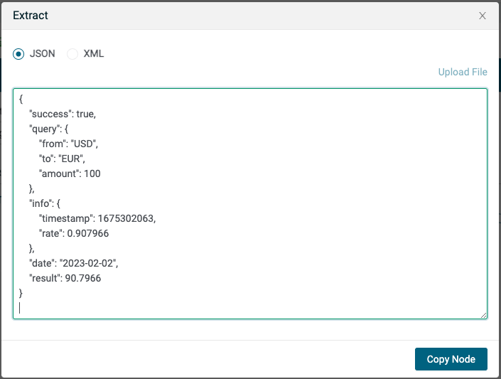
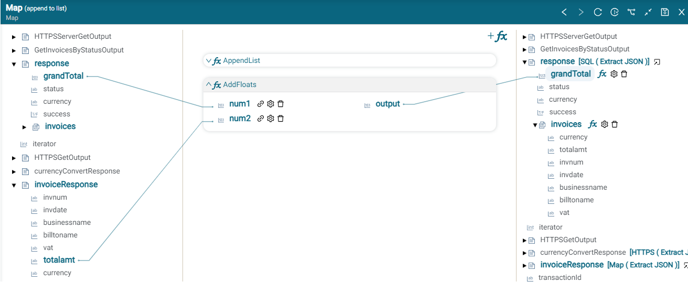

# Invoices APIfication Lab

## Introduction

In these labs, we'll create an integration that will enable us to expose an API for invoices in a database. The integration will also orchestrate and aggregate the invoice data with a currency conversion service to convert the invoice amount to the desired currency as well as calculate a grand total amount of the invoices.

The API we are building is as follows:

`GET /invoices?status=Overdue&currencycode=EUR`

with sample response:

```json
{   
    "success": true,
    "invoices": [
        {
            "invnum": "IN4001",
            "invdate": "2022-11-05",
            "businessname": "ACME Corp",
            "billtoname": "Cesar Bowman",
            "vat": "15%",
            "status": "Overdue",
            "currency": "EUR",
            "totalamt": 462.47
        },
        {
            "invnum": "IN4003",
            "invdate": "2023-01-04",
            "businessname": "Crypto Corp",
            "billtoname": "Jane Doe",
            "vat": "15%",
            "status": "Overdue",
            "currency": "EUR",
            "totalamt": 601.21
        }
    ],
    "currency": "EUR",
    "status": "Overdue",
    "grandTotal": 1063.68
}
```

A demo is shown below:


The integration is described below:

* Expose a GET API endpoint that retrieves invoices by status and desired currency
* Query a PostgreSql Database
* Loop over the invoices
  * Make a REST API call to a currency conversion service to convert each invoice total amount to a desired currency
  * Total the amounts of each invoice
* Return a payload optimized array of invoices with converted total amount as well as a grand total amount for all invoices

This data flow is illustrated below:


In this set of labs, you will learn the following:

* How to configure an HTTP/S Server Connection
* How to use an HTTP/S Server Get component to define a GET API with query parameters
* How to to configure a PostgreSql Database Connection
* How to use a PostgreSql Database Select component and plug to query a table with a where clause
* How to loop over an array (of invoices)
* How to configure an HTTP/S Client Connection (to a currency converter REST API)
* How to use an HTTP/S Client Get component to call a currency conversion REST API
* How to use the Map component to:
  * Map data between objects
  * Use Map functions to set decimal precision and append to a JSON array object
* Set the response to the API we are exposing

The final integration is shown below:


## Prerequisites

* Access to Amplify Integration
  > If you do not have an account and need one, please send an email to **[amplify-integration-training@axway.com](mailto:amplify-integration-training@axway.com?subject=Amplify%20Integration%20-%20Training%20Environment%20Access%20Request&body=Hi%2C%0D%0A%0D%0ACould%20you%20provide%20me%20with%20access%20to%20an%20environment%20where%20I%20can%20practice%20the%20Amplify%20Integration%20e-Learning%20labs%20%3F%0D%0A%0D%0ABest%20Regards.%0D%0A)** with the subject line `Amplify Integration Training Environment Access Request`
* A Postgres Database for storing our invoice records. In this lab, we have used [**Neon**](https://neon.tech)
* Access to the free [**API Layer Exchange Rates Data API**](https://apilayer.com/marketplace/exchangerates_data-api). Make sure that you subscribe to the API and test the API in Postman so that you are familiar with how to call the API and see it's response.

## Lab 1

Let's create the Postgres Database to hold our invoice records.

Create an account at [**Neon**](https://neon.tech). Create a project and write down the connection string ("postgres://_`username`_:_`password`_@_`host`_/_`database name`_") for later and select your project and navigate to the SQL Editor tab. We'll use the following SQL to create an invoice table:

```sql
CREATE TABLE Invoice (
  created_at      TIMESTAMPTZ NOT NULL DEFAULT NOW(),
  updated_at      TIMESTAMPTZ NOT NULL DEFAULT NOW(),
  invid           SERIAL PRIMARY KEY,
  invnum          VARCHAR(100) NOT NULL,
  invdate         DATE NOT NULL DEFAULT CURRENT_DATE,
  duedate         DATE NOT NULL DEFAULT CURRENT_DATE,
  businessname    VARCHAR(100) NOT NULL,
  businessaddress VARCHAR(100) NOT NULL,
  businessphone   VARCHAR(100) NOT NULL,
  billtoname      VARCHAR(100) NOT NULL,
  billtoaddress   VARCHAR(100) NOT NULL,
  vat             VARCHAR(100) NOT NULL,
  totalamt        MONEY NOT NULL,
  currency        VARCHAR(100) NOT NULL,
  status          VARCHAR(100) NOT NULL,
  notes           VARCHAR(100)
);
```

You can use the following SQL to create multiple invoices. You can modify the values as you wish.

```sql
INSERT INTO Invoice
  ( invnum,businessName,businessAddress,businessPhone,
    billToName,billToAddress,
    totalAmt,currency,vat,invdate,duedate,status
  )
VALUES
  ( 'IN4001','ACME Corp','3734 Jacobs Street,Pittsburgh, PA, 15201 , USA','412-297-3188',
    'Cesar Bowman','3734 Jacobs Street,Pittsburgh, PA, 15201 , USA',
    500.00,'USD','15%',(select current_date - 90),(select current_date - 60),'Overdue'
  ),
  ( 'IN4002','Hillside Inc','144 Main St,NY, NY, 10021 , USA','212-444-1122',
    'John Smith','144 Main St,NY, BY, 10021 , USA',
    700.00,'USD','15%',(select current_date - 30),(select current_date - 1),'Paid'
  ),
  ( 'IN4003','Crypto Corp','19 Summer Ave,Miami, FL, 88088 , USA','212-444-1122',
    'Jane Doe','19 Summer Ave,Miami, FL, 88088 , USA',
    650.00,'USD','15%',(select current_date - 30),(select current_date -1),'Overdue'
  ),
  ( 'IN4004','Jamee Corp','111 French St,New Orelans, LA, 79890 , USA','212-444-1122',
    'John Smith','144 Main St,NY, BY, 10021 , USA',
    900.00,'USD','15%',(select current_date - 1),(select current_date + 30),'Sent'
  );
```

Run the following SQL to see your rows:

```sql
Select * from invoice
```


Now the database is ready.

## Lab 2

In this lab, we'll create our integration and define the REST API endpoint using an HTTP/S Server Component and associated connection and then we'll query our database for invoices with a particular status.

* Create a new integration (e.g. GetInvoicesByStatus)
* Click on the Event button and add an HTTP/S Server component
* We'll need an HTTP/S Connection so click on Add next to Connection, provide a connection name and description
* Select HTTPS for the Protocol and leave Authentication to None for now and click on Update

* Close the connection sub tab and go back to the HTTP/S Server component in the integration
* Enter `invoices` for the resource path and enter two Query Parameters: `status` and `currencycode` and press Save. The resource path must be unique for your tenant. Since you are most likely working in a shared environment, you may want to prefix the resource path with your initials to make it unique (e.g. lb_invoices)

* Note that we still need to connect the response to the HTTP/S Server component but we'll do that shortly after we've defined the response variable
* Click the plus button to add a Database Select component and expand the bottom panel
* We need to create a database connection for our Postgres database so click Add next to the Connection picker and give your connection a name and description (e.g. Neon Postgres DB)
* Enter your username, password, database type, host and database name from the connection details you wrote down previsouly, add port 5432 (default PostgreSQL database port) and click on Update and then on Test

* Close your connection sub tab and return the the Database Select component in your integration
* Click refresh in the Connections tab and select the database connection you just created
* We need a plug for selecting invoices by Status so click Add next to the Plug picker and give your plug a name and description (e.g. GetInvoicesByStatus) and click on the Configure button
* Select the database connector you just created and select `Select` for the Actions and `public` for the schemas
* Check the box next to your invoice table, and click on that table name and select all the columns
* Click the Where tab and select `invoice.status` and `=` and press Generate and click save


* Close the plug sub tab and return to the Database Select component in your integration and click the refresh button in the Plug picker and select the newly created plug
* Expand `HTTPSServerGetOutput` in the left hand panel to expose the `queryParams->status` and drag a line from status to `GetInvoicesByStatusInput->where->invoice_status` in the ACTION PROPERTIES in the center panel
* We are going to declare some variables that we'll use later on in the integration
  * Right click on any variable in the right hand panel and select Extract and paste in the following JSON that describes our desired API response object and click on Copy Node button

    ```json
    {
        "success": true,
        "invoices": [],
        "status": "Paid",
        "grandTotal": 0.00,
        "currency": "EUR"
    }
    ```

    * Right click again and select Paste and name your variable `response`
    * Repeat these steps with the following JSON to define a variable called `DBInvoicePayload` for mapping the invoices received by the database query

    ```json
    {
      "public_invoice_created_at": "2023-01-26 00:00:00.0",
      "public_invoice_updated_at": "2023-01-26 00:00:00.0",
      "public_invoice_invid": "1",
      "public_invoice_invnum": "IN4001",
      "public_invoice_invdate": "2023-01-26",
      "public_invoice_businessname": "ACME Corp",
      "public_invoice_businessaddress": "3734 Jacobs Street,Pittsburgh, PA, 15201 , USA",
      "public_invoice_businessphone": "412-297-3188",
      "public_invoice_billtoname": "Cesar Bowman",
      "public_invoice_billtoaddress": "3734 Jacobs Street,Pittsburgh, PA, 15201 , USA",
      "public_invoice_vat": "15%",
      "public_invoice_totalamt": "500.0",
      "public_invoice_currency": "USD",
      "public_invoice_status": "Paid",
      "public_invoice_notes": "Net30"
    }
    ```

* Click the Save button

* Now that we've declared our API response variable, let's go back to the HTTP/S Server component and map our response
* Click on the HTTP/S Server component and click on Response

* Click on Map Reponse and expand the bottom panel
* Drag a line from the variable `response` in the left panel to the `HttpResponseInput->body` under ACTION PROPERTIES in the center panel and click on Save


Your integration should look like this:


* Enable your integration and make an API call from the Browser, Postman or curl as follows:

  ```bash
  curl --location --request GET 'https://<<YOUR BASE ADDRESS>>/invoices?status=Overdue&currencycode=EUR'
  ```

  Note: Make sure to update the resource path to match what you defined

* Find your transaction in the Monitor and click on the Database Select step and expand `GetInvoicesByStatusOutput->resultSet` and see that you are retrieving invoices


## Lab 3

In this lab, we'll loop over the invoices, parse each one to a JSON object and do a currency conversion on the invoice amount to a desired currency passed into the API call as a query parameter.

* Click the plus button and add a For-each component, expand it and click on Config
* Click the down arrow and select the `GetInvoicesByStatusOutput->resultSet` array to loop over and click Save

* Add a Map component inside the For-each loop and expand the bottom panel and drag a line from `GetInvoicesByStatusOutput->resultSet` in the left hand panel to `DBInvoicePayload` in the right hand panel to parse our invoice to a JSON object and click on Save

* Let's convert the invoice total amount to the desired currency using the APILayer currency conversion API. Add an HTTP/S Client Get component after the Map component inside the loop and expand the bottom panel
* Click Add next to the Connection picker and give your connection a name and description (e.g. Exchange Rates Data API) and enter the information as shown below and click Update. Note the the URL is `api.apilayer.com/exchangerates_data`

* Go back to your HTTP/S Client Get component, click refresh in the Connection picker and select the connection you just created
* In the center panel under ACTION PROPERTIES, expand `HTTPSGetInput` and:
  * Right click on basePath and setValue to `/convert`
  * Right click on `queryParams` and add 3 string variables inside (`amount`, `to` and `from`)
  * Right click on `headers` and add a string variable called `apikey`
  * Right click on `apikey` and setValue to your APILayer apikey value
  * Drag a line from the left hand panel `/HTTPSServerGetOutput->queryParams->currencycode` to the center panel `HTTPSGetInput->queryParams->to` to set the target currency code for the APILayer API
  * Drag a line from the left hand panel `DBInvoicePayload->public_invoice_totalamt` to the center panel `HTTPSGetInput->queryParams->amount` to set the amount for the APILayer API
  * Drag a line from the left hand panel `DBInvoicePayload->public_invoice_currency` to the center panel `HTTPSGetInput->queryParams->from` to set the source currency code for the APILayer API
  * Press Save


Your integration should look like this:


* Enable your integration and make an API call from the Browser, Postman or curl as follows:

  ```bash
  curl --location --request GET 'https://<<YOUR BASE ADDRESS>>/invoices?status=Overdue&currencycode=EUR'
  ```

* Find your transaction in the Monitor and click on it. You should see the For-each with some number inside indicating the number of invoices

* Click the plus sign next to the For-each and again on one of the iterations
* Click on the HTTP/S Client Get and then expand the HTTPSGetOutput to see the currency conversion API response


## Lab 4

In this lab, we'll map our invoice and currency converted amount to the response invoice array and calculate a grand total.

* Disable your integration and click on the currency conversion HTTP/S Client Get component and expand the bottom panel
* Right click on any variable on the right hand side and select Extract and paste in the following JSON sample response and click on Copy Node button

  ```json
  {
      "success": true,
      "query": {
          "from": "USD",
          "to": "EUR",
          "amount": 100
      },
      "info": {
          "timestamp": 1675302063,
          "rate": 0.907966
      },
      "date": "2023-02-02",
      "result": 90.7966
  }
  ```



* Right click on any variable on the right hand side and select Paste and give your extract variable a name (e.g. currencyConvertResponse) and drag a line from `HTTPSGetOutput->response` to the new extract variable `currencyConvertResponse` and click save

* Add a Map component inside the loop and expand the bottom panel. We're going to set the decimal precision of the converted currency to 2 using a Map DecimalPrecision function as follows:

* Add another Map component and expand the bottom panel. Right click on any variable on the right hand panel and select Extract and paste in the following JSON that represents what we want our resulting invoice looks like and click on Copy Node button

  ```json
  {
    "invnum": "IN4001",
    "invdate": "2023-01-26",
    "businessname": "ACME Corp",
    "billtoname": "Cesar Bowman",
    "vat": "15%",
    "totalamt": "500.00",
    "currency": "USD",
    "status": "Paid"
  }
  ```

* Right click on any variable on the right hand panel and select Paste and name your variable (e.g. invoiceResponse)
* Expand `DBInvoicePayload` in the left hand panel and drag lines from:
  * `public_invoice_invnum` to `invoiceResponse->invnum` in the right hand panel
  * `public_invoice_invdate` to `invoiceResponse->invdate` in the right hand panel
  * `public_invoice_businessname` to `invoiceResponse->businessname` in the right hand panel
  * `public_invoice_billtoname` to `invoiceResponse->billtoname` in the right hand panel
  * `public_invoice_vat` to `invoiceResponse->vat` in the right hand panel
  * `public_invoice_status` to `invoiceResponse->status` in the right hand panel
* Expand `currencyConvertResponse` in the left hand panel and drag lines from:
  * `query->to` to `invoiceResponse->currency` in the right hand panel
  * `result` to `invoiceResponse->totalamt` in the right hand panel
* Add a Function, AddFloats, to add the converted currency (`currencyConvertResponse->result`) to the grandTotal as follows:

* Click Save

* Add another Map component to the loop so we can add our invoice to the response invoice array using a AppendList function as follows:

  * Drag a line from `HTTPSServerGetOutput->queryParams->status` on the left hand panel to `response/status` on the right hand panel
  * Drag a line from `currencyConvertResponse->query->to` on the left hand panel to `response->currency` on the right hand panel
  * Right click on `response->success` and setValue to True
  * Click Save


Your integration is complete and should look like this:


* Enable your integration and make an API call from the Browser, Postman or curl as follows:

  ```bash
  curl --location --request GET 'https://<<YOUR BASE ADDRESS>>/invoices?status=Overdue&currencycode=EUR'
  ```

Your result should look similar to the following:

  ```json
  {
      "grandTotal": 1072.19,
      "invoices": [
          {
              "invnum": "IN4001",
              "invdate": "2022-11-08",
              "businessname": "ACME Corp",
              "billtoname": "Cesar Bowman",
              "vat": "15%",
              "status": "Overdue",
              "currency": "EUR",
              "totalamt": 466.17
          },
          {
              "invnum": "IN4003",
              "invdate": "2023-01-07",
              "businessname": "Crypto Corp",
              "billtoname": "Jane Doe",
              "vat": "15%",
              "status": "Overdue",
              "currency": "EUR",
              "totalamt": 606.02
          }
      ],
      "currency": "EUR",
      "status": "Overdue",
      "success": true
  }
  ```

## Lab 5 - Challenge yourself!

Add Basic Authentication to your API and test it again.
