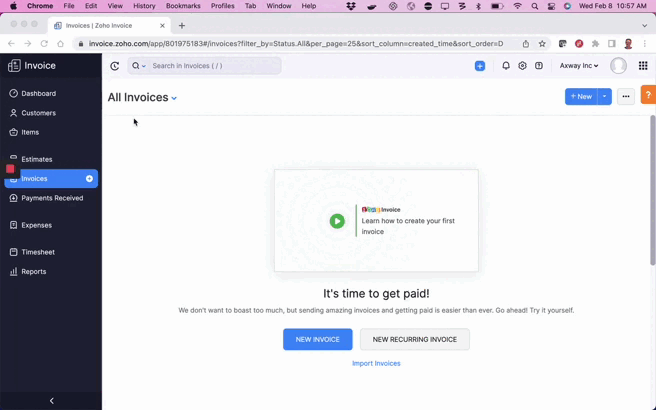
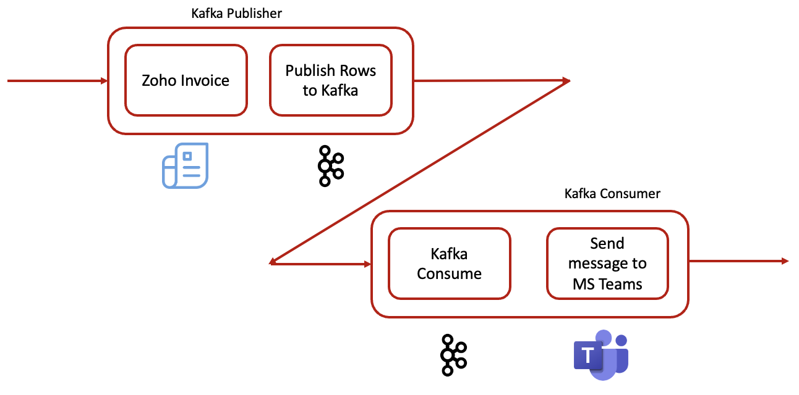
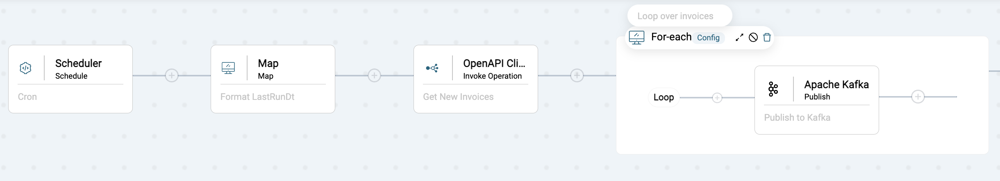
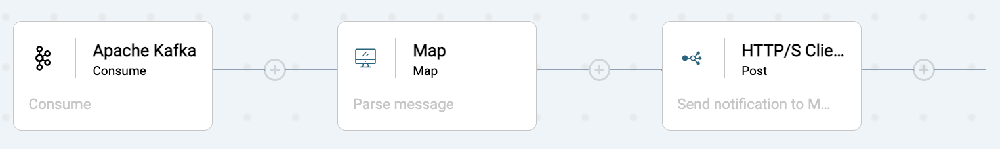
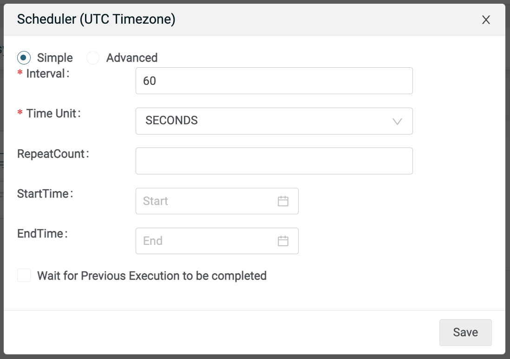
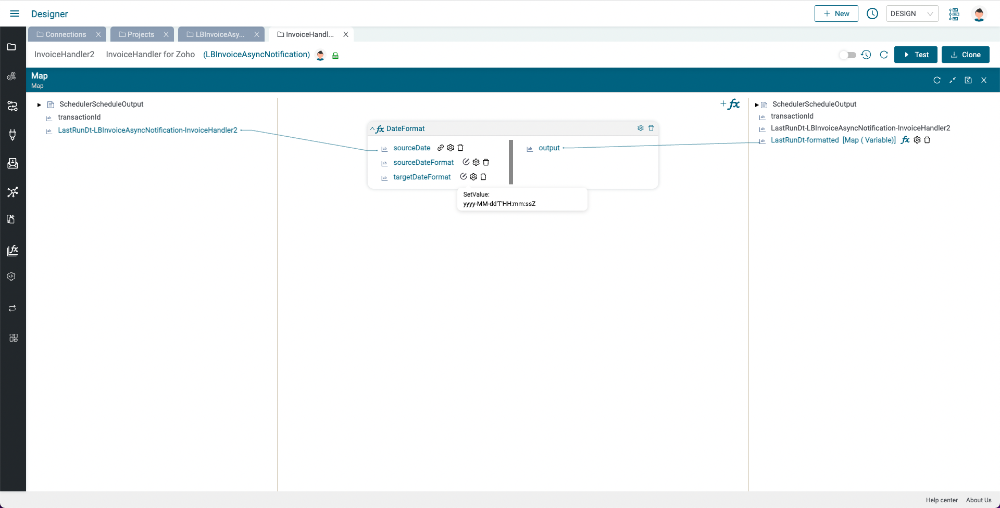
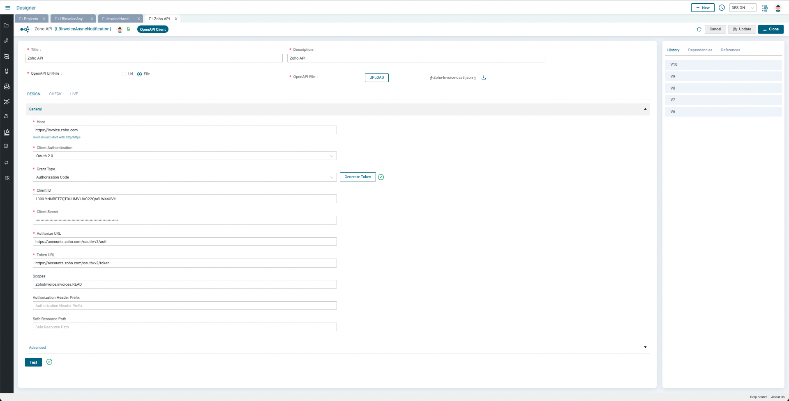

# Amplify Integration - Asynchronous Integration Use Case

## Introduction

In these labs, we'll create a set of integrations that will enable us to discover new and modified invoices and send notifications to stakeholders via MS Teams. The data will pass through Kafka.

A demo is shown below:

You can download an Amplify Integration project [**here**](assets/LBInvoiceAsyncNotification_V10_NoCreds.zip).

The flows are described below:

* Kafka Publisher
  * Poll Zoho Invoice for new and modified invoices
  * Loop over the invoices and publish to Kafka
* Kafka Consumer
  * Consume Kafka message
  * Parse message
  * Send Notification to MS Teams

This entire data flow is illustrated below:

In this set of labs, you will learn the following:

* How to create a Kafka Connection
* How to publish to a Kafka Topic
* How to consume a Kafka topic
* How to create a Zoho Invoice OpenAPI Connection
* How to use the Zoho Invoice OpenAPI Component to query Zoho Invoice for new and modified records
* How to create an HTTP/S Client Connection to integrate with MS Teams
* How to use an HTTP/S Client Post component to send a notification to MS Teams

The final integrations are shown below:

* Kafka Publisher

* Kafka Consumer

## Prerequisites

* Access to Amplify Integration  
If you do not have an account and need one, please send an email to amplify-integration-training@axway.com with the subject line `Amplify Integration Training Environment Access Request`
* A free [**Zoho Invoice**](https://www.zoho.com/invoice/) account
* A Kafka instance and the ability to create topics and publish on the topic. [**CloudKarafka**](https://www.cloudkarafka.com/) and [**Upstash**](https://upstash.com/) have free tiers. In these labs I used Upstash
* Access to MS Teams and the ability to add an Incoming Webhook Connector to a channel

## Lab 1

In this lab, we'll create the first flow that will poll Zoho Invoice for updated invoices and publish each as a Kafka message.

* Create an integration (e.g. InvoiceHandler)
* Click on the Event button and select the Scheduler Component and configure for 60 seconds
  
* Click Test to run the integration and set the built in Last Run time stamp, `LastRunDt-...`
* In order to query Zoho Invoice for updated invoices, we'll use the built in Last Run time stamp, `LastRunDt-...` to compare with the invoice *last_modified_time* times tamp, but we need to convert it to the Zoho Invoice Timestamp format using a Map function. Click on plus button and add a Map component and expand the bottom panel and add a DateFormat function
  * On the right hand panel, right click on a variable and add a String variable called *LastRunDt-formatted*
  * Drag a line from `LastRunDt-...` variable on the left hand side to the DateFormat function `sourceDate`
  * Right click on the DateFormat `sourceDateFormat` and set to `yyyy-MM-dd HH:mm:ss SSS`
  * Right click on the DateFormat targetDateFormat and set to `yyyy-MM-dd'T'HH:mm:ssZ`
  * Drag a line from DateFormat function `output` to the String variable you created above (e.g. *LastRunDt-formatted*) and click Save
  
* Now, we need to query Zoho Invoice for modified invoices. So, click the plus button to add an OpenAPI Client Invoke Operation component and expand the bottom panel. Click the Add button next to Connection so that we can create an OpenAPI Connection to your Zoho Invoice application and enter a name (e.g. Zoho API) and description.
* Follow the instructions [**here**](assets/instructions_for_Zoho_API.pdf) and use the OAS doc [**here**](assets/Zoho-Invoice-oas3.json) to create you connection and don't forget to generate a token and test the connection
  
* Go back to the Integration and click on the OpenAPI Client Invoke Operation component and click refresh and select the connection you just created
* Select Invoice for the Object and GetInvoices for the Action
* Right click on the queryParams and add two string variables inside: `filter_by` and `last_modified_time`
  * Right click on `filter_by` and set to `Status.All`
  * Drag a line from `LastRunDt-formatted` on the left to `last_modified_time`
* Expand headers and set `X-com-zoho-invoice-organizationid` to your ogranization id as described in the guide and click on Save

....
