# Amplify Integration - Asynchronous Integration Use Case

## Introduction

In these labs, we'll create a set of integrations that will enable us to discover new and modified invoices and send notifications to stakeholders via MS Teams. The data will pass through Kafka.

A demo is shown below:


You can download an Amplify Integration project [**here**](assets/LBInvoiceAsyncNotification_V10_NoCreds.zip).

The flows are described below:

* Kafka Publisher
  * Poll Zoho Invoice for new and modified invoices
  * Loop over the invoices and publish to Kafka
* Kafka Consumer
  * Consume Kafka message
  * Parse message
  * Send Notification to MS Teams

This entire data flow is illustrated below:

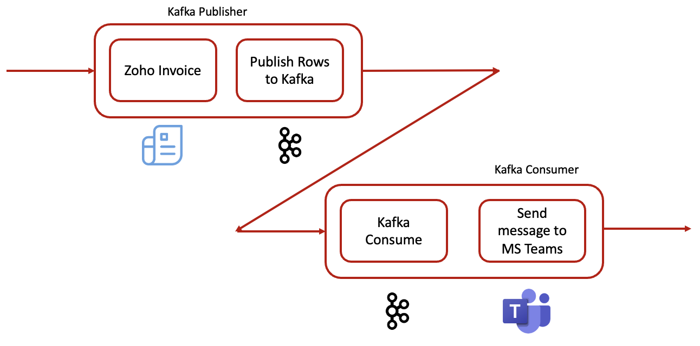

In this set of labs, you will learn the following:

* How to create a Kafka Connection
* How to publish to a Kafka Topic
* How to consume a Kafka topic
* How to create a Zoho Invoice OpenAPI Connection
* How to use the Zoho Invoice OpenAPI Component to query Zoho Invoice for new and modified records
* How to create an HTTP/S Client Connection to integrate with MS Teams
* How to use an HTTP/S Client Post component to send a notification to MS Teams

The final integrations are shown below:

* Kafka Publisher
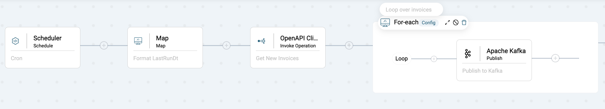
* Kafka Consumer
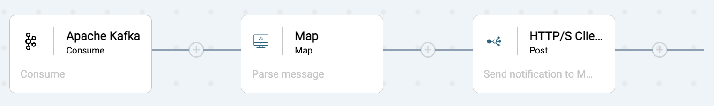

## Prerequisites

* Access to Amplify Integration </br>
If you do not have an account and need one, please send an email to amplify-integration-training@axway.com with the subject line `Amplify Integration Training Environment Access Request`
* A free [**Zoho Invoice**](https://www.zoho.com/invoice/) account
* A Kafka instance and the ability to create topics and publish on the topic. [**CloudKarafka**](https://www.cloudkarafka.com/) and [**Upstash**](https://upstash.com/) have free tiers. In these labs I used Upstash
* Access to MS Teams and the ability to add an Incoming Webhook Connector to a channel

## Lab 1

In this lab, we'll create the first flow that will poll Zoho Invoice for updated invoices and publish each as a Kafka message.

* Create an integration (e.g. InvoiceHandler)
* Click on the Event button and select the Scheduler Component and configure for 60 seconds
  
* Click Test to run the integration and set the built in Last Run time stamp, `LastRunDt-...`
* In order to query Zoho Invoice for updated invoices, we'll use the built in Last Run time stamp, `LastRunDt-...` to compare with the invoice *last_modified_time* times tamp, but we need to convert it to the Zoho Invoice Timestamp format using a Map function. Click on plus button and add a Map component and expand the bottom panel and add a DateFormat function
  * On the right hand panel, right click on a variable and add a String variable called *LastRunDt-formatted*
  * Drag a line from `LastRunDt-...` variable on the left hand side to the DateFormat function `sourceDate`
  * Right click on the DateFormat `sourceDateFormat` and set to `yyyy-MM-dd HH:mm:ss SSS`
  * Right click on the DateFormat targetDateFormat and set to `yyyy-MM-dd'T'HH:mm:ssZ`
  * Drag a line from DateFormat function `output` to the String variable you created above (e.g. *LastRunDt-formatted*) and click Save
  
* Now, we need to query Zoho Invoice for modified invoices. So, click the plus button to add an OpenAPI Client Invoke Operation component and expand the bottom panel. Click the Add button next to Connection so that we can create an OpenAPI Connection to your Zoho Invoice application and enter a name (e.g. Zoho API) and description.
* Follow the instructions [**here**](assets/instructions_for_Zoho_API.pdf) and use the OAS doc [**here**](assets/Zoho-Invoice-oas3.json) to create you connection and don't forget to generate a token and test the connection
  
* Go back to the Integration and click on the OpenAPI Client Invoke Operation component and click refresh and select the connection you just created
* Select Invoice for the Object and GetInvoices for the Action
* Right click on the queryParams and add two string variables inside: `filter_by` and `last_modified_time`
  * Right click on `filter_by` and set to `Status.All`
  * Drag a line from `LastRunDt-formatted` on the left to `last_modified_time`
* Expand headers and set `X-com-zoho-invoice-organizationid` to your ogranization id as described in the guide and click on Save

  
* Now let's loop over the modified invoices and publish each to Kafka
* Add a For-each component, expand it and click on Config and select `GetInvoicesOutput->response->invoices` to specify the array to loop over
  
* Inside the For-each add an Apache Kafka Publish Component and expand the bottom panel
* Click on Add next to Connection to create a new Kafka Connection and give it a name and description
* Review your Upstash Kafka Details and get your Endpoint, Username and Password
  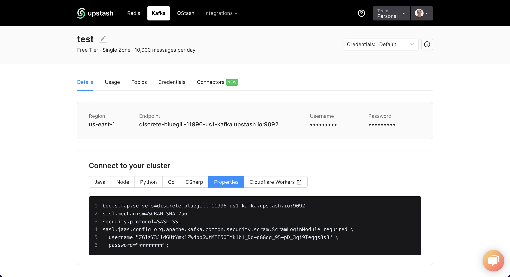
* In the Amplify Integration Connection screen
  * Enter the Upstash Endpoint for Bootstrap Servers
  * Select SASL_SCRAM for Authentication
  * Enter the Upstash username and password
  * Select for SCRAM_SHA_256 Encryption Type
  * Check the SSL Certificate checkbox and press Test
  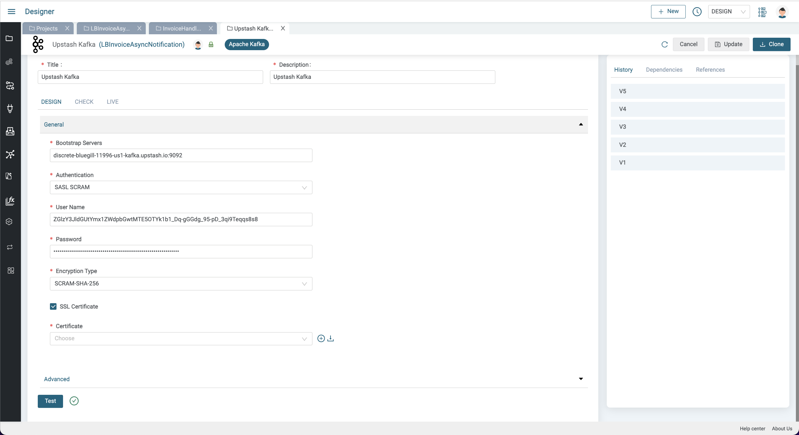
* Return to the Apache Kafka Publish component in the integration and click refresh in the Connection picker and select our newly created Kafka Connection
* Expand the `ApacheKafkaPublishInput->messages` to expose the messages parameters and drag a line from the `GetInvoicesOutput->response->invoices` in the left hand panel to `ApacheKafkaPublishInput->messages->value`
* Right click on `ApacheKafkaPublishInput->topicName` and select SetValue and paste in a Topic name that you should create in your Upstash Kafka instance (e.g. invoice) and press Save
  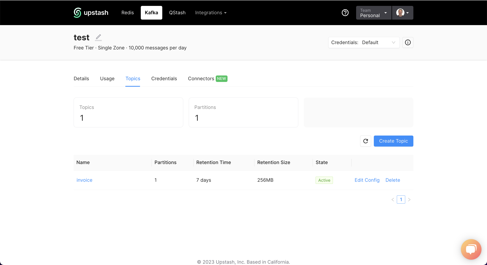
  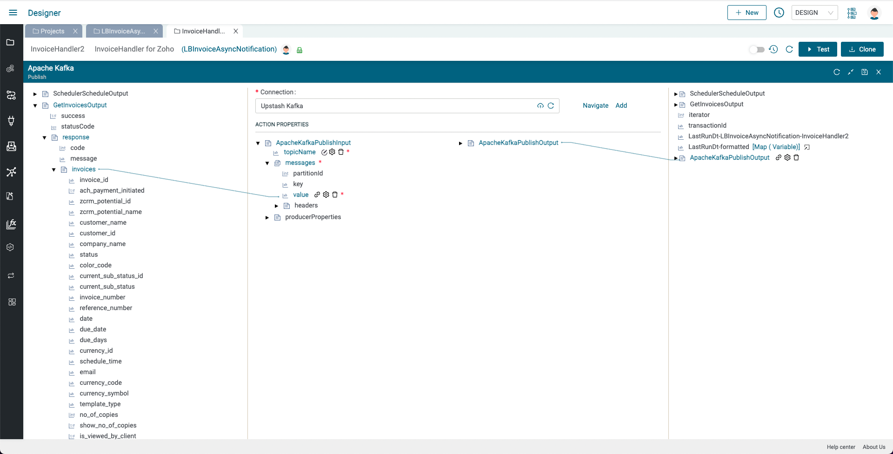
* This is what your final integration should look like:
  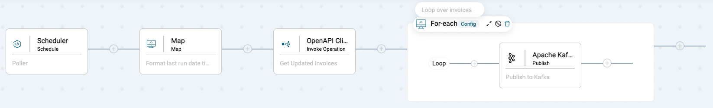
* Let's test it by adding an invoice to Zoho Invoice and then pressing the Test button in your integration (no need to enable the integration)
* A new browser tab will open showing the transaction. You should see that one invoice was detected by looking at the For-each step
  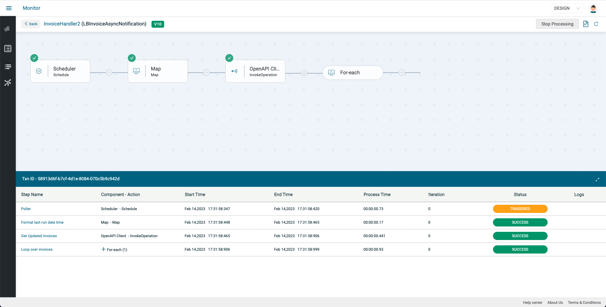
* Click the plus sign next to For-each and again and see the Apache Publish step and click on it and expand both sides to see that your invoice was published
  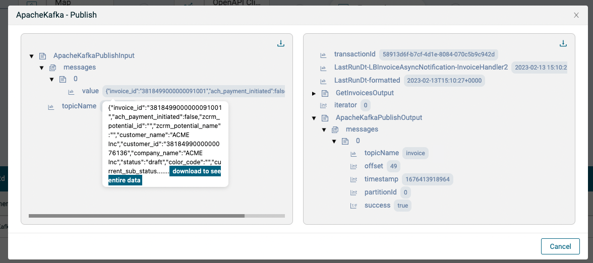

Now that we can publish an updated invoice to Kafka, let's create a Kafka Consumer integration to consume the Kafka message and send a notification to Microsoft Teams

## Lab 2

In this lab, we'll consume a Kafka message from the `invoice` topic and send a notification with some invoice details to Microsoft Teams.

* Create an integration (e.g. InvoiceNotifier)
* Click on the Event button and select the Apache Kafka Consume Component and select the Kafka connector used in the first integration and enter the topic name (e.g. invoice) and press save
  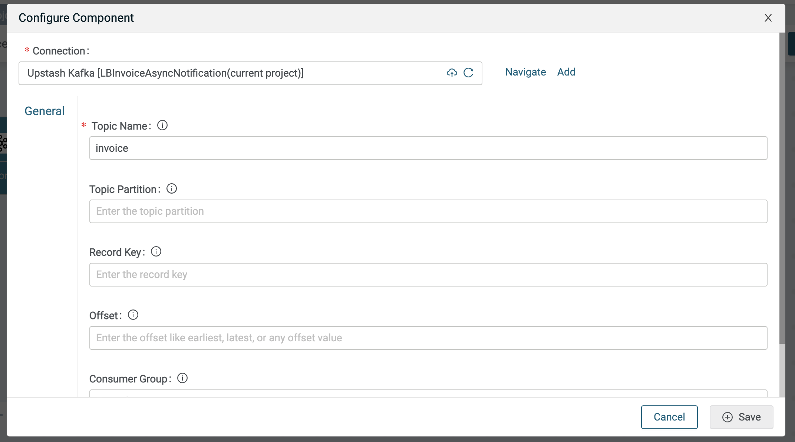
* Add a Map component to parse the Kafka message and expand the bottom panel
* Right click on any variable on the right hand side and select Extract and paste in the following invoice payload sample and click Copy Node

  ```json
  {
    "invoice_id": "3818499000000076212",
    "ach_payment_initiated": false,
    "zcrm_potential_id": "",
    "zcrm_potential_name": "",
    "customer_name": "ACME Inc",
    "customer_id": "3818499000000076136",
    "company_name": "ACME Inc",
    "status": "draft",
    "color_code": "",
    "current_sub_status_id": "",
    "current_sub_status": "draft",
    "invoice_number": "INV-000002",
    "reference_number": "",
    "date": "2023-02-01",
    "due_date": "2023-02-01",
    "due_days": "",
    "currency_id": "3818499000000000097",
    "schedule_time": "",
    "email": "lbrenman99@hotmail.com",
    "currency_code": "USD",
    "currency_symbol": "$",
    "template_type": "standard",
    "is_viewed_by_client": false,
    "has_attachment": false,
    "client_viewed_time": "",
    "project_name": "",
    "billing_address": {
      "address": "1 Main St",
      "street2": "",
      "city": "Chicago",
      "state": "Illinois",
      "zipcode": "01810",
      "country": "U.S.A",
      "phone": "",
      "fax": "",
      "attention": ""
    },
    "shipping_address": {
      "address": "1 Main St",
      "street2": "",
      "city": "Chicago",
      "state": "Illinois",
      "zipcode": "01810",
      "country": "U.S.A",
      "phone": "",
      "fax": "",
      "attention": ""
    },
    "country": "U.S.A",
    "phone": "",
    "created_by": "lbrenman",
    "updated_time": "2023-02-01T08:02:15-0500",
    "transaction_type": "renewal",
    "total": 24995.00,
    "balance": 24995.00,
    "created_time": "2023-02-01T08:02:15-0500",
    "last_modified_time": "2023-02-01T08:02:15-0500",
    "is_emailed": false,
    "reminders_sent": 0,
    "last_reminder_sent_date": "",
    "payment_expected_date": "",
    "last_payment_date": "",
    "custom_fields": [],
    "custom_field_hash": {},
    "template_id": "3818499000000017001",
    "documents": "",
    "salesperson_id": "3818499000000076159",
    "salesperson_name": "Leor Brenman",
    "shipping_charge": 0.00,
    "adjustment": 0.00,
    "write_off_amount": 0.00,
    "exchange_rate": 1.00
  }
  ```

* Right click on any variable on the right hand side and select Paste and give your extract variable a name (e.g. invoiceJson)
* Expand the `ApacheKafkaConsumeOutput` variable on the left panel to expose the `recordValue` and drag a line from it to the `invoiceJson` variable
  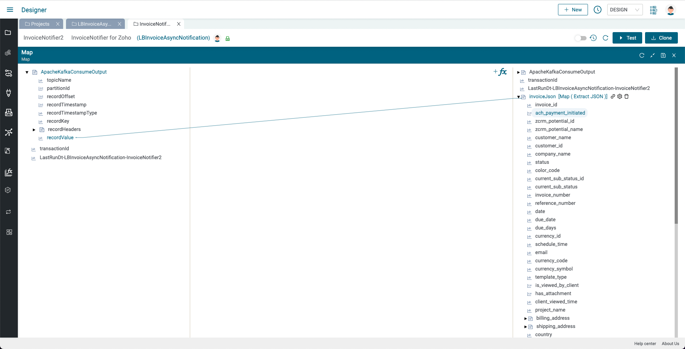

In the next few steps, we'll post a message to MS Teams with some details from the invoice.

We'll use the MS Teams Incoming Webhook Connector so that we can Post a message to a MS Teams channel using an HTTP/S Client Post component.

* Follow the instructions [**here**](https://learn.microsoft.com/en-us/microsoftteams/platform/webhooks-and-connectors/how-to/add-incoming-webhook) to get a URL to a MS Teams channel
* Add an HTTP/S Client Post Connection component to your integration and expand the bottom panel
* Click Add next to Connection so we can create an HTTP/S Client Connection to the MS Teams Incoming Webhook Connector URL and give the connection a name and description and do the following:
  * Select HTTPS for Protocol
  * Select HTTP/2 for HTTP Version
  * Enter the MS Teams Incoming Webhook Connector URL (without the https://) and press Update
  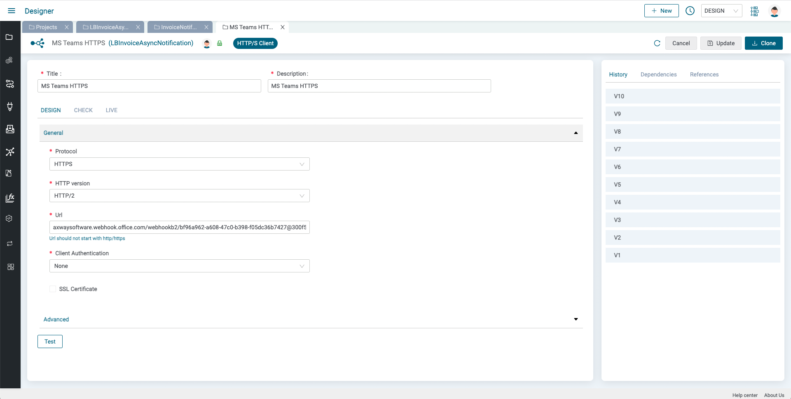
* Return the HTTP/S Client Post Connection component in your integration, click refresh and select the MS Teams Connection
  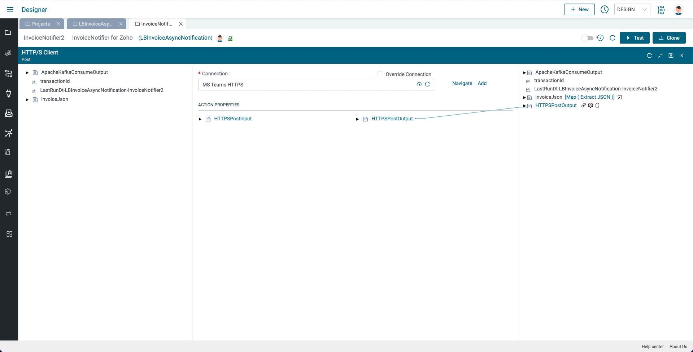
* In the ACTION PROPERTIES section, expand `HTTPSPostInput` to expose the `body` and right click on `body` and select SetValue
* Enter the following:

  ```json
  {
    Text: "Invoice #{{invoice_number}} for customer '{{company_name}}', total value: {{currency_symbol}}{{total}} {{currency_code}} is now {{status}}"
  }
  ```

* Replace the variables (e.g. {{}}) by deleting them and clicking the plus button and selecting the appropriate variable from there and click Save and then Save again
  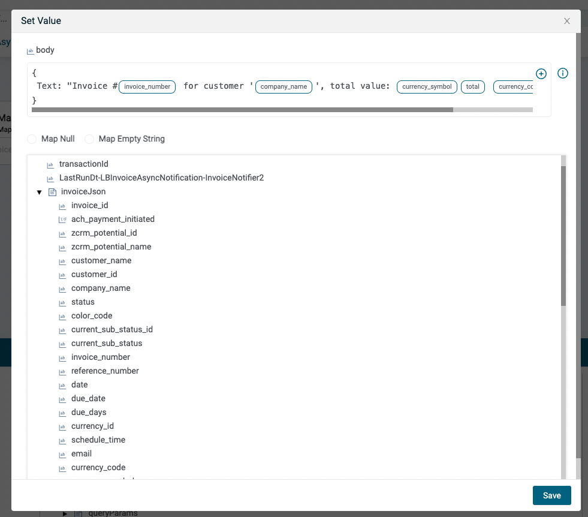
* Now we're ready to test our integration which should look like this:
  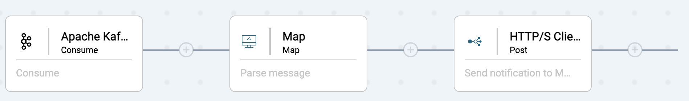
* Enable your integration and you should see a message in MS Teams. This is the message we published at the end of the previous lab
  
* Make sure the other integration is enabled and modify an invoice or create a new invoice in Zoho Invoice and see that you get a new message in MS Teams once the scheduler is triggered. For updating a invoice you can mark an invoice as sent and/or record a payment to change its status
* Disable both integrations (to avoid polling) when not in use

## Lab 3 - Challenge yourself!

Use the following MS Teams card sample and modify it to make a nicer MS Teams card for your invoice and send it as the body of your HTTPS Client Post to MS Teams:

  ```json
  {
    "@type": "MessageCard",
    "@context": "http://schema.org/extensions",
    "themeColor": "0076D7",
    "summary": "Summary",
    "sections": [
      {
        "activityTitle": "Title",
        "activitySubtitle": "Subtitle",
        "activityImage": "https://teamsnodesample.azurewebsites.net/static/img/image5.png",
        "facts": [
          {
            "name": "Date",
            "value": "March 4, 2020"
          },
          {
            "name": "Total",
            "value": 29672
          },
          {
            "name": "Partial",
            "value": 3564
          }
        ],
        "markdown": true
      }
    ]
  }
  ```

