# Invoice Asynchronous Integration Lab

## Introduction

In these labs, we'll create a set of integrations that will enable us to discover new and modified invoices and send notifications to stakeholders via MS Teams. The data will pass through RabbitMQ.

A demo is shown below:


The flows are described below:

* RabbitMQ Publisher
  * Poll Zoho Invoice for new and modified invoices
  * Loop over the invoices and publish to RabbitMQ
* RabbitMQ Consumer
  * Consume RabbitMQ message
  * Parse message
  * Send Notification to MS Teams channel

This entire data flow is illustrated below:


In this set of labs, you will learn the following:

* How to create a RabbitMQ Connection
* How to publish to in a RabbitMQ queue
* How to consume from a RabbitMQ queue
* How to create a Zoho Invoice OpenAPI Connection
* How to use the Zoho Invoice OpenAPI Component to query Zoho Invoice for new and modified records
* How to create an HTTP/S Client Connection to integrate with MS Teams
* How to use an HTTP/S Client Post component to send a notification to MS Teams

The final integrations are shown below:

* RabbitMQ Publisher

* RabbitMQ Consumer


## Prerequisites

* Access to Amplify Fusion
  > If you do not have an account and need one, please send an email to **[amplify-integration-training@axway.com](mailto:amplify-integration-training@axway.com?subject=Amplify%20Fusion%20-%20Training%20Environment%20Access%20Request&body=Hi%2C%0D%0A%0D%0ACould%20you%20provide%20me%20with%20access%20to%20an%20environment%20where%20I%20can%20practice%20the%20Amplify%20Fusion%20e-Learning%20labs%20%3F%0D%0A%0D%0ABest%20Regards.%0D%0A)** with the subject line `Amplify Fusion Training Environment Access Request`
* A free [**Zoho Invoice**](https://www.zoho.com/invoice/) account
* A CloudAMQ RabbitMQ instance and the ability to create queues and publish on the queue. [**CloudAMQ**](https://www.cloudamqp.com/) have free tiers and is recommended for this lab. Follow this tutorial to create an instance and get access [**RabbitMQ tutorial**](assets/rabbitmq-instructions.md)
* Access to **Microsoft Teams** and the ability to install an Microsoft Teams incoming Webhook connector
  > If you don't use Teams or don't have the webhook capability, you can use a test webhook online app like [Webhook.site](https://webhook.site) instead for this lab.

## Lab 1

In this lab, we'll create the first flow that will poll Zoho Invoice for updated invoices and publish each as a RabbitMQ message.

* Create a new project in Amplify Fusion to manage this asynchronous integration. Use a unique name in case you're not the only one doing this lab on your tenant (e.g., XX_InvoiceAsyncNotification with XX being your name or initials).
* Create an integration (e.g. InvoiceHandler)
* Click on the Event button and select the Scheduler Component and configure for 60 seconds
  
* Click Test to run the integration. This will initialize the Last Run time stamp, `LastRunDt-...`. This built in variable will always contain the timestamp of the last time the integration ran. We can use it for polling modifications in back end data sources.
* In order to query Zoho Invoice for updated invoices, we'll use the built in Last Run time stamp, `LastRunDt-...` to compare with the invoice *last_modified_time* times tamp, but we need to convert it to the Zoho Invoice Timestamp format using a Map function. Click on `+` button and add a Map component and expand the bottom panel and add a DateFormat function
  * On the right hand panel, right click on a variable and add a String variable called *LastRunDt-formatted*
  * Drag a line from `LastRunDt-...` variable on the left hand side to the DateFormat function `sourceDate`
  * Right click on the DateFormat `sourceDateFormat` and set value to `yyyy-MM-dd HH:mm:ss SSS`
  * Right click on the DateFormat `targetDateFormat` and set value to `yyyy-MM-dd'T'HH:mm:ssZ`
  * Drag a line from DateFormat function `output` to the String variable you created above (e.g. *LastRunDt-formatted*) and click Save
  
* Now, we need to query Zoho Invoice for modified invoices. So, click the `+` button to add an OpenAPI Client Invoke Operation component and expand the bottom panel. Click the Add button next to Connection so that we can create an OpenAPI Connection to your Zoho Invoice application and enter a name (e.g. Zoho API) and description.
* Follow the instructions [**here**](assets/zoho-api-instructions.md) and use the OAS doc [**here**](assets/Zoho-Invoice-oas3.json) to create you connection and don't forget to generate a token and test the connection
  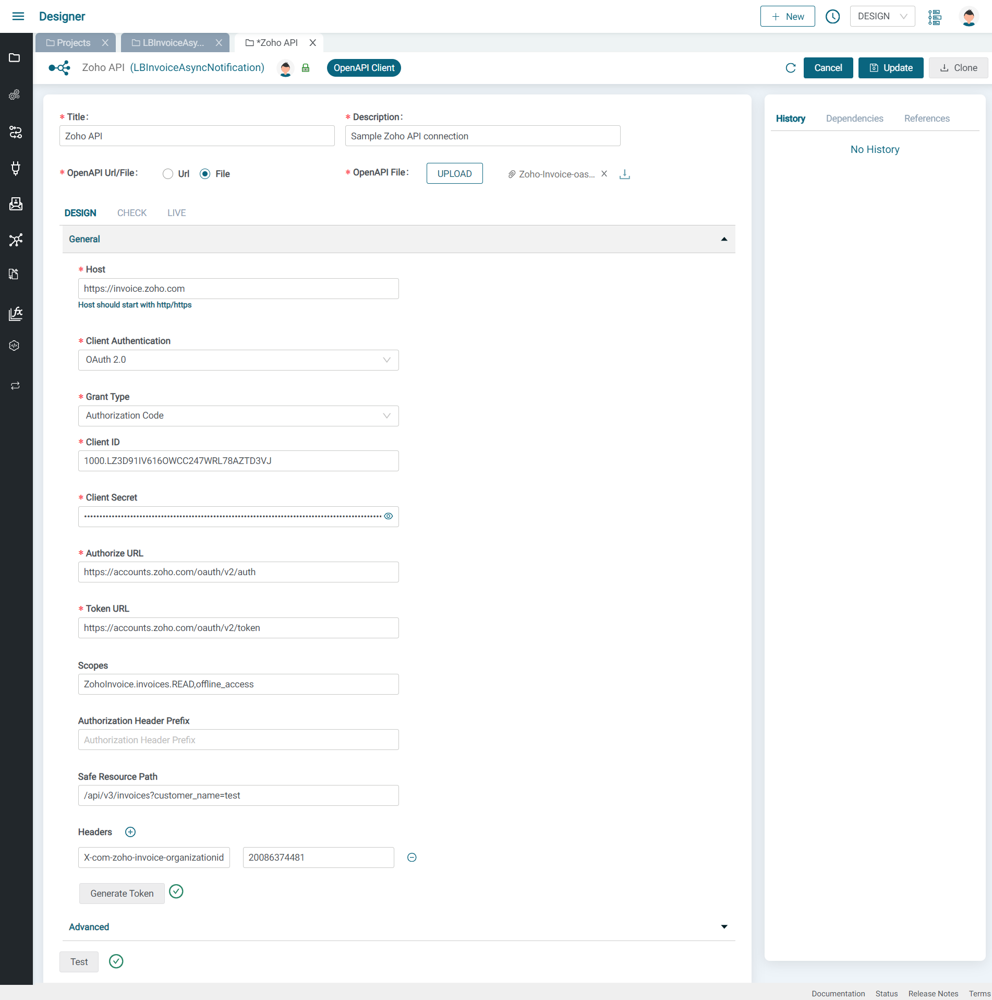
* Go back to the Integration and click on the OpenAPI Client Invoke Operation component and click refresh and select the connection you just created
* Select Invoice for the Object and GetInvoices for the Action
* Right click on the queryParams and add two string variables inside: `filter_by` and `last_modified_time`
  * Right click on `filter_by` and set to `Status.All`
  * Drag a line from `LastRunDt-formatted` on the left to `last_modified_time` and click on Save

  
* Now let's loop over the modified invoices and publish each to RabbitMQ
* Add a For-each component, expand it and click on Config and select `GetInvoicesOutput->response->invoices` to specify the array to loop over
  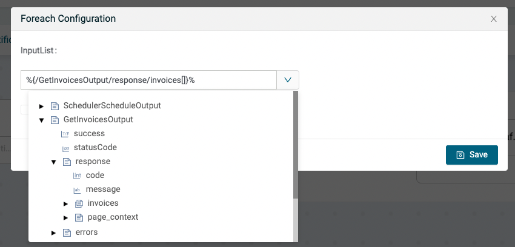
* Inside the For-each add an RabbitMQ Publish Component and expand the bottom panel
* Click on Add next to Connection to create a new RabbitMQ Connection and give it a name and description
* Review your RabbitMQ details and get your **Cluster** host, **User & Vhost**, **Password** and **port**
  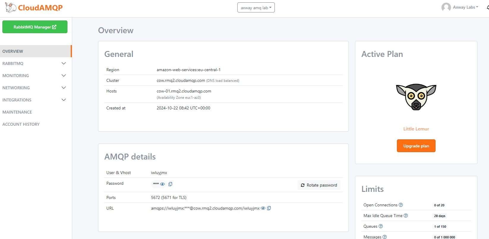
* In the Amplify Fusion Connection screen
  * Enter the protocol (here, AMQP)
  * Enter CloudAMQ host and port
  * Enter CloudAMQ Virtual Host
  * Select Basic for Client Authentication
  * Enter CloudAMQ username and password
  * Click on save/update and press Test
  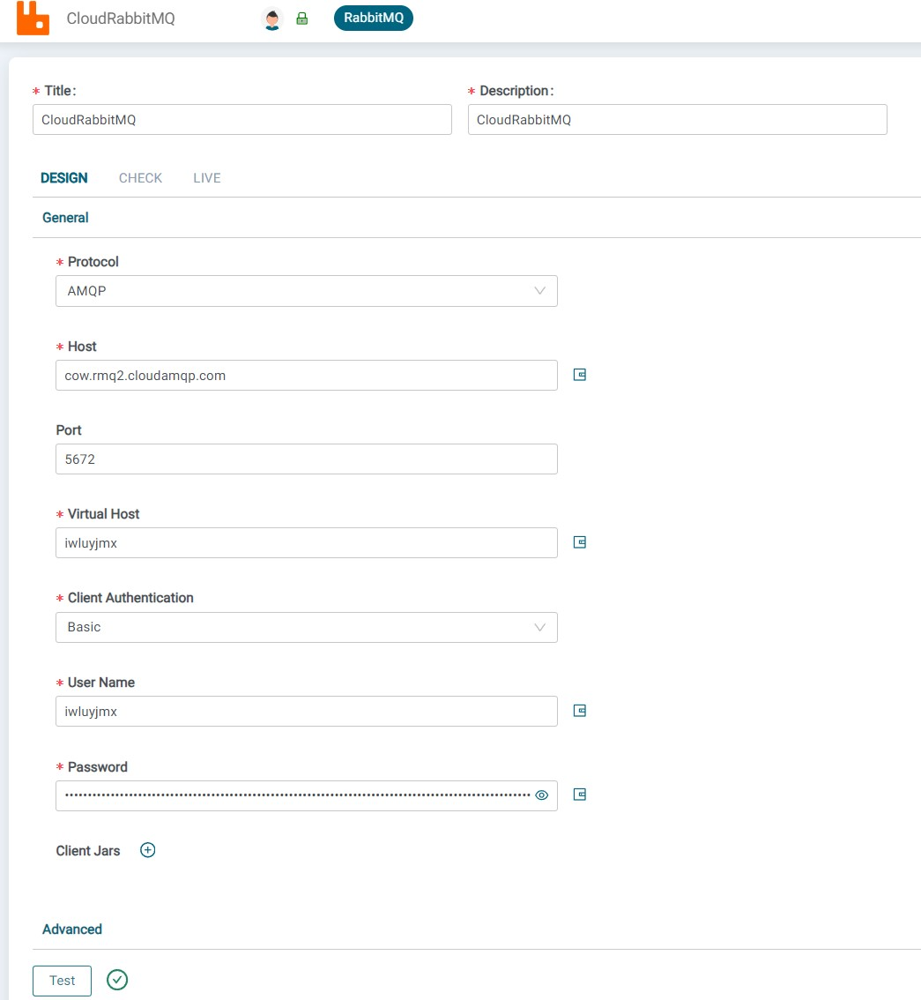
* Return to the RabbitMQ Publish component in the integration and click refresh in the Connection picker and select our newly created RabbitMQ Connection
* Expand the `RabbitMQPublishInput->messages` to expose the messages parameters and drag a line from the `GetInvoicesOutput->response->invoices` in the left hand panel to `RabbitMQPublishInput->messages->payload`
  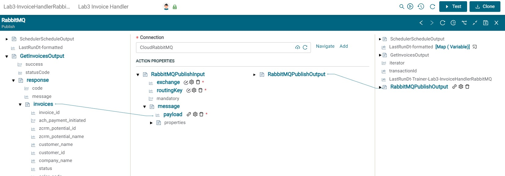
* Right click on `RabbitMQPublishInput->exchange` and select SetValue and paste in an exchange name from your CloudAMQ RabbitMQ instance (e.g. amq.topic)
* Right click on `RabbitMQPublishInput->routingKey` and select SetValue and paste in a routing key  that you should create in your CloudAMQ RabbitMQ instance (e.g. invoicesKey) and press Save
  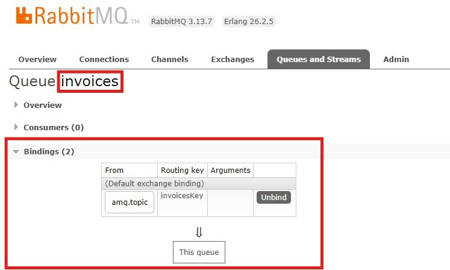
* This is what your final integration should look like:
  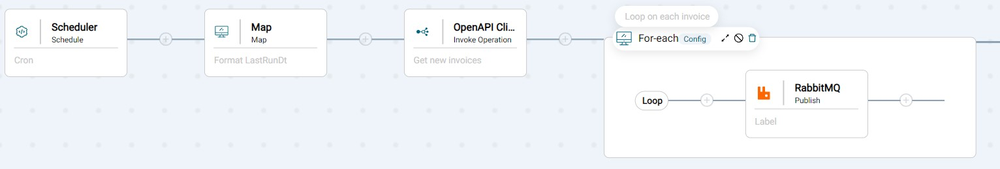
* Let's test it by adding an invoice to Zoho Invoice and then pressing the Test button in your integration (no need to enable the integration)
* A new browser tab will open showing the transaction. You should see that one invoice was detected by looking at the For-each step
  
* Click the `+` sign next to For-each and again and see the RabbitMQ Publish step and click on it and expand both sides to see that your invoice was published
  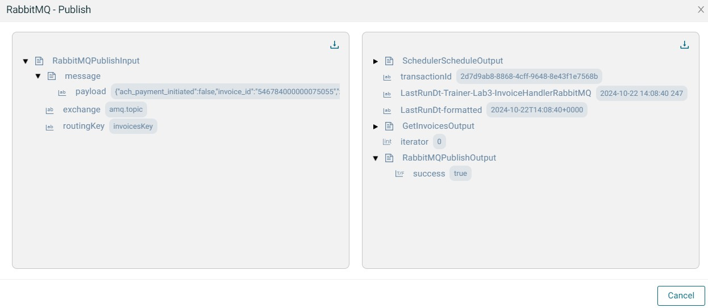

Now that we can publish an updated invoice to RabbitMQ queue, let's create a RabbitMQ Consumer integration to consume the RabbitMQ message and send a notification to Microsoft Teams

## Lab 2

In this lab, we'll consume a RabbitMQ message from the `invoices` queue and send a notification with some invoice details to Microsoft Teams.

* Create an integration (e.g. InvoiceNotifier)
* Click on the Event button and select the **RabbitMQ Consume** Component and select the RabbitMQ connector used in the first integration and enter the queue name (e.g. **invoices**) and press `Save`
  
* Add a Map component to parse the RabbitMQ message and expand the bottom panel
* Right click on any variable on the right hand side and select `Extract` and paste in the following invoice payload sample and click Copy Node

  ```json
  {
    "invoice_id": "3818499000000076212",
    "ach_payment_initiated": false,
    "zcrm_potential_id": "",
    "zcrm_potential_name": "",
    "customer_name": "ACME Inc",
    "customer_id": "3818499000000076136",
    "company_name": "ACME Inc",
    "status": "draft",
    "color_code": "",
    "current_sub_status_id": "",
    "current_sub_status": "draft",
    "invoice_number": "INV-000002",
    "reference_number": "",
    "date": "2023-02-01",
    "due_date": "2023-02-01",
    "due_days": "",
    "currency_id": "3818499000000000097",
    "schedule_time": "",
    "email": "lbrenman99@hotmail.com",
    "currency_code": "USD",
    "currency_symbol": "$",
    "template_type": "standard",
    "is_viewed_by_client": false,
    "has_attachment": false,
    "client_viewed_time": "",
    "project_name": "",
    "billing_address": {
      "address": "1 Main St",
      "street2": "",
      "city": "Chicago",
      "state": "Illinois",
      "zipcode": "01810",
      "country": "U.S.A",
      "phone": "",
      "fax": "",
      "attention": ""
    },
    "shipping_address": {
      "address": "1 Main St",
      "street2": "",
      "city": "Chicago",
      "state": "Illinois",
      "zipcode": "01810",
      "country": "U.S.A",
      "phone": "",
      "fax": "",
      "attention": ""
    },
    "country": "U.S.A",
    "phone": "",
    "created_by": "lbrenman",
    "updated_time": "2023-02-01T08:02:15-0500",
    "transaction_type": "renewal",
    "total": 24995.00,
    "balance": 24995.00,
    "created_time": "2023-02-01T08:02:15-0500",
    "last_modified_time": "2023-02-01T08:02:15-0500",
    "is_emailed": false,
    "reminders_sent": 0,
    "last_reminder_sent_date": "",
    "payment_expected_date": "",
    "last_payment_date": "",
    "custom_fields": [],
    "custom_field_hash": {},
    "template_id": "3818499000000017001",
    "documents": "",
    "salesperson_id": "3818499000000076159",
    "salesperson_name": "Leor Brenman",
    "shipping_charge": 0.00,
    "adjustment": 0.00,
    "write_off_amount": 0.00,
    "exchange_rate": 1.00
  }
  ```

* Right click on any variable on the right hand side and select Paste and give your extract variable a name (e.g. invoiceJson)
* Expand the `RabbitMQConsumeOutput` variable on the left panel to expose the `message -> payload` and drag a line from it to the `invoiceJson` variable
  

In the next few steps, we'll post a message to MS Teams with some details from the invoice.

We'll use the MS Teams Incoming Webhook Connector so that we can Post a message to a MS Teams channel using an HTTP/S Client Post component.

* Follow the instructions [**here**](https://support.microsoft.com/en-us/office/create-incoming-webhooks-with-workflows-for-microsoft-teams-8ae491c7-0394-4861-ba59-055e33f75498) to get a URL to a MS Teams channel
* Add an HTTP/S Client Post Connection component to your integration and expand the bottom panel
* Click Add next to Connection so we can create an HTTP/S Client Connection to the MS Teams Incoming Webhook Connector URL and give the connection a name and description and do the following:
  * Select HTTPS for Protocol
  * Select HTTP/2 for HTTP Version
  * Enter the MS Teams Incoming Webhook Connector URL (without the https://) and press Update
  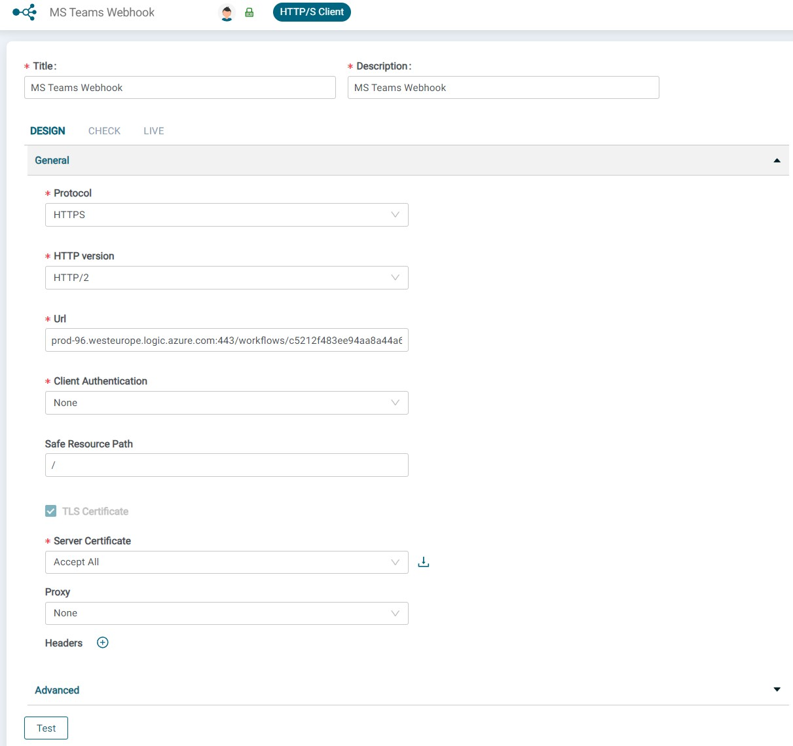
* Return the HTTP/S Client Post Connection component in your integration, click refresh and select the MS Teams Connection
  
* In the ACTION PROPERTIES section, expand `HTTPSPostInput` to expose the `body` and right click on `body` and select SetValue
* Enter the following:

  ```json
  {
    "type": "message",
    "attachments": [
        {
            "contentType": "application/vnd.microsoft.card.adaptive",
            "content": {
                "type": "AdaptiveCard",
                "body": [
                    {
                        "type": "TextBlock",
                        "text": "Invoice #{invoice_number} for customer '{customer_name}', total value: {currency_symbol}{total} {currency_code} is now {status}",
                        "wrap": true
                    }
                ],
                "$schema": "https://adaptivecards.io/schemas/adaptive-card.json",
                "version": "1.0",
                "msteams": {
                    "entities": []
                }
            }
        }
    ]
  }
  ```

* Replace the variables (e.g. {...}) by deleting them and clicking the `+` button and selecting the appropriate variable from there and click Save and then Save again
  

* in headers, add two new strings attributes : 
  * Accept=application/json
  * Content-Type=application/json
    
    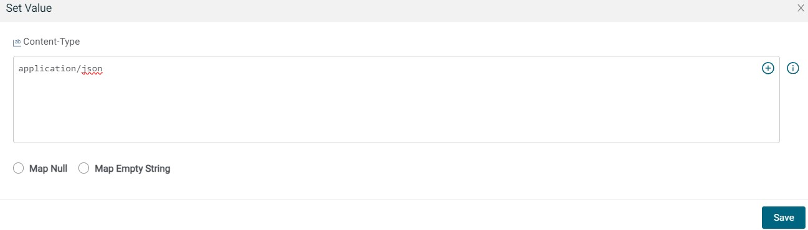

* Now we're ready to test our integration which should look like this:
  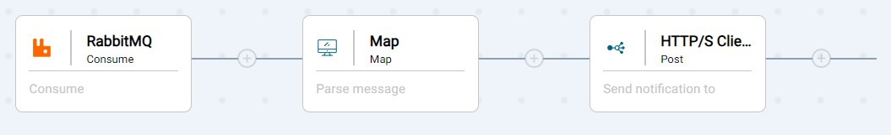
* Enable your integration and you should see a message in MS Teams. This is the message we published at the end of the previous lab
  
* Make sure the other integration is enabled and modify an invoice or create a new invoice in Zoho Invoice and see that you get a new message in MS Teams once the scheduler is triggered. For updating a invoice you can mark an invoice as sent and/or record a payment to change its status
* Disable both integrations (to avoid polling) when not in use

## Lab 3 - Challenge yourself!

Review adaptive card samples [here](https://adaptivecards.io/samples/) and try to make you card look nicer like this:
  