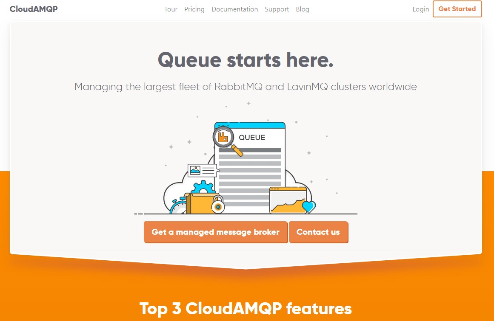
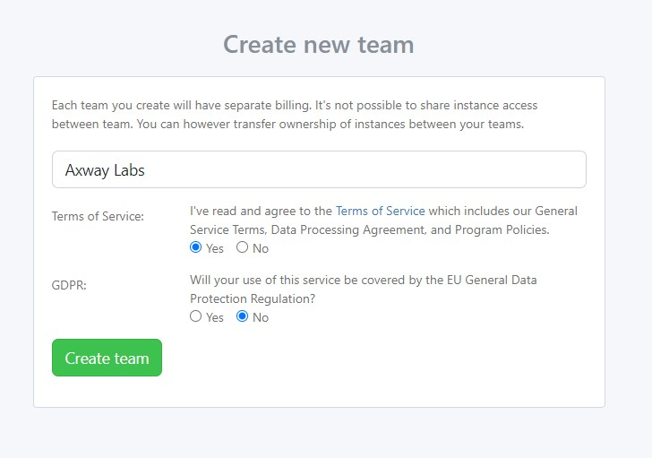
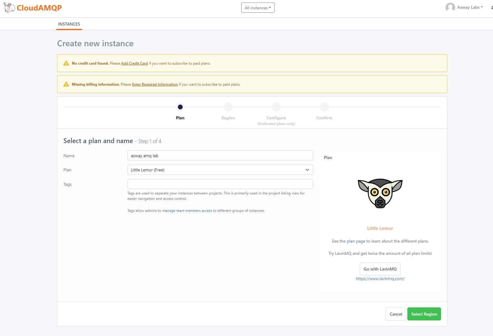
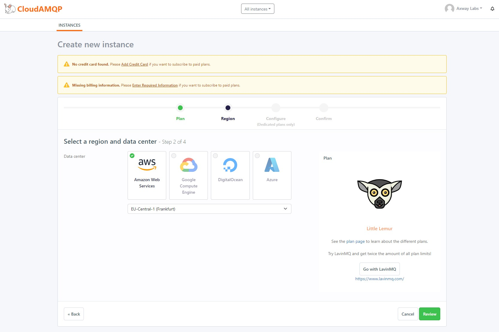
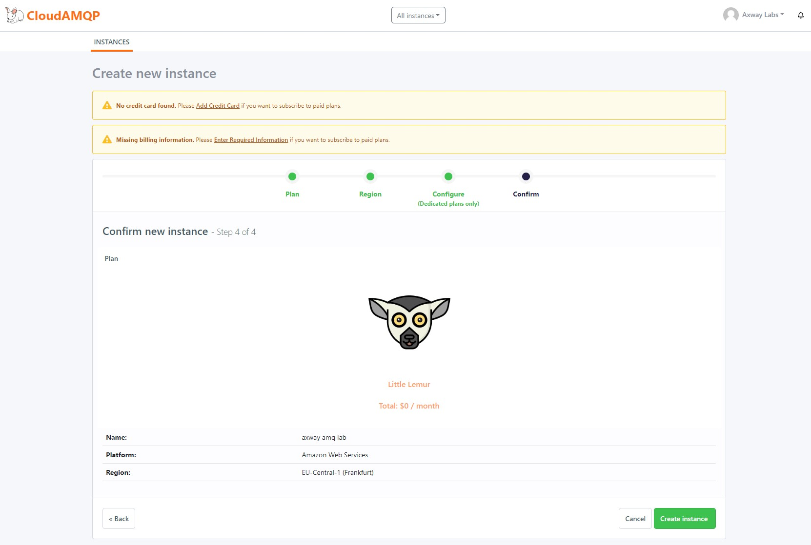
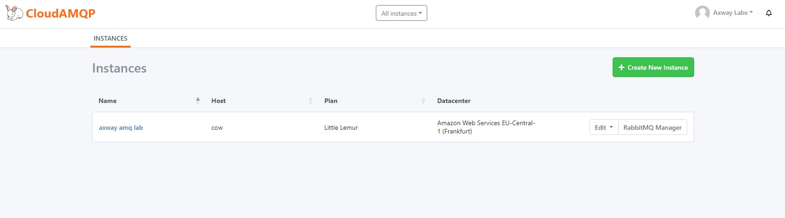
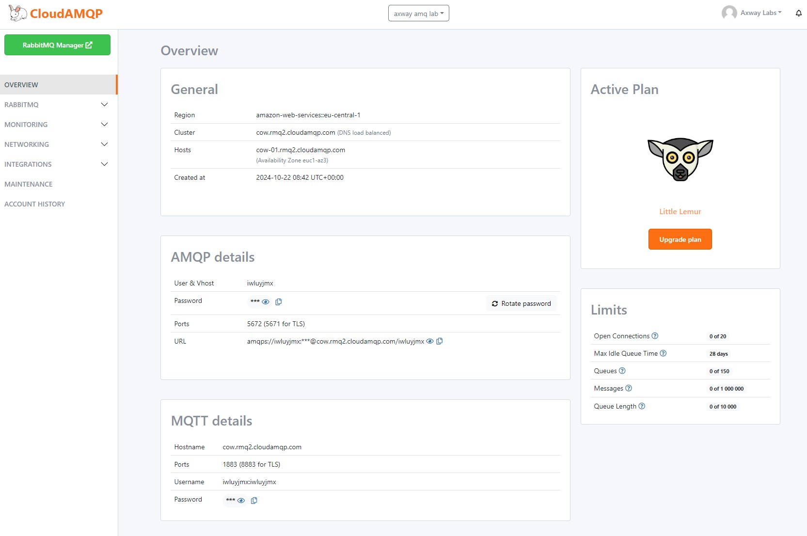
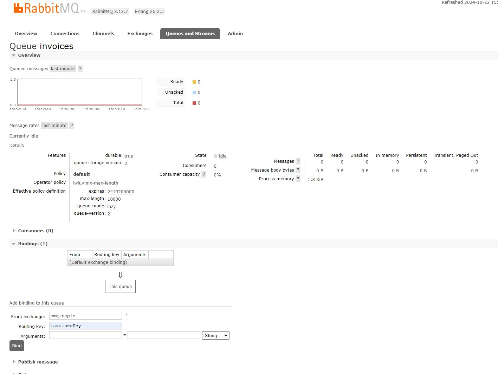

# RabbitMQ Invoice API integration guide

## Create a RabbitMQ instance on CloudAMQ

1. Start from <https://www.cloudamqp.com/> by clicking on **Get Started**\
   

2. Create an account with your email or choose Github/Google sign-up
   

3. Once your account is created and you first login, you have to create a team :
   - Put a team name,
   - Accept tems of services,
   - Decline GDPR
   - Click on **Create team**
   

4. Then, create a new instance by clicking on **+ Create New Instance**
   

5. Put an instance name, choose `Little Lemur (Free)` plan and click **Select Region** button
    

6. Select a **region** (*example AWS*) and a **data center** where your RabbitMQ instance will be deployed and click on **Review** button
   

7. Review your instance information and click on **Create Instance** button
   

8. Once your instance is created, you should be able to see it and access it
   

9. Click on your instance name to display details like URL and credentials
    

10. In order to configure an Amplify Fusion Connection, copy the following information:

- From **General**
  - Cluster
- From **AMQP details**
  - User & Vhost
  - Password
  - Port (non TLS)

## Create a RabbitMQ queue and a routing rule

To publish a message in RabbitMQ, you need to create a queue and a routing rule. You can read about CloudAMQP RabbitMQ Exchanges and a Routing Keys [here](https://www.cloudamqp.com/blog/part4-rabbitmq-for-beginners-exchanges-routing-keys-bindings.html).

1. Click the `RabbitMQ Manager` button in your CloudAMQP cluster Overview page

2. Click on the `Queues and Streams` tab and add a new queue. \
   In the `Add a new queue section`, set **invoices** in `Name`  \
    \
   Click on `Add queue` button\
   

3. One your queue is created, click on your queue name, then go to `Bindings` section.
   - Set **amq.topic** in `From exchange`
   - Set **invoicesKey** in `Routing key`
   - Click on `Bind` button to save.

