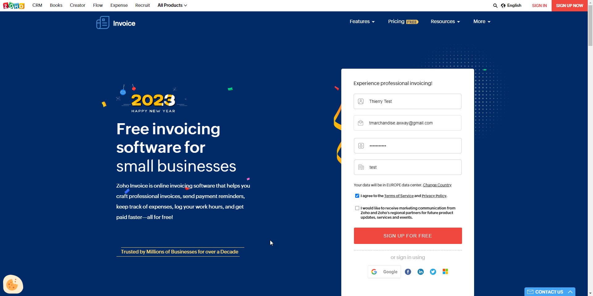
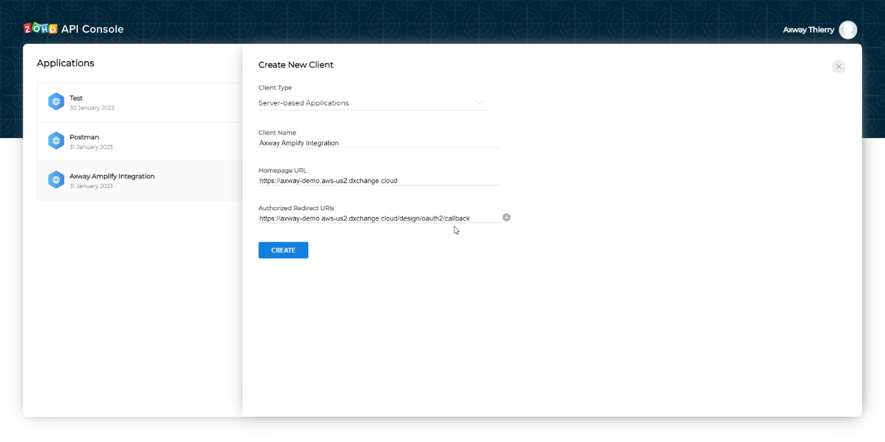
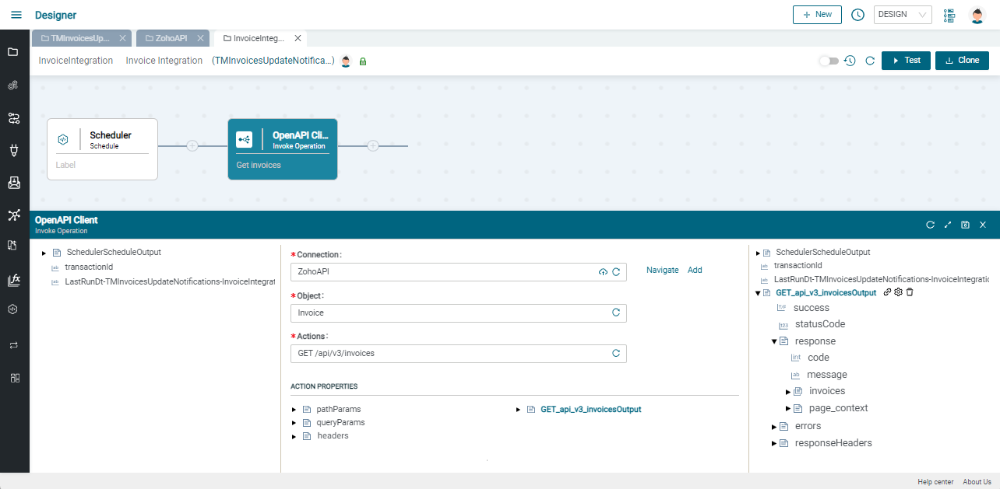

# Zoho Invoice API integration guide

## Zoho Invoice Setup

1. Sign Up from <https://www.zoho.com/invoice/> \
   

2. Note the data center location above the check boxes. \
   If not US, then replace `zoho.com` in all next steps by your datacenter domain (e.g. `zoho.eu` for Europe)

3. Once subscribed and signed-in, and you can access the Invoice app : <https://invoice.zoho.com/app> \
    (change domain `.com` suffix if needed )

4. Navigate to Invoices menu

5. Click on New button to create a new invoice

   - Add customer details : at least, primary contact "John Doe" , Company name: "ACME" and email address (use one of yours)
   - Add first item "Printer V9" at 49\$/unit
   - Change quantity to 10
   - Click on save and send \
     

6. Review recipient address (that should be yours) and click ok.

7. Copy your Organization ID for later from the top right corner menu \
`  

8. Open the API console: <https://api-console.zoho.com> (change domain
    `.com` suffix if needed )

9. Create a "server-based application"
   - Name the client "Axway Amplify Integration"
   - Give the Homepage URL of your Amplify Integration instance
   - Add "/design/oauth2/callback" to the same URL for the Authorized
        redirect URL

10. Copy Client ID and secret for later

## Amplify Integration Setup

1. Open your Amplify Integration project and add a "OpenAPI client"
    connector
    - Name it "**ZohoAPI**"
    - Select OpenAPI file option and upload the corresponding JSON file (using a local copy of [Zoho-Invoice-oas3.json](Zoho-Invoice-oas3.json) )
    - Set server **<https://invoice.zoho.com>** (change domain `.com` suffix if needed )
    - Select **OAuth 2.0** with **Authorization code**
    - Paste your **Client ID** and **secret**
    - Provide OAuth 2.0 setup required by ZOHO
        - Authorize URL: **<https://accounts.zoho.com/oauth/v2/auth>** \
          (change domain `.com` suffix if needed )
        - Token URL: **<https://accounts.zoho.com/oauth/v2/token>** \
          (change domain `.com` suffix if needed )
        - Scope: **ZohoInvoice.invoices.READ,offline_access**
    - Click Update/save button
    - Generate a Token
    - Test connection.

2. Create a test integration
    - Add a scheduler as trigger
    - Add an "OpenAPI client -- invoke operation" component
    - Select the "ZohoAPI" , invoice object and "Get invoices" action
    - Set a value for the "X-come-zoho-organizationid" header. Use the Organization ID you copied previously. \
    

3. Test retrieving Invoices
    - Click on test
    - Click on details of the API call to see request parameters and response body with 1 invoice \
        
