# Intégration asynchrone de factures 

## Introduction

Dans cet exercice, nous allons créer un ensemble des intégrations qui nous permettront de récupérer les nouvelles factures ainsi que celles qui ont été modifiées, et d'envoyer des notifications aux parties prenantes via MS Teams. Les données transiteront par RabbitMQ.

Un exemple est illustré ci-dessous:

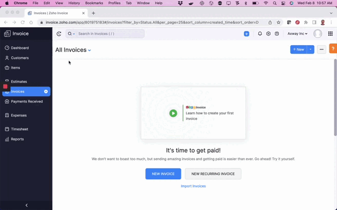

Les flux sont décrits ci-dessous:

* Producteur RabbitMQ (RabbitMQ Publisher)
  * Interroge Zoho Invoice pour récupération des nouvelles factures ou des factures modifiées 
  * Passe en revue les factures et les publie sur RabbitMQ 
* Consommateur RabbitMQ (RabbitMQ Consumer)
  * Consomme les messages sur RabbitMQ
  * Analyse et interprète les messages
  * Envoie une notification à MS teams

Ce flux de données (Data flow) est illustré ci-dessous:

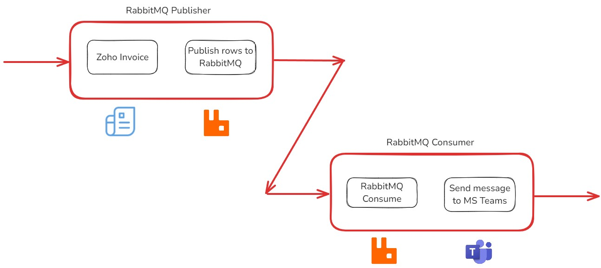

Dans cet exercice nous allons apprendre à :

* Créer une connexion RabbitMQ
* Publier dans une queue RabbitMQ
* Consommer une queue RabbitMQ
* Créer une connexion Zoho Invoice OpenAPI
* Utiliser le composant Zoho Invoice OpenAPI pour interroger Zoho Invoice concernant les nouveaux enregistrements et les enregistrements modifiés 
* Créer une connexion HTTP/S Client pour réaliser une intégration avec MS Teams
* Utiliser un composant HTTP/S Client Post pour envoyer des notifications sur MS Teams

L'intégration finale est illustrée ci-dessous :

* Producteur RabbitMQ
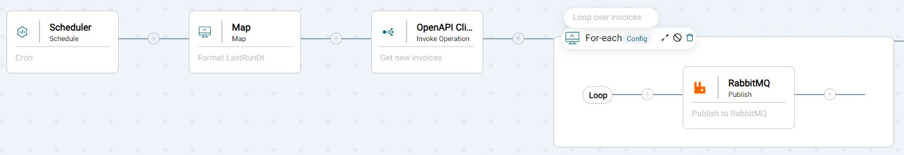
* Consommateur RabbitMQ 
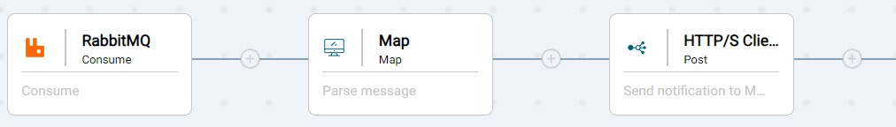

## Pré-requis

Avant de démarrer cet exercice assurez vous d'avoir:

* Un accès à Amplify Fusion
  > Si vous n'avez pas de compte, veuillez contacter **[amplify-fusion-training@axway.com](mailto:amplify-fusion-training@axway.com?subject=Amplify%20Fusion%20-%20Training%20Environment%20Access%20Request&body=Hi%2C%0D%0A%0D%0ACould%20you%20provide%20me%20with%20access%20to%20an%20environment%20where%20I%20can%20practice%20the%20Amplify%20Fusion%20e-Learning%20labs%20%3F%0D%0A%0D%0ABest%20Regards.%0D%0A)** par mail avec en objet `Amplify Fusion Training Environment Access Request`
* Un compte [**Zoho Invoice**](https://www.zoho.com/invoice/) gratuit
* Une instance RabbitMQ sur CloudAMQ et une queue afin de publier dessus. [**CloudAMQ**](https://www.cloudamqp.com/) propose un forfait gratuit recommandé pour cet exercice. Suivez ce guide pour créer une instance gratuitement [**RabbitMQ tutorial**](rabbitmq-instructions.md) . 
* Un Accès à **Microsoft Teams** et la capacité d'installer le connecteur Webhook entrant sur un canal
  > Si vous n'utilisez pas Teams ou que vous n'avez pas la fonctionnalité Webhook, vous  pouvez utiliser une application de test webhook en ligne comme [Webhook.site](https://webhook.site) à la place pour cet exercice


## Étape 1

Dans cette étape, nous allons mettre en place le premier flux qui interroge Zoho Invoice à propos des mises à jour de factures et publie pour chacune un message dans RabbitMQ.

* Créer un nouveau projet Amplify Fusion pour cette intégration asynchrone. Utiliser un nom unique au cas où vous ne seriez pas le seul à faire cet exercice sur votre tenant Amplify (par ex: XX_InvoiceAsyncNotification, XX étant votre nom ou vos initiales).
* Créer une intégration (par exemple: InvoiceHandler)
* Cliquer sur le bouton `Event`, sélectionner l'évènement déclencheur **Scheduler** et le régler à 60 secondes
  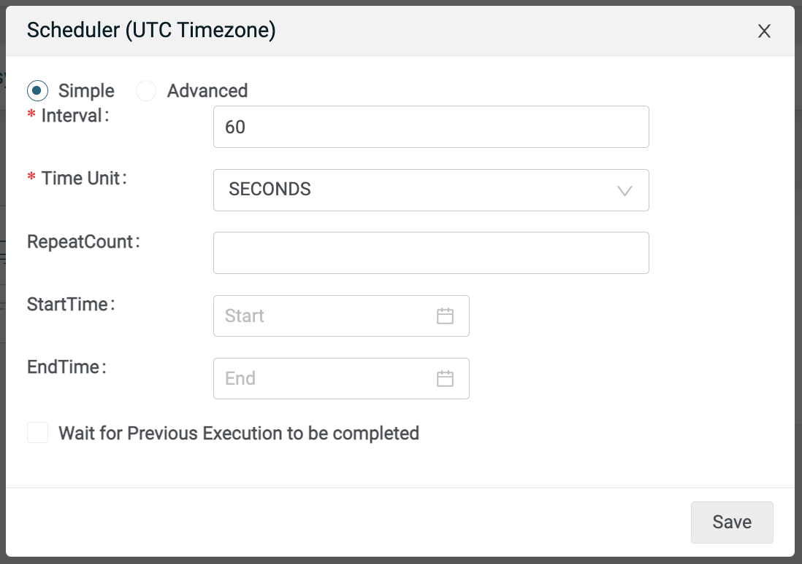
* Cliquer sur Test pour lancer l'intégration. Cette opération initialisera l'horodatage de la dernière exécution, `LastRunDt-...`. Cette variable intégrée contiendra toujours l'horodatage de la dernière exécution de l'intégration. Nous pourrons l'utiliser pour interroger à propos des modifications dans les sources de données backend.
* Afin d'interroger Zoho Invoice à propose des mises à jour de  factures, nous utiliserons l'horodatage intégré de la dernière exécution, `LastRunDt-...` pour comparer avec l'horodatage de la facture modifiée `last_modified_time`. Mais pour cela nous devons le convertir au format d'horodatage de Zoho Invoice en utilisant une fonction dans un composant Map. Cliquez sur le bouton `+` pour ajouter un composant MAP puis étendez le panneau inférieur et ajoutez une fonction DateFormat
  * Sur le panneau de droite, effectuer un clic droit et ajouter une variable String nommé *LastRunDt-formatted*
  * Tirer une ligne de la variable `LastRunDt-...` qui se trouve sur le côté gauche, à la fonction DateFormat `sourceDate`
  * Faire un clic droit sur la variable de DateFormat `sourceDateFormat`, cliquer sur Set Value, puis copier/coller la valeur suivante: `yyyy-MM-dd HH:mm:ss SSS`
  * Faire un clic droit sur la variable de DateFormat `targetDateFormat`, cliquer sur Set Value, puis copier/coller la valeur suivante: `yyyy-MM-dd'T'HH:mm:ssZ`
  * Tirer une ligne de la fonction DateFormat `output` à la variable String créée au-dessus (par exemple: *LastRunDt-formatted*) et cliquer sur **Save**
  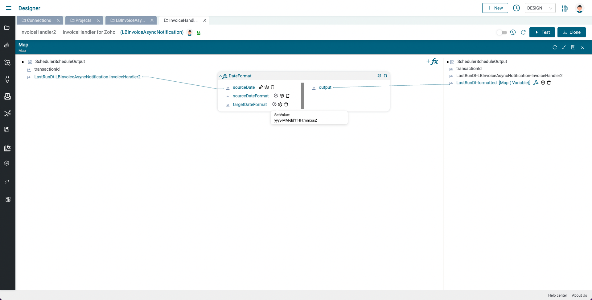
* Nous devons maintenant interroger Zoho Invoice à propos des factures mises à jour. Pour cela, cliquer sur le bouton `+` pour ajouter un composant OpenAPI Client puis agrandir le panneau inférieur. Cliquer sur Add à côté de Connection afin de créer une connexion OpenAPI pour l'application ZohoInvoice et entrer un nom (par exemple: Zoho API) et une description.
* Suivre ces [**instructions**](../fr/zoho-api-instructions.md) et utiliser le document OAS [**ci-joint**](../assets/Zoho-Invoice-oas3.json) pour créer une connexion. Ne pas oublier de générer un Token et de tester la connexion
  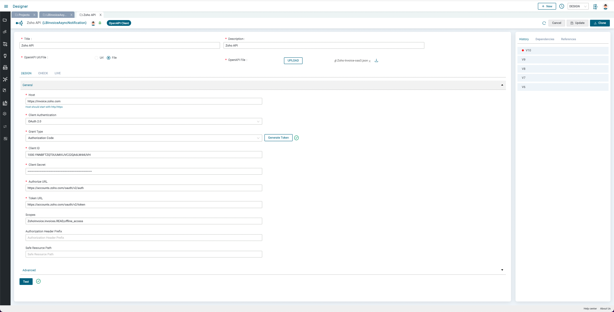
* Retourner à l'intégration et cliquer sur le composant OpenAPI Client, actualiser et sélectionner la connexion tout juste créée
* Sélectionner **Invoice** pour `Object` et **GetInvoices** pour `Action`
* Faire un clic droit sur queryParams et ajouter deux variables de type String (Add Inside): `filter_by` et `last_modified_time`
  * Faire un clic droit sur `filter_by` cliquer sur set, puis entrer `Status.All` comme valeur
  * Tirer une ligne de `LastRunDt-formatted` sur la gauche vers `last_modified_time` puis cliquer sur Save

  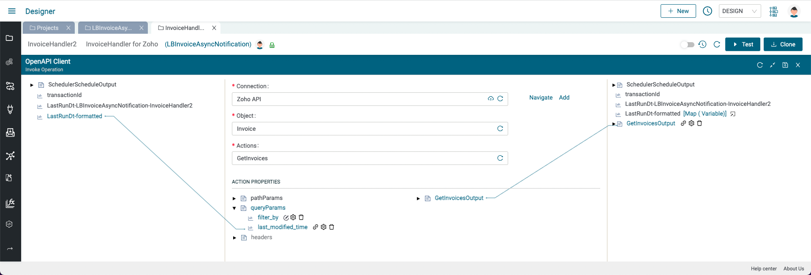
* Passons maintenant en revue les factures modifiées et publions chacune d'entre elles sur RabbitMQ.
* Ajouter un composant `For-each`, l'étendre, cliquer sur `Config` et sélectionner `GetInvoicesOutput->response->invoices` pour indiquer le tableau à parcourir
  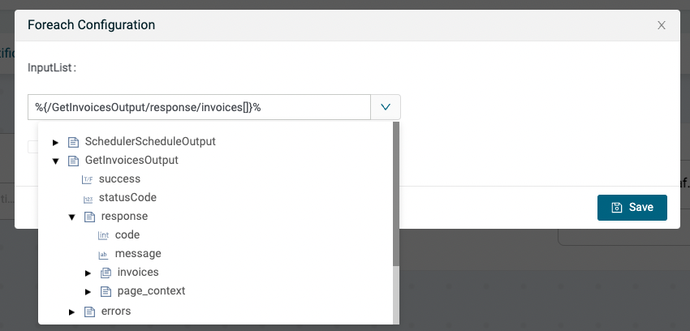
* Ajouter un composant RabbitMQ Publish à l'intérieur du For-each et agrandir le panneau inférieur
* Cliquer sur Add à côté de Connection et donner un nom et une description à celle-ci.
* Consulter vos détails CloudAMQ RabbitMQ pour récupérer la configuration (URL endpoint, Username et Password).
  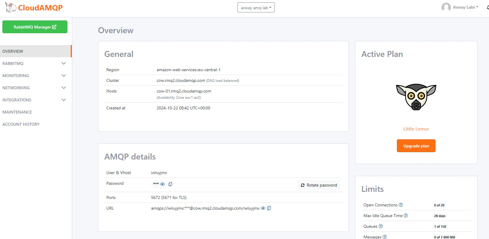
* Dans la fenêtre Connection de Amplify Fusion
  * Renseigner `Protocol` (ici, AMQP)
  * Renseigner `Host` et `port`
  * Renseigner le `VirtualHost` CloudAMQ
  * Sélectionner **Basic** pour le `Client Authentication`
  * Renseigner `Username` et `password`
  * Cliquer sur **save/update** and sur le bouton **Test**
  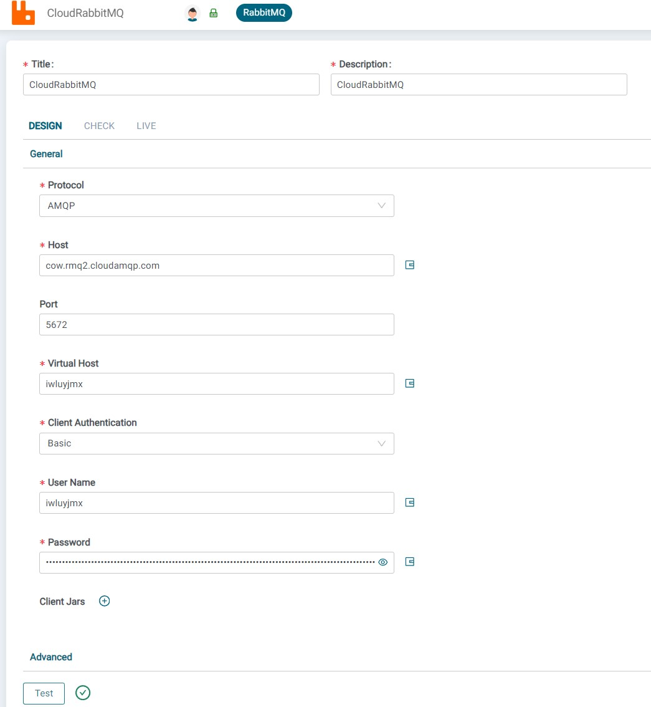
* Retourner sur le composant RabbitMQ Publish dans l'intégration et cliquer sur refresh dans le sélecteur de connexion. Sélectionner la connexion RabbitMQ tout juste créée.
* Sur la panneau de gauche, dérouler `RabbitMQPublishInput->messages` pour afficher les paramètres de message et tirer une ligne de `GetInvoicesOutput->response->invoices` sur le panneau de gauche, vers `RabbitMQPublishInput->messages->payload`
  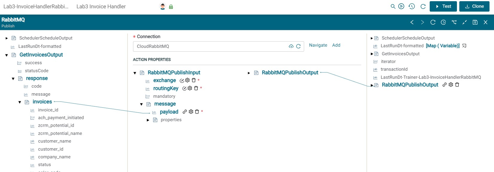
* Faire un clique droit sur `RabbitMQPublishInput->exchange` et  sélectionner **SetValue** puis renseigner le nom de l'exchange de votre instance CloudAMQ RabbitMQ (exemple: amq.topic)
* Faire un clique droit sur `RabbitMQPublishInput->routingKey` et sélectionner **SetValue** puis renseigner la routing key  de votre instance CloudAMQ RabbitMQ (exemple: invoicesKey) et cliquer sur **Save**
  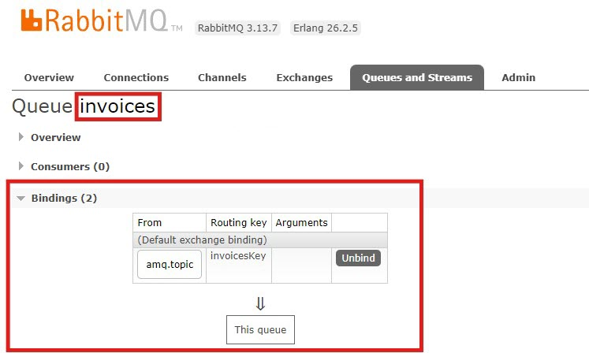
* Votre intégration finale doit ressembler à ceci :
  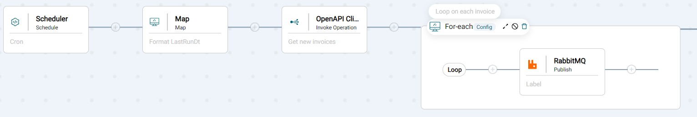
* Testons-la en ajoutant une facture sur ZohoInvoice et en appuyant ensuite sur le bouton Test dans votre intégration (il n'est pas nécessaire d'activer l'intégration)
* Un nouvel onglet de navigateur s'ouvre et affiche la transaction. Une facture devrait être visible au niveau de l'étape For-each 
  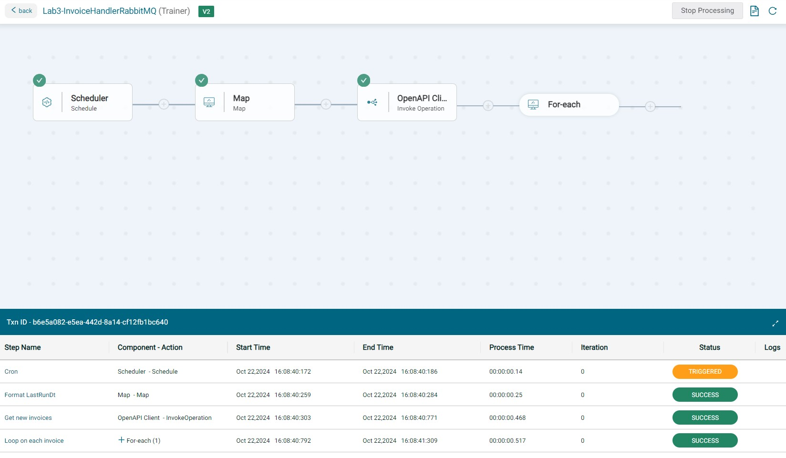
* Cliquer sur le signe `+` à côté de For-each puis cliquer sur l'étape RabbitMQ Publish et dérouler les deux côtés pour voir que la facture a été publiée
  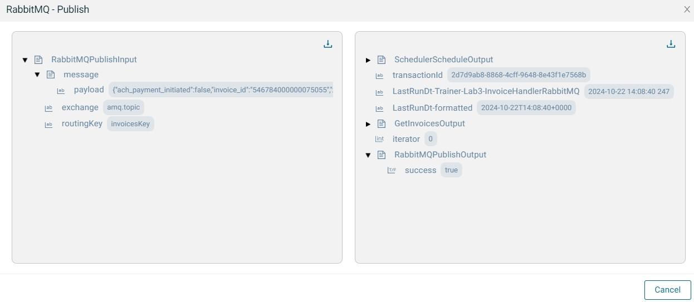

Maintenant que nous pouvons publier une facture mise à jour sur RabbitMQ, créons une intégration RabbitMQ Consumer pour consommer le message dans la queue RabbitMQ et envoyer une notification à Microsoft Teams.

## Étape 2

Dans cette étape, nous allons consommer un message RabbitMQ provenant de la queue `invoices` et envoyer une notification avec quelques détails de la facture sur Microsoft Teams

* Créer une intégration (par exemple: InvoiceNotifier)
* Cliquer sur le bouton `Event`, sélectionner l'évènement déclencheur **RabbitMQ Consume** puis sélectionner la connexion utilisée dans la première intégration et entrer le nom de la queue (par ex: **invoices**) et cliquer sur `Save`
  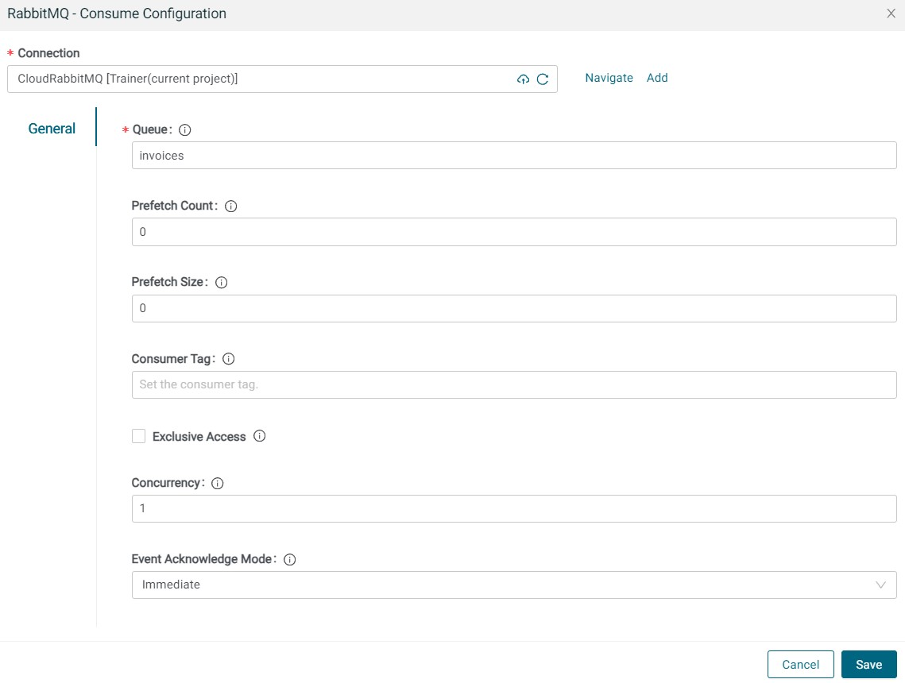
* Ajouter ensuite un composant Map pour analyser le message RabbitMQ puis agrandir le panneau inférieur 
* Faire un clic droit sur n'importe quelle variable du panneau de droite et sélectionner `Extract` puis coller l'exemple d'Invoice payload suivant. Cliquer ensuite sur `Copy Node`

  ```json
  {
    "invoice_id": "3818499000000076212",
    "ach_payment_initiated": false,
    "zcrm_potential_id": "",
    "zcrm_potential_name": "",
    "customer_name": "ACME Inc",
    "customer_id": "3818499000000076136",
    "company_name": "ACME Inc",
    "status": "draft",
    "color_code": "",
    "current_sub_status_id": "",
    "current_sub_status": "draft",
    "invoice_number": "INV-000002",
    "reference_number": "",
    "date": "2023-02-01",
    "due_date": "2023-02-01",
    "due_days": "",
    "currency_id": "3818499000000000097",
    "schedule_time": "",
    "email": "lbrenman99@hotmail.com",
    "currency_code": "USD",
    "currency_symbol": "$",
    "template_type": "standard",
    "is_viewed_by_client": false,
    "has_attachment": false,
    "client_viewed_time": "",
    "project_name": "",
    "billing_address": {
      "address": "1 Main St",
      "street2": "",
      "city": "Chicago",
      "state": "Illinois",
      "zipcode": "01810",
      "country": "U.S.A",
      "phone": "",
      "fax": "",
      "attention": ""
    },
    "shipping_address": {
      "address": "1 Main St",
      "street2": "",
      "city": "Chicago",
      "state": "Illinois",
      "zipcode": "01810",
      "country": "U.S.A",
      "phone": "",
      "fax": "",
      "attention": ""
    },
    "country": "U.S.A",
    "phone": "",
    "created_by": "lbrenman",
    "updated_time": "2023-02-01T08:02:15-0500",
    "transaction_type": "renewal",
    "total": 24995.00,
    "balance": 24995.00,
    "created_time": "2023-02-01T08:02:15-0500",
    "last_modified_time": "2023-02-01T08:02:15-0500",
    "is_emailed": false,
    "reminders_sent": 0,
    "last_reminder_sent_date": "",
    "payment_expected_date": "",
    "last_payment_date": "",
    "custom_fields": [],
    "custom_field_hash": {},
    "template_id": "3818499000000017001",
    "documents": "",
    "salesperson_id": "3818499000000076159",
    "salesperson_name": "Leor Brenman",
    "shipping_charge": 0.00,
    "adjustment": 0.00,
    "write_off_amount": 0.00,
    "exchange_rate": 1.00
  }
  ```

* Faire un clic droit sur n'importe quelle variable du panneau de droite, sélectionner `Paste` et nommer la variable extraite (par ex: invoiceJson)
* Dérouler la variable `RabbitMQConsumeOutput` sur le panneau de gauche pour afficher la variable `message -> payload` puis tirer une ligne de celle-ci vers la variable `invoiceJson`
  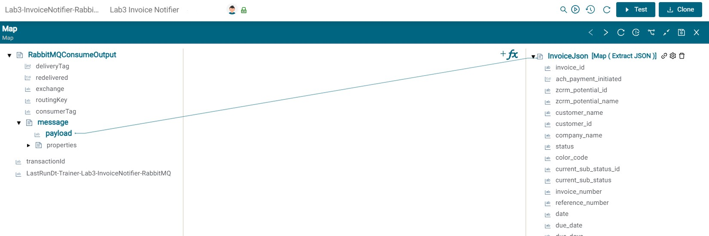

Dans les prochaines étapes, nous allons poster un message sur MS Teams avec quelques détails sur la facture 

Nous utiliserons le connecteur MS Teams Webhook afin de pouvoir poster un message sur un canal MS Teams en utilisant le composant HTTP/S Client Post

* Suivre ces [**instructions**](https://support.microsoft.com/fr-fr/office/create-incoming-webhooks-with-workflows-for-microsoft-teams-8ae491c7-0394-4861-ba59-055e33f75498) pour obtenir l'URL d'un canal MS teams
* Ajouter un composant HTTP/S Client Post Connection à l'intégration et agrandir le panneau inférieur
* Cliquer sur Add à côté de Connection afin de créer une connexion Client HTTP/S vers l'URL du connecteur MS Teams Webhook entrant et donner un nom et une description à la connexion puis suivre ces étapes:
  * Sélectionner HTTPS comme Protocol
  * Sélectionner HTTP/2 en tant que HTTP Version
  * Entrer l'URL du connecteur MS Teams Webhook entrant (sans le https://) puis appuyer sur update
  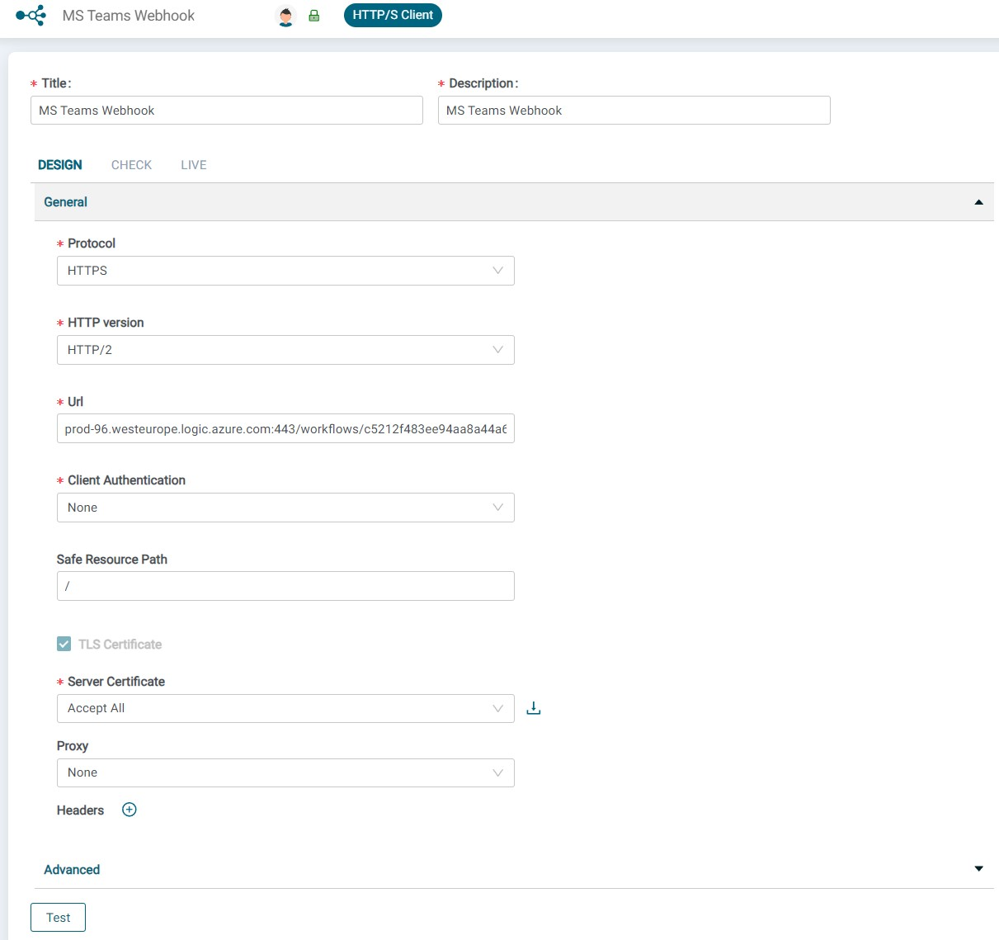
* Retourner au composant HTTP/S Client Post Connection dans l'intégration, cliquer sur refresh et sélectionner la connexion MS Teams
  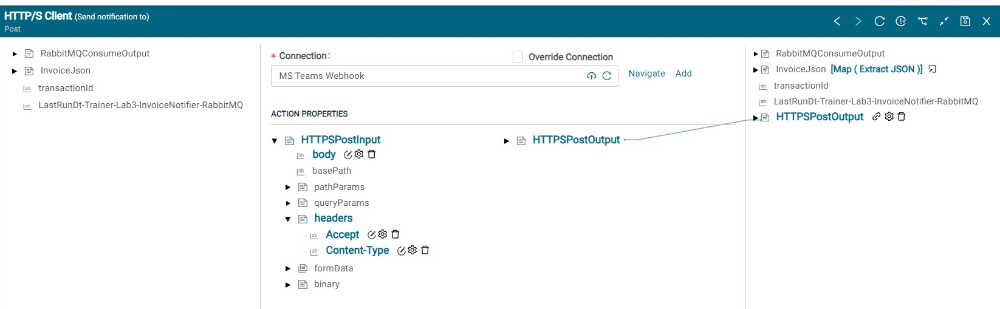
* Dans la section ACTION PROPERTIES, dérouler `HTTPSPostInput` pour afficher `body` faire un clic droit sur `body` et sélectionner SetValue
* Entrer le texte suivant:

  ```json
  {
    "type": "message",
    "attachments": [
        {
            "contentType": "application/vnd.microsoft.card.adaptive",
            "content": {
                "type": "AdaptiveCard",
                "body": [
                    {
                        "type": "TextBlock",
                        "text": "Invoice #{invoice_number} for customer '{customer_name}', total value: {currency_symbol}{total} {currency_code} is now {status}",
                        "wrap": true
                    }
                ],
                "$schema": "https://adaptivecards.io/schemas/adaptive-card.json",
                "version": "1.0",
                "msteams": {
                    "entities": []
                }
            }
        }
    ]
  }
  ```

* Remplacer les variables entre accolades (par ex: {invoice_number}) en les supprimant puis en cliquant sur le bouton `+` et en sélectionnant les variables appropriées à cet endroit. Cliquer ensuite sur Save
  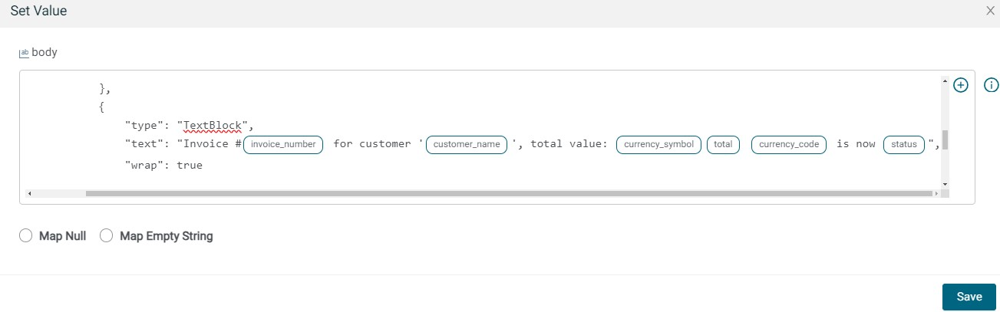
* Dans la section **headers**, ajouter deux nouveaux attributs de type String: 
  * Accept=application/json
  * Content-Type=application/json
    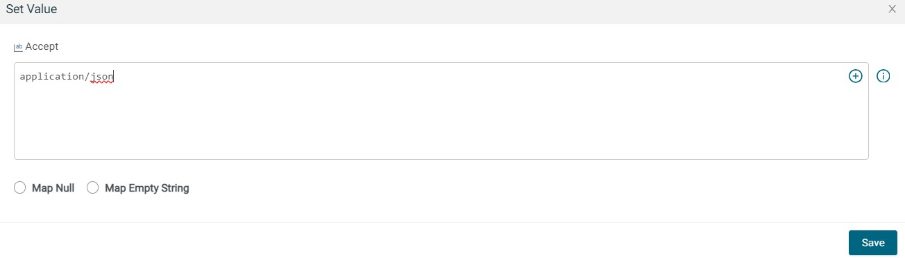
    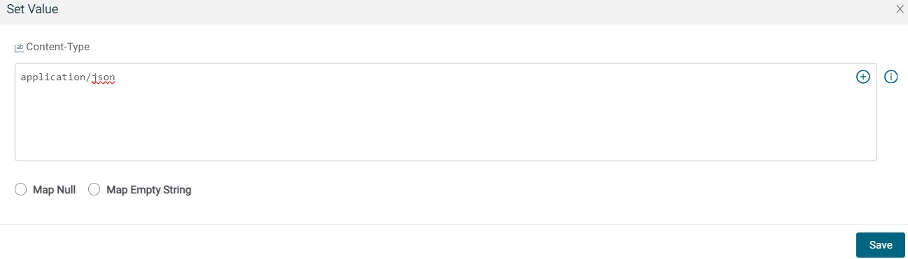
* Cliquer sur **Save** pour sauvegarder le paramétrage du composant.
* Nous sommes maintenant prêts à tester notre intégration qui devrait ressembler à ceci:
  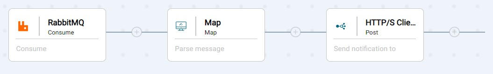
* Activer l'intégration, suite à cela un message apparaît sur MS Teams. C'est le message publié à la fin de l'étape 1
  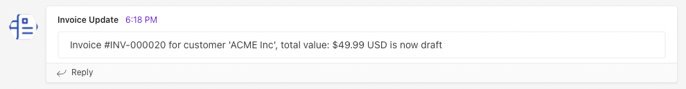
* S'assurer que la première intégration soit activée et modifier une facture ou créer une nouvelle facture dans Zoho Invoice. On constate la réception d'un nouveau message dans MS Teams une fois que le Scheduler est déclenché. Pour mettre à jour une facture, on peut la marquer comme envoyée et/ou enregistrer un paiement pour changer son statut.
* Désactiver les deux intégrations lorsqu'elles ne sont plus utilisées afin d'éviter les requêtes répétitives.

## Étape 3 - Relevez le défi!

Aller voir les examples de cartes adaptatives [ici](https://adaptivecards.io/samples/) et essayer de modifier le design de la carte pour avoir un affichage différent. 

Exemple: 
  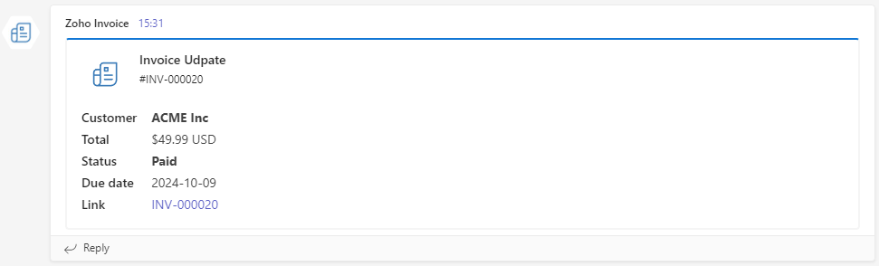