# Gide d'intégration du broker RabbitMQ

## Création d'une instance RabbitMQ sur CloudAMQ

1. Naviguer sur <https://www.cloudamqp.com/> et cliquer sur **Get Started**\
   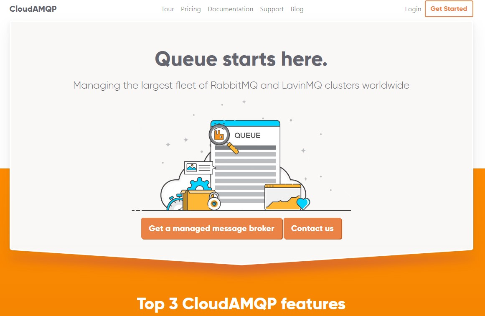

2. Créer un compte avec votre email ou bien en utilisant votre compte Github/Google
   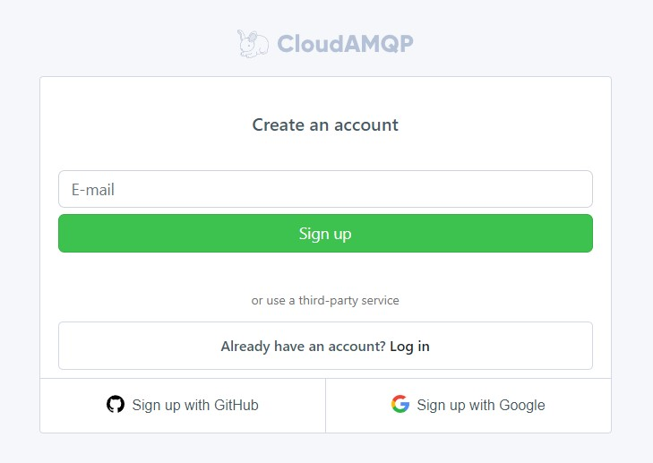

3. Une fois votre compte créé, lors de votre première connexion vous devez créer une Team:
   - Renseigner un nom, 
   - Accepter les **tems of services**, 
   - Décliner la mention GDPR,
   - Cliquer sur **Create team**
   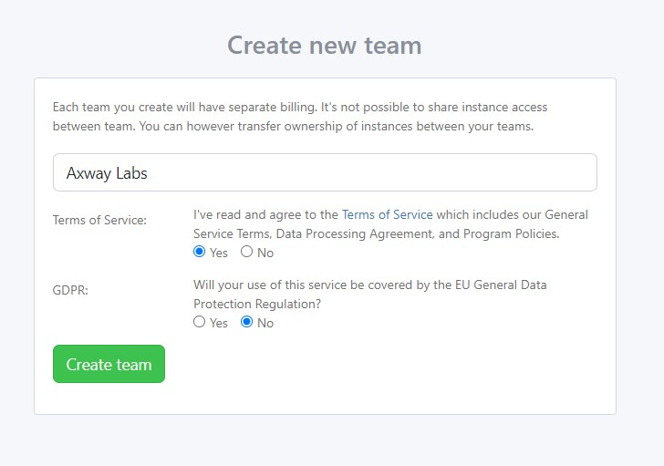

4. Créer une nouvelle instance en cliquant sur **+ Create New Instance**
   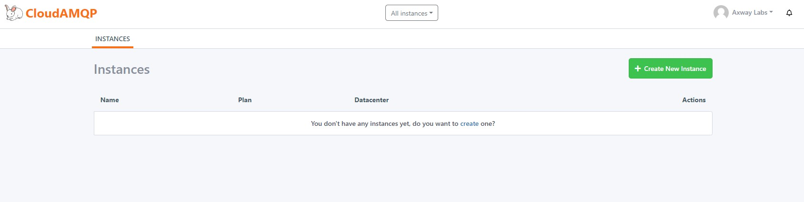

5. Renseigner un nom d'instance, choisissez le plan `Little Lemur (Free)` puis cliquer sur le bouton **Select Region**
    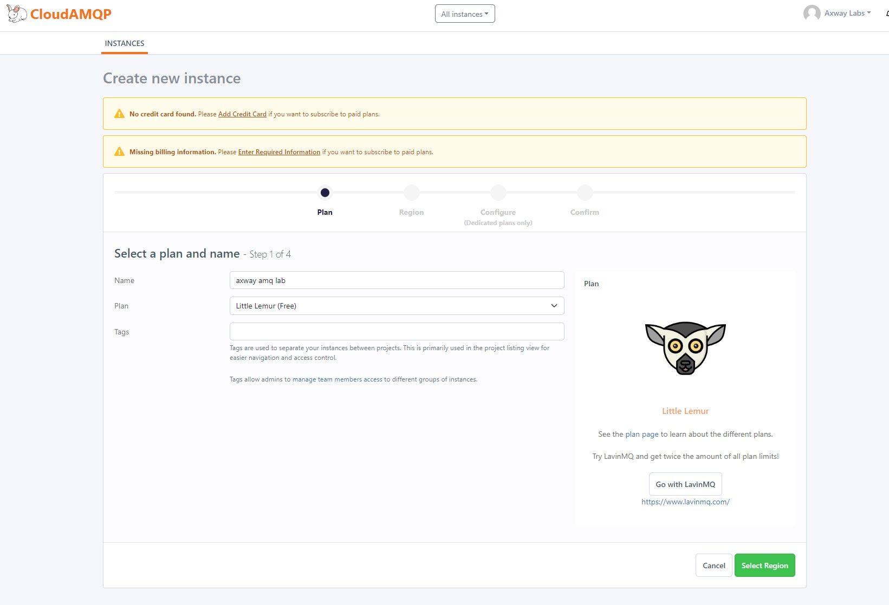

6. Sélectionner une **region** (*par exemple AWS*) ainsi qu'un **data center** où votre instance RabbitMQ sera déployée puis cliquer sur le bouton **Review**
   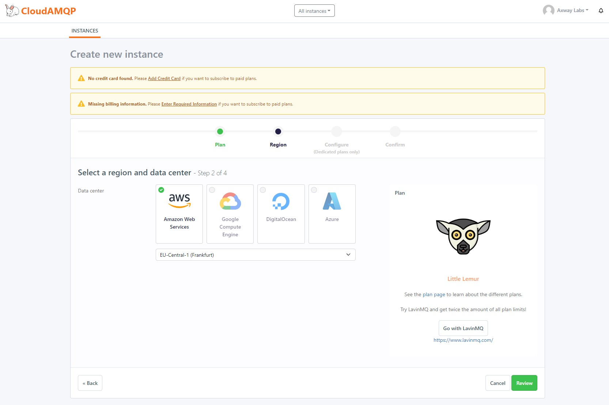

7. Vérifier l'exactitude des informations de votre instance puis cliquer sur le bouton **Create Instance**
   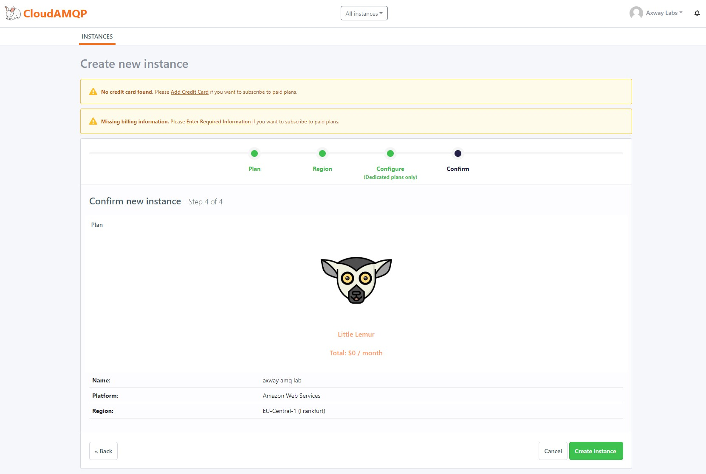

8. Une fois votre instance créée, vous devriez être en capacité de la voir et d'y accéder
   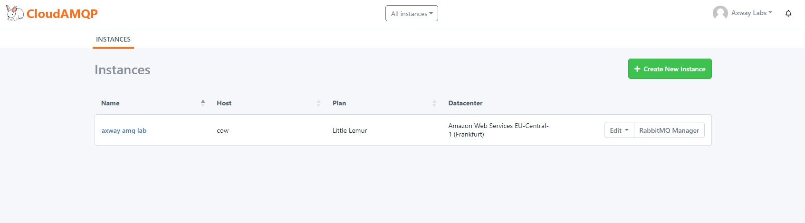

9. Cliquer sur le nom de votre instance afin d'afficher aux détails comme son URL ou bien ses identifiants
    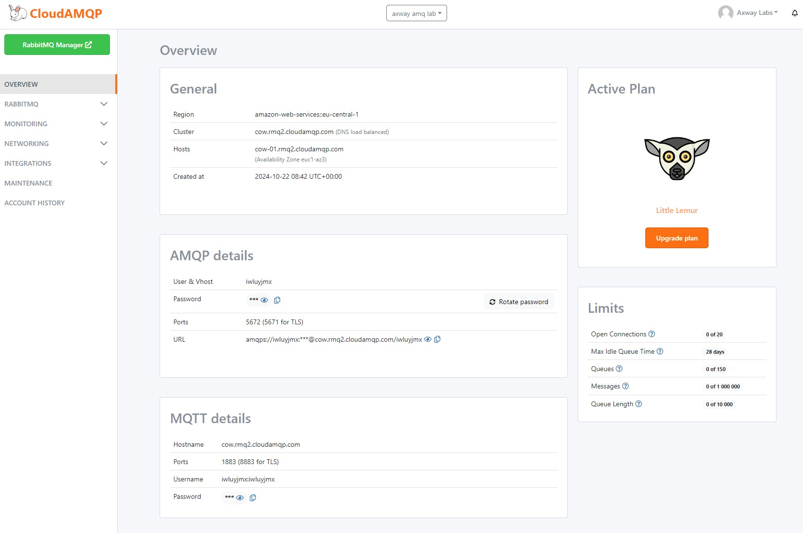

10. Les informations suivantes seront nécessaire pour la configuration d'un composant RabbitMQ dans Amplify Fusion: 
- Dans la section **General**
  - Cluster
- Dans la section **AMQP details**
  - User & Vhost
  - Password
  - Port (non TLS)

  ## Création d'une queue et d'une règle de routage
  Afin de publier un message dans RabbitMQ, il est nécessaire de créer une queue ainsi qu'une règle de routage. Plus d'information [ici](https://www.cloudamqp.com/blog/part4-rabbitmq-for-beginners-exchanges-routing-keys-bindings.html).

  1. Cliquer sur le bouton RabbitMQ Manager à partir de la page principale de votre instance
   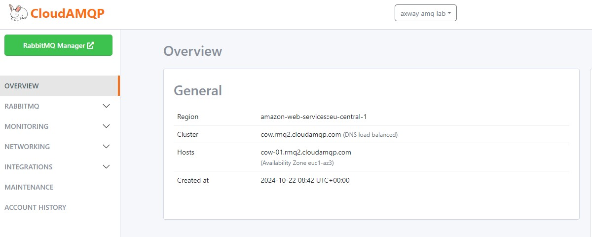

   2. Cliquer sur l'onglet `Queues and Streams` et ajoute rune nouvelle queue
   renseigner un **Name** et cliquer sur le bouton **Add queue**
    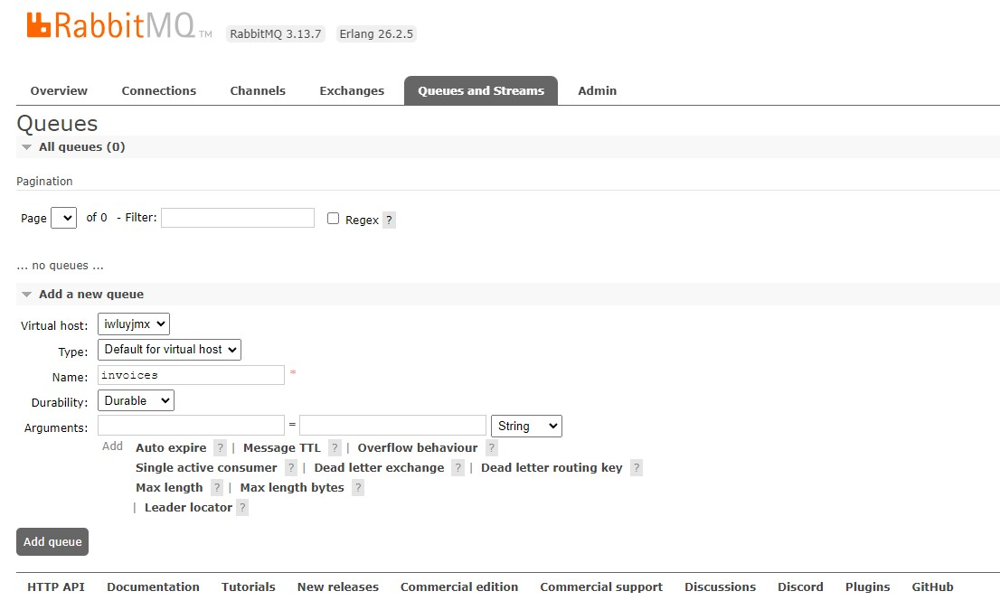
    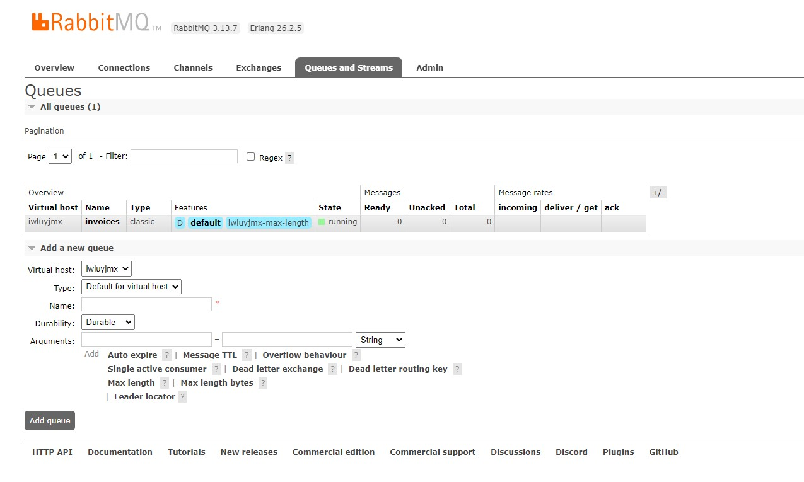

   3. Une fois la queue créée, cliquer sur le nom de la queue, puis cliquer sur la section `Bindings`
      - Renseigner **amq.topic** dans `From exchange`
      - Renseigner **invoiceKey** dans `Routing key`
      - Cliquer sur le bouton `Bind` pour sauvegarder
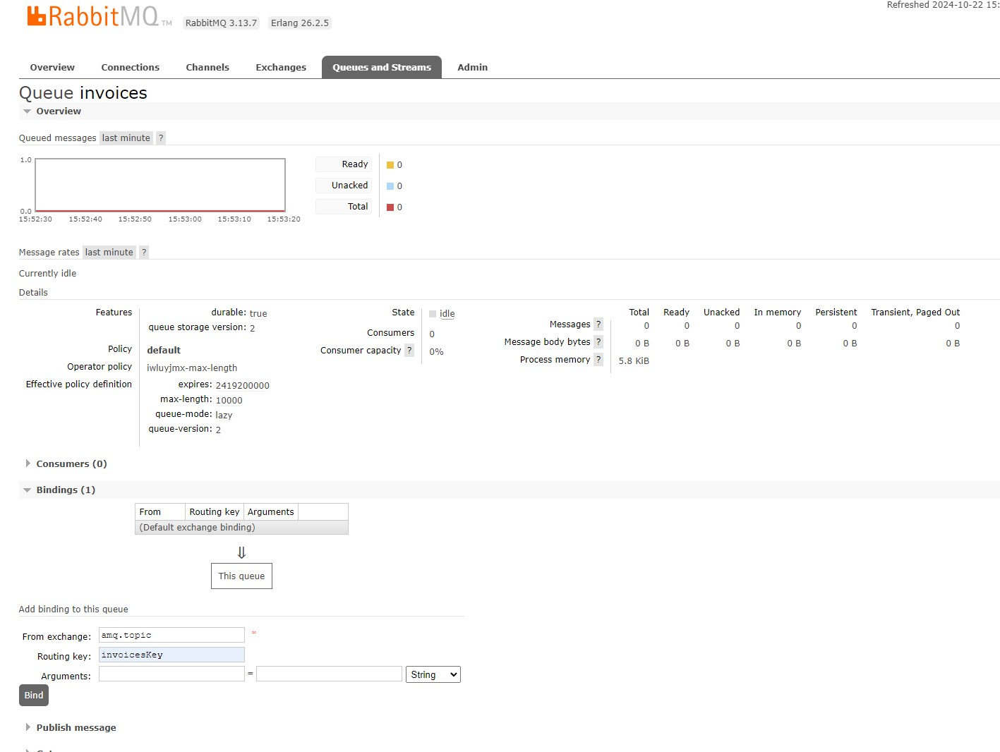