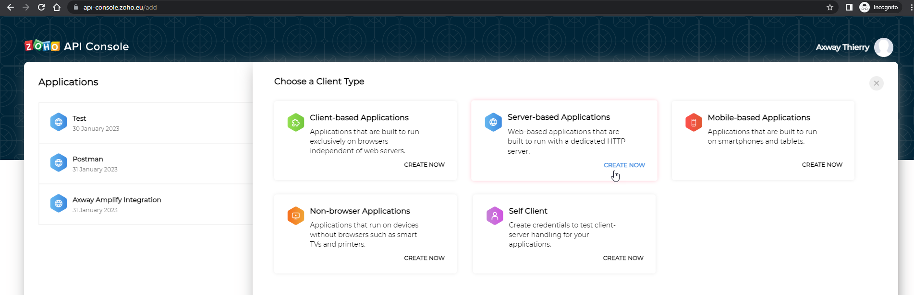
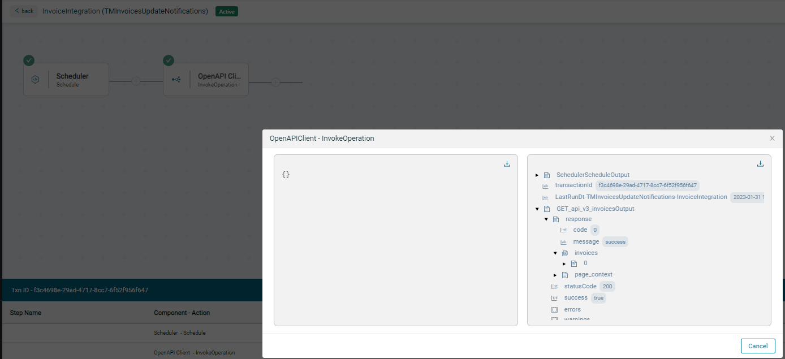

# Guide d'intégration de l'API Zoho Invoice

## Configuration de Zoho Invoice

1. Inscrivez-vous depuis <https://www.zoho.com/invoice/> \
   

2. Notez l'emplacement du data center au-dessus des cases à cocher. \
   Si ce n'est pas les Etats-Unis, remplacez `zoho.com` dans toutes les étapes suivantes par le domaine de votre data center (par exemple `zoho.eu` pour l'Europe).

3. Une fois inscrit vous pouvez accéder à l'application Invoice (facture) : <https://invoice.zoho.com/app> \
    (changez le suffixe `.com` du domaine si nécessaire)

4. Accédez au menu des factures (Invoices)

5. Cliquez sur new pour ajouter une nouvelle facture

   - Renseignez les informations du client: au moins un nom: "John Doe" , un nom de l'entreprise : "ACME" et une adresse email (utilisez une des vôtres)
   - Ajouter un premier item par exemple: "Printer V9" à 49$/unité
   - Changez la quantité à 10
   - Cliquez sur Save puis sur Send \
     

6. Vérifiez l'adresse du destinataire (qui doit être la vôtre) et cliquez sur ok.

7. Copiez votre Organization ID pour la suite depuis le menu en haut à droite\
`  

8. Ouvrez la console de l'API: <https://api-console.zoho.com> (remplacez le suffixe
    `.com` si besoin )

9. Créez une "server-based application"
   - Nommez le client "Axway Amplify Integration"
   - Donnez l'URL de la page d'accueil de votre instance Amplify Integration
   - Ajoutez "/design/oauth2/callback" au même URL pour le redirect URL

10. Copiez le Client ID et Secret pour plus tard 

## Configuration sur Amplify Integration

1. Ouvrez votre projet Amplify Integration et ajoutez un connecteur "OpenAPI client"
    - Nommez le "**ZohoAPI**"
    - Sélectionnez l'option OpenAPI file et téléchargez le fichier JSON correspondant (en utilisant une copie locale de [Zoho-Invoice-oas3.json](../assets/Zoho-Invoice-oas3.json)
    - Configurez le serveur **<https://invoice.zoho.com>** (changez le suffixe `.com` du domaine si nécessaire)
    - Sélectionnez **OAuth 2.0** avec  **Authorization code**
    - Collez votre **Client ID** et **secret**
    - Fournissez la configuration OAuth 2.0 requise par ZOHO
        - Authorize URL: **<https://accounts.zoho.com/oauth/v2/auth>** \
          (changez le suffixe `.com` du domaine si nécessaire)
        - Token URL: **<https://accounts.zoho.com/oauth/v2/token>** \
          (changez le suffixe `.com` du domaine si nécessaire)
        - Scope: **ZohoInvoice.invoices.READ,offline_access**
    - Fournissez un safe path (chemin sûr) pour tester la connexion: **/api/v3/invoices?customer_name=test**
    - Ajoutez un header nommé **X-com-zoho-invoice-organizationid** comme indiqué dans la documentation de l'API et fournissez la valeur copiée précédemment
    - Cliquez sur Update/save 
    - Générez un Token
    - Testez la connexion

2. [optionnel] Créez un test d'intégration
    - Ajoutez un scheduler comme trigger
    - Ajoutez un composant « OpenAPI client -- invoke operation ».
    - Sélectionnez l'objet « ZohoAPI », l'objet « invoice » et l'action « Get invoices ». 
    - Cliquez sur Save
    

3. [optionnel] Testez la récupération des factures
    - Cliquez sur le bouton Test de votre intégration
    - Cliquez sur les détails de l'appel API pour voir le corps de la réponse avec 1 facture.
        
