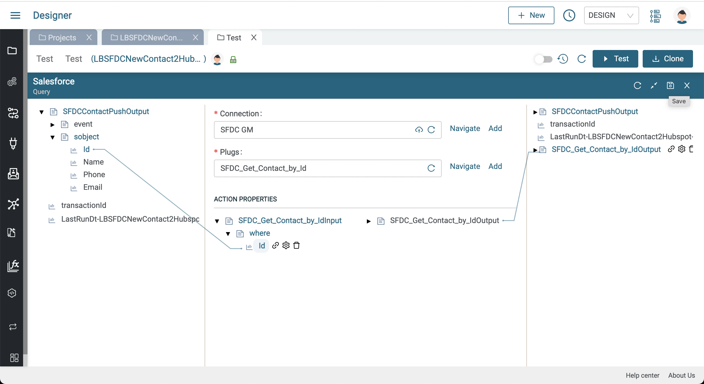
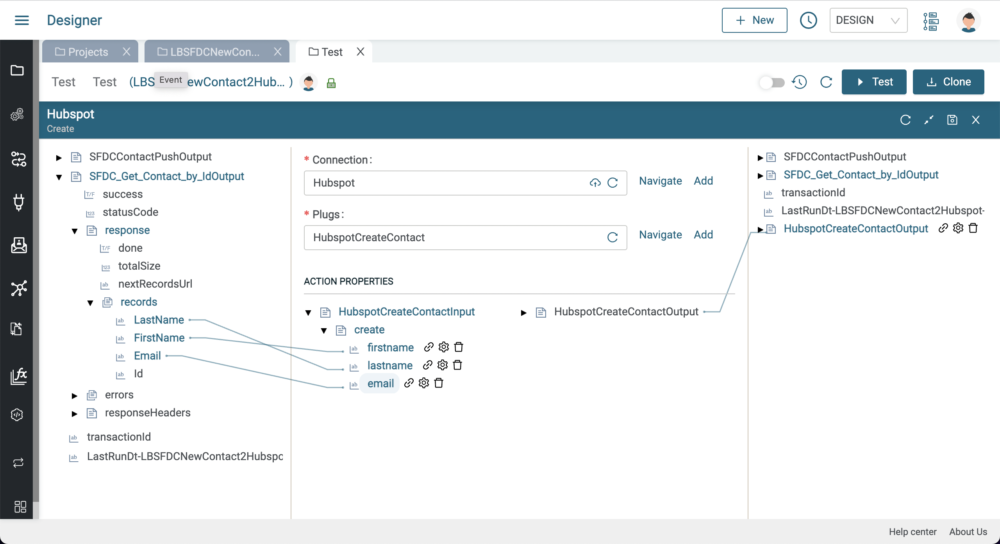
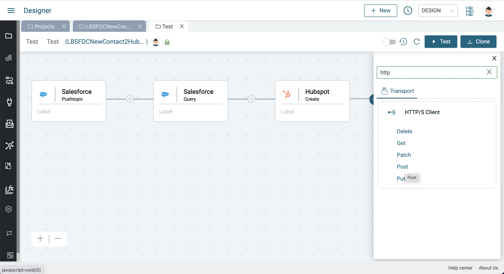
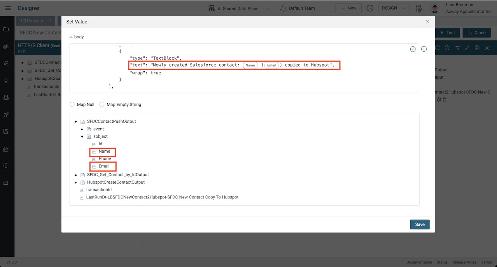

# CRM Cloud Integration Lab

In these labs, we will create an integration that will copy new Salesforce Contacts to Hubspot and Microsoft Teams as shown below:


A data flow diagram is shown below:


We will learn the following:

* How to create a Salesforce Connection
* How to use the Salesforce query Component and associated Plug to query a Salesforce Opportunity
* How to create a Salesforce Platform Event
* How to create a Hubspot Connection
* How to use the Hubspot Create Component and associated Plug to create a Hubspot Contact
* How to Map data
* How to create a Microsoft Teams Connection using the HTTP/S Client Connection
* Send a message to a Microsoft Teams channel

Your final integration should like this:

  

## Pre-requisites

* Access to Amplify Fusion
  > If you do not have an account and need one, please send an email to **[amplify-fusion-training@axway.com](mailto:amplify-fusion-training@axway.com?subject=Amplify%20Fusion%20-%20Training%20Environment%20Access%20Request&body=Hi%2C%0D%0A%0D%0ACould%20you%20provide%20me%20with%20access%20to%20an%20environment%20where%20I%20can%20practice%20the%20Amplify%20Fusion%20e-Learning%20labs%20%3F%0D%0A%0D%0ABest%20Regards.%0D%0A)** with the subject line `Amplify Fusion Training Environment Access Request`
* A **Salesforce developer instance**
  > If you don't have a developer instance, details to sign up for free will be provided in the lab below.
  > If you already use Salesforce as a CRM in your organization, don't use your corporate account for this lab and sign-up for a developer account not using your corporate email address as username.
* Access to a **Hubspot** instance
  > If you don't have a developer instance, details to sign up for free will be provided in the lab below.
* Access to **Microsoft Teams** and the ability to install an Microsoft Teams incoming webbook connector
  > If you don't use Teams or don't have the webhook capability, you can use a test webhook online app like [Webhook.site](https://webhook.site) instead for this lab.

Before you start, make sure you have Salesforce and Hubspot accounts that you can access.

## Lab 1

In this lab, we'll set up a Salesforce Platform Event and start our integration by adding a Salesforce Platform-Event listener as a trigger to our integration.

* Create a new Amplify Fusion project for this CRM cloud integration. Use a unique name in case you're not the only one doing this lab on your tenant (e.g. XX_CRMCloudIntegration with XX being your name or initials).
* Follow the instructions [**here**](assets/salesforce-connection.md) to setup a Salesforce Connected OAuth App and an Amplify Fusion Salesforce Connection and generate a token and test the connection \

* Create a Platform Event for New Contacts
    * Open Salesforce _Setup menu > Integration > Platform Events_
    * Set "NewContact" as label and object name 
    
    * Add a custom field "ContactID"
    

* Add a Object Trigger for New Contacts
  * Open Salesforce _Setup menu > Object and Fields > Object Manager_ and select "Contact" Object 
    
  
  * Click "New" in _Triggers_ section 
    
  * Replace the existing Apex trigger code by the following code:

    ```java
    trigger NewContactTrigger on Contact (after insert) {
      List<NewContact__e> events = new List<NewContact__e>();
      for (Contact contact : Trigger.new) {
        NewContact__e event = new NewContact__e(
            ContactId__c = contact.Id
        );
        events.add(event);
      }
      if (!events.isEmpty()) {
        EventBus.publish(events);
      }
    }
    ```

    
  * Save and make sure there is no compile error and the Trigger is active.

* Go back to your Amplify Fusion project
* Create a Plug for Salesforce (e.g. SalesforceNewContactEvent), and configure it:
  * Select the Salesforce Connection you created previously
  * Select `Platform Event` for Actions
  * Select `/event/NewContact__e` you've just created for Objects
  * Select RECEIVE_NEW_EVENTS for Replay Id
  
  * Click Generate and then Save to create your Plug
* Create an integration for CRM cloud integration
  * Click on the Event button and select the Salesforce Platform Event component
  * Select the Salesforce Connection and Plug you created above
  
* Activate your integration 
* Add a new contact in Salesforce _Sales menu > Contacts > New Contact_
  
  
* Go to the Monitor and click on the transaction and see that you consumed the pushtopic contact
  

## Lab 2

In this lab, we'll retrieve the contact and desired fields based on the id from the new contact pushtopic. We'll use a Salesforce query component and a query Contact by id Plug.

* Deactivate your integration to continue designing the integration
* Click the `+` icon to add a step after the trigger event 
* Select a Salesforce query component and select your Salesforce Connection
  
* Click Add on the Plugs and name your Plug (e.g. Salesforce_Get_Contact_by_Id) and Configure it
  * Select your Salesforce Connection 
  * Select `Query` for Actions
  * Select `Contact` for Objects
  * Select Id, FirstName, LastName and Email for the fields
  * Click on the Where clause button and select Id for the field and `=` for the operation

  
* Click Generate and then Save to create your Plug
  
* Return to your integration and select the plug you just created for your query component
  

* Maximize the bottom panel, to view the pipeline details
  * In the left pane (pipe-in), expand `SalesforceNewContactEventOutput` and expose the `SalesforceNewContactEventOutput/payload/ContactID__c` variable
  * In the middle pane under ACTION PROPERTIES on the right (action-in) expand `Salesforce_GetContactByIdInput` to expose the `SSalesforce_GetContactByIdInput/where/where_Id` variable 
  * Drag a line between the two nodes and click Save
  
* Activate the integration, add a new Salesforce Contact and inspect your transaction in the Monitor to see the contact with the fields we specified in the Plug
  

## Lab 3

In this lab, we'll use the retrieved contact and insert it into Hubspot. We'll use a Hubspot create component and an associated create Plug.

* Follow [**this guide**](assets/hubspot-connection.md) to create  Hubspot Connection
* Deactivate your integration to continue designing the integration
* Click on the `+` sign to add a new step to the integration and select a Hubspot Create component 
  
* Select the Hubspot connection you just created
  
* Click on the Add button next to the Plugs so we can create a Hubspot plug to Create a Contact. 
* Provide a name and description and click on Create
  
* Click on Configure and do the following:
  * Select your Hubspot Connector
  * Select Create for Actions
  * Select contacts for Objects
  * Select `firstname`, `lastname` and `email` fields
  
  * Press the Generate button
  
* Click Save and then return to your integration and select the newly created plug
  
* Maximize the bottom panel, to view the pipeline details  
  * In the left pane (pipe-in), expand `Salesforce_GetContactByIdOutput/response/records` and expose the `LastName`, `FirstName` and `Email`  variables from Salesforce contact.
  * In the middle pane, under ACTION PROPERTIES, on the left side (action-in) expand `Hubspot_CreateContactInput/create` to expose the `email`, `firstname` and `lastname` variables of the Hubspot contact to be created
  * Connect each Salesforce contact variable to the corresponding Hubspot contact variable 
  * Click Save

  
* Activate your integration and create a new Salesforce contact and see the new contact in Hubspot
  
  

## Lab 4 - Challenge yourself!

In this lab, we'll post a message to Microsoft Teams with the contact details.

We'll use the Microsoft Teams Incoming Webhook Connector so that we can Post a message to a MS Teams channel.

* Follow the instructions [**here**](https://support.microsoft.com/en-us/office/create-incoming-webhooks-with-workflows-for-microsoft-teams-8ae491c7-0394-4861-ba59-055e33f75498) to get a URL to a Microsoft Teams channel
  * If you don't use Teams or don't have the webhook capability, you can use a test webhook online app like [Webhook.site](https://webhook.site) instead for this lab.
* Deactivate to integration and add an HTTP/S Client Post Connection to your integration
  
  
* Click Add next to Connection so we can create an HTTP/S Client Connection to the Microsoft Teams Incoming Webhook Connector URL and give the connection a name and description and do the following:
  * Select HTTPS for Protocol
  * Select HTTP/2 for HTTP Version
  * Enter the Microsoft Teams Incoming Webhook Connector URL and press Update 
  
* Return to the integration and select the Microsoft Teams Connection
* Maximize the bottom panel, to view the pipeline details  
  * In the ACTION PROPERTIES section, expand `HTTPSPostInput` to expose the body and right click on body and select SetValue
    
  * Copy the JSON text, and insert Name and Email as shown by positioning your cursor in the text and by pressing the `+` button to select "Name" and "Email" from `Salesforce_GetContactByIdOutput/response/records`, then press "Save

    ```json
    {
      "type": "message",
      "attachments": [
          {
              "contentType": "application/vnd.microsoft.card.adaptive",
              "content": {
                  "type": "AdaptiveCard",
                  "body": [
                      {
                          "type": "TextBlock",
                          "text": "Newly created Salesforce contact: {name} ({email}) copied to Hubspot",
                          "wrap": true
                      }
                  ],
                  "$schema": "https://adaptivecards.io/schemas/adaptive-card.json",
                  "version": "1.0",
                  "msteams": {
                      "entities": []
                  }
              }
          }
      ]
    }
    ```

  
* Activate your integration and create a new Salesforce contact and see the new contact in Hubspot and you should also have a message in your Microsoft Teams channel as follows:
  

Your final flow should like this:

  
