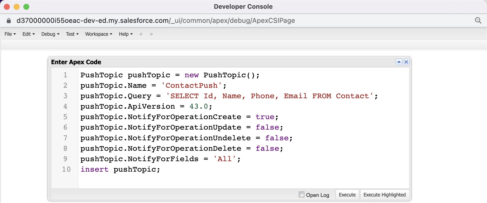
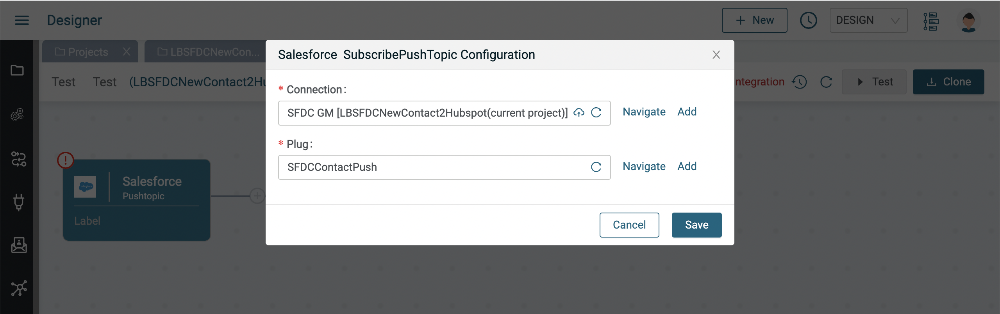
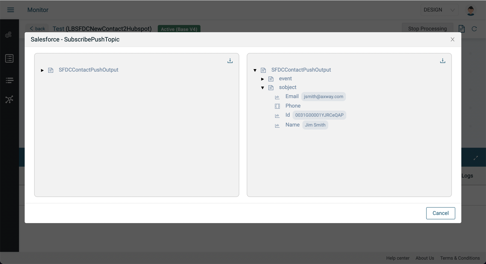
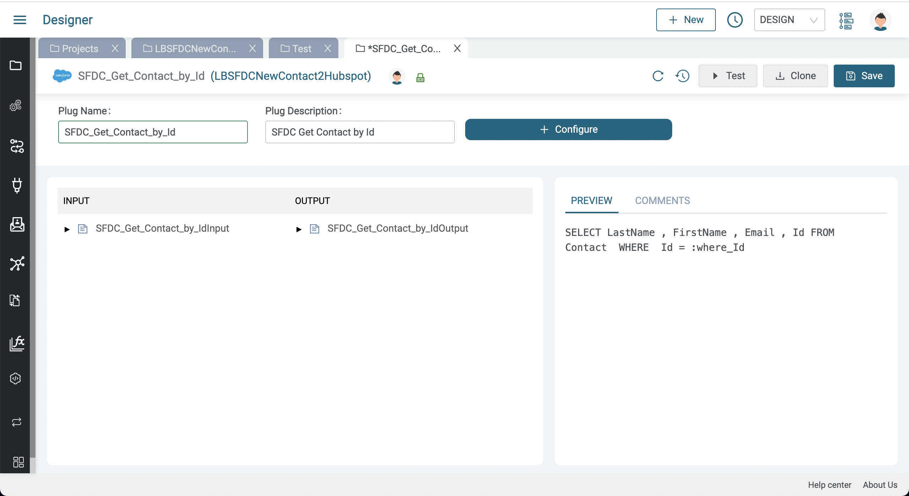
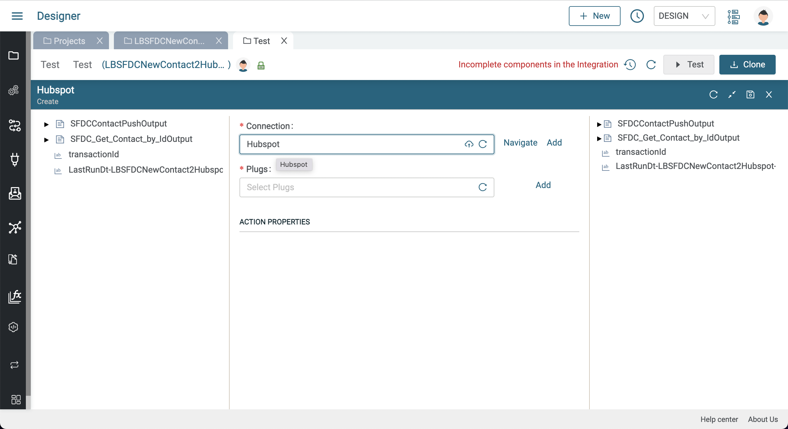
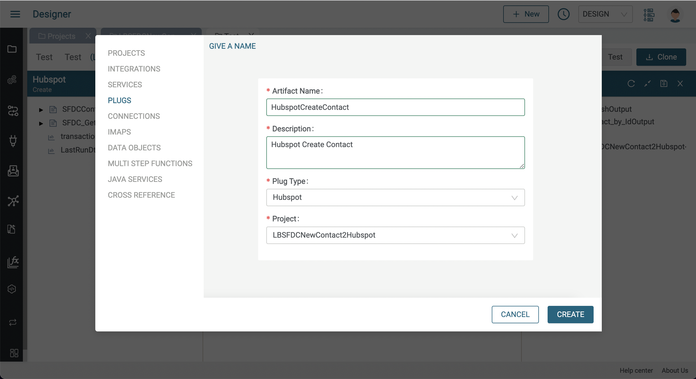
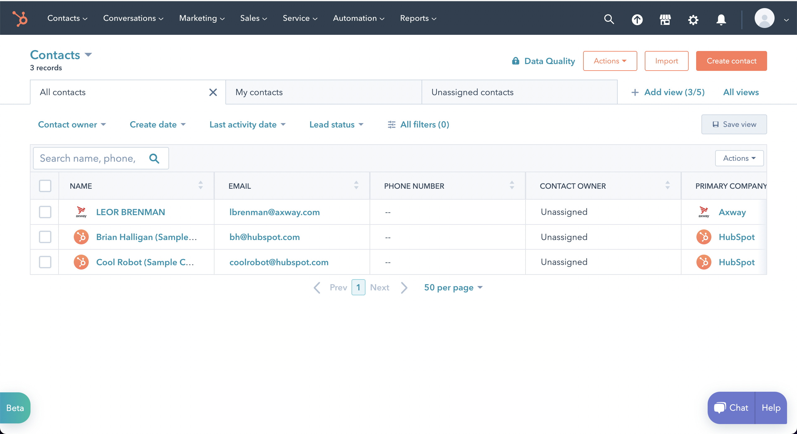
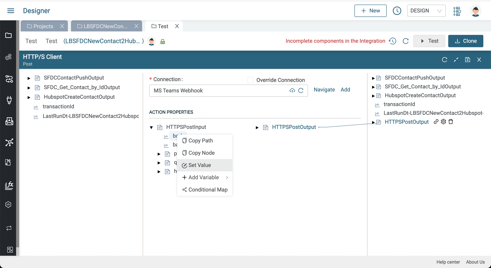

# CRM Cloud Integration Lab

In these labs, we will create an integration that will copy new Salesforce Contacts to Hubspot and MS Teams as shown below:


A data flow diagram is shown below:


We will learn the following:

* How to create a Salesforce Connection
* How to use the Salesforce query Component and associated Plug to query a Salesforce Opportunity
* How to create a Salesforce Push Topic
* How to create a Hubspot Connection
* How to use the Hubspot Create Component and associated Plug to create a Hubspot Contact
* How to Map data
* How to create an MS Teams Connection using the HTTP/S Client Connection
* Send a message to a MS Teams channel

Your final integration should like this:

  

## Pre-requisites

* Access to Amplify Integration
  > If you do not have an account and need one, please send an email to **[amplify-integration-training@axway.com](mailto:amplify-integration-training@axway.com?subject=Amplify%20Integration%20-%20Training%20Environment%20Access%20Request&body=Hi%2C%0D%0A%0D%0ACould%20you%20provide%20me%20with%20access%20to%20an%20environment%20where%20I%20can%20practice%20the%20Amplify%20Integration%20e-Learning%20labs%20%3F%0D%0A%0D%0ABest%20Regards.%0D%0A)** with the subject line `Amplify Integration Training Environment Access Request`
* A **Salesforce developer instance**
  > If you don't have a developer instance, details to sign up for free will be provided in the lab below.
  > If you already use Salesforce as a CRM in your organization, don't use your corporate account for this lab and sign-up for a developer account not using your corporate email address as username.
* Access to a **Hubspot** instance
  > If you don't have a developer instance, details to sign up for free will be provided in the lab below.
* Access to **Microsoft Teams** and the ability to install an Microsoft Teams incoming webbook connector
  > If you don't use Teams or don't have the webhook capability, you can use a test webhook online app like [Webhook.site](https://webhook.site) instead for this lab.

Before you start, make sure you have Salesforce and Hubspot accounts that you can access.

## Lab 1

In this lab, we'll set up a Salesforce push topic and start our integration by adding a Salesforce Pushtopic listener as a trigger to our integration.

* Create a new project in Amplify Integration for this CRM cloud integration. Use a unique name in case your not the only one to do this lab on your Amplify Integration tenant.
* Follow the instructions [**here**](assets/salesforce-connection.md) to setup a Salesforce Connected OAuth App and an Amplify Integration Salesforce Connection and generate a token and test the connection \

* Create a PushTopic in the Salesforce Developer Console
  * Open the Salesforce Developer Console \
    
  * Click Debug -> Open Execute Anonymous Window \
     \
    
  * In the Enter Apex Code window, paste in the following Apex code, and click Execute:

    ```java
    PushTopic pushTopic = new PushTopic();
    pushTopic.Name = 'ContactPush';
    pushTopic.Query = 'SELECT Id, Name, Phone, Email FROM Contact';
    pushTopic.ApiVersion = 58.0;
    pushTopic.NotifyForOperationCreate = true;
    pushTopic.NotifyForOperationUpdate = false;
    pushTopic.NotifyForOperationUndelete = false;
    pushTopic.NotifyForOperationDelete = false;
    pushTopic.NotifyForFields = 'All';  
    insert pushTopic;
    ```

    

* Go back to your Amplify Integration project
* Create a Plug for Salesforce (e.g. SFDCContactPush), and configure it:
  * Select the Salesforce Connection you created previously
  * Select `SubscribePushTopic` for Actions
  * Select `/topic/ContactPush` you've just created for Objects
  * Select RECEIVE_NEW_EVENTS for Replay Id
  
  * Click Generate and then Save to create your Plug
* Create an integration for CRM cloud integration
  * Click on the Event button and select the Salesforce Pushtopic component
  * Select the Salesforce Connection and Plug you created above
  
* Enable your integration 
* Add a new contact in Salesforce 
  
  
* Go to the Monitor and click on the transaction and see that you consumed the pushtopic contact
  

## Lab 2

In this lab, we'll retrieve the contact and desired fields based on the id from the new contact pushtopic. We'll use a Salesforce query component and a query Contact by id Plug.

* Disable your integration to continue designing the integration
* Click the plus icon to add a step after the trigger event 
* Select a Salesforce query component and select your Salesforce Connection
  
* Click Add on the Plugs and name your Plug and give it a description (e.g. SFDC_Get_Contact_by_Id) and Configure it
  * Select your Salesforce Connection 
  * Select `Query` for Actions
  * Select `Contact` for Objects
  * Select Id, FirstName, LastName and Email for the fields
  * Click on the Where clause button and select Id for the field and `=` for the operation
  
* Click Generate and then Save to create your Plug
  
* Return to your integration and select the plug you just created for your query component
  
* In the left pane (pipelin in) expand `SFDCContactPushOutput` and expose the `SFDCContactPushOutput/sobject/Id`
* In the middle pane under ACTION PROPERTIES expand `SFDC_Get_Contact_by_IdInput` to expose the `SFDC_Get_Contact_by_IdInput/where/where_Id` and drag a line between the two nodes and click Save
  
* Enable the integration, add a new Salesforce Contact and inspect your transaction in the Monitor to see the contact with the fields we specified in the Plug
  

## Lab 3

In this lab, we'll use the retrieved contact and insert it into Hubspot. We'll use a Hubspot create component and an associated create Plug.

* Follow [**this guide**](assets/hubspot-connection.md) to create  Hubspot Connection
* Disable your integration to continue designing the integration
* Click on the plus sign to add a new step to the integration and select a Hubspot Create component 
  
* Select the Hubspot connection you just created
  
* Click on the Add button next to the Plugs so we can create a Hubspot plug to Create a Contact. 
* Provide a name and description and click on Create
  
  
* Click on Configure and do the following:
  * Select your Hubspot Connector
  * Select Create for Actions
  * Select contacts for Objects
  * Select `firstname`, `lastname` and `email` fields
  
  * Press the Generate button
  
* Click Save and then return to your integration and select the newly created plug
  
* Expand the ACTION PROPERTIES -> `HubspotCreateContactInput->create` to expose the Hubspot contact fields
  
* In the left panel, expand `SFDC_Get_Contact_by_IdOutput/response/records[]` so you can see the Salesforce contact fields and connector each one to the corresponding Hubspot contact fields and click Save
  
* Enable your integration and create a new Salesforce contact and see the new contact in Hubspot
  
  

## Lab 4 - Challenge yourself!

In this lab, we'll post a message to MS Teams with the contact details.

We'll use the MS Teams Incoming Webhook Connector so that we can Post a message to a MS Teams channel.

* Follow the instructions [**here**](https://learn.microsoft.com/en-us/microsoftteams/platform/webhooks-and-connectors/how-to/add-incoming-webhook) to get a URL to a MS Teams channel
  * If you don't use Teams or don't have the webhook capability, you can use a test webhook online app like [Webhook.site](https://webhook.site) instead for this lab.
* Disable to integration and add an HTTP/S Client Post Connection to your integration
  
  
* Click Add next to Connection so we can create an HTTP/S Client Connection to the MS Teams Incoming Webhook Connector URL and give the connection a name and description and do the following:
  * Select HTTPS for Protocol
  * Select HTTP/2 for HTTP Version
  * Enter the MS Teams Incoming Webhook Connector URL and press Update
  
  
* Return the integration and select the MS Teams Connection
  
* In the ACTION PROPERTIES section, expand `HTTPSPostInput` to expose the body and right click on body and select SetValue
  
* Follow the screen shots below to type the POST body and press the + button to select Name and Email from `SFDCContactPushOutput` and press Save
  
  
  
* Enable your integration and create a new Salesforce contact and see the new contact in Hubspot and you should also have a message in your MS Teams channel as follows:
  

Your final flow should like this:

  
