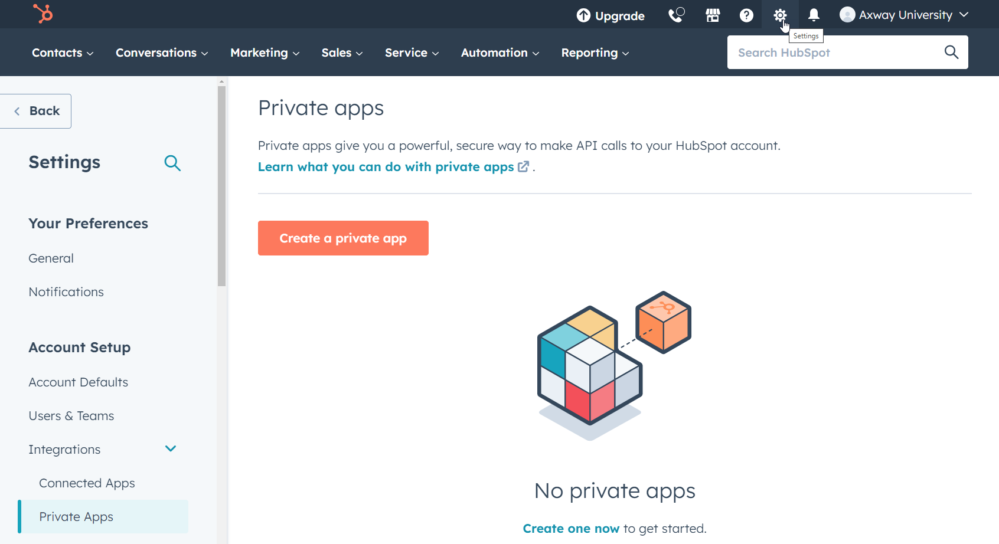

# Amplify Integration - Hubspot Connection Guide

This guide describes how to create an Amplify Integration Hubspot Connection.

We will do the following:

* Create a Hubspot Connected App and configure the OAuth settings
* Create an Amplify Integration Hubspot Connection using these settings
* Test our new Amplify Integration Hubspot Connection

## Hubspot Connected App

* If you don't have a Hubspot account, subscribe for free at **[https://www.hubspot.com](https://www.hubspot.com)**
* Open the **Settings** > **Account Setup** > **Integration** > **Private Apps**
  
* Click the **Create Private App** button to create a new app
  
* Give your app a name (e.g. AIP App) and optional Logo and Description
* Click on the Scope tab and select your desired scopes. For example, to be able to retrieve and modify contacts you need to select: **crm.objects.contacts.read** **crm.objects.contacts.write**
  
* Click on **Create** button
* Once your token is generated, click **Show token** and **Copy** to clipboard

## Amplify Integration Hubspot Connection

* Create a new Connection and select Hubspot and give it a name and description
  
* Select Token as **Connection Type** and paste the token of your Hubspot private app.
  
* Click on **Update** and on the **Test** button
   \
  Make sure you get a green check

Now your Connection can be used in an integration
