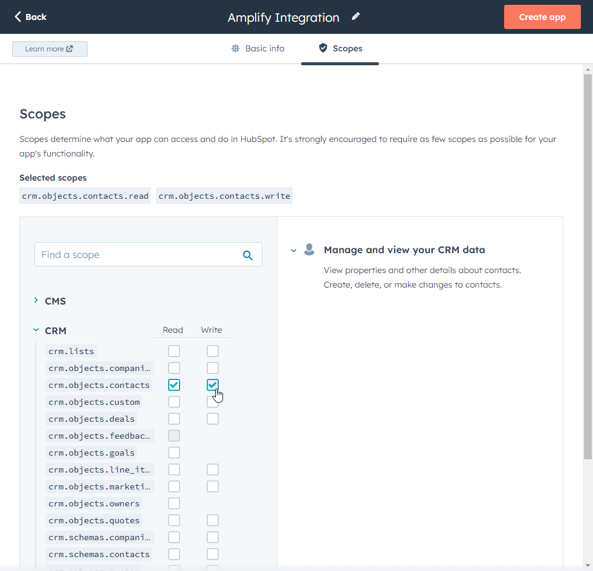
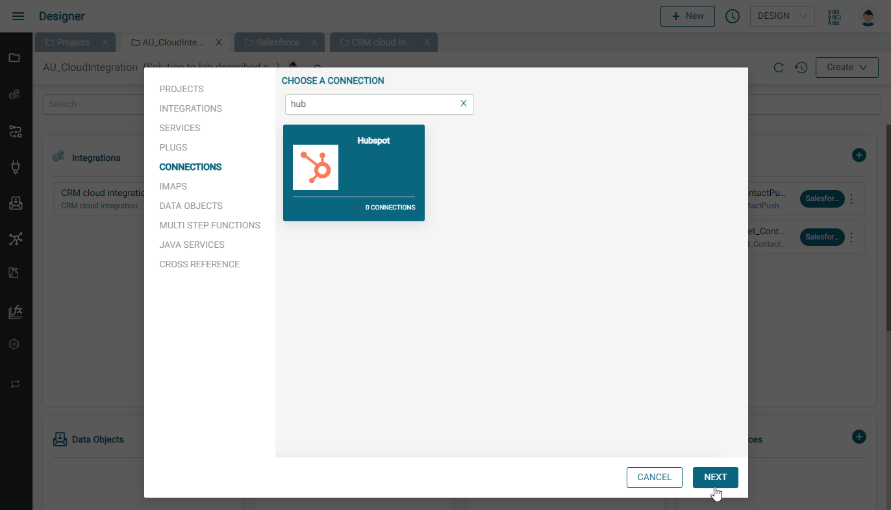
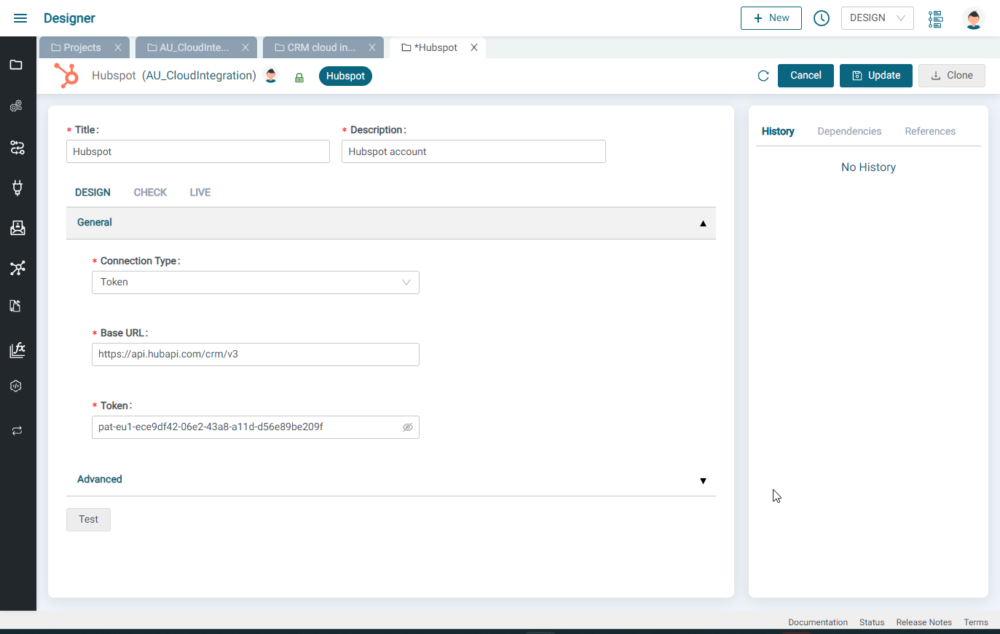

# Amplify Integration - Hubspot Connection Guide

This guide describes how to create an Amplify Integration Hubspot Connection.

We will do the following:

* Create a Hubspot Connected App and configure the OAuth settings
* Create an Amplify Integration Hubspot Connection using these settings
* Test our new Amplify Integration Hubspot Connection

## Hubspot Connected App

* If you don't have a Hubspot account, create one at **[https://www.hubspot.com/](https://www.hubspot.com/)**
* If you don't have a Hubspot Developer account, create one at [**https://developers.hubspot.com/**](https://developers.hubspot.com/)
  
* In your developer account, click on Manage Apps and click the Create App button to create a new app
  
* Give your app a name (e.g. AIP App) and optional Logo and Description
* Click on the Auth tab to see your Client ID and Client Secret. You will need these when you setup the Amplify Integration Hubspot Connection
  
* Scroll down to the Redirect URLs and enter the following Redirect URL and press Save:
  `<<YOUR AIP BASE URL>>/design/oauth2/callback`
  
* Scroll down to the Scopes section and select your desired scopes. For example, I selected all CRM scopes below:
  
* We will need the list of selected scopes when we create the Amplify Integration Hubspot Connection. For my settings, they are as follows:
`crm.schemas.companies.write crm.schemas.contacts.write crm.schemas.deals.read crm.schemas.deals.write crm.objects.owners.read crm.objects.contacts.write crm.objects.companies.write crm.lists.write crm.objects.companies.read crm.lists.read crm.objects.deals.read crm.schemas.contacts.read crm.objects.deals.write crm.objects.contacts.read crm.schemas.companies.read crm.objects.custom.read crm.schemas.custom.read`

## Amplify Integration Hubspot Connection

* Create a new Connection and select Hubspot and give it a name and description
  
  
* Enter your Hubspot App Client ID, Client Secret and Scope list from above and click on Update
  
* Click on the Generate Token button to authenticate, enter your credentials, select the non developer account and click on Choose Account
  
  
  
* Scroll down and click on the Connect App button
  
  
* Click the Test button
  

Now your Connection can be used in an integration but first let's test it out.

## Test the Connection

* Create an integration and add a Scheduler trigger event and set to any value since we won't be turning it on
  
  
* Click the plus button and add a Hubspot Get All component to the integration
  
  
* Expand the bottom panel and select the Hubspot Connector you created above
  
* Now we need to create a Plug so click on the Add button next to Plugs. Provide a name and click on the Create button
  
  
* Click on Configure, select the connector, Get All for the Actions, contacts for the Objects, select the desired fields (firstname, lastname, ...) and press Generate and then press Save
  
* Back in the integration, select the plug and then click the save button
  
* Click the Test button to try the integration
  
* Click on the Hubspot GetAll step and see the Hubspot contacts
  
