# Salesforce connection guide

## Salesforce Setup

- If you already have a Salesforce dev or test account you can use for training, make sure it is either a developer edition, or API Access has been enabled and that you have admin rights.
- In other cases, you can **sign up** for a new salesforce developer account using <https://developer.salesforce.com/signup> for free.
  - Provide all required fields and a valid email address. \
  Make sure to use a username that is specific for the training, and **different from corporate email address** in case you use Salesforce in your organization. \
  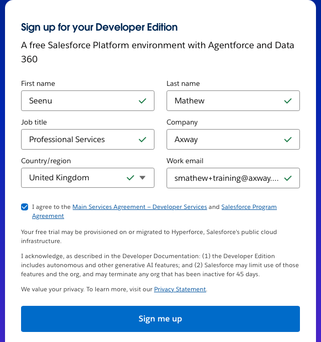

  - Once you click on **Sign me Up**, you will get an email with your Salesforce URL and username (you might need to wait couple minutes). Reset your password \
  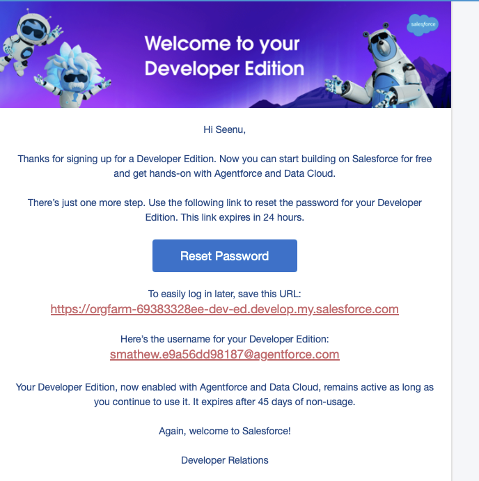

  - Verify account by clicking on **Verify Account** button in the email.

  - Set password to your account \
  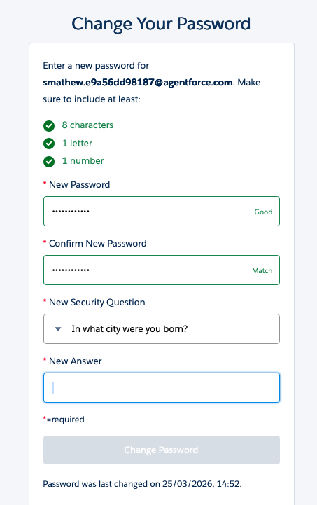

  - You are now able to login to your Salesforce developer account.

- Go to [https://login.salesforce.com](https://login.salesforce.com/) and enter your Username and Password click on **Log In**. \
  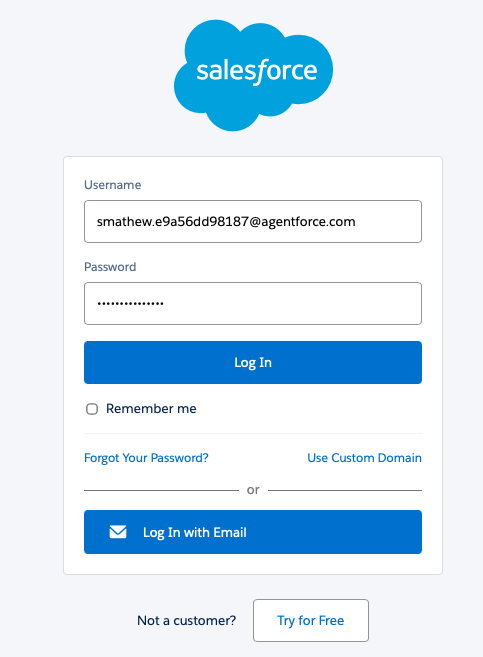

- Open the **Setup** menu. \
  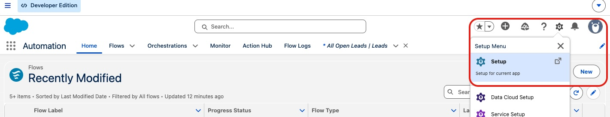

- Under **Apps**, click on **App Manager** and click **New External Client  App** for creating a new app \
  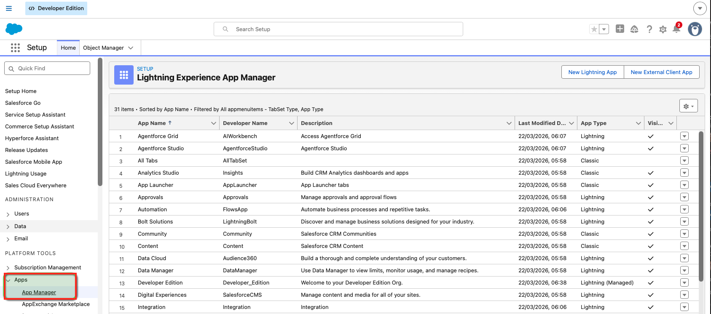.

- Fill up the required fields in the **Basic Information** \
  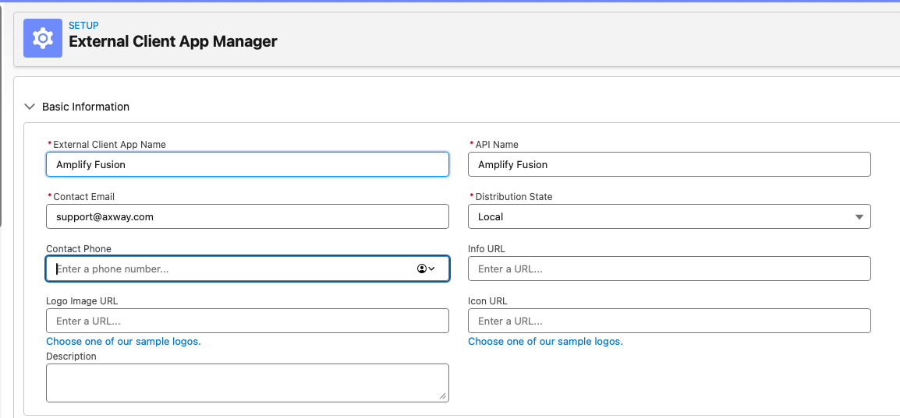

- Enable **OAuth Settings** should be checked and
  - Enter the **Callback URLs**. For example, if your Amplify Studio URL is  `https://axway-university.integration.us.axway.com`, your callback URL to generate tokens will be `https://axway-university.integration.us.axway.com/design/oauth2/callback`.
  - Choose the following scopes in the **Available OAuth Scopes** and **Add** them to the **Selecected OAuth Scopes** .
    - Full access (full)
    - Manage user data via APIs (api)
    - Perform requests at any time (refresh_token, offline_access)
  

  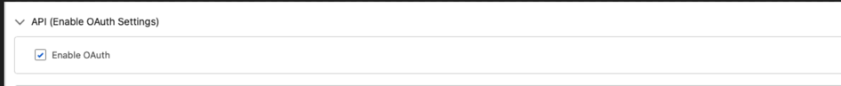
 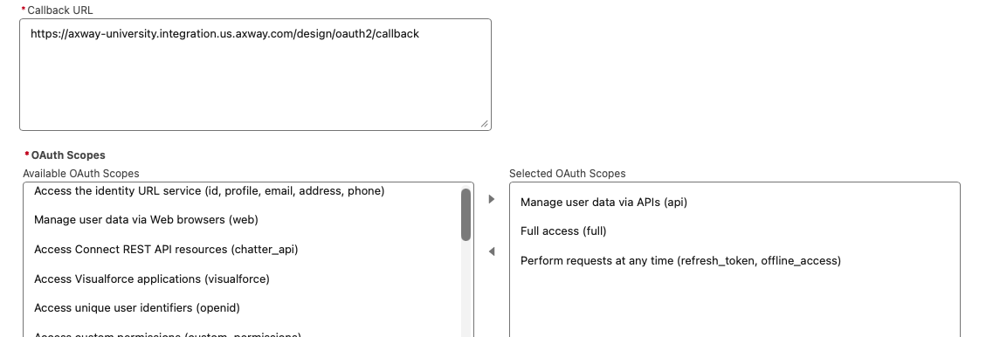

- Enable **Enable Authorization Code and Credentials Flow**
- Enable **Enable Device Flow**
- Enable **Enable Token Exchange Flow**
- Enable **Require secret for Token exchange Flow**

In the security field
- Enable **Require secret for Web Server Flow**
- Enable **Require secret for Refresh Token Flow**
- Disable **Require Proof Key for Code Exchange (PKCE) extension for Supported Authorization Flows**
- Enable **Enable Refresh Token Rotation**

- Click on **Create** 

    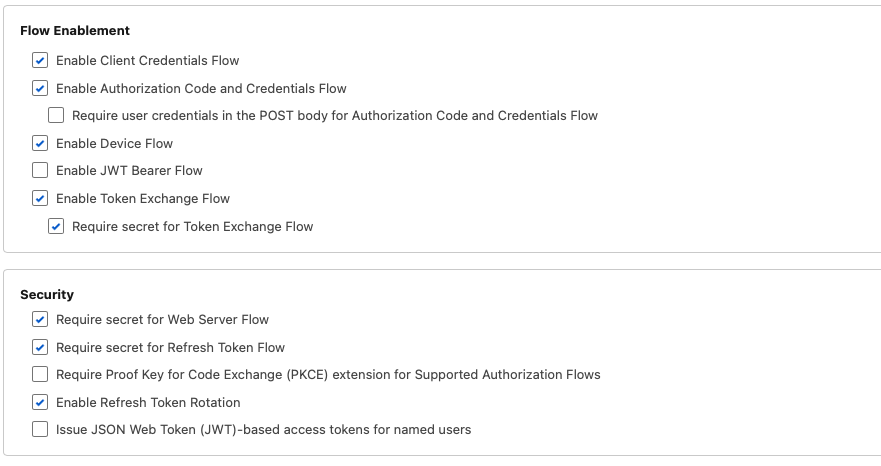

 - Click on **Settings tab**
 - Scroll down and open OAuth Settings
 -  Click on **ConsumerKey and Secret**

  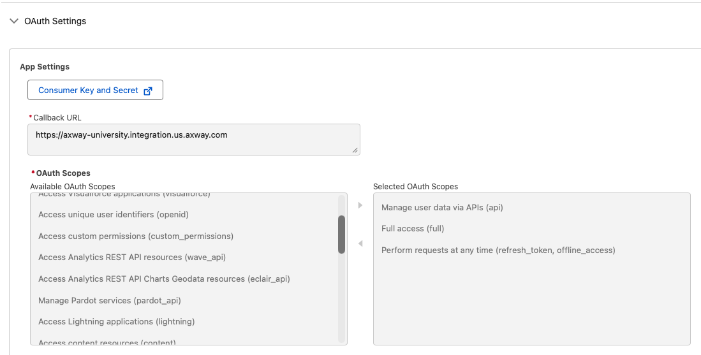
    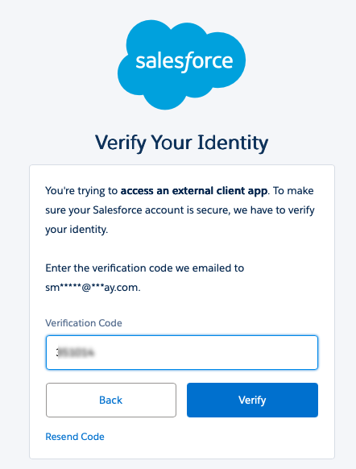
    
-  A new tab will ask you to verify your idenity by asking you to enter the verification code sent to your email. Once you enter the code, you will be able to see the Consumer Key and Consumer Secret, which you need to save for later use in Amplify Fusion connection configuration. \
        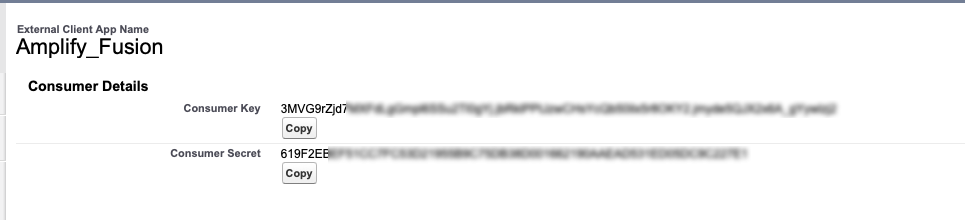

## Amplify Fusion Setup

You must configure a Salesforce Connection to connect Amplify Fusion to your Salesforce instance .

- From Amplify Studio, Navigate to **New** in the top right corner. \
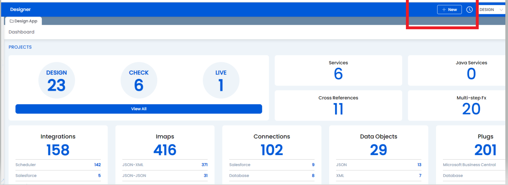

- Select the **Connections** tab from the left side menu, choose the **Salesforce** connection and then click **Next**. \
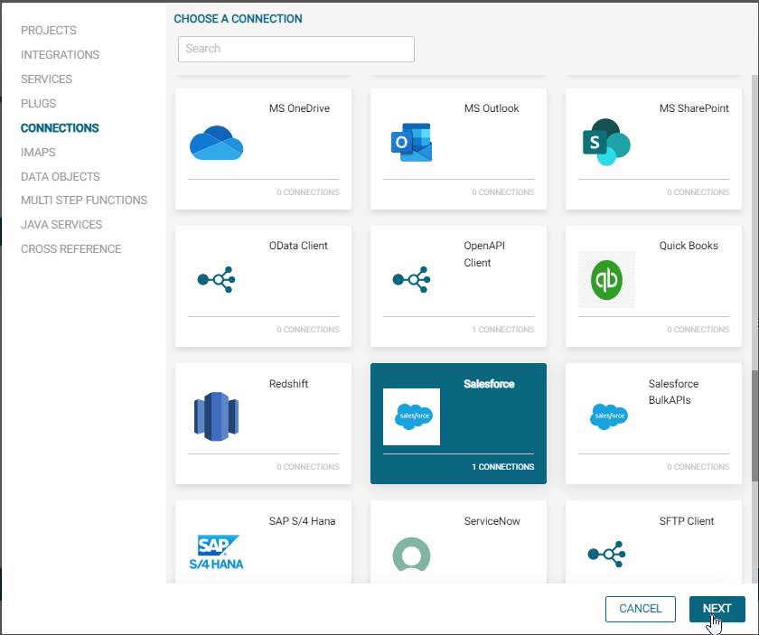

- Enter the **Name**, **Description**, select the **Project** and then click **Create**. \
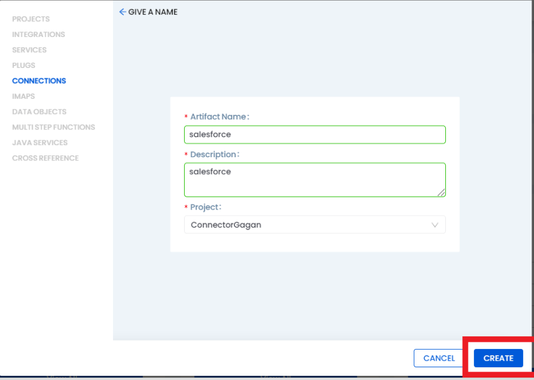

- To configure the connection, enter the following details:\
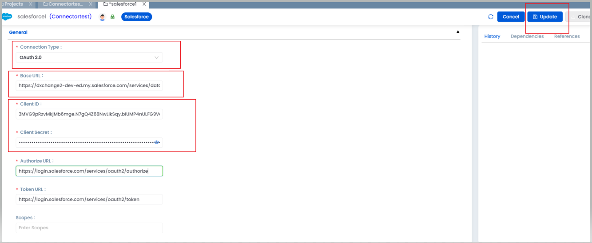

  - Connection Type: **OAuth2.0** 

  - Base URL:  **https://{subdomain}.my.salesforce.com/services/data/v{version}**. Replace your {subdomain} and {version} as follow: 

    - Subdomain: You can get your domain by clicking on the Avatar on the top right corner of Salesforce application and copy what comes before ".my.saleforce.com"
      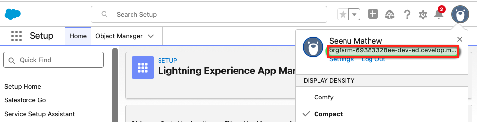

    - Version: 60.0.  You can get the available API versions by calling the service <https://{subdomain}.my.salesforce.com/services/data> in your browser.

  - ClientID: Paste the Consumer Key of the Salesforce app

  - Client Secret: Paste the Consumer Secret of the Salesforce app, which will be saved in the encrypted format.

- After entering the above details, click **Update** to save the connection details.

- Click on [Generate token] to Allow access. A pop-up window should prompt you to explicitly allow some access. Please ensure that the browser does not block pop-ups. \
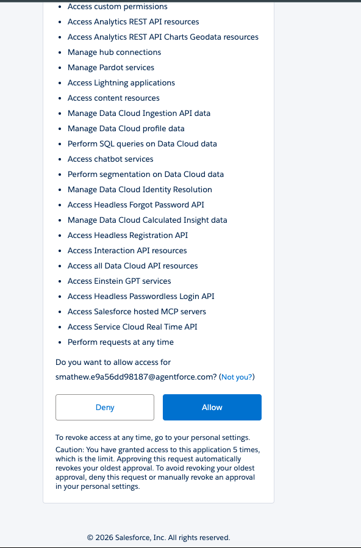

- Once token is generated, click on **Test** button \
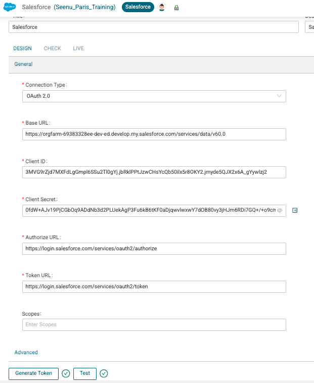

- A  indicates a successful connection test, while an  indicates wrong connection and a pop-up would provide error details.
