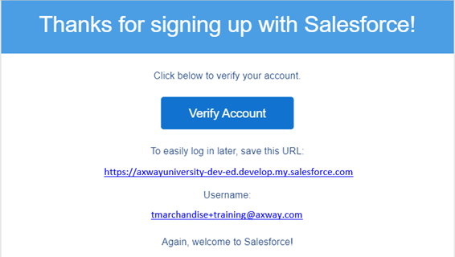
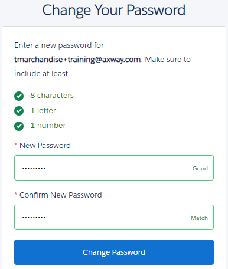
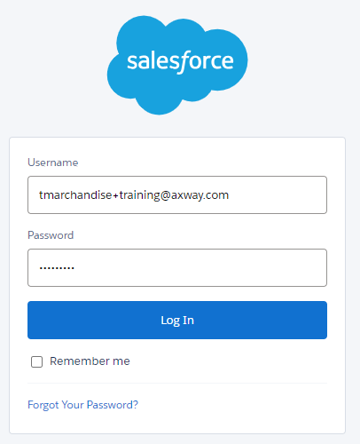
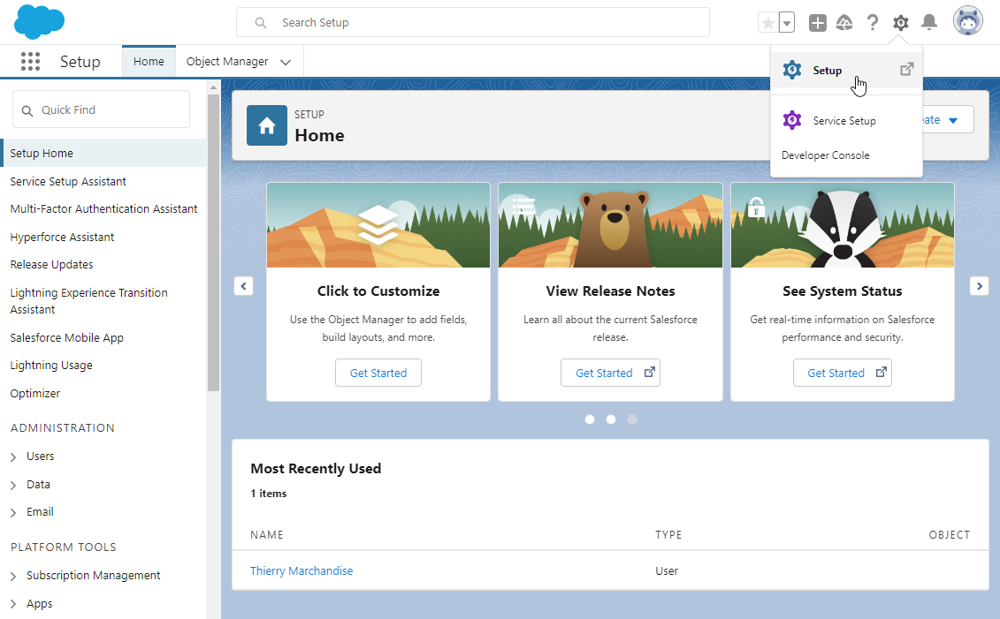
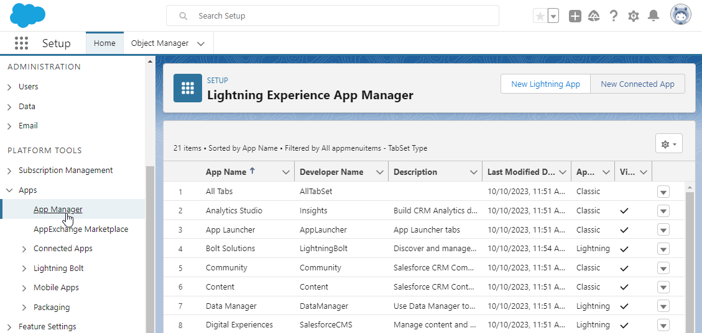
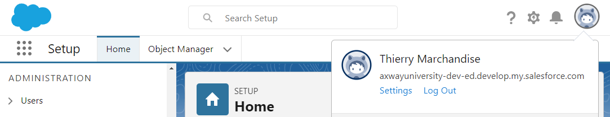
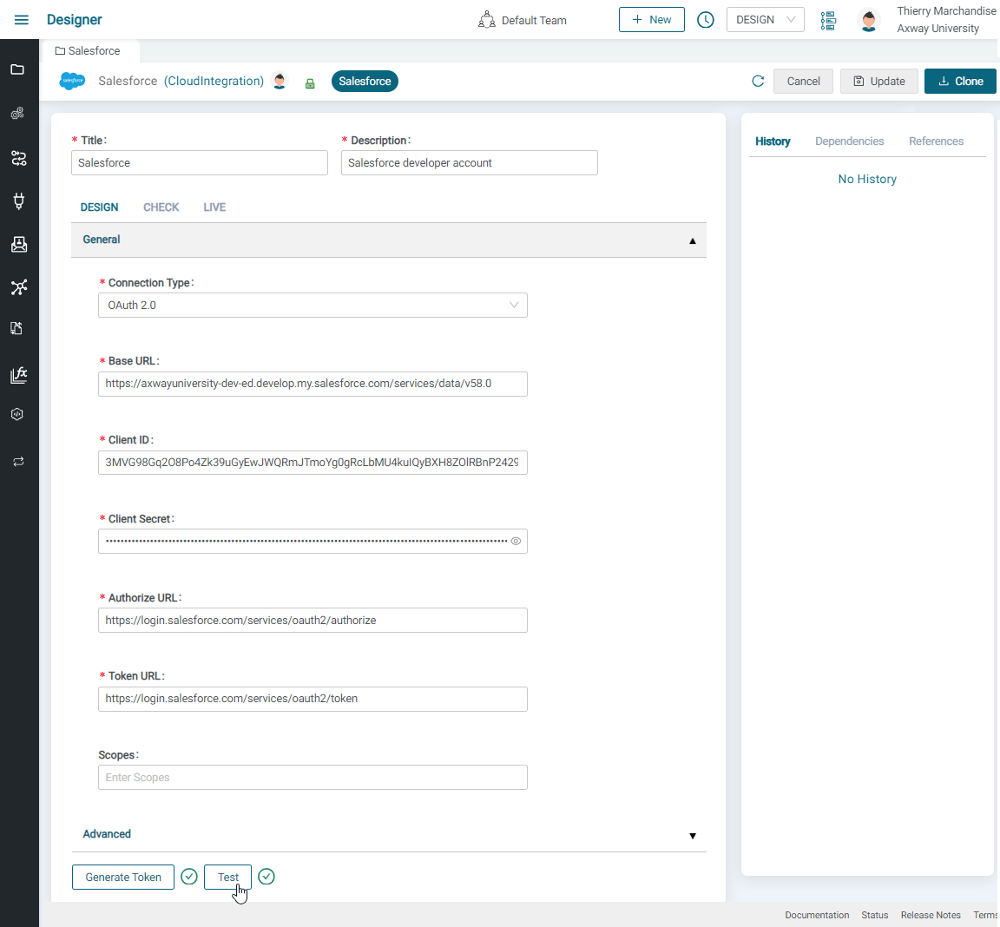

# Salesforce connection guide

## Salesforce Setup

- If you already have a Salesforce developer account you can use for training, make sure is either a developer edition, or API Access has been enabled.
- In other cases, you can **sign up** for a new salesforce developer account using <https://developer.salesforce.com/signup> for free.
  - Provide all required fields and a valid email address. \
  Make sure to use a username that is specific for the training, and **different from corporate email address** in case you use Salesforce in your organization. \
  

  - Once you click on **Sign me Up**. You will get an email with your Salesforce URL and username. \
  

  - Verify account by clicking on **Verify Account** button in the email.

  - Set password to your account \
  

  - You are now able to login to your Salesforce developer account.

- Go to [https://login.salesforce.com](https://login.salesforce.com/) and enter your Username and Password click on **Log In**. \
  

- Open the **Setup** menu. \
  

- Under **Apps**, click on **App Manager** and click **New connected App** for creating a new app \
  .

- Fill up the required fields in the **Basic Information** \
  

- Enable **OAuth Settings** should be checked and
  - Enter the **Callback URLs**. For example, if your Amplify Integration access URL is <https://axway.integration.us.axway.com>, your callback URL will be <https://axway.integration.us.axway.com/design/oauth2/callback>.
  - Choose the following scopes in the **Available OAuth Scopes** and **Add** them to the **Selecected OAuth Scopes** .
    - Full access (full)
    - Manage user data via APIs (api)
    - Perform requests at any time (refresh_token, offline_access)
  
  

- **Save** the app and then click **Continue**.

- Click on **Manage Consumer Details** button, and copy the **Consumer Key** and **Consumer Secret** or keep the page open for later. These consumer details will be used when creating your Salesforce connection on Amplify Integration \
  

## Amplify Integration Setup

You must configure a Salesforce Connection to connect Amplify Integration to your Salesforce instance .

- From Amplify Integration, Navigate to **New** in the top right corner. \

- Select the **Connections** tab from the left side menu, choose the **Salesforce** connection and then click **Next**. \

- Enter the **Name**, **Description**, select the **Project** and then click **Create**. \

- To configure the connection, enter the following details:\

  - Connection Type: **OAuth2.0** 

  - Base URL:  **https://{subdomain}.develop.my.salesforce.com/services/data/v{version}** if using a developer edition. Replace your {subdomain} and {version} as follow: 

    - Subdomain: You can get your domain by clicking on the Avatar on the top right corner of Salesforce application
      

    - Version: 46.0, 57.0 etc.  You can get the available API versions by calling the service <https://{subdomain}.my.salesforce.com/services/data> in your browser.

  - ClientID: Enter Consumer ID of the Salesforce app

  - Client Secret: Enter Consumer Secret of the Salesforce app, which will be saved in the encrypted format.

- After entering the above details, click **Update** to save the connection details.

- Click on [Generate token] to Allow access. A pop-up window should prompt you to explicitly allow some access. \

- Once token is generated, click on **Test** button \

- A  indicates a successful connection test, while an  indicates wrong connection and a pop-up would provide error details.
