# Integration Cloud entre CRM

Dans cet exercice, nous allons créer une intégration qui copiera des nouveaux contacts Salesforce vers Hubspot et Microsoft Teams, comme indiqué ci-dessous :

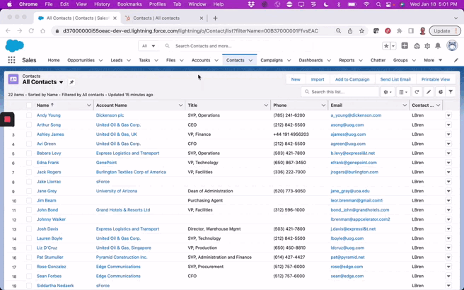

Le data flow est illustré ci-dessous:


Dans cet exercice nous allons apprendre à :

* Créer une connexion Salesforce
* Utiliser le composant Salesforce de recherche (Salesforce Query) et le branchement (plug) associé
* Créer un Platform Event dans Salesforce
* Créer une connexion Hubspot
* Utiliser le composant HubSpot de création (Hubspot Create) et le plug associé pour créer un contact HubSpot
* Faire un Mapping de données
* Créer une connexion Microsoft Teams en utilisant la connexion client HTTP/S
* Envoyer un message sur un canal Microsoft Teams

L'intégration finale doit ressembler à ceci:

  

## Pré-requis

Avant de démarrer cet exercice assurez vous d'avoir:

* Accès à Amplify Fusion
  > Si vous n'avez pas de compte, veuillez contacter **[amplify-fusion-training@axway.com](mailto:amplify-fusion-training@axway.com?subject=Amplify%20Fusion%20-%20Training%20Environment%20Access%20Request&body=Hi%2C%0D%0A%0D%0ACould%20you%20provide%20me%20with%20access%20to%20an%20environment%20where%20I%20can%20practice%20the%20Amplify%20Fusion%20e-Learning%20labs%20%3F%0D%0A%0D%0ABest%20Regards.%0D%0A)** par mail avec en objet `Amplify Fusion Training Environment Access Request`
* Une **Instance développeur Salesforce**
  > Si vous n'avez pas d'instance développeur, les détails pour vous inscrire gratuitement seront fournis dans les étapes ci-dessous.
  > Si vous utilisez déjà Salesforce comme CRM dans votre organisation, n'utilisez pas votre compte d'entreprise pour cet exercice et créez un compte de développeur en n'utilisant pas l'adresse e-mail de votre entreprise comme nom d'utilisateur.
* Un accès à une instance **Hubspot** 
  > Si vous n'avez pas d'instance développeur, les détails pour s'inscrire gratuitement seront donnés dans les étapes ci-dessous 
* Un Accès à **Microsoft Teams** et la capacité d'installer le connecteur Webhook entrant sur un canal
  > Si vous n'utilisez pas Teams ou que vous n'avez pas la fonctionnalité Webhook, vous  pouvez utiliser une application de test webhook en ligne comme [Webhook.site](https://webhook.site) à la place pour cet exercice

## Étape 1

Dans cette étape nous allons paramétrer un Platform Event Salesforce et commencer notre intégration par ajouter un Salesforce Platform-Event listener en tant qu'évènement déclencheur de notre intégration 

* Créer un nouveau projet Amplify Fusion pour cette intégration CRM. Utiliser un nom unique au cas où vous ne seriez pas le seul à faire cet exercice sur votre tenant Amplify (par ex: XX_CRMCloudIntegration, XX étant votre nom ou vos initiales).
* Créer une intégration (par exemple: InvoiceHandler)
* Suivre les instructions [**ci-jointes**](../fr/salesforce-connection.md) pour configurer une App OAuth connectée à Salesforce, une connexion Salesforce dans Amplify Fusion, génerer un token et tester la connexion \
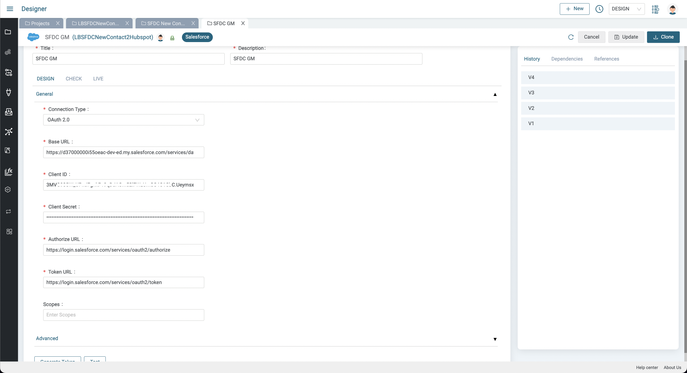
* Créer un Platform Event pour les nouveaux Contacts
  * Ouvrir le menu Salesforce _Setup > Integration > Platform Events_
  * Entrer "NewContact" comme libellé et nom d'object
      
    * Ajouter un custom field "ContactID"
    

* Ajouter un Object Trigger pour les nouveaux Contacts
  * Ouvrir le menu Salesforce _Setup > Object and Fields > Object Manager_ et selectionner l'objet "Contact"  
    
  
  * Cliquer sur "New" dans la section _Triggers_  
    
  * Remplacer le code Apex trigger par le code suivant :

    ```java
        trigger NewContactTrigger on Contact (after insert) {
      List<NewContact__e> events = new List<NewContact__e>();
      for (Contact contact : Trigger.new) {
        NewContact__e event = new NewContact__e(
            ContactId__c = contact.Id
        );
        events.add(event);
      }
      if (!events.isEmpty()) {
        EventBus.publish(events);
      }
    }
    ```

    
  * Sauvergarder puis vérifier qu'il n'y a pas d'erreur de compilation et que le trigger est bien actif.

* Retourner au projet Fusion
* Créer un Plug pour Salesforce (par ex: SalesforceNewContactEvent) et le configurer:
  * Sélectionner la connexion Salesforce créée précédemment
  * Sélectionner `Platform Event` pour Actions
  * Sélectionner `/event/NewContact__e` tout juste crée en tant qu'Objects 
  * Sélectionner `RECEIVE_NEW_EVENTS` pour le  Replay Id

  
  * Cliquer sur Generate et ensuite Save pour créer le Plug
* Créer une intégration pour l'intégration CRM cloud 
  * Cliquer sur le bouton Event et sélectionner le composant Salesforce Platform Event
  * Sélectionner la connexion Salesforce et le plug créés juste avant 
  
* Activer l'intégration
* Créer un nouveau contact depuis le menu Salesforce  _Sales menu > Contacts > New Contact_
  
  
* Consulter le Monitor et cliquer sur la transaction pour voir les informations du contact créé
  

## Étape 2

Dans cette étape, nous allons récupérer le contact et les champs souhaités à partir l'identifiant du nouveau contact reçu dans l'évènement Salesforce. Nous utiliserons un composant de requête Salesforce (Salesforce query component) et un plug de recherche de contact par identifiant

* Désactiver l'intégration pour poursuivre le design
* Cliquer sur l'icône `+` pour ajouter une étape après l'évènement déclencheur 
* Sélectionner le composant Salesforce Query et sélectionner la connexion Salesforce créée auparavant 
  
* Cliquer sur  Add Plugs, nommer le Plug, lui donner une description (par ex: Salesforce_Get_Contact_by_Id) et le configurer
  * Sélectionner votre connexion Salesforce  
  * Sélectionner `Query` pour les Actions
  * Sélectionner `Contact` pour les  Objects
  * Sélectionner les fields: Id, FirstName, LastName et Email 
  * Cliquer sur Where puis sur Add Condition et sélectionner le champ `Id` et l'opérateur `=`

  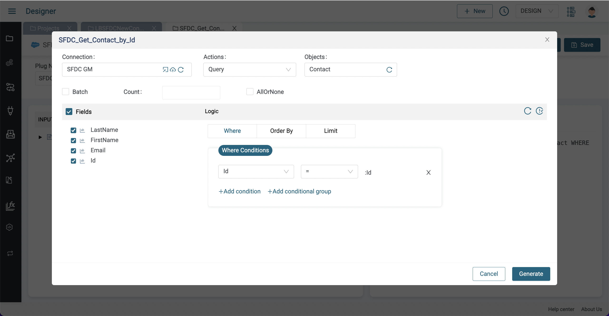
* Cliquer sur Generate puis sur Save pour créer votre plug 
  
* Retourner à l'intégration et sélectionner le plug tout juste créé pour le composant query
  

* Agrandir le panneau inférieur pour voir les détails de la pipeline
  * In the left pane (pipe-in), expand `SalesforceNewContactEventOutput` and expose the `SalesforceNewContactEventOutput/payload/ContactID__c` variable
  * In the middle pane under ACTION PROPERTIES on the right (action-in) expand `Salesforce_GetContactByIdInput` to expose the `SSalesforce_GetContactByIdInput/where/where_Id` variable 
  * Drag a line between the two nodes and click Save
  
* Activer l'intégration, créer un nouveau contact Salesforce et consulter la transaction dans le Monitor pour voir le nouveau contact avec les champs spécifiés dans le plug 
  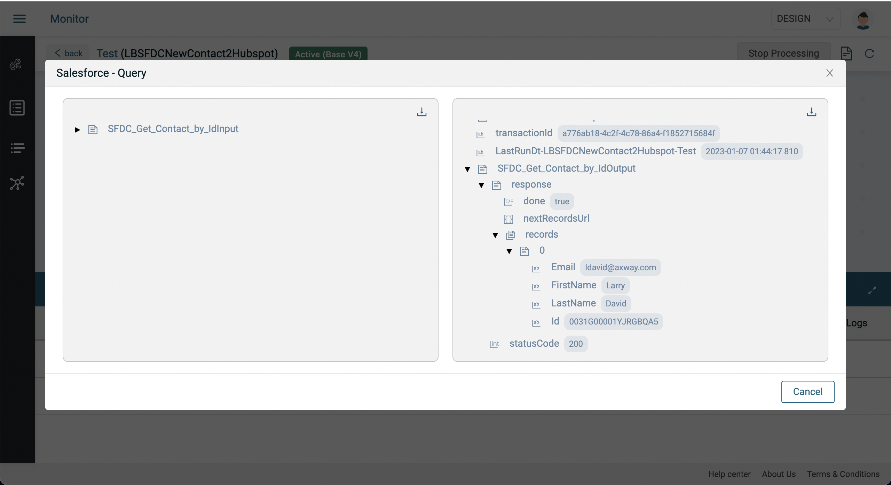

## Étape 3

Dans cette étape, nous allons récupérer le contact et l'insérer dans Hubspot. Nous allons utiliser le composant Hubspot Create et un plug associé

* Suivre [**ce guide**](../fr/hubspot-connection.md) pour créer une connexion Hubspot
* Désactiver l'integration précédente pour continuer le design
* Cliquer sur le signe `+` pour ajouter une nouvelle étape à l'intégration puis sélectionner le composant Hubspot Create
  
* Sélectionner la connexion Hubspot tout juste créée 
  
* Cliquer sur le bouton Add à côté de Plugs afin de créer un Plug Hubspot de création de contact
* Donner un nom, une description puis cliquer sur Create
  
* Cliquer sur Configure puis suivre ces étapes:
  * Sélectionner le connecteur Hubspot crée précédemment
  * Sélectionner create pour les Actions
  * Sélectionner contacts pour les Objects
  * Sélectionner `firstname`, `lastname` and `email` pour les fields
  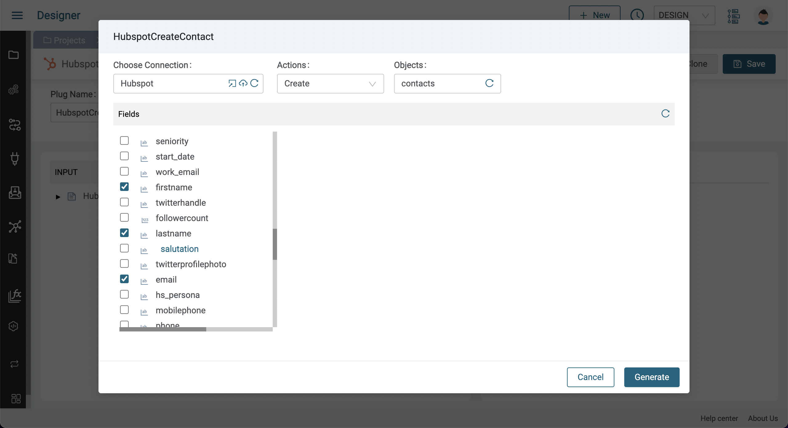
  * Appuyer sur Generate
  
* Cliquer sur Save puis retourner à l'intégration et sélectionner le plug tout juste créé
  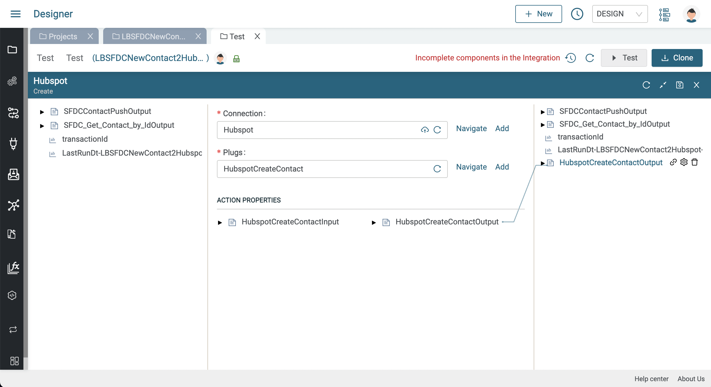
* Agrandir le panneau inférieur pour voir les détails de la pipeline
  * Dans le partie de gauche (pipe-in), développer `Salesforce_GetContactByIdOutput/response/records` pour visualiser les variables  `LastName`, `FirstName` and `Email` du contact Salesforce.
  * Dans la partie centrale, sous ACTION PROPERTIES, à gauche (action-in), développer `Hubspot_CreateContactInput/create` pour visualiser les variables `email`, `firstname` and `lastname` du contact Hubspot à créer
  * Relier chaque variable du contact Salesforce à la variable du contact Hubspot correspondante
  * Cliquer sure `Save`
  
* Activer l'intégration et créer un nouveau contact Salesforce. Le contact est désormais visible sur Hubspot
  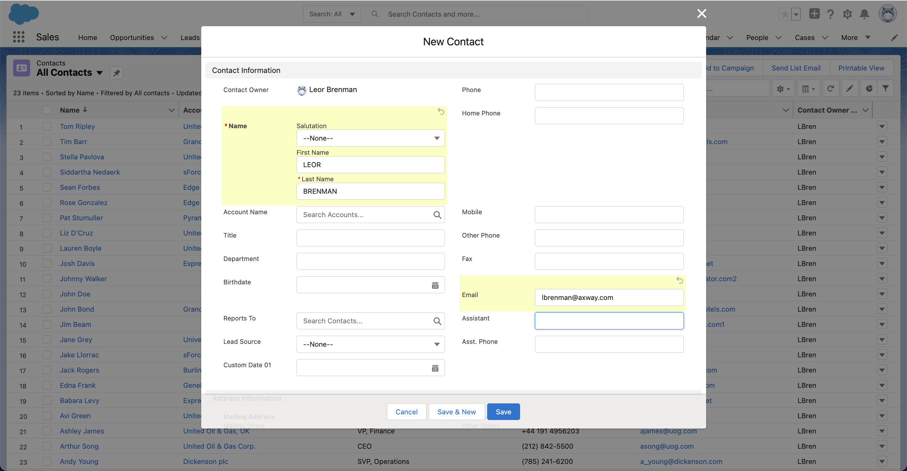
  

## Étape 4 - Relevez le défi !

Dans cette étape, nous posterons un message sur le canal Microsoft Teams contenant les détails du contact

Nous utiliserons le connecteur Webhook entrant de Microsoft Teams afin de pouvoir poster un message sur un canal Microsoft Teams

* Suivre les instructions [**ci-jointes**](https://learn.microsoft.com/fr-fr/microsoftteams/platform/webhooks-and-connectors/how-to/add-incoming-webhook) pour obtenir l'URL d'un canal Microsoft Teams
  * Si vous n'utilisez pas Teams ou que vous n'avez pas la fontionnalité Webhook, vous pouvez utiliser une application de test Webhook ligne comme  [Webhook.site](https://webhook.site) à la place pour cette étape
* Désactiver l'intégration précédente et ajouter une connexion HTTP/S Client Post à l'intégration 
  
  
* Cliquer sur Add à côté de Connection afin de créer une connexion HTTP/S Client vers le Microsoft Teams Incoming Webhook Connector URL, lui donner un nom, une description puis suivre ces étapes:
  * Sélectionner HTTPS pour le Protocol
  * Sélectionner HTTP/2 pour la Version HTTP
  * Entrer l'URL du connecteur Microsoft Teams Incoming Webhook et appuyer sur Update 
  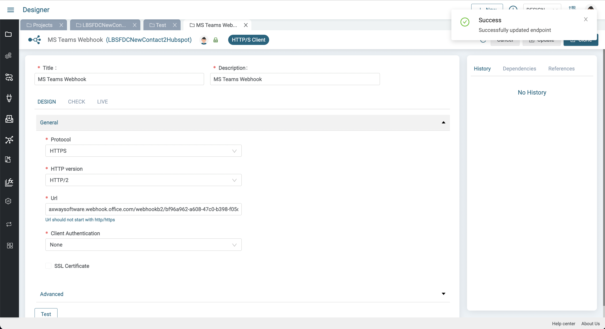
* Retourner à l'intégration et sélectionner la connexion Microsoft Teams
* Agrandir le panneau inférieur pour voir les détails de la pipeline  
  * Dans la section ACTION PROPERTIES, développer `HTTPSPostInput` pour afficher le body, faire un clic droit sur body et sélectionner SetValue 
    
  * Copier le texte JSON suivant, puis insérer Name et Email comme illustré en positionnant le curseur sur le texte et en appuyant sur le bouton `+` pour sélectionner "Name" et "Email" depuis `Salesforce_GetContactByIdOutput/response/record`, puis cliquer

  ```json
    {
      "Text": "Newly created Salesforce contact: () copied to Hubspot"
    ‌}
    ```
    
  
  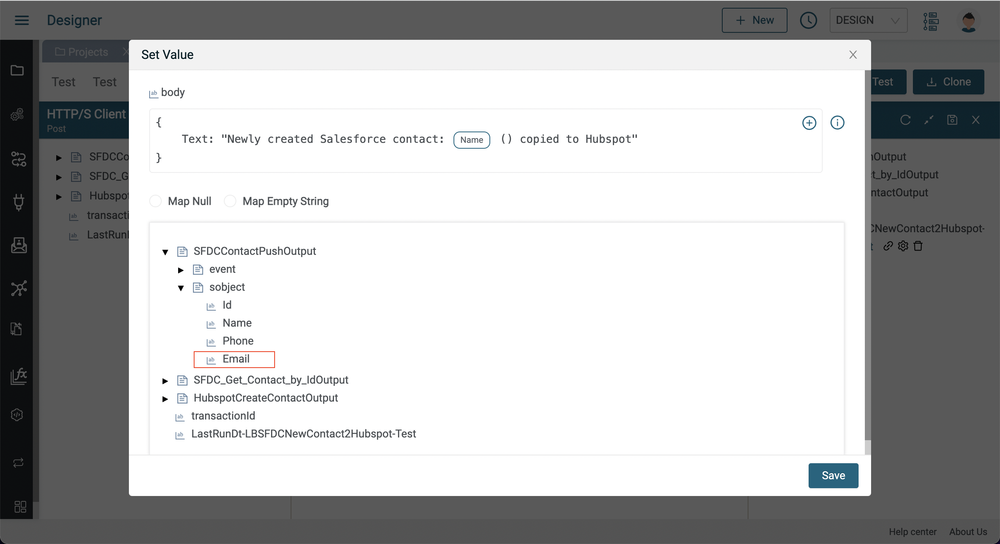
  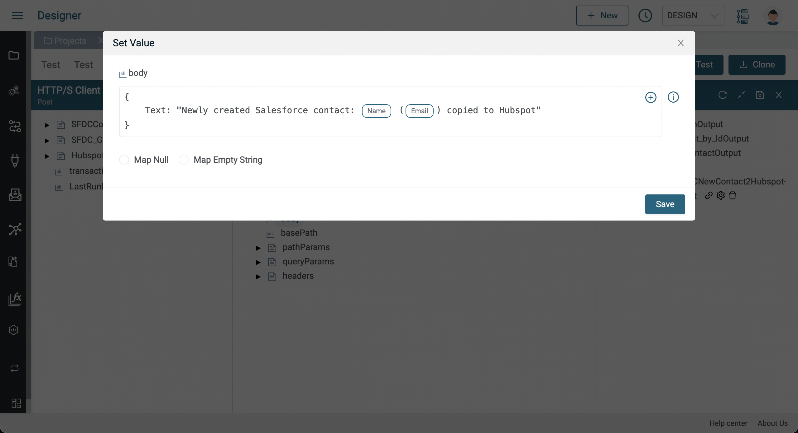
* Activer l'intégration et créer un nouveau contact Salesforce puis visualiser le contact sur Hubspot. Un message comme celui-ci doit aussi apparaître sur votre canal Microsoft Teams:
  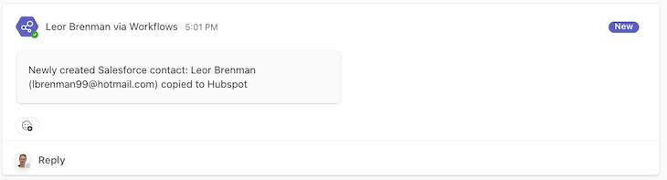

L'intégration finale doit ressembler à ceci:

  
