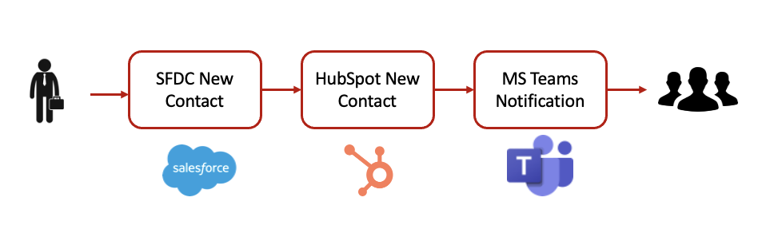
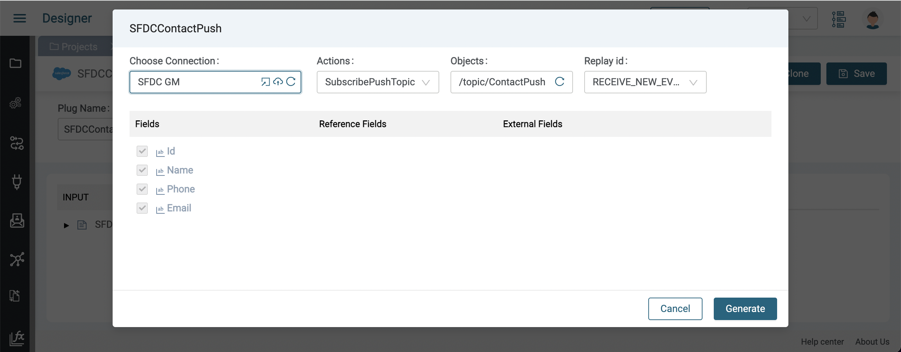
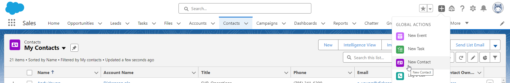
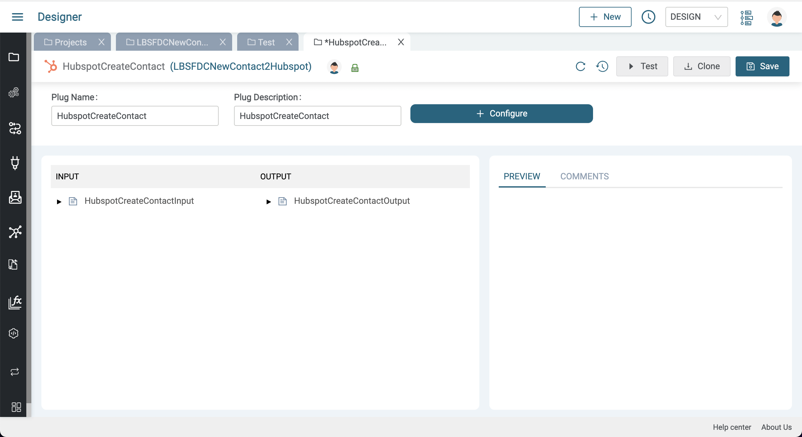
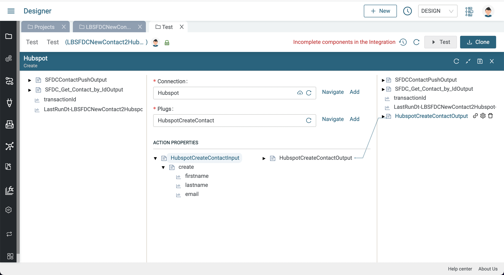
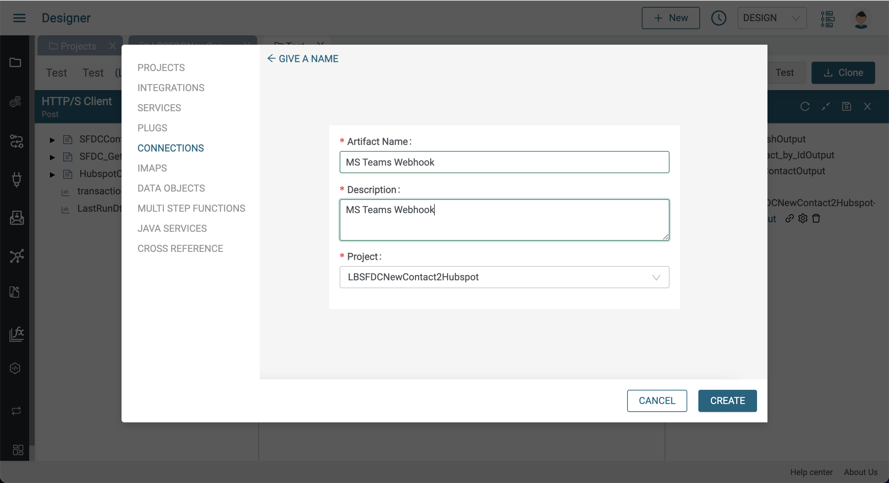
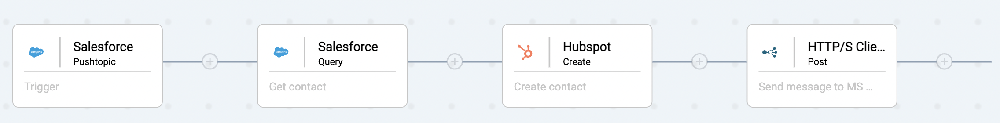

# Integration Cloud entre CRM

Dans cet exercice, nous allons créer une intégration qui copiera des nouveaux contacts Salesforce vers Hubspot et MS Teams, comme indiqué ci-dessous :


Le data flow est illustré ci-dessous:



Dans cet exercice nous allons apprendre à :

* Créer une connexion Salesforce
* Utiliser le composant Salesforce de recherche (Salesforce Query) et le branchement (plug) associé
* Créer un Push Topic dans Salesforce
* Créer une connexion Hubspot
* Utiliser le composant HubSpot de création (Hubspot Create) et le plug associé pour créer un contact HubSpot
* Faire un Mapping de données
* Créer une connexion MS Teams en utilisant la connexion client HTTP/S
* Envoyer un message sur un canal MS Teams

L'intégration finale doit ressembler à ceci:

  

## Pré-requis

Avant de démarrer cet exercice assurez vous d'avoir:


* Accès à Amplify Fusion
  > Si vous n'avez pas de compte, veuillez contacter **[amplify-integration-training@axway.com](mailto:amplify-integration-training@axway.com?subject=Amplify%20Fusion%20-%20Training%20Environment%20Access%20Request&body=Hi%2C%0D%0A%0D%0ACould%20you%20provide%20me%20with%20access%20to%20an%20environment%20where%20I%20can%20practice%20the%20Amplify%20Fusion%20e-Learning%20labs%20%3F%0D%0A%0D%0ABest%20Regards.%0D%0A)** par mail avec en objet `Amplify Fusion Training Environment Access Request`
* Une **Instance développeur Salesforce**
  > Si vous n'avez pas d'instance développeur, les détails pour vous inscrire gratuitement seront fournis dans les étapes ci-dessous.
  > Si vous utilisez déjà Salesforce comme CRM dans votre organisation, n'utilisez pas votre compte d'entreprise pour cet exercice et créez un compte de développeur en n'utilisant pas l'adresse e-mail de votre entreprise comme nom d'utilisateur.
* Un accès à une instance **Hubspot** 
  > Si vous n'avez pas d'instance développeur, les détails pour s'inscrire gratuitement seront donnés dans les étapes ci-dessous 
* Un Accès à **Microsoft Teams** et la capacité d'installer le connecteur Webhook entrant sur un canal
  > Si vous n'utilisez pas Teams ou que vous n'avez pas la fonctionnalité Webhook, vous  pouvez utiliser une application de test webhook en ligne comme [Webhook.site](https://webhook.site) à la place pour cet exercice

## Étape 1

Dans cette étape nous allons paramétrer un PushTopic Salesforce et commencer notre intégration par ajouter un Salesforce PushTopic listener en tant qu'évènement déclencheur de notre intégration 

* Créer un nouveau projet Amplify Fusion pour cette intégration CRM. Utiliser un nom unique au cas où vous ne seriez pas le seul à faire cet exercice sur votre tenant Amplify (par ex: XX_Salesforce2Hubspot, XX étant votre nom ou vos initiales).
* Créer une intégration (par exemple: InvoiceHandler)
* Suivre les instructions [**ci-jointes**](../fr/salesforce-connection.md) pour configurer une App OAuth connectée à Salesforce, une connexion Salesforce dans Amplify Fusion, génerer un token et tester la connexion \

* Créer un PushTopic dans la console de développeur Salesforce
  * Ouvrir la console de développeur Salesforce \
    
  * Cliquer sur Debug -> Open Execute Anonymous Window \
     \
    
  * Dans la fenêtre Enter Apex Code, coller le code Apex suivant et cliquer sur Execute:

    ```java
    PushTopic pushTopic = new PushTopic();
    pushTopic.Name = 'ContactPush';
    pushTopic.Query = 'SELECT Id, Name, Phone, Email FROM Contact';
    pushTopic.ApiVersion = 58.0;
    pushTopic.NotifyForOperationCreate = true;
    pushTopic.NotifyForOperationUpdate = false;
    pushTopic.NotifyForOperationUndelete = false;
    pushTopic.NotifyForOperationDelete = false;
    pushTopic.NotifyForFields = 'All';  
    insert pushTopic;
    ```

    

* Retourner au projet
* Créer un Plug pour Salesforce (par ex: SFDCContactPush) et le configurer:
  * Sélectionner la connexion Salesforce créée précédemment
  * Sélectionner `SubscribePushTopic` pour Actions
  * Sélectionner `/topic/ContactPush` tout juste crée en tant qu'Objects 
  * Sélectionner `RECEIVE_NEW_EVENTS` pour le  Replay Id

  
  * Cliquer sur Generate et ensuite Save pour créer le Plug
* Créer une intégration pour l'intégration CRM cloud 
  * Cliquer sur le bouton Event et sélectionner le composant Salesforce PushTopic
  * Sélectionner la connexion Salesforce et le plug créés juste avant 
  
* Activer l'intégration
* Créer un nouveau contact dans Salesforce 
  
  
* Consulter le Monitor et cliquer sur la transaction pour voir les informations du contact créé
  

## Étape 2

Dans cette étape, nous allons récupérer le contact et les champs souhaités à partir l'identifiant du PushTopic du nouveau contact. Nous utiliserons un composant de requête Salesforce (Salesforce query component) et un plug de recherche de contact par identifiant

* Désactiver l'intégration pour poursuivre le design
* Cliquer sur l'icône `+` pour ajouter une étape après l'évènement déclencheur 
* Sélectionner le composant Salesforce Query et sélectionner la connexion Salesforce créée auparavant 
  
* Cliquer sur  Add Plugs, nommer le Plug, lui donner une description (par ex: SFDC_Get_Contact_by_Id) et le configurer
  * Sélectionner votre connexion Salesforce  
  * Sélectionner `Query` pour les Actions
  * Sélectionner `Contact` pour les  Objects
  * Sélectionner les fields: Id, FirstName, LastName et Email 
  * Cliquer sur Where puis sur Add Condition et sélectionner le champ `Id` et l'opérateur `=`
  
* Cliquer sur Generate puis sur Save pour créer votre plug 
  
* Retourner à l'intégration et sélectionner le plug tout juste créé pour le composant query
  
* Sur le panneau de gauche, développer `SFDCContactPushOutput` pour afficher `SFDCContactPushOutput/sobject/Id`
* Sur le panneau du milieu, sous ACTION PROPERTIES, développer `SFDC_Get_Contact_by_IdInput` pour afficher  `SFDC_Get_Contact_by_IdInput/where/where_Id` et tirer une ligne entre ces deux noeuds puis cliquer sur Save
  
* Activer l'intégration, créer un nouveau contact Salesforce et consulter la transaction dans le Monitor pour voir le nouveau contact avec les champs spécifiés dans le plug 
  

## Étape 3

Dans cette étape, nous allons récupérer le contact et l'insérer dans Hubspot. Nous allons utiliser le composant Hubspot Create et un plug associé

* Suivre [**ce guide**](../fr/hubspot-connection.md) pour créer une connexion Hubspot
* Désactiver l'integration précédente pour continuer le design
* Cliquer sur le signe `+` pour ajouter une nouvelle étape à l'intégration puis sélectionner le composant Hubspot Create
  
* Sélectionner la connexion Hubspot tout juste créée 
  
* Cliquer sur le bouton Add à côté de Plugs afin de créer un Plug Hubspot de création de contact
* Donner un nom, une description puis cliquer sur Create
  
  
* Cliquer sur Configure puis suivre ces étapes:
  * Sélectionner le connecteur Hubspot crée précédemment
  * Sélectionner create pour les Actions
  * Sélectionner contacts pour les Objects
  * Sélectionner `firstname`, `lastname` and `email` pour les fields
  
  * Appuyer sur Generate
  
* Cliquer sur Save puis retourner à l'intégration et sélectionner le plug tout juste créé
  
* Dérouler ACTION PROPERTIES -> `HubspotCreateContactInput->create` pour afficher les fields du contact Hubspot
  
* Dans le panneau de gauche, développer `SFDC_Get_Contact_by_IdOutput/response/records[]` pour visualiser les propritétés du contact et les associer individuellement aux propriétés correspondantes du contact Hubspot, puis cliquer sur Save  
  
* Activer l'intégration et créer un nouveau contact Salesforce. Le contact est désormais visible sur Hubspot
  
  

## Étape 4 - Relevez le défi !

Dans cette étape, nous posterons un message sur le canal MS teams contenant les détails du contact

Nous utiliserons le connecteur Webhook entrant de MS Teams afin de pouvoir poster un message sur un canal MS Teams

* Suivre les instructions [**ci-jointes**](https://learn.microsoft.com/fr-fr/microsoftteams/platform/webhooks-and-connectors/how-to/add-incoming-webhook) pour obtenir l'URL d'un canal MS teams
  * Si vous n'utilisez pas Teams ou que vous n'avez pas la fontionnalité Webhook, vous pouvez utiliser une application de test Webhook ligne comme  [Webhook.site](https://webhook.site) à la place pour cette étape
* Désactiver l'intégration précédente et ajouter une connexion HTTP/S Client Post à l'intégration 
  
  
* Cliquer sur Add à côté de Connection afin de créer une connexion HTTP/S Client vers le MS Teams Incoming Webhook Connector URL, lui donner un nom, une description puis suivre ces étapes:
  * Sélectionner HTTPS pour le Protocol
  * Sélectionner HTTP/2 pour la Version HTTP
  * Entrer l'URL du connecteur MS Teams Incoming Webhook et appuyer sur Update
  
  
* Retourner à l'intégration et sélectionner la connexion MS Teams
  
* Dans la section ACTION PROPERTIES, développer `HTTPSPostInput` pour afficher le body, faire un clic droit sur body et sélectionner SetValue 
  
* Copier le texte JSON suivant, puis insérer Name et Email comme illustré en positionnant le curseur sur le texte et en appuyant sur le bouton `+` pour sélectionner "Name" et "Email" depuis `SFDCContactPushOutput`, puis cliquer

 ```json
  {
    "Text": "Newly created Salesforce contact: () copied to Hubspot"
  ‌}
  ```
  
  
  
  
* Activer l'intégration et créer un nouveau contact Salesforce puis visualiser le contact sur Hubspot. Un message comme celui-ci doit aussi apparaître sur votre canal MS Teams:
  

L'intégration finale doit ressembler à ceci:

  
