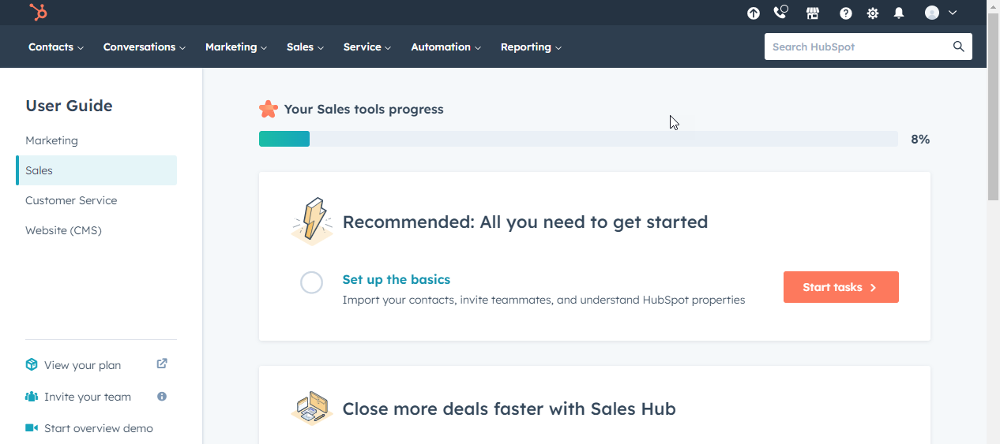
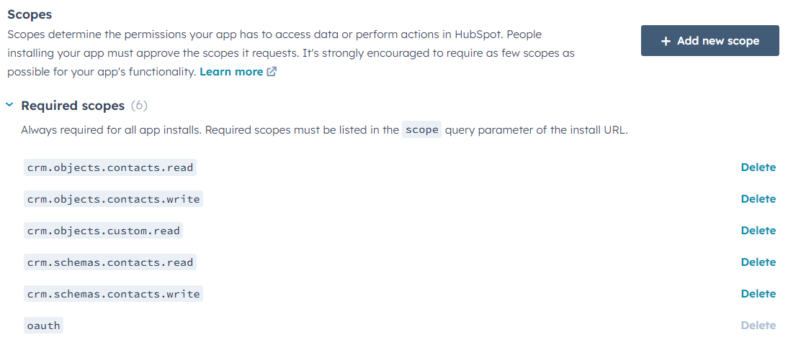

# Amplify Fusion - Guide de connexion Hubspot

Ce guide décrit le processus de création d'une connexion Hubspot pour Amplify Fusion

Nous ferons ce qui suit:

* Créer une App Hubspot Connectée et configurer les paramètres OAuth
* Créer une connexion Amplify Fusion en utilisant ces paramètres
* Tester notre nouvelle connexion 

## App connectée Hubspot Hubspot

* Si vous n'avez pas de compte Hubspot, créez en un à l'adresse suivante: **[https://www.hubspot.com/](https://www.hubspot.com/)**. Passez tous les écrans de bienvenue jusqu'à atteindre la page d'accueil de Hubspot
  
* Si vous n'avez pas d'App de développeur Hubspot, créez en une à l'adresse suivante: [**https://developers.hubspot.com/**](https://developers.hubspot.com/) , choisissez l'option App Developer et passez tous les écrans de bienvenue jusqu'à atteindre la page d'accueil de développeur Hubspot
  
* Sur votre compte développeur, cliquez sur Manage Apps puis cliquez sur Create App pour créer une nouvelle App
  
* Donnez un nom à votre App (par ex: AIP App), un logo et une description (facultatif)
* Cliquez sur la fenêtre Auth pour voir votre Client ID et votre Client Secret. Vous en aurez besoin pour paramétrer votre Connexion Hubspot dans Amplify Fusion
  
* Faites défiler vers le bas jusqu'aux URLs de redirection puis entrez l'URL de redirection suivant, puis appuyez sur Save:
  `<<Nom de domaine de l'interface de Designe d'Amplify Fusion>>/design/oauth2/callback`
  
* Faites défiler vers le bas jusqu'à la section Scopes et sélectionnez les scopes souhaités. Par exemple, vous pouvez sélectionner les 4 Scopes CRM en lien avec les clients:
  
* Nous aurons besoin de la liste des Scopes lorsque nous créerons la connexion Hubspot sur Amplify Fusion Hubspot. Pour cet exemple, ce sont les suivants:
`crm.schemas.contacts.write crm.objects.contacts.write crm.schemas.contacts.read crm.objects.contacts.read crm.objects.custom.read oauth`
## Connexion Hubspot sur Amplify Fusion

* Créez une nouvelle connexion, sélectionnez Hubspot et donnez-lui un nom et une description
  
  
* Entrez votre Client ID, Client Secret et la liste des Scopes provenant de l'étape précédente puis cliquez sur Update
  
* Cliquez sur Generate Token pour vous authentifier, renseignez vos informations de connexion, sélectionnez votre compte non-développeur puis cliquez sur choose Account
  
  
  
* Faites défiler vers le bas et cliquez sur Connect App
  
  
* Cliquez sur Test
  

Votre connexion peut désormais être utilisée dans une intégration. Mais avant cela, testons-la

## Test de la Connexion

* Créez une intégration et ajoutez un évènement déclencheur Scheduler et réglez le à n'importe quelle valeur étant donné que nous n'allons pas l'activer
  
  
* Cliquez sur le bouton `+` pour ajouter un composant Hubspot Get All à votre intégration
  
  
* Étendez le panneau inférieur et sélectionnez le connecteur Hubspot créé précedemment 
  
* Nous avons maintenant besoin de créer un plug, pour cela cliquez sur Add à côté de Plugs. Donnez un nom puis cliquez sur Create
  
  
* Cliquez sur Configure, selectionnez le connecteur, choisissez Get All pour les Actions, contacts pour les Objects, sélectionnez les champs désirés (firstname, lastname, ...) cliquez sur Generate puis sur Save
  
* Retournez à l'intégration, sélectionnez le plug puis cliquez sur Save
  
* Cliquez sur Test pour essayer l'intégration
  
* Cliquez sur Hubspot GetAll, les contacts Hubspot apparaissent
  
