# Deployment Lab

In these labs, we will build a very basic project and integration and version and deploy it. We will also exercise some of the versioning and deployment features. At the end of these labs, you will learn the following:

* How to version a project
* How to deploy a project
* How to override connections
* How to deploy an updated version of a project
* How to rollback a deployment
* How to revert to older version of a project

## Pre-requisites

* Access to Amplify Integration
  > If you do not have an account and need one, please send an email to **[amplify-integration-training@axway.com](mailto:amplify-integration-training@axway.com?subject=Amplify%20Integration%20-%20Training%20Environment%20Access%20Request&body=Hi%2C%0D%0A%0D%0ACould%20you%20provide%20me%20with%20access%20to%20an%20environment%20where%20I%20can%20practice%20the%20Amplify%20Integration%20e-Learning%20labs%20%3F%0D%0A%0D%0ABest%20Regards.%0D%0A)** with the subject line `Amplify Integration Training Environment Access Request`
* Access to curl (or Postman)
* Completion of the Use Case hands on labs in section 2

## Lab 1

In this lab, we'll create, test and version a very basic integration triggered by an HTTP/S Server GET,.

* Create a new project (e.g. deploytest)
* Create an integration (e.g. test)
* Add an HTTP/S Server Get for the Event
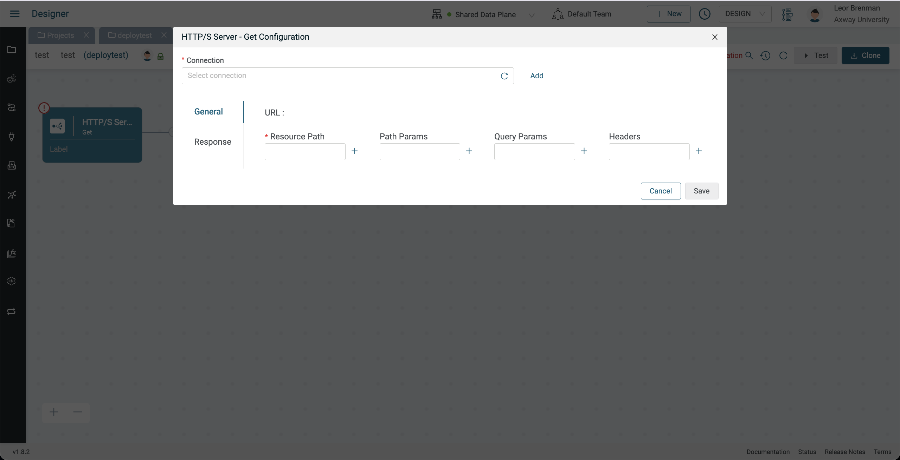
* Click Add to create a new HTTP/S Server Connection (e.g. http server)
* Select `HTTPS` for Protocol and `Token` for Authentication and enter `12345` for the Token and click Update
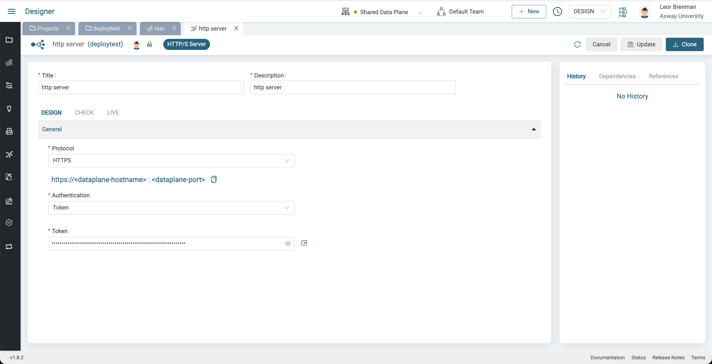
* Return to the integration and click on the HTTP/S Server Get component and click refresh and select the HTTP/S Server Connection you just created
* Enter `test` for the Resource Path
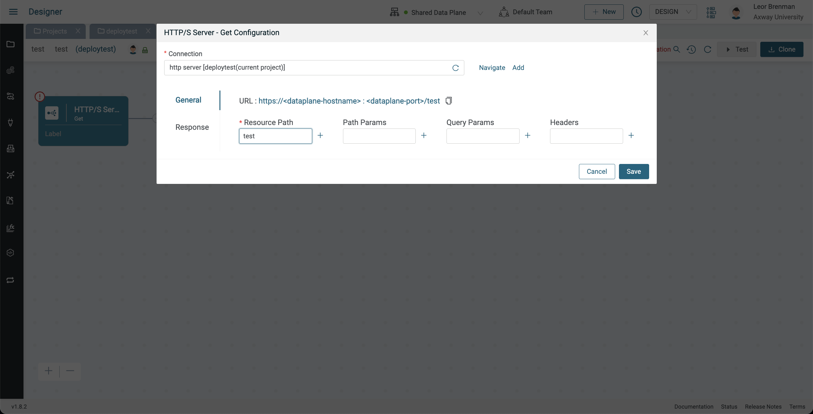
* Click on Response and set Body to `Hello from V1`, set Content Type to `text/plain`, check `Send Response before flow execution` and click Save
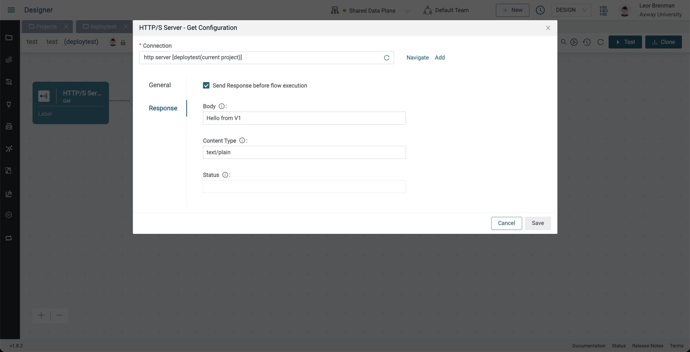
* Enable your integration and copy your URL and call it using curl as follows:
  ```bash
  curl --location '{{YOUR INTEGRATION URL}}/test' --header 'Authorization: Bearer 12345'
  ```
  The response should be `Hello from V1`

Now that our integration is working, let's version it

* Disable the integration
* Click the History button in your Project and click Create New Version
* Enter a commit message (e.g. initial commit) and click Save
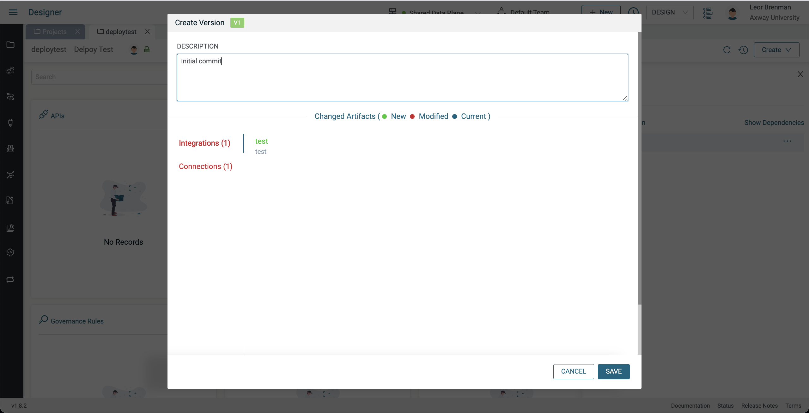
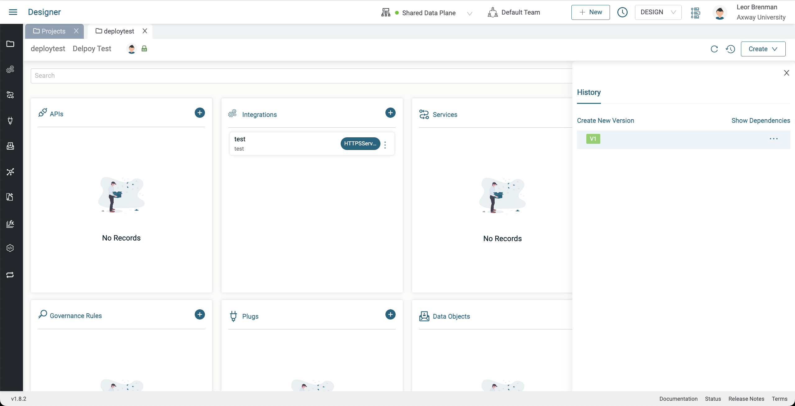

## Lab 2

In this lab, we'll deploy our project to LIVE.

> Note that it is best practice to deploy to CHECK first to perform QA but in this lab, we'll skip this intermediate step and go right to LIVE (production) since the steps are basically the same.

* Click the History button in your Project and click the three dots next to V1 and select deploy
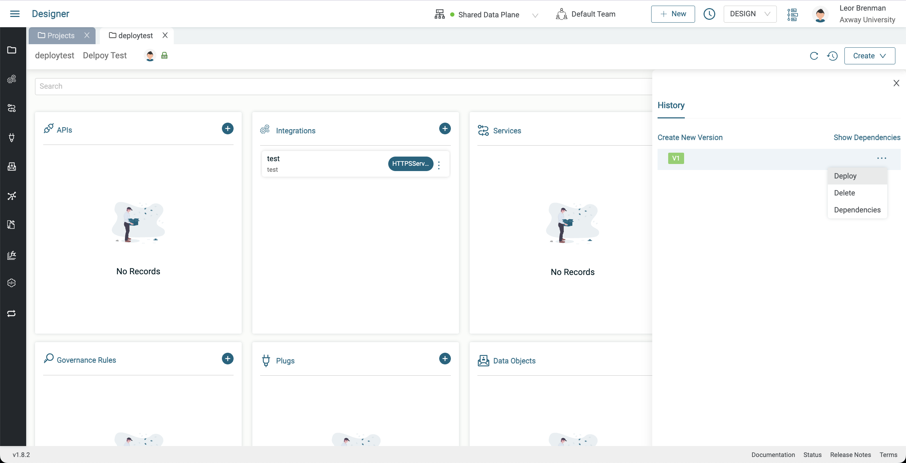
* Enter a Deployment Job name and description (e.g. deploytest_v1_dj) and click on Create Job
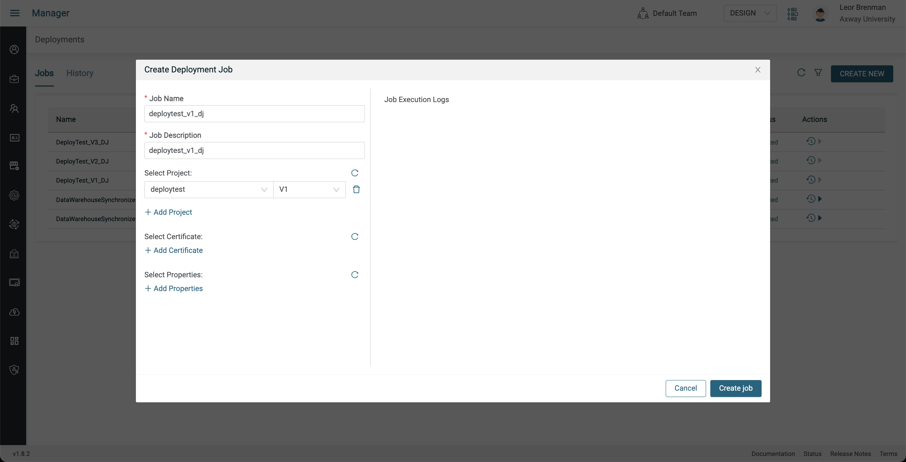
* A new tab will open showing your deployment jobs in the manager module with the deployment job you just created at the top

* Click the Run button under Actions and select LIVE and click Run Now
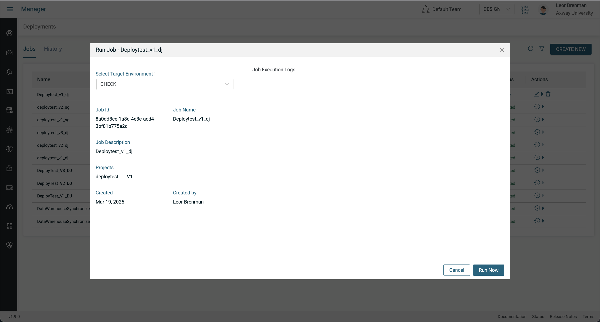

Before we can enable our integration and test it, we need to configure the connection(s) in the project. In this case we have one, the HTTP/S Server connection. We will use the Connection Override feature to accomplish this.

* Switch to the LIVE environment by first closing the Designer tab to make sure you only have one tab open and then click on Live in the Environment picker
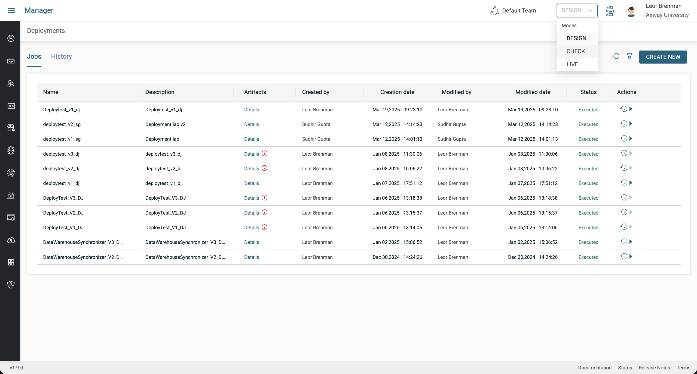
* Select Environments from the Left menu
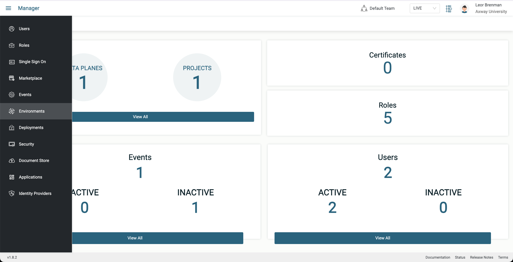
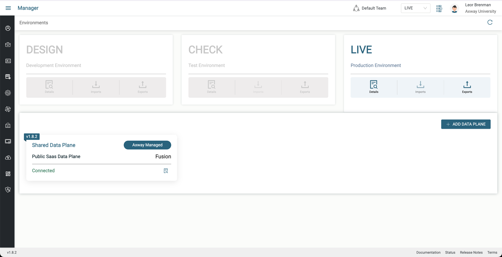
* Click on the Details icon in the Live Environment and then click on Projects
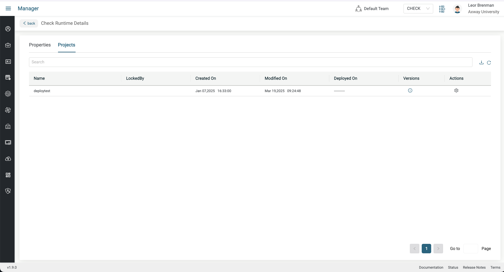
* Click on the Action icon for your project and select the HTTP/S Server Connection and click next
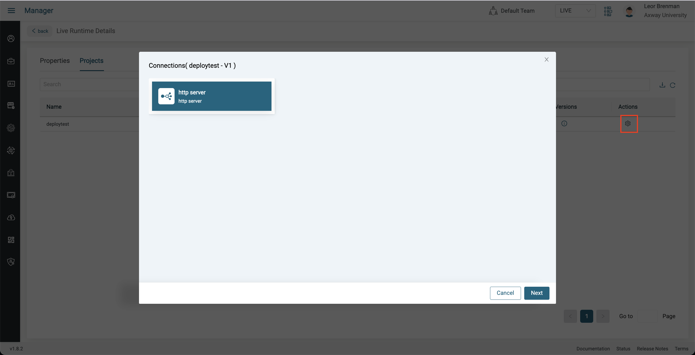
* Click Override and select `HTTPS` for Protocol and `Token` for Authentication and enter `abcde` for the Token and click Update and then click Cancel to dismiss the dialog box
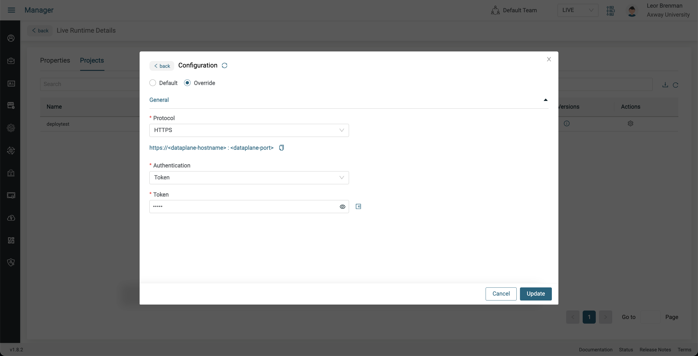

Now we can activate the integration and test it.

* Switch to the Designer module and make sure you are still in LIVE mode
* Open your project and acquire the lock
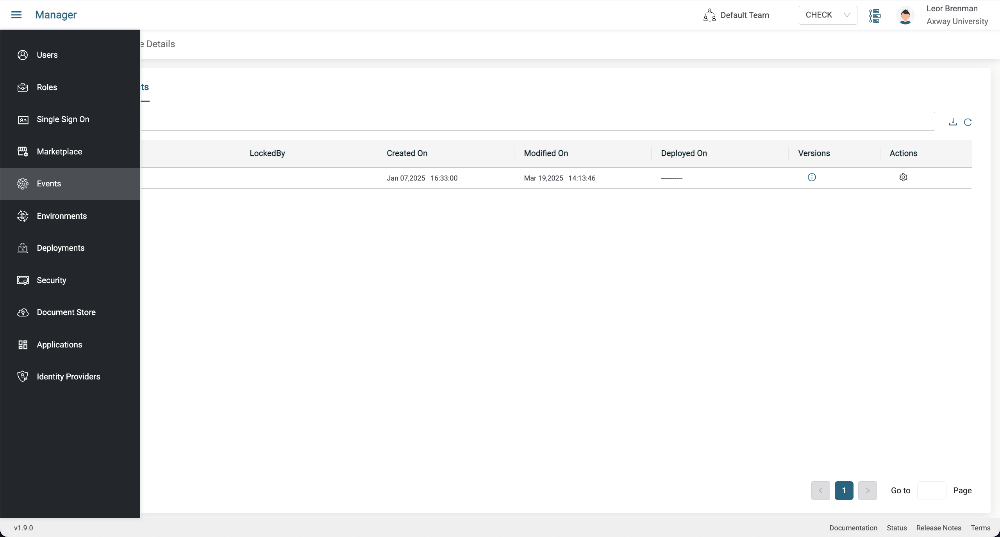
* Open the integration and activate it and copy your URL and call it using curl as follows:
  ```bash
  curl --location '{{YOUR INTEGRATION URL}}/test' --header 'Authorization: Bearer abcde'
  ```
  The response should be `Hello from V1`