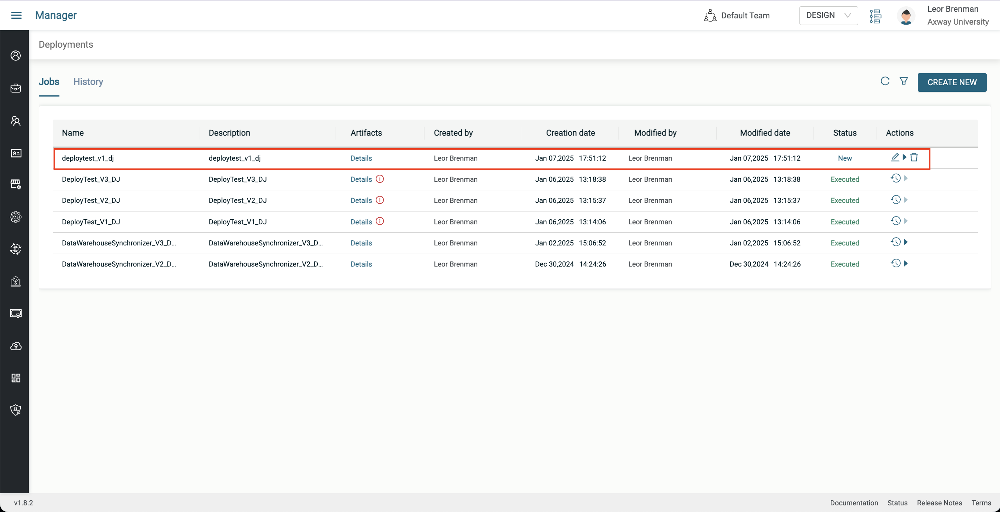
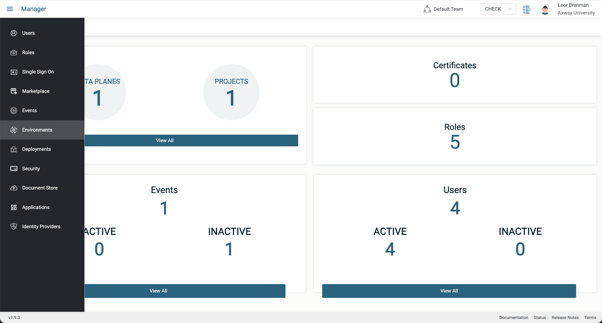
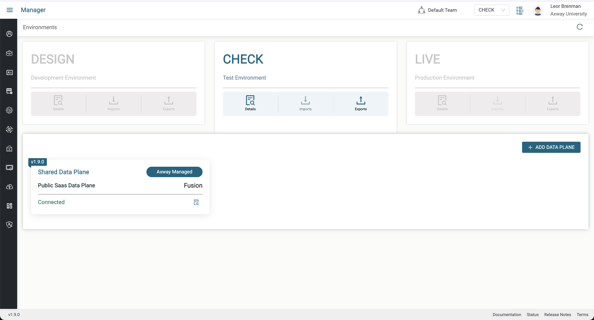
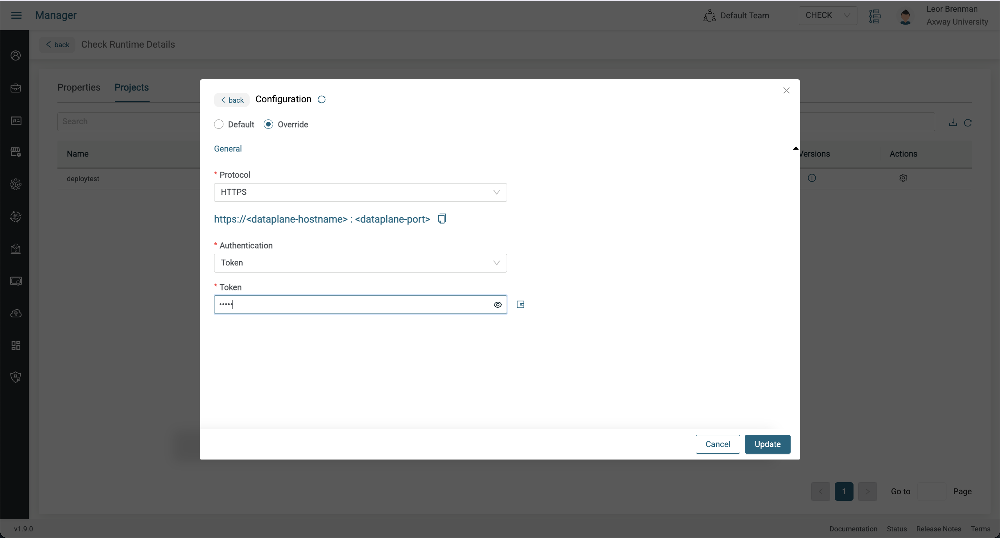

# Deployment Lab

In these labs, we will build a very basic project and integration and version and deploy it. We will also exercise some of the versioning and deployment features. At the end of these labs, you will learn the following:

* How to version a project
* How to deploy a project
* How to override connections
* How to deploy an updated version of a project
* How to rollback a deployment
* How to revert to older version of a project

## Pre-requisites

* Access to Amplify Integration
  > If you do not have an account and need one, please send an email to **[amplify-fusion-training@axway.com](mailto:amplify-fusion-training@axway.com?subject=Amplify%20Fusion%20-%20Training%20Environment%20Access%20Request&body=Hi%2C%0D%0A%0D%0ACould%20you%20provide%20me%20with%20access%20to%20an%20environment%20where%20I%20can%20practice%20the%20Amplify%20Fusion%20e-Learning%20labs%20%3F%0D%0A%0D%0ABest%20Regards.%0D%0A)** with the subject line `Amplify Integration Training Environment Access Request`
* Access to curl (or Postman)
* Completion of the Hello World hands on labs
* Suitable role to create and run deployment jobs
  > **Note**: You will need Manager role privileges to create deployment jobs in Design mode and deploy to CHECK and LIVE and activate your integrations in CHECK and LIVE. If you run into permission issues during deployment, please reach out to your environment administrator to update your role accordingly. Full Manager access or Admin access should be sufficient.

## Lab 1

In this lab we'll create, test and version a very basic integration triggered by an HTTP/S Server GET.

* Create a new Amplify Fusion project for this deployment test. Use a unique name in case you're not the only one doing this lab on your tenant (e.g. XX_deploytest with XX being your name or initials).
* Create an integration (e.g. test)
* Add an HTTP/S Server Get for the Event

* Click Add to create a new HTTP/S Server Connection (e.g. http server)
* Select `HTTPS` for Protocol and `Token` for Authentication and enter `12345` for the Token and click Update

* Return to the integration and click on the HTTP/S Server Get component and click refresh and select the HTTP/S Server Connection you just created
* Enter `test` for the Resource Path.
  > Note that the resource path must be unique for your tenant. Since you are most likely working in a shared environment, you may want to prefix the resource path with your initials to make it unique (e.g. XX_test) \

  > Note that your Resource Path must be unique for your tenant. You can prefix with your initials to help ensure uniqueness (e.g. `lb_test`)
* Click on Response and set Body to `Hello from V1`, set Content Type to `text/plain`, check `Send Response before flow execution` and click Save

* Activate your integration and copy your URL and call it using curl as follows:

  ```bash
  curl "{YOUR INTEGRATION URL}" --header "Authorization: Bearer 12345"
  ```
  The response should be `Hello from V1`

Now that our integration is working, let's version it

* Deactivate the integration
* Click the History button in your Project and click Create New Version
* Enter a version description (e.g. initial commit) and click Save


## Lab 2

In this lab we'll deploy our project to CHECK so that it can be tested by the QA team.

* Click the History button in your Project and click the three dots next to V1 and select deploy

* Enter a Deployment Job name and description (e.g. deploytest_v1_dj) and click on Create Job

* A new tab will open showing your deployment jobs in the manager module with the deployment job you just created at the top

* Click the Run button under Actions and select CHECK and click Run Now


Before we can activate our integration and test it, we need to configure the connection(s) in the project. In this case we have one, the HTTP/S Server connection. We will use the Connection Override feature to accomplish this.

* Switch to the CHECK environment by first closing the Designer tab to make sure you only have one tab open and then click on CHECK in the Environment picker

* Select Environments from the Left menu


* Click on the Details icon in the CHECK Environment and then click on Projects

* Click on the Action icon for your project and select the HTTP/S Server Connection and click next

* Click Override and select `HTTPS` for Protocol and `Token` for Authentication and enter `abcde` for the Token and click Update and then click Cancel to dismiss the dialog box


Now we can activate the integration and test it.

* Select Events from the Manager Module Menu

* Locate your project and click on the activate button

* Click activate on the Shared Data Plane and copy your url

* Call it using curl as follows:
  ```bash
  curl "{YOUR INTEGRATION URL}" --header "Authorization: Bearer abcde"
  ```
  The response should be `Hello from V1`

## Lab 3

In this lab we'll update our integration, version it to v2 and deploy it to CHECK. Many of the steps will be a repeat of what we already did in lab 1 and lab 2.

* Deactivate the integration you just activated and tested
* Switch to the Designer module and switch to DESIGN mode and open your project and integration
* Edit the HTTP/S Server GET component and set the response to `Hello from V2` and save

* Test your project and make sure your response is `Hello from V2`
* Version your project to v2

* Click the 3 dots next to the version and click Deploy
* Give you deployment job a name and description (e.g. deploytest_v2_dj)

* Run your deployment job and select CHECK

* Make sure you have only one tab open and switch to Manager module and CHECK mode
* Open the Events tab and activate your integration and test it and make sure your response is `Hello from V2`

## Lab 4

In this lab we'll roll back the project in CHECK to v1.

Normally, we'd use rollback in Production (LIVE) but we can also perform rollbacks in CHECK. This simulates a scenario where we discover that we have a defect in production and need to quickly revert to prior version.

* Make sure you only have one tab open and while in CHECK mode, deactivate the integration you just activated
* Select DESIGN mode, click Deployments and click on History

* Click on the rollback Action button for your v2 deployment and select your deployment only and click OK


* Since we rolled back our deployment, we will need to redo the Connection override as we did in Lab 2
* Activate your integration and test it and make sure your response is `Hello from V1`

## Lab 5

In this lab we'll revert our project back to v1 in DESIGN, make modifications and then version it to v3 and deploy it to CHECK.

* Deactivate your integration in CHECK
* Make sure you have only one tab open and switch to Designer module and DESIGN mode
* Open your project and click on the history icon and click on the 3 dots next to v1

* Click on Revert to revert to v1
* Follow the instructions in lab 3 and set your response to `Hello from V3` and test it
* Refresh your browser tab and click on the history icon and create a new version V3


* Deploy V3 as we did in lab 3 (e.g. deploytest_v3_dj)

* Activate your integration in CHECK and test it and make sure your response is `Hello from V3`

## Lab 6 - Challenge yourself!

In this lab, you will deploy your V3 project to LIVE without any instructions.

Hints:
* You do not need to create a new deployment job. You can use the V3 deployment job to deploy to LIVE
* You will need to perform a Connection Override for your project in LIVE