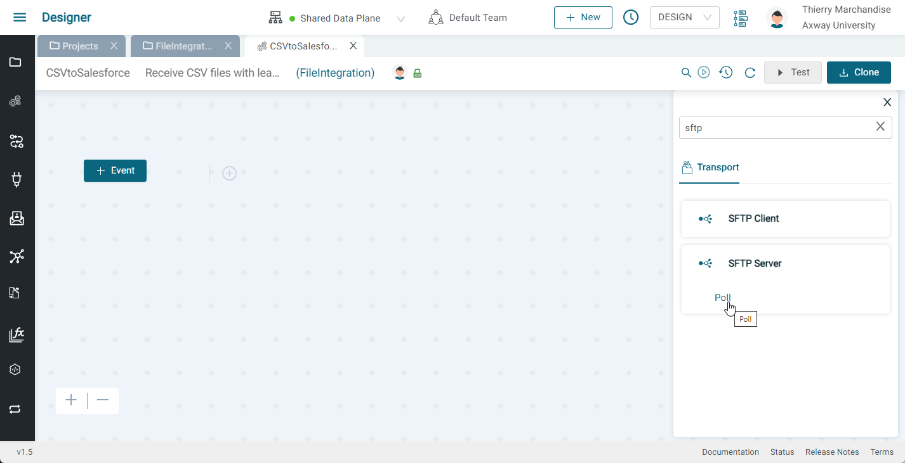
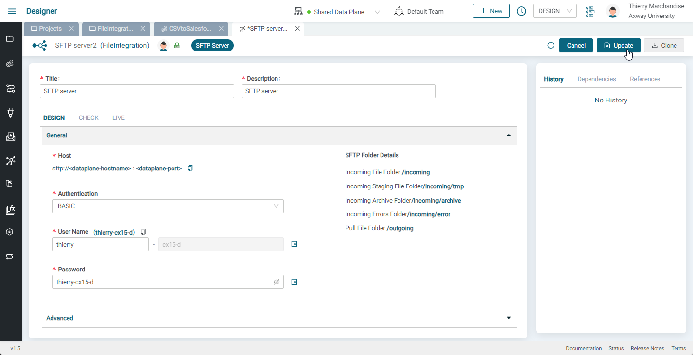
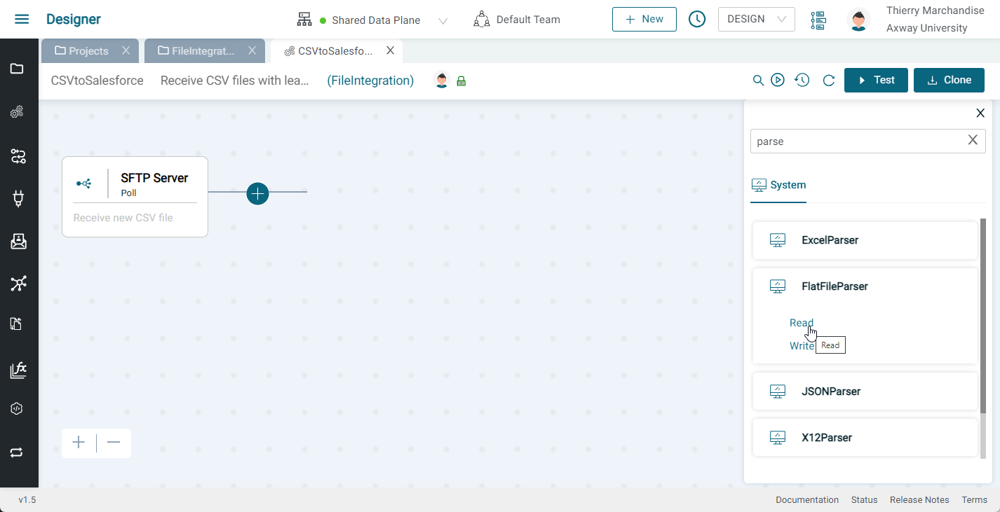
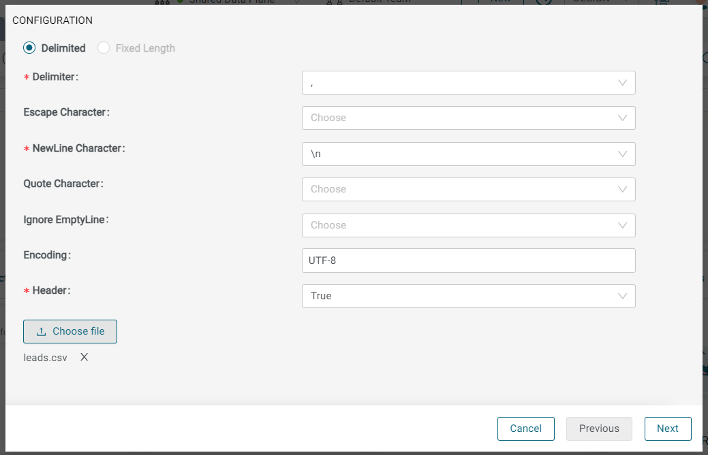
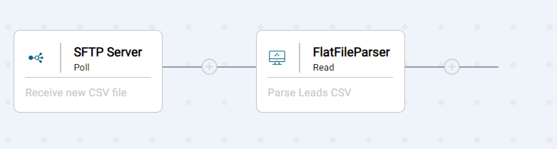
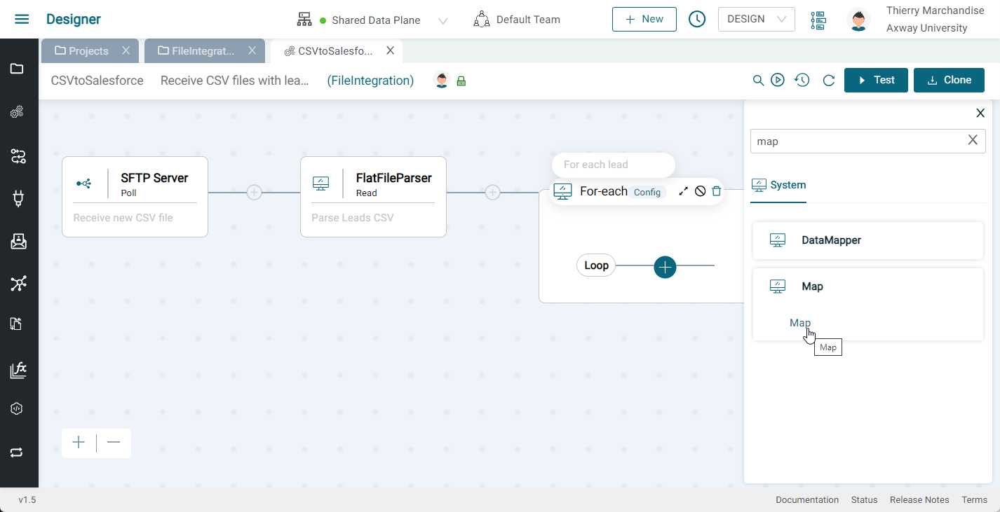
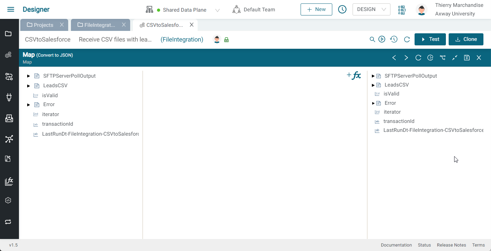
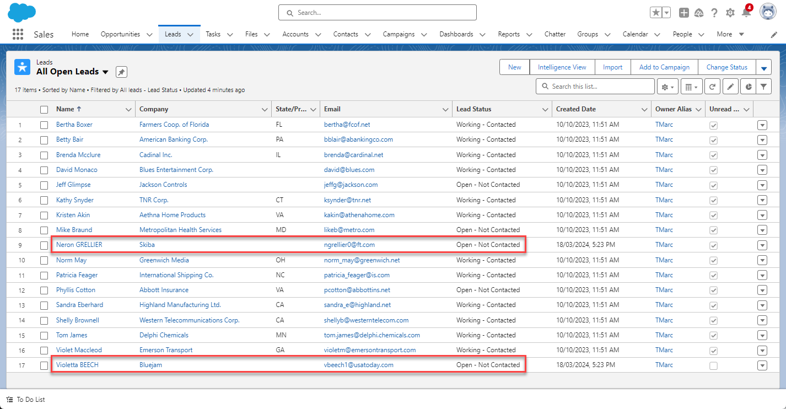

# CSV Leads File Integration Lab

## Introduction

In these labs, we will create an integration that will enable us to SFTP a CSV file of leads and create new Salesforce leads based on the CSV rows. The demo is shown below:


You can download the base Amplify Integration project export [**here**](assets/LBCSVSFTP2SFDC_V4_NoCreds.zip).

The flow is described below:

* Ingest a CSV file (of leads) via an SFTP Ingest Server
* Parse the CSV file
* Loop over the rows and create the leads in SFDC

This data flow is illustrated below:


In this set of labs, you will learn the following:

* How to create an SFTP Server Component
* How to create a Salesforce Connection
* How to use the Salesforce insert Component and associated Plug to create a Salesforce Lead
* How to use the Map component to transform data and use functions

The final integration is shown below:


## Prerequisites

* Access to Amplify Integration
  > If you do not have an account and need one, please send an email to **[amplify-integration-training@axway.com](mailto:amplify-integration-training@axway.com?subject=Amplify%20Integration%20-%20Training%20Environment%20Access%20Request&body=Hi%2C%0D%0A%0D%0ACould%20you%20provide%20me%20with%20access%20to%20an%20environment%20where%20I%20can%20practice%20the%20Amplify%20Integration%20e-Learning%20labs%20%3F%0D%0A%0D%0ABest%20Regards.%0D%0A)** with the subject line `Amplify Integration Training Environment Access Request`
* A **[Salesforce developer instance](https://developer.salesforce.com/signup)**
  > If you already use Salesforce in your organization, don't use your corporate account for this lab and do not use your corporate email address to register for a developer account. Simply register with an alternative email address if you have one. \
  If you don't, and your corporate email provider is Google or Microsoft, you may use email aliases to avoid creating a new email : for instance, if your corporate email is john@axway.com , you can use john+labs@axway.com alias to register an salesforce developer account for your labs.
* An SFTP client, such as FileZilla

## Lab 1

In this lab, we will ingest a CSV file of contacts.

* Create an integration (e.g. csv2sfdc)
* Click on the Event button and select the SFTP Server Poll Component
  
  
* In the Configure Component dialog, click Add to add a new SFTP Server Connection
* Give your Connection a name and description (e.g. SFTP Server)
* Select Basic Authentication, enter a unique username and password, and press Update
  

  > Note: to keep things simple, you can use the same value for username and password. In the screen shot above, I  used lbadmin3-cx2-d for both

* Close the SFTP Server Connection sub tab and return to your integration
* Click on the SFTP Server Poll Component, click refresh and select the newly created SFTP Server Connection from the list. Enter `*.csv` for File Pattern and press Save
  
* Your integration should look like this:
  

Now, let's test the integration.

* Enable the integration by clicking on the toggle switch next to the Test button
* Download the file leads.csv from [**here**](assets/leads.csv)
* Launch your FTP client (e.g. FileZilla) and create a connection to the SFTP Server using the credentials from the Connection and connect to the SFTP server. Select the `/incoming` folder to upload to (as this will trigger your integration)
  
* Upload leads.csv to the `/incoming` folder which will trigger your integration
* Go to the Monitor
  
* Click on the transaction
  
* Click on the SFTP Server Poll step and expand `SFTPServerPollOutput` to see the files->0 node and it's body field to see that your file was ingested
  

## Lab 2

In this lab, we will parse the CSV file of contacts so that we can loop over the rows.

* Disable your integration
* Add a a FlatFile Parser Read component to your integration and expand the bottom panel
  
  
* Click Add to add a Data Object and give it a name (e.g. LeadsCSV) and description
* Select FLAT FILE for the Document Format
  
* Press Configure and select the following
  * Comma (,) for the Delimiter
  * \n for the New Line Character
  * True for the Header
  * Click on Choose File and select leads.csv
    
  * Click Next, Next and Create
  * Close the LeadsCSV subtab
* Back in our FlatFile Parser Read component, click refresh and select the new Data Object you just created
  
* On the left hand side (pipeline in) Expand the `SFTPServerPollOutput` to expose `files -> body` and drag a connection between body and `ffString` under ACTION PROPERTIES and press Save
  
* Your integration should look like this
  
* Enable the integration and upload your CSV file and check the transaction in the monitor to see your delimited rows
  

## Lab 3

In this lab, we will loop over the delimited rows (contacts) and create the leads in Salesforce.

* Continuing from where we left off, disable the integration and add a For-each component, expand it and click the configuration and select `LeadsCSV->delimitedRecords` and press Save
  

  

  
* Add a Map Component inside the For-each loop branch, and expand the bottom panel
  
  
* On the right side, right click on a variable and select Extract
  
* Paste in a sample Salesforce lead and click Copy Node

  ```json
  {
    "FirstName": "Lonni",
    "LastName": "Gadie",
    "Title": "CFO",
    "Email": "lgadie0@reddit.com",
    "Company": "Reallinks",
    "LeadSource": "Partner Referral",
    "Status": "Open - Not Contacted"
  }
  ```

  
* On the ride side, right click on a variable and select Paste and provide a name for your variable (e.g. lead)
  
* Expand LeadsCSV in the left hand panel to expose `delimitedRecords` and it's fields
  
* Let's convert the last name to uppercase by using a function. Click on +fx and search for, and select, the UpperCase function
  
  
  
  * Drag a line from `LeadsCSV->delimitedRecords->last_name` to the UpperCase inputString and a drag a line from the UpperCase output to `leads->LastName`
* Let's convert the email to lowercase by using a function. Click on +fx and search for, and select, the LowerCase function
  * Drag a line from `LeadsCSV->delimitedRecords->email` to the LowerCase inputString and a drag a line from the LowerCase output to `leads->Email`
* Drag a line from `LeadsCSV->delimitedRecords->first_name` to `leads->FirstName`
* Drag a line from `LeadsCSV->delimitedRecords->title` to `Title`
* Drag a line from `LeadsCSV->delimitedRecords->company` to `leads->Company`
* Right click on `leads->LeadStatus` and select SetValue and set the value to `Partner Referral`
* Right click on `leads->Status` and select SetValue and set the value to `Open - Not Contacted` and click Save
  
* Close the bottom panel
* We need to create a Salesforce Connection so follow the instructions [**here**](assets/salesforce-connection.md) to setup a Salesforce Connected OAuth App and an Amplify Integration Salesforce Connection and generate a token and test the connection
  
* Close the Salesforce Connection and return to your Integration
* Click the add button to add a Salesforce insert Component and expand the bottom panel and select the newly created Salesforce Connection that we just created
* We need a Plug that defines the lead insert so click on the Plug Add button and provide a name (e.g. CreateLead) and description and then click on Configure
* Select the Salesforce Connection we just created, Insert for the Actions and Lead for the Objects and select FirstName, LastName, Title, Company, Email, LeadSource and Status for the fields and click Generate and then Save and then close the plug and return to the flow (as we did before)
  
* Select the newly created plug
* Expand the CreateLeadInput ACTION PROPERTY to expose the insert property
* Drag the leads variable we created prior and drag it to the insert property and press Save
  
* Enable the event and test the integration
* This time you should see two new leads added to your Salesforce leads
  

Your final flow should like this:

  
  