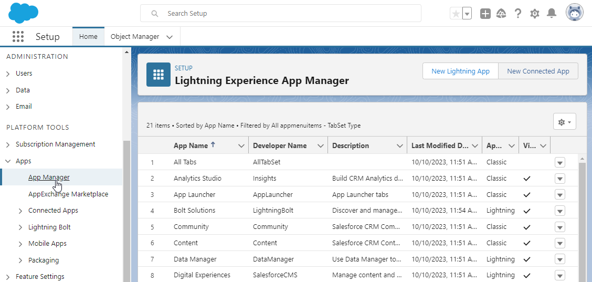
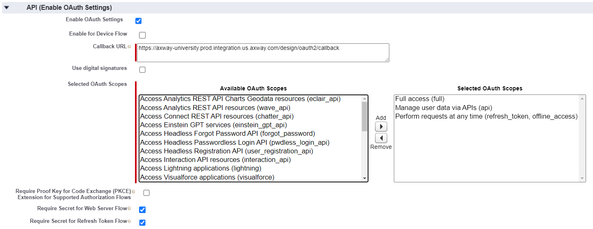
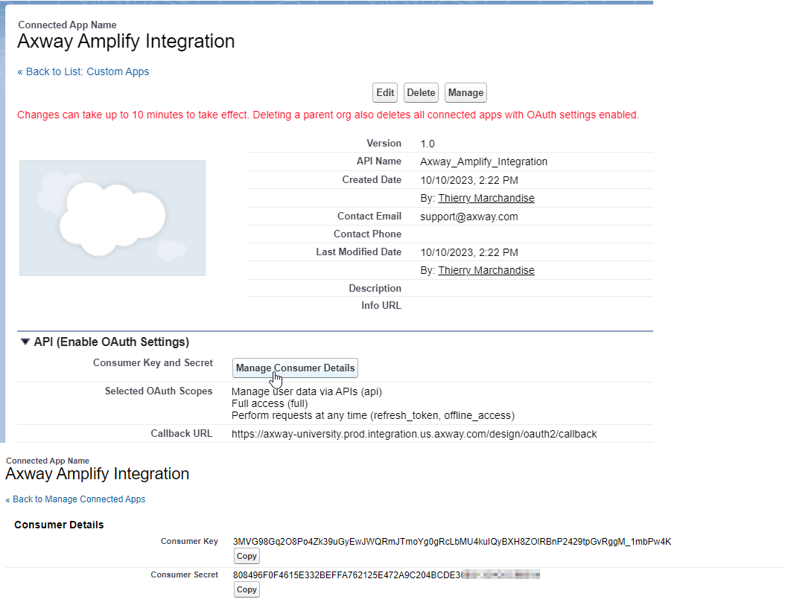
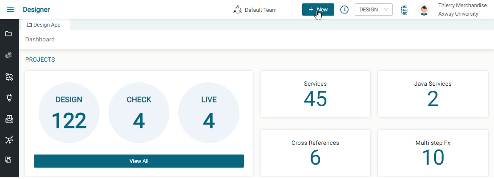
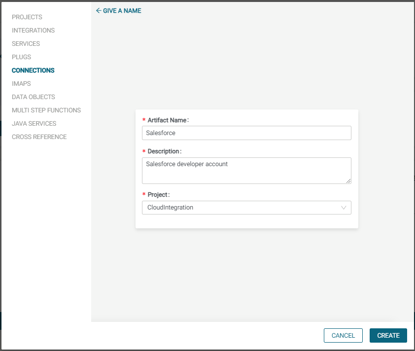
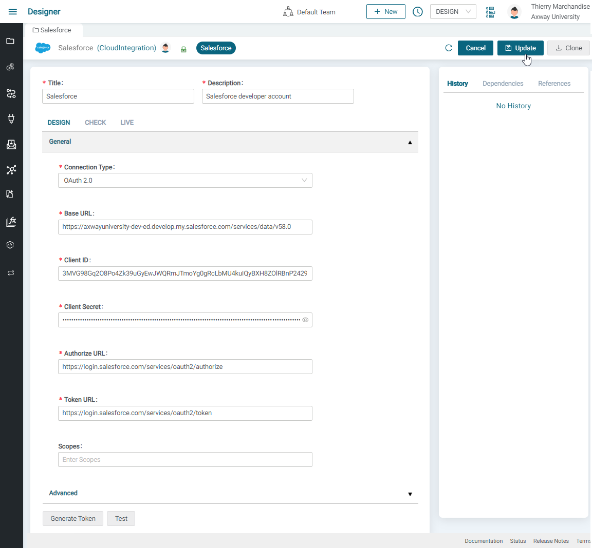
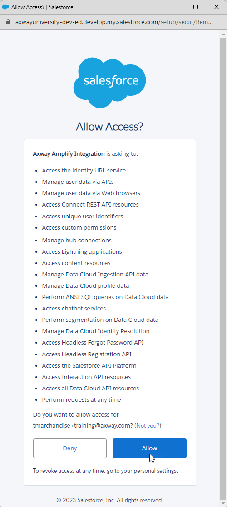
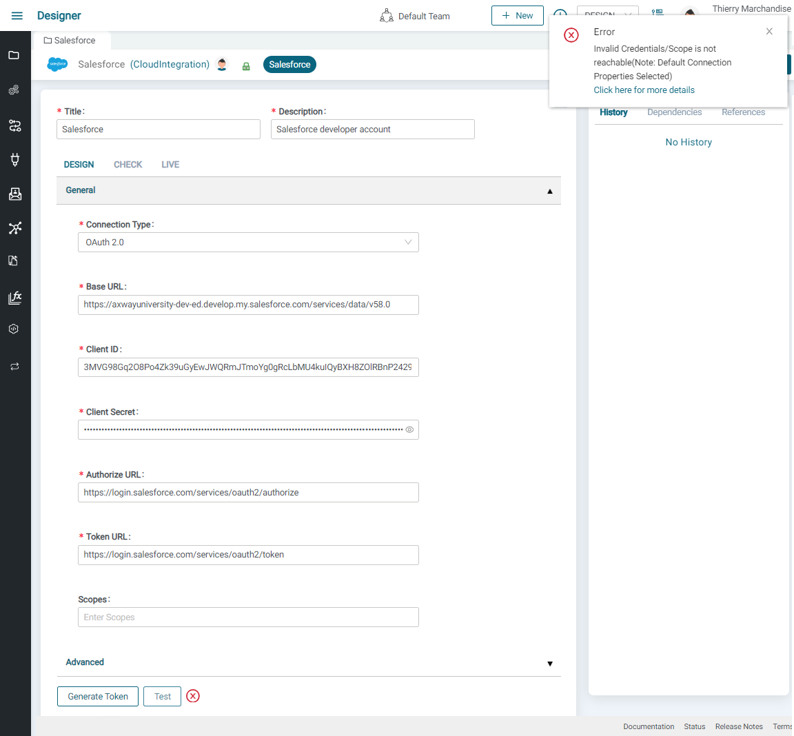

# Salesforce connection guide

## Salesforce Setup

- Sign up for a salesforce account using <https://developer.salesforce.com/.> If you use editions other than developer edition, you will have to request Salesforce support to enable API Access as it's not enabled by default.
  

- Provide all required fields and a valid email address.
  

- Once you click on Sign me up, you will get an email.
  
  

- Verify account by clicking on Verify Account button in the email.

- Set password to your account
  

- Now you are able to login to your salesforce developer account.

- Go to [https://login.salesforce.com](https://login.salesforce.com/).

- Enter your Username and Password click on LogIn.
  

- After Login, you will get verification code to your registered email account. Fill the code and verify.
  

- In the left navigation panel, Under Apps, Click on App Manager to create a new app or edit existing app
  .

- Click New connected App for creating a new app
  

- Fill up the required fields in the Basic Information
  

- Enable OAuth Settings should be checked.

- Enter the Callback URL. For example, if your access URL is [https://test.dxchange.cloud](https://test.dxchange.cloud/), your callback URL will be    <https://test.dxchange.cloud/design/oauth2/callback>

- Choose the following scopes in the Selected available OAuth Scopes.
  - Full access (full)
  - Manage user data via APIs (api)
  - Perform requests at any time (refresh_token, offline_access)

- Save all settings and then click Continue.

- Save the Consumer Key (Client ID) and Consumer Secret (Client Secret) displayed after clicking Continue.
  

- These above details must be used when creating your Salesforce connection on Amplify Integration

## Amplify Integration Setup

- You must configure Salesforce Connection to connect to your Salesforce instance.

- Navigate to **New** in the top right corner.

- Select the **Connections** tab from the left side menu, choose the **Salesforce** connection and then click **Next**.

- Enter the **Name**, **Description**, select the **Project** and then click **Create**.

- To configure the connection, enter the following details:

- Select the OAuth2.0 connection type

- Base URL (Required) --

  - Subdomain -- You can get your domain by clicking on the Avatar on the top right corner of Salesforce application

  - Version -- 46.0, 52.0 etc
    

  - Replace your subdomain and version in the below URL
    `https://{subdomain}.my.salesforce.com/services/data/v{version}`

- ClientID (Required) -- Enter ClientID of the salesforce instance

- Client Secret (Required) -- Enter Client Secret of the salesforce instance, which will be saved in the encrypted format.

- After entering the above details, click **Update** to save the connection details.

- Click on [Generate token] to Allow access. Once token is generated, click on [Test button] as shown below.

- **Note:** A **Green Tick** mark indicates a successful Connection
    Test, while an **Error Popup** indicates wrong connection details as
    shown in the screenshots below. 

