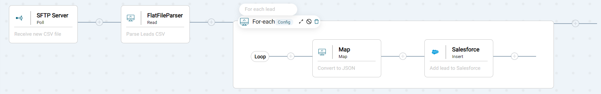
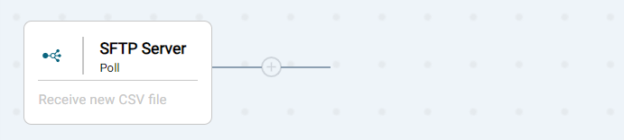
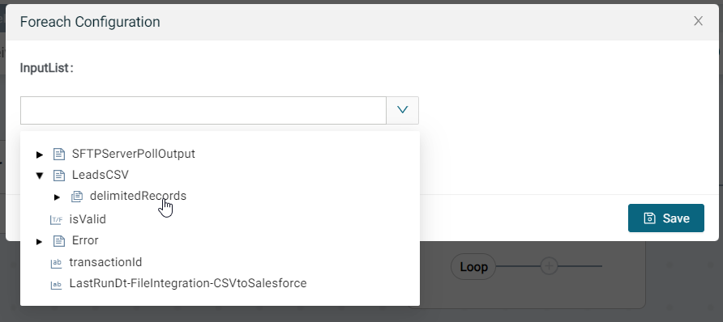
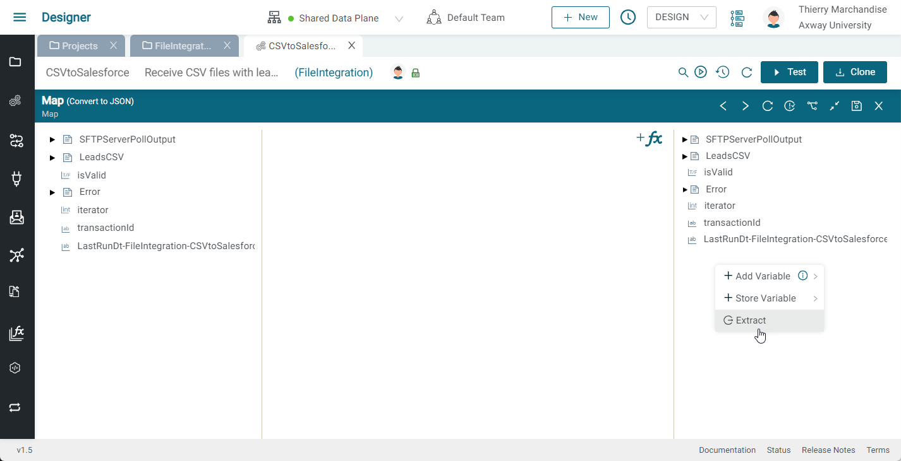
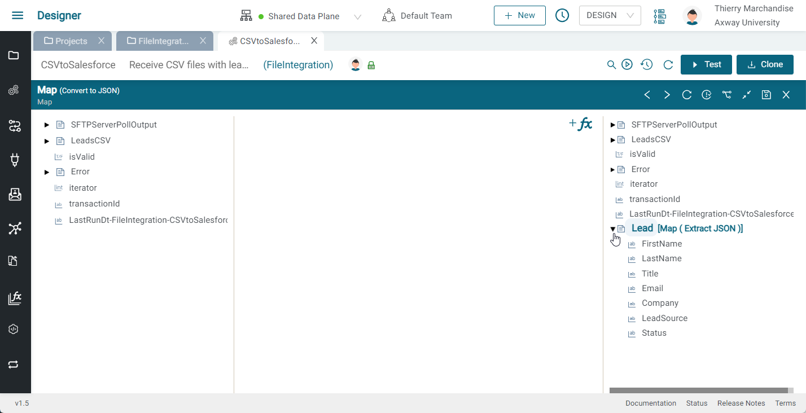
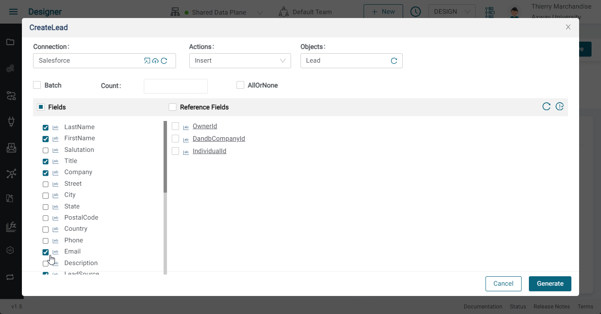

# Intégration de fichier CSV de Leads

## Introduction

Dans cet exercice, nous allons créer une intégration qui nous permettra de transférer un fichier CSV contenants des Leads (aussi appelé Pistes, c’est-à-dire des clients potentiels) via le protocole SFTP, et de créer de nouveaux Leads Salesforce basés sur les champs CSV. La démo est présentée ci-dessous :


Le flux est décrit ci-dessous:

* Ingérer un fichier CSV (de leads) via un serveur d'ingestion SFTP
* Analyser le fichier CSV
* Parcourir les champs et créer les leads sur SFDC

Ce data flow est illustré ci-dessous:


Dans cette exercice, vous allez apprendre à:

* Créer un composant serveur SFTP
* Créer une connexion Salesforce
* Utiliser un composant d'insertion Salesforce et un plug associé pour créer un lead Salesforce
* Utiliser le composant Map pour transformer de la data et utiliser des fonctions

L'intégration finale doit ressembler à ceci:



## Prérequis

* Accès à **Amplify Integration**
  > Si vous n'avez pas de compte, veuillez contacter **[amplify-integration-training@axway.com](mailto:amplify-integration-training@axway.com?subject=Amplify%20Integration%20-%20Training%20Environment%20Access%20Request&body=Hi%2C%0D%0A%0D%0ACould%20you%20provide%20me%20with%20access%20to%20an%20environment%20where%20I%20can%20practice%20the%20Amplify%20Integration%20e-Learning%20labs%20%3F%0D%0A%0D%0ABest%20Regards.%0D%0A)** par mail avec en objet `Amplify Integration Training Environment Access Request`
* Une **instance développeur Salesforce**
  > Si vous n'avez pas d'instance de développeur, les détails pour vous inscrire gratuitement seront fournis dans les étapes ci-dessous.
  > Si vous utilisez déjà Salesforce comme CRM dans votre organisation, n'utilisez pas votre compte d'entreprise pour cet exercice et créez un compte de développeur en n'utilisant pas l'adresse e-mail de votre entreprise comme nom d'utilisateur.
* Un **client SFTP**, tel que [FileZilla](https://filezilla-project.org/download.php?type=client&show_all=1)

## Étape 1

Dans cette étape, nous allons ingérer un fichier CSV de contacts.

* Créer une intégration (par ex: CSVtoSalesforce)
* Cliquer sur Event et sélectionner le composant SFTP Server
  
  
* Dans la boîte de dialogue de configuration du composant, cliquer sur Add pour ajouter une nouvelle connexion au serveur SFTP.
* Donnez un nom unique et une description à votre connexion (par ex: SFTP Server).
* Sélectionner Basic pour l'Authentication, et entrer un username et un password, puis cliquer sur  Update \
    
  > Conseil : pour simplifier les choses, vous pouvez utiliser la même valeur pour le username et le password. Dans la capture d'écran ci-dessus, j'ai utilisé thierry-cx15-d pour les deux.

* Fermer l'onglet SFTP Server Connection et retourner à l'intégration
* Cliquer sur le composant SFTP Server Poll, cliquer sur refresh et sélectionner la connexion SFTP Server tout juste créée. Entrer `*.csv` pour File Pattern, laisser les autres valeurs par défaut et cliquer sur Save.
  
* Votre intégration doit ressembler à ceci: \
  

Testons maintenant l'intégration.

* Activer l'intégration en cliquant sur le bouton play à côté du bouton test et commuter l'interrupteur qui se trouve à côté du data plane
* Une fois activée, passer la souris sur l'icône du lien pour voir l'URL SFTP et copier le lien

* Télécharger le fichier leads.csv [**ici**](../assets/leads.csv)
* Lancez un client FTP (par exemple FileZilla) et créez une connexion SFTP au serveur SFTP en utilisant l'URL que vous venez de copier et les informations d'identification de la connexion et connectez-vous au serveur SFTP (si vous utilisez FileZilla, collez simplement l'URL SFTP dans le premier champ et cliquez sur connexion rapide. Assurez-vous de préfixer l'hôte par `sftp://` puis entrez le mot de passe). Sélectionnez le dossier `/incoming` pour le téléchargergement (c'est ce qui déclenchera votre intégration).
  
* Télécharger leads.csv dans le dossier `/incoming`ce qui déclenchera votre intégration
* Aller sur le Monitor
  
* Cliquer sur la transaction
  
* Cliquer sur l'étape SFTP Server Poll et dérouler`SFTPServerPollOutput` pour voir le node files->0  et son body field pour voir que le file a été ingéré
  
 
## Étape 2

Dans cette étape, nous allons parcourir le fichier CSV des contacts afin d'en parcourir les champs.

* Désactiver l'intégration
* Ajouter un composant FlatFile Parser Read à votre intégration 
  
  
* Cliquer sur Add pour ajouter un Data Object et lui donner un nom (par ex: LeadsCSV) et une description
* Sélectionner FLAT FILE pour le Document Format
  
* Appuyer sur Configure et sélectionner les caractéristiques suivantes:
  * Virgule (,) pour le Delimiter
  * \n pour le New Line Character
  * True pour le Header
  * Cliquer sur Choose File et sélectionner leads.csv
    
  * Cliquer sur Next, Next puis Create
  * Fermer le sous-onglet LeadsCSV 
* De retour sur notre composant FlatFile Parser Read, élargir le panneau inférieur, cliquer sur refresh et sélectionner le nouveau data object tout juste créé
  
* Sur le côté gauche (pipeline in), développer le `SFTPServerPollOutput` pour afficher `files -> body` et tirer une ligne de body à `ffString` sous ACTION PROPERTIES puis appuyer sur Save.
  
* Votre intégration doit ressembler à ceci:
  
* Activez l'intégration et téléchargez votre fichier CSV sur FileZilla, puis vérifiez la transaction dans le Monitor pour voir vos champs délimités.
  

## Étape 3

Dans cette étape, nous allons parcourir les différents champs (contacts) et créer des leads dans Salesforce.

* En continuant là où nous nous sommes arrêtés, désactiver l'intégration et ajouter un composant For-each, le développer et cliquer sur configuration, sélectionner `LeadsCSV->delimitedRecords` et appuyer sur Save.
  

  

  
* Ajouter un composant MAP à l'intérieur de la branche de la boucle For-each, le sélectionner et développer le panneau inférieur.
  
  
* Sur le côté droit, effectuer un clic droit n'importe où et sélectionner Extract
  
* Coller cet exemple de Leads Salesforce puis cliquer sur Copy node

  ```json
  {
    "FirstName": "Lonni",
    "LastName": "Gadie",
    "Title": "CFO",
    "Email": "lgadie0@reddit.com",
    "Company": "Reallinks",
    "LeadSource": "Partner Referral",
    "Status": "Open - Not Contacted"
  }
  ```

  
* Sur le côté droit, effectuer à nouveau un clic droit n'importe où et sélectionner Paste, donner un nom à votre variable (par ex: Leads) puis l'étendre pour voir à l'intérieur.
  
* Dérouler LeadsCSV dans le panneau de gauche pour afficher `delimitedRecords` et ses champs
  
* Procédons maintenant au Mapping entre le format CSV et le format JSON.:
  * Commençons par convertir last name en majuscule en utilisant une fonction
    * Cliquer sur +fx, rechercher la fonction UpperCase puis la sélectionner
    
    
    * Tirer une ligne de `LeadsCSV->delimitedRecords->last_name` à `UpperCase inputString` et tirer une ligne de `UpperCase Output` à `leads->LastName`
    
  * Convertissons l'e-mail en minuscules à l'aide d'une fonction. Cliquer sur +fx, rechercher la fonction LowerCase puis la sélectionner.
  * Tirer une ligne de`LeadsCSV->delimitedRecords->email`à LowerCase inputString et Tirer une ligne de LowerCase output jusqu'à `leads->Email`
  * Tirer une ligne de `LeadsCSV->delimitedRecords->first_name` à  `leads->FirstName`
  * Tirer une ligne de `LeadsCSV->delimitedRecords->title` à `Title`
  * Tirer une ligne de`LeadsCSV->delimitedRecords->company` à `leads->Company`
  * Faire un clic droit sur `leads->LeadSource`, sélectionner SetValue et paramétrer  la valeur à `Partner Referral`
  * Faire un clic droit sur `leads->Status`, sélectionner SetValue et paramétrer la valeur à `Open - Not Contacted` puis cliquer sur Save
  
  * Fermer le panneau inférieur
* Nous avons besoin de créer une connexion Salesforce, pour cela suivre les instructions juste  [**ici**](../fr/salesforce-connection.md) pour configurer une application OAuth connectée à Salesforce, une connexion de type Salesforce, générer un token et tester la connexion.

  
* Fermer la connexion Salesforce et retourner sur l'intégration
* Cliquer sur Add pour ajouter un composant Salesforce Insert, étendre le pannel inférieur et sélectionner la connexion Salesforce tout juste créée 
* Nous avons besoin d'un plug qui définisse l'insertion de leads. Pour cela cliquer sur Add près de Plug et donner un nom (par ex: CreateLead)une description, puis cliquer sur Configurer.
* Sélectionner la connexion Salesforce que nous venons de créer, Insert comme Actions et Lead pour Objects, puis  sélectionner FirstName, LastName, Title, Company, Email, LeadSource et Status pour les Fields. Cliquer sur Generate puis Save et ensuite fermer le plug et retourner au flux (comme fait précédemment).

  
* Sélectionner le plug tout juste crée
* Dérouler CreateLeadInput dans ACTION PROPERTIES pour afficher la propriété insert
* Tirer une ligne de la variable Leads créée précédemment à `insert`, puis appuyer sur Save.
  
* Activer l'event et tester l'intégration
* Cette fois, vous devriez voir deux nouveaux leads ajoutés à vos leads Salesforce
  

L'intégration finale doit ressembler à ceci:

  
