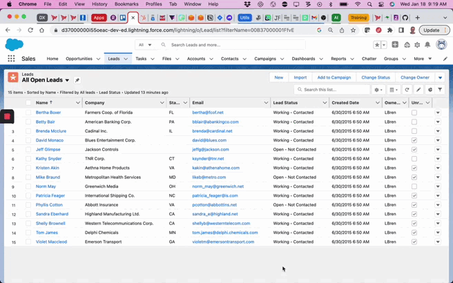
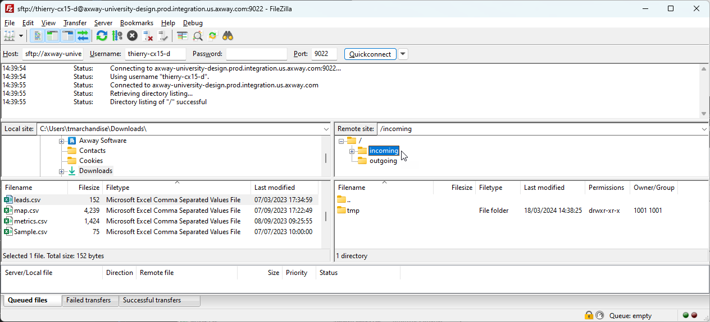
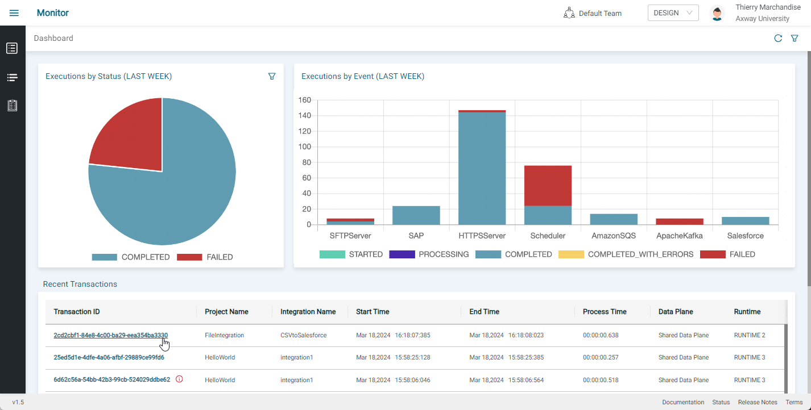
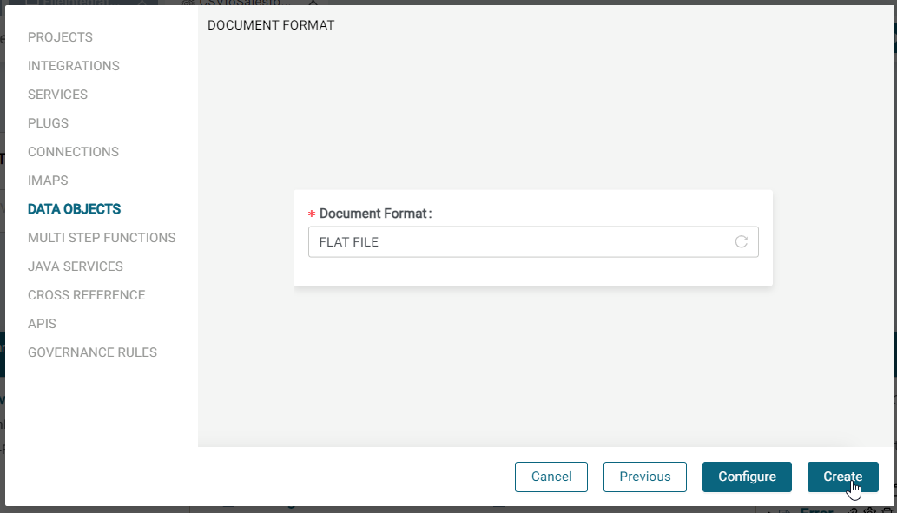
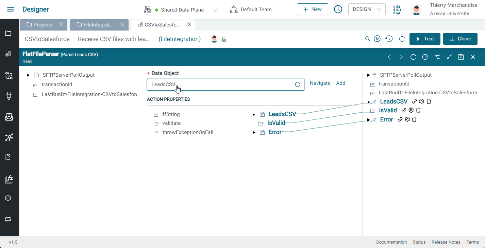
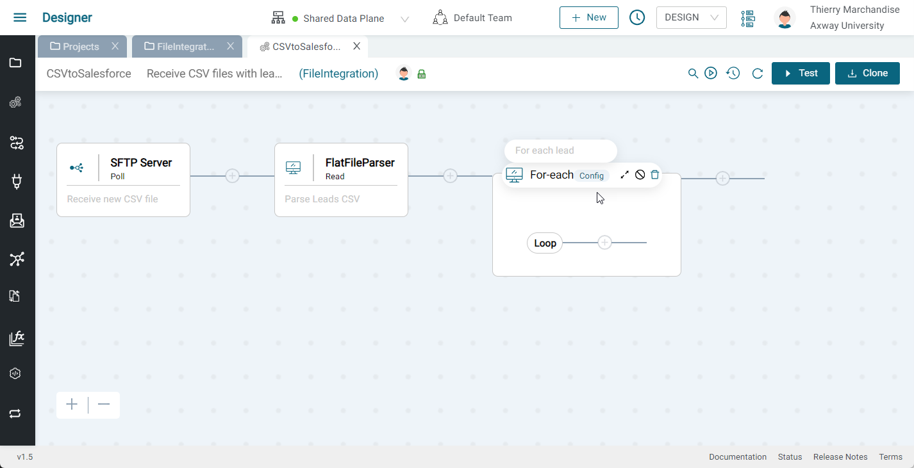
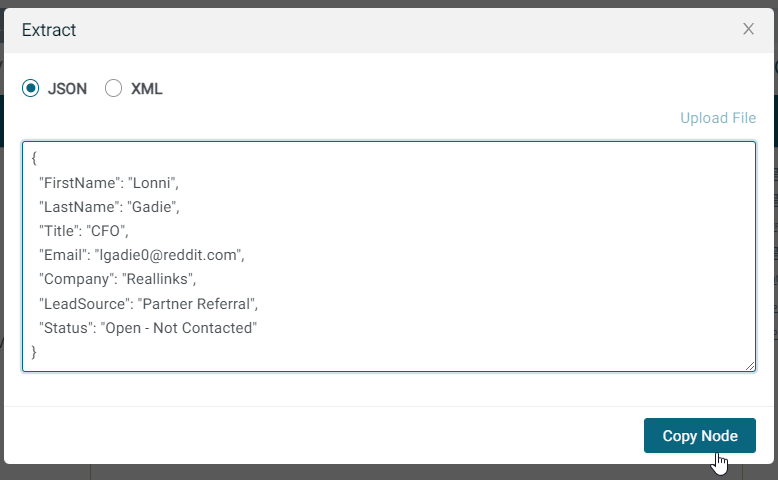
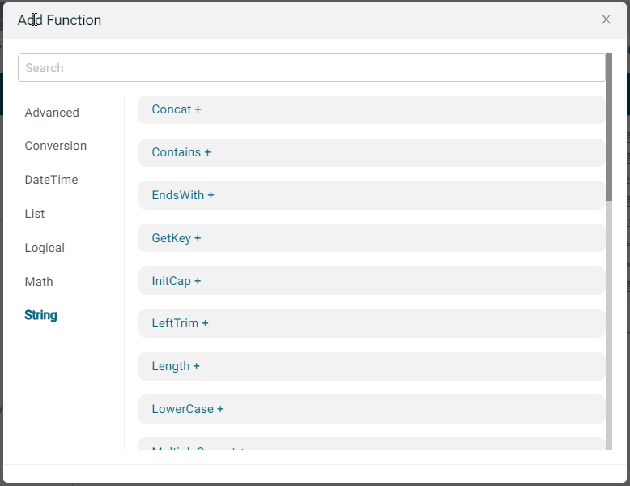
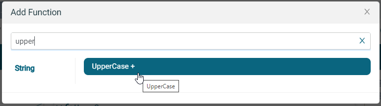

# Lab CSV Leads File Integration 

## Introduction

Dans cet exercice, nous allons créer une intégration qui nous permettra de SFTP un fichier CSV de prospects et de créer de nouveaux prospects Salesforce basés sur les lignes CSV. La démo est présentée ci-dessous :



Le flux est décrit ci-dessous:

* Ingérer un fichier CSV (de leads) via un serveur d'ingestion SFTP
* Analyser le fichier CSV
* Parcourir les lignes et créer les leads sur SFDC

Ce data flow est illustré ci-dessous:


Dans cette sessions d'exercices, vous allez apprendre à:

* Créer un composant serveur SFTP
* Créer une connexion Salesforce
* Utiliser un composant d'insertion Salesforce et un plug associé pour créer un lead Salesforce
* Utiliser le composant Map pour transformer de la data et utiliser des fonctions

L'intégration finale doit ressembler à ceci:


## Prérequis

* Accès à **Amplify Integration**
  > Si vous n'avez pas de compte, veuillez contacter **[amplify-integration-training@axway.com](mailto:amplify-integration-training@axway.com?subject=Amplify%20Integration%20-%20Training%20Environment%20Access%20Request&body=Hi%2C%0D%0A%0D%0ACould%20you%20provide%20me%20with%20access%20to%20an%20environment%20where%20I%20can%20practice%20the%20Amplify%20Integration%20e-Learning%20labs%20%3F%0D%0A%0D%0ABest%20Regards.%0D%0A)** par mail avec en objet `Amplify Integration Training Environment Access Request`
* Une **instance de développeur Salesforce**
  > Si vous n'avez pas d'instance de développeur, les détails pour vous inscrire gratuitement seront fournis dans les étapes ci-dessous.
  > Si vous utilisez déjà Salesforce comme CRM dans votre organisation, n'utilisez pas votre compte d'entreprise pour cet exercice et créez un compte de développeur en n'utilisant pas l'adresse e-mail de votre entreprise comme nom d'utilisateur.
* Un **client SFTP**, tel que [FileZilla](https://filezilla-project.org/download.php?type=client&show_all=1)

## Etape 1

Dans cette étape, nous allons ingérer un fichier CSV de contacts.

* Créer une intégration (par ex: CSVtoSalesforce)
* Cliquer sur event et sélectionner le composant SFTP Server
  
  
* Dans la boîte de dialogue de configuration du composant, cliquer sur Add pour ajouter une nouvelle connexion au serveur SFTP.
* Donnez un nom et une description à votre connexion (par ex: Serveur SFTP).
* Sélectionner Basic Authentication, et entrer un unique nom username et password, puis cliquer sur  Update \
    
  > Conseil : pour simplifier les choses, vous pouvez utiliser la même valeur pour le username et le password. Dans la capture d'écran ci-dessus, j'ai utilisé thierry-cx15-d pour les deux.

* Fermer l'onglet SFTP Server Connection et retourner à l'intégration
* Cliquer sur le composant SFTP Server Poll, cliquer sur refresh et sélectionner la connexion SFTP Server nouvellement créée dans la liste. Entrer `*.csv` pour File Pattern, laissez les autres valeurs par défaut et cliquer sur Save.
  
* Votre intégration doit ressembler à ceci: \
  

Testons maintenant l'intégration.

* Activer l'intégration en cliquant sur le bouton play à côté du bouton test et Activate the integration by clicking on the play button next to the Test button et commuter l'interrupteur qui se trouve à côté du data plane
* Une fois activé, passez la souris sur l'icône du lien pour voir l'URL SFTP et copiez le lien

* Télécharger le fichier leads.csv from [**here**](assets/leads.csv)
* Lancez votre client FTP (par exemple FileZilla) et créez une connexion SFTP au serveur SFTP en utilisant l'URL que vous venez de copier et les informations d'identification de la connexion et connectez-vous au serveur SFTP (si vous utilisez FileZilla, collez simplement l'URL SFTP dans le premier champ et cliquez sur connexion rapide. Assurez-vous de préfixer l'hôte par `sftp://` puis entrez le mot de passe). Sélectionnez le dossier `/incoming` pour le téléchargergement (c'est ce qui déclenchera votre intégration).
  
* Télécharger leads.csv dans le dossier `/incoming`ce qui déclenchera votre intégration
* Aller sur le Monitor
  
* Cliquer sur Transaction
  
* Cliquer sur l'étape SFTP Server Poll et dérouler`SFTPServerPollOutput` pour voir le node files->0  et son body field pour voir que le file a été ingéré
  

## Etape 2

Dans cette étape, nous allons parcourir le fichier CSV des contacts afin d'en parcourir les lignes.

* Désactiver l'intégration
* Ajouter un composant FlatFile Parser Read à votre intégration 
  
  
* Cliquer sur Add pour ajouter un Data Object et lui donner un nom (par ex: LeadsCSV) et une description
* Sélectionner FLAT FILE pour le Document Format
  
* Appuyer sur Configure et sélectionner les caractéristiques suivantes:
  * Virgule (,) pour le Delimiter
  * \n pour le New Line Character
  * True pour le Header
  * Cliquer sur Choose File et sélectionner leads.csv
    
  * Cliquer sur Next, Next puis Create
  * Fermer le sous-onglet LeadsCSV 
* De retour dans notre composant FlatFile Parser Read, élargissez le panneau inférieur, cliquez sur refresh et sélectionnez le nouveau data object que vous venez de créer
  
* Sur le côté gauche (pipeline in), développer le `SFTPServerPollOutput` pour afficher `files -> body` et faire glisser une connexion entre body et `ffString` sous ACTION PROPERTIES puis appuyer sur Save.
  
* Votre intégration doit ressembler à ceci:
  
* Activez l'intégration et téléchargez votre fichier CSV, puis vérifiez la transaction dans le Monitor pour voir vos lignes délimitées.
  

## Etape 3

Dans cette étape, nous allons parcourir les lignes délimitées (contacts) et créer des leads dans Salesforce.

* En continuant là où nous nous sommes arrêtés, désactiver l'intégration et ajouter un composant For-each, le développer et cliquer sur configuration, sélectionner `LeadsCSV->delimitedRecords` et appuyer sur Save.
  

  

  
* Ajouter un composant MAP à l'intérieur de la branche de la boucle For-each, le sélectionner et développer le panneau inférieur.
  
  
* Sur le côté droit, effectuer un clique droit n'importe où et sélectionner Extract
  
* Coller un exemple de Lead Salesforce et cliquer sur Copy node

  ```json
  {
    "FirstName": "Lonni",
    "LastName": "Gadie",
    "Title": "CFO",
    "Email": "lgadie0@reddit.com",
    "Company": "Reallinks",
    "LeadSource": "Partner Referral",
    "Status": "Open - Not Contacted"
  }
  ```

  
* Sur le côté droit, effectuer à nouveau un clique droit n'importe où et sélectionner Paste, donner un nom à votre variable (par ex: Lead) puis l'étendre pour voir à l'intérieur.
  
* Dérouler LeadsCSV dans le panneau de gauche pour afficher `delimitedRecords` et ses champs
  
* Procédons maintenant au Mapping entre le format CSV et le format JSON.:
  * Commençons par convertir last name en majuscule en utilisant une fonction
    * Cliquer sur +fx, rechercher la fonction UpperCase puis la sélectionner
    
    
    * Faire glisser une ligne de `LeadsCSV->delimitedRecords->last_name` jusque UpperCase inputString et faire glisser une ligne de UpperCase output jusqu'à `leads->LastName`
    
  * Convertissons l'e-mail en minuscules à l'aide d'une fonction. Cliquez sur +fx, recherchez la fonction LowerCase et sélectionnez-la.
    * Faire glisser une ligne de`LeadsCSV->delimitedRecords->email`à LowerCase inputString et Faire glisser une ligne de LowerCase output jusqu'à `leads->Email`
  * Faire glisser une ligne de `LeadsCSV->delimitedRecords->first_name` à  `leads->FirstName`
  * Faire glisser une ligne de `LeadsCSV->delimitedRecords->title` à `Title`
  * Faire glisser une ligne de`LeadsCSV->delimitedRecords->company` à `leads->Company`
  * Faire un clique droit sur `leads->LeadSource` et sélectionner SetValue et paramètrer  la valeur à `Partner Referral`
  * Faire un clique droit sur `leads->Status`, sélectionner SetValue et régler la valeur à `Open - Not Contacted` puis cliquer sur Save
  
  * Fermer le panneau inférieur
* We need to create a Salesforce Connection so follow the instructions [**here**](assets/salesforce-connection.md) to setup a Salesforce Connected OAuth App and an Amplify Integration Salesforce Connection and generate a token and test the connection
  
* Close the Salesforce Connection and return to your Integration
* Click the add button to add a Salesforce insert Component and expand the bottom panel and select the newly created Salesforce Connection that we just created
* We need a Plug that defines the lead insert so click on the Plug Add button and provide a name (e.g. CreateLead) and description and then click on Configure
* Select the Salesforce Connection we just created, Insert for the Actions and Lead for the Objects and select FirstName, LastName, Title, Company, Email, LeadSource and Status for the fields and click Generate and then Save and then close the plug and return to the flow (as we did before)
  
* Select the newly created plug
* Expand the CreateLeadInput ACTION PROPERTY to expose the insert property
* Drag the leads variable we created prior and drag it to the insert property and press Save
  
* Activate the event and test the integration
* This time you should see two new leads added to your Salesforce leads
  

Your final flow should like this:

  
