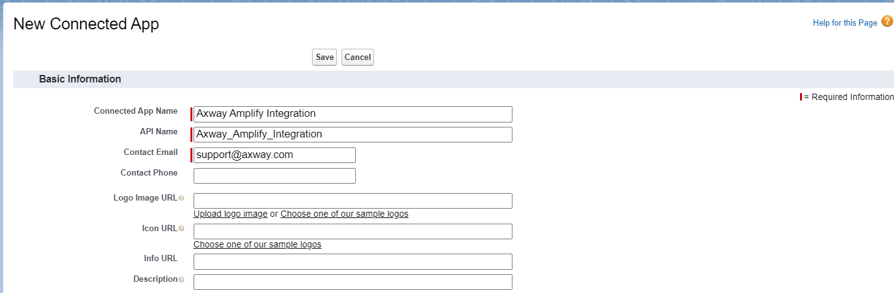
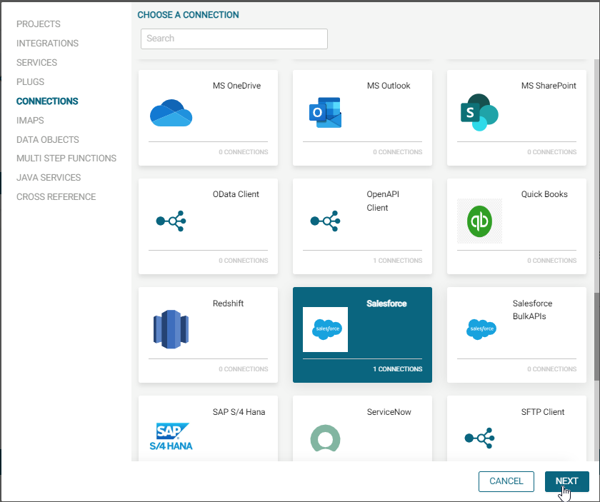

# Guide de connexion Salesforce

## Configuration de Salesforce

- Si vous avez déja un compte Salesforce de dévelopeur ou un compte test, assurez-vous qu'il s'agisse d'une édition pour développeurs ou que l'accès à l'API a été activé et que vous disposez des droits d'administrateur
- Dans les autres cas, vous pouvez **créer** un nouveau compte développeur Salesforce gratuitement sur <https://developer.salesforce.com/signup>
  - Précisez tous les champs nécessaires et fournissez une adresse e-mail valide. \
  Assurez vous d'utiliser un nom d'utilisateur propre à l'exercice, et **différent de votre adresse e-mail professionnelle** dans le cas où vous utiliseriez Salesforce au sein de votre entreprise. \
  

  - Une fois que vous aurez cliqué sur **Sign me Up**, vous recevrez un email avec votre nom d'utilisateur Salesforce et votre URL (cela peut prendre quelques minutes) \
  

  - Vérifiez votre compte en cliquant sur **Verify Account** dans le mail.

  - Créez un mot de passe \
  

  - Vous pouvez maintenant vous connecter à votre compte de développeur Salesforce.

- Rendez vous sur [https://login.salesforce.com](https://login.salesforce.com/),  entrez votre nom d'utilisateur et votre mot de passe puis cliquez sur **Log In**. \
  

- Ouvrez le menu **Setup** \
  

- Sous **Apps**, cliquez sur **App Manager** puis cliquez sur  **New connected App** pour créer une nouvelle application \
  .

- Remplissez les champs nécessaires dans **Basic Information** \
  

- Cochez  **Enable OAuth Settings** puis:
  - Entrez le **Callback URL**. Par exemple, si votre URL Amplify Integration est `https://axway-university.integration.us.axway.com`, votre callback URL pour générer les tokens sera `https://axway-university.integration.us.axway.com/design/oauth2/callback`.
  - Choisissez les scopes suivants dans **Available OAuth Scopes** et **Ajoutez** les aux **Selected OAuth Scopes** .
    - Full access (full)
    - Manage user data via APIs (api)
    - Perform requests at any time (refresh_token, offline_access)

  - Assurez vous de désactiver l'extension PKCE. Laissez les autres options 'Require Secret' activés.

  

- Cliquez sur **Save** pour sauvegarder l'application, puis sur **Continue**.

- Cliquez sur **Manage Consumer Details**, puis copiez la **Consumer Key** et le  **Consumer Secret** ou gardez la page ouverte pour plus tard. Ces informations seront nécessaires lors de la création de votre connexion Salesforce sur Amplify Integration \
  

## Configuration sur Amplify Integration

Nous devons configurer une connexion Salesforce pour relier Amplify Integration à votre instance Salesforce. 

- Depuis Amplify Integration, cliquez sur **New**, en haut à droite \

- Sélectionnez **Connections** dans le menu de gauche. Choisir la connexion **Salesforce** puis cliquez sur **Next**. \

- Entrez un **Name**, une **Description**, sélectionnez le  **Project** puis cliquez sur **Create**. \

- Pour configurer la connexion, entrez les détails suivants:\

  - Connection Type: **OAuth2.0** 

  - Base URL:  **https://{subdomain}.my.salesforce.com/services/data/v{version}**. Remplacez le {subdomain} et la {version} comme suit: 

    - Subdomain: Vous pouvez obtenir votre subdomain en cliquant sur l'avatar dans le coin supérieur droit de l'application Salesforce et en copiant ce qui précède ".my.saleforce.com"
      

    - Version: (46.0, 57.0 etc)  Vous pouvez obtenir les versions d'API disponibles en appelant le service <https://{subdomain}.my.salesforce.com/services/data> depuis votre navigateur

  - ClientID: Collez la Consumer Key de l'app Salesforce
  - Client Secret: Collez le Consumer Secret de l'app Salesforce, elle sera enregistrée dans un format encrypté

- Après avoir renseigné ces détails, cliquez sur **Update** pour enregistrer les détails de la connexion 

- Cliquez sur [Generate token] pour autoriser l'accès. Une fenêtre pop-up devrait apparaître pour vous demander d'autoriser certains accès. \

- Une fois le token généré, cliquez sur **Test** \

- Une  indique un test de connexion réussi, tandis qu'une  indique un échec de connexion. Une fenêtre pop-up devrait vous donner les détails en cas d'erreur.
