# Hello World Lab

In these labs, we will start from the scratch and build some very basic integrations.
At the end of these labs, you will learn the following:

* Two ways to trigger an integration (Webhook and Scheduler)
* How to view the integration execution
* How to enable/disable integrations
* The HTTP/S Server event trigger and the HTTP/S Client and if-else Components
* How to create an HTTP/S Server and HTTP/S Client Connection
* How to use the drag and drop features to configure components

As you go through the labs, take the time to explore more about the items related to what you are working on. For example, when you are instructed to add an if-else component, explore what other components are available.

## Pre-requisites

* Access to Amplify Fusion
  > If you do not have an account and need one, please send an email to **[amplify-fusion-training@axway.com](mailto:amplify-fusion-training@axway.com?subject=Amplify%20Fusion%20-%20Training%20Environment%20Access%20Request&body=Hi%2C%0D%0A%0D%0ACould%20you%20provide%20me%20with%20access%20to%20an%20environment%20where%20I%20can%20practice%20the%20Amplify%20Fusion%20e-Learning%20labs%20%3F%0D%0A%0D%0ABest%20Regards.%0D%0A)** with the subject line `Amplify Fusion Training Environment Access Request`
* Access to [**Webhook.site**](https://webhook.site/) that you can use to send API requests to for analysis. You can alternatively use an equivalent tool such as [**typedwebhook**](https://typedwebhook.tools/) or others that you may prefer.

## Logging In

* Login into Amplify Studio

  

* Click on Designer

  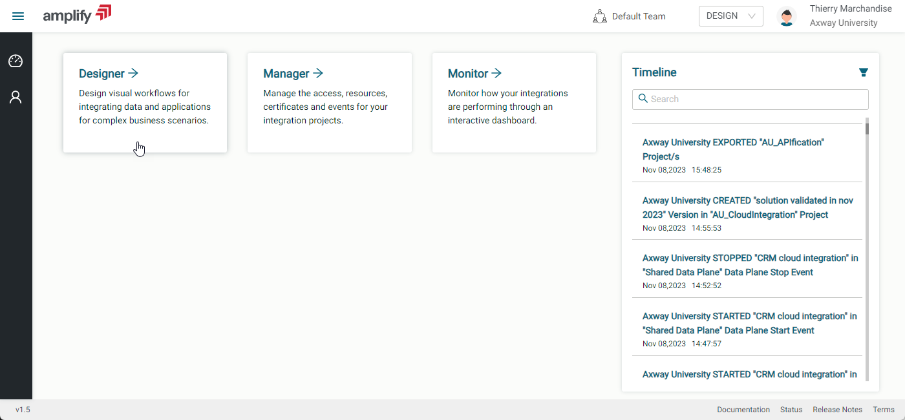

* Expand the menu panel on the left

  

* Select Projects

  

* Click on Create to start a new Project for Amplify Fusion

  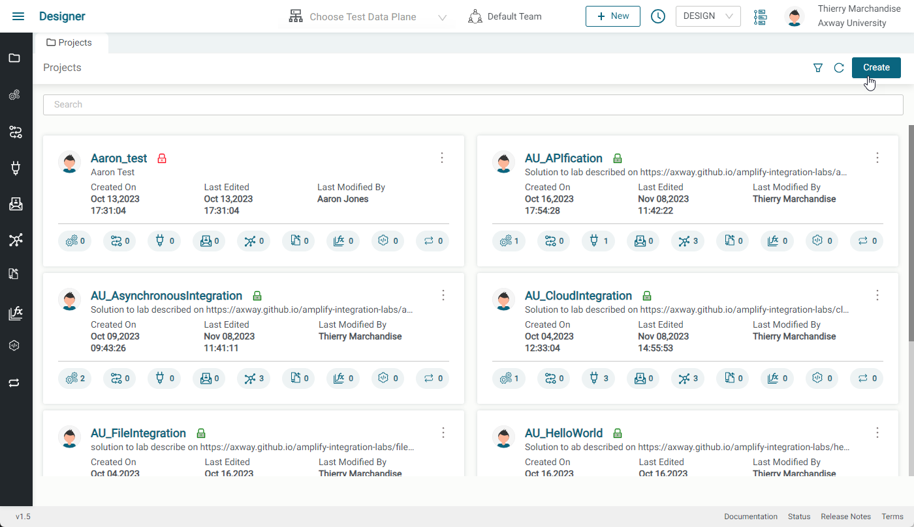

* This is where we will do our design work

  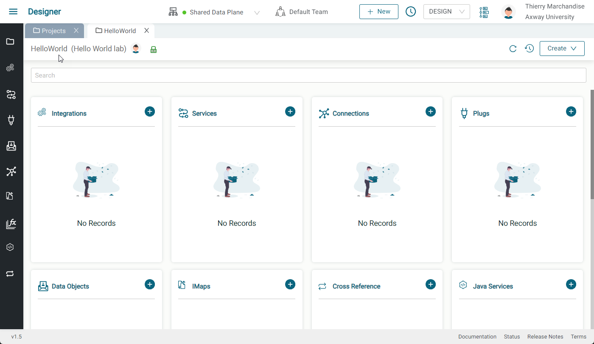

The labs below are intended to be exploratory. Instructions are provided but you will need to figure out how to accomplish them.

## Lab 1

In this lab, we'll create an integration that is triggered using a Scheduler and test it.

* Create an integration
* Add Scheduler trigger
  
  
  
* Choose a test data plane (if not set yet on the top bar)
  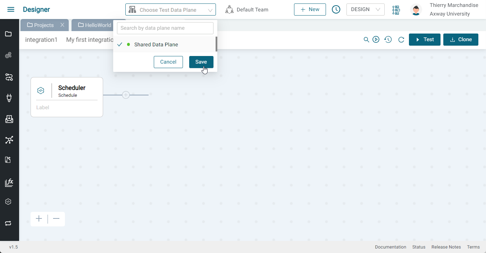
* Click test
* See transaction in monitor (or refresh until you see it)
  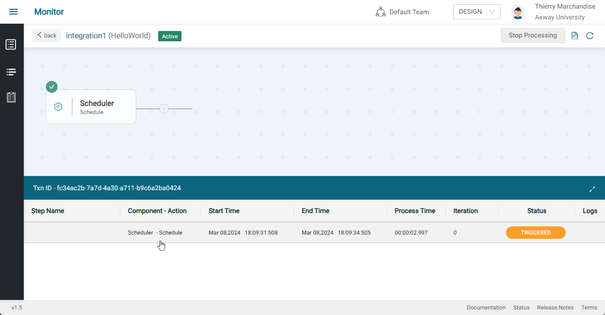
  

Your final integration should look like this:


## Lab 2

In this lab, we'll add an HTTP/S Client component (and associated connection) to our integration and test it.

Continue from Lab 1

* Add an HTTP/S Client Post Component
  
* Label the component "Send to webhook site"
  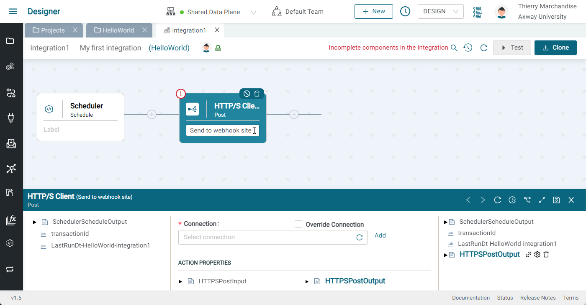
* Expand bottom panel
  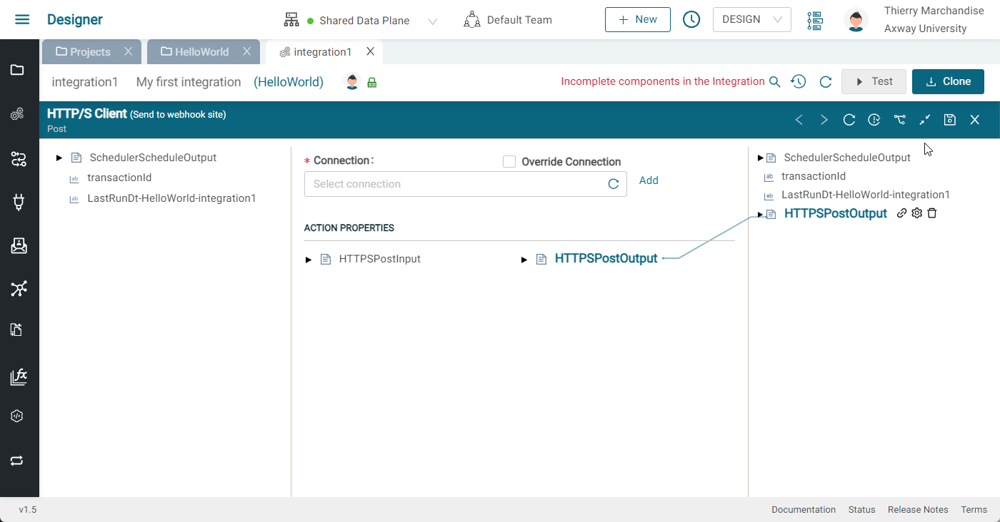
* Click Add on Connection
  * Provide a name and description (webhook site)
  * Select https
  * Paste url for webhook site (WITHOUT THE `https://` PROTOCOL )
  * Select Basic Authentication
  * Enter username and password (abcd/1234)
  * Set / as safe path
  * Click update
    
  * Click test and make sure you get a green check
  * Close tab
* Go back to integration -> HTTP/S Client POST Component, click refresh in the Connection picker and select the Connection we just made
* Expand the HTTPSPostInput flyout in the ACTION PROPERTIES section
* Right click on body and select Set Value
* Enter simple JSON body and press Save


  ```json
  {
    "text": "Hello world"
  ‌}
  ```

* Right click on basePath and select Set Value
* Enter any base path (e.g. /v1/message)
  
* Click save on the panel
* Click the Test button to test your flow
* See results in webhook site and see the resource path, Authorization Header and body
  

Your final integration should look like this:


## Lab 3

In this lab, we'll replace the Scheduler component event trigger with an HTTP/S Server component (and associated connection) and test it.

Continue from Lab 2

* Delete the Scheduler Event trigger (first component)
* Click the Event button and select an HTTP/S Server Get trigger
  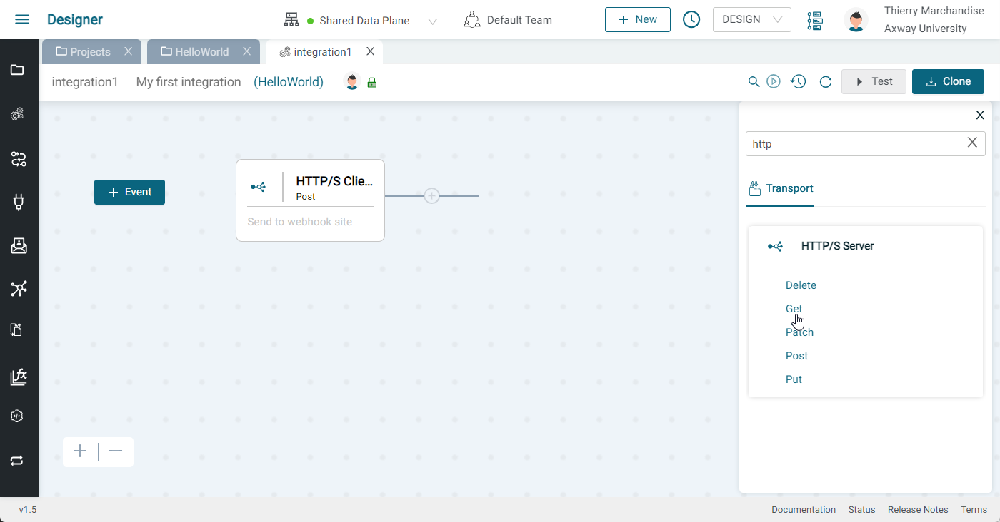
  
* Click add on Connection
  * Provide a name and description (e.g. HTTPS Server) and press Select
  * Select HTTPS
  * Leave authentication as None
  * Click Update
  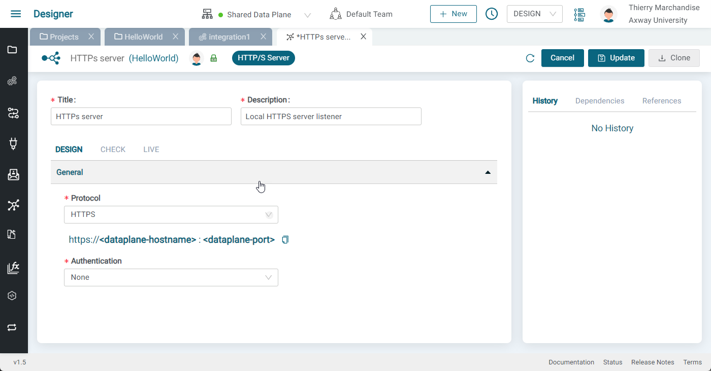
  * Close tab
* Go back to integration and open the HTTP/S Server GET Component. click refresh and select the Connection we just created
* Add a resource path (e.g. checkvalue). Note that the name must be unique
* Add a query parameter (e.g. value)
  
* Click Save 
* Label the HTTP/S Server Get component "Receive check request"
* Click on the HTTP/S Client POST component (Send to webhook site) and expand the bottom panel
* Expand the HTTPSPostInput flyout in the ACTION PROPERTIES section
* Click the delete button on the body to remove the former static value
* Expand the HTTPSServerGetOutput flyout and the queryParams flyout on the left hand side of the panel
* Drag value over to body and click save
  
* Click the Test button to test your flow and see that you cannot do that. We will need to trigger our integration with an API call
* Activate the integration on the data plane with the toggle switch
  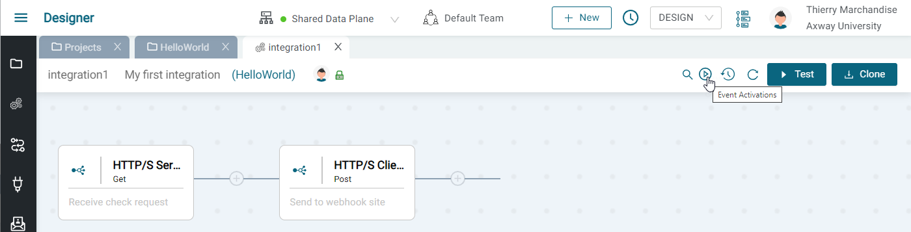
  
* Copy the endpoint URL of the integration on the data plane  
  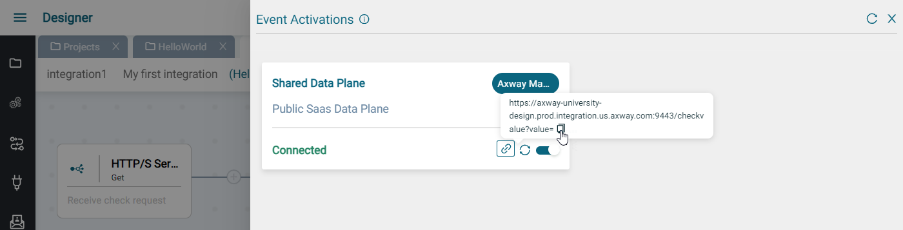
* In a separate browser tab paste the URL and enter a value for value (e.g. 10)
* See results in webhook site and see that the body should be equal to the value you provided as a query parameter
  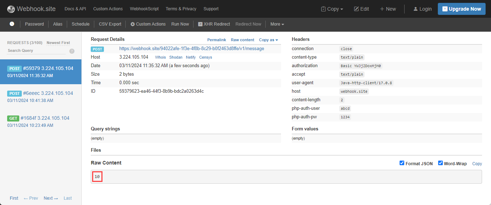
* Go to the Monitor and view the transaction and explore the information there that is useful for debugging
  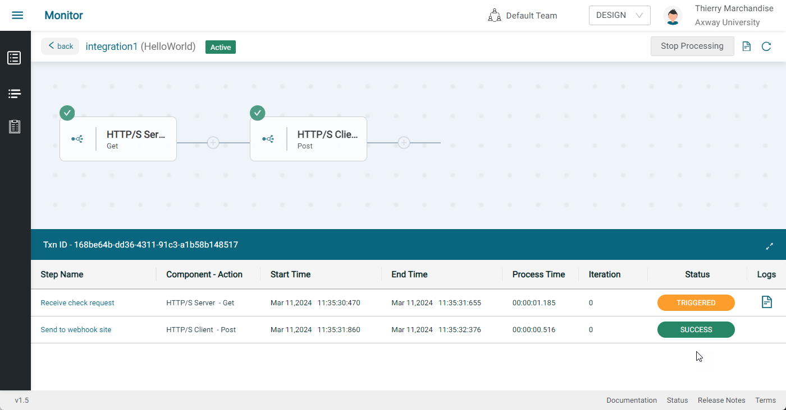
  


Your final integration should look like this:


## Lab 4

In this lab, we'll add some flow control logic and variables to our integration and test it.

Continue from Lab 3

* Disable the integration so it can be edited
* Click the `+` sign between the two components and add an if-else
  
* Expand the If-else and label it "check value"
  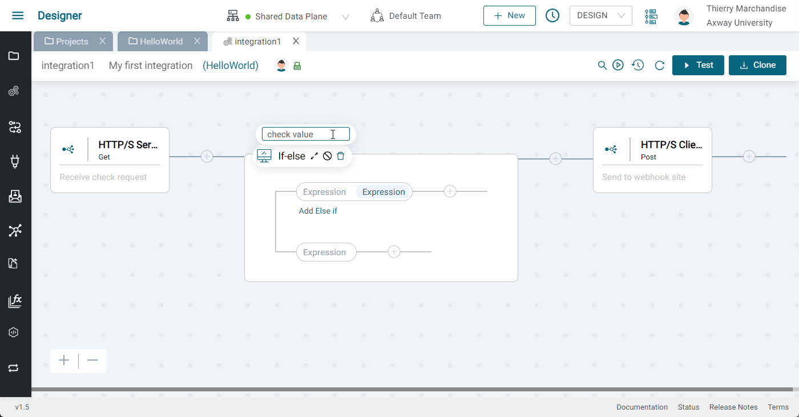
* click on Expression
  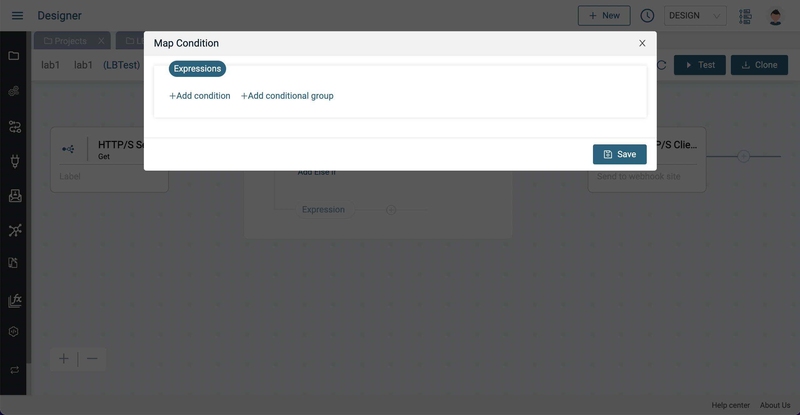
* Add a condition and set the expressions condition so that it checks if `value` is greater than 10
  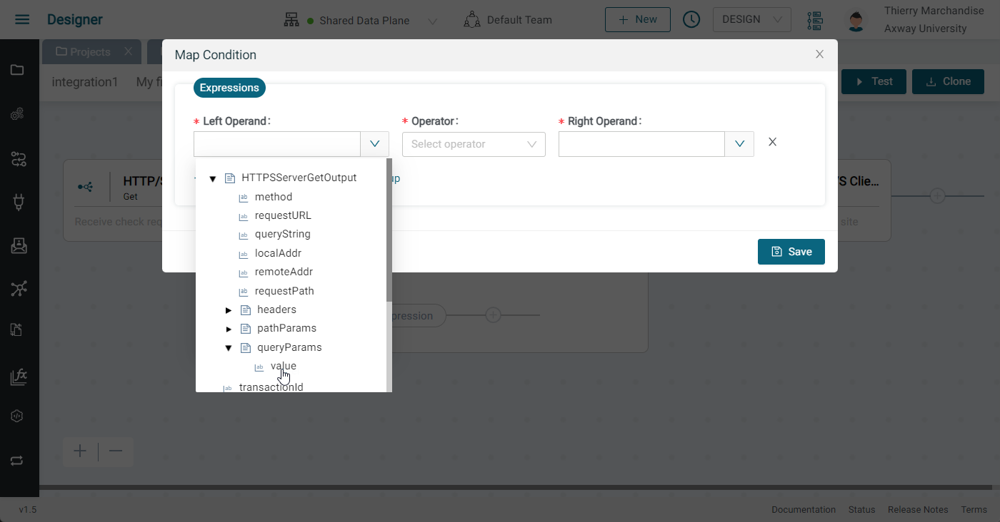
  
* Drag the webhook HTTP/S Client POST component inside the "if true" path (on the top line, after the expression)
  
  
* Activate your integration and trigger it with values greater than and less than 10 to see that only those greater than 10 are sent to webhook site. Verify by inspecting the transaction in the Monitor.

Your final integration should look like this:


Note that is recommanded to set labels to every step for an easier understanding and monitoring of each integration.
