# Hello World

Dans cet exercice, nous partirons de zéro et construirons quelques intégrations très simples.
À travers ces étapes, vous apprendrez ce qui suit :

* Deux façons de déclencher une intégration (Webhook et Scheduler)
* Comment visualiser l'exécution de l'intégration
* Comment activer/désactiver les intégrations
* L'évènement déclencheur HTTP/S Server et les composants HTTP/S Client et If-Else
* Comment créer une connexion HTTP/S Server et HTTP/S Client 
* Comment utiliser les fonctions glisser-déposer pour configurer les composants.

Au cours des étapes de l'exercice, prenez le temps d'explorer davantage les éléments liés à ce sur quoi vous travaillez. Par exemple, lorsqu'il vous est demandé d'ajouter un composant if-else, n'hésitez pas à parcourir les autres composants disponibles.


## Pré-requis

Avant de démarrer cet exercice assurez vous d'avoir:

* Un Accès à Amplify Integration
  > Si vous n'avez pas de compte, veuillez contacter **[amplify-integration-training@axway.com](mailto:amplify-integration-training@axway.com?subject=Amplify%20Integration%20-%20Training%20Environment%20Access%20Request&body=Hi%2C%0D%0A%0D%0ACould%20you%20provide%20me%20with%20access%20to%20an%20environment%20where%20I%20can%20practice%20the%20Amplify%20Integration%20e-Learning%20labs%20%3F%0D%0A%0D%0ABest%20Regards.%0D%0A)**  par mail avec en objet `Amplify Integration Training Environment Access Request`
* Un accès à [**Webhook.site**](https://webhook.site/) que vous pourrez utiliser pour envoyer des requêtes d'API afin de les analyser. Vous pouvez également utiliser un outil équivalent tel que [**typedwebhook**](https://typedwebhook.tools/) ou d'autres que vous préféreriez.

## Se connecter

* Se connecter à Amplify Integration

  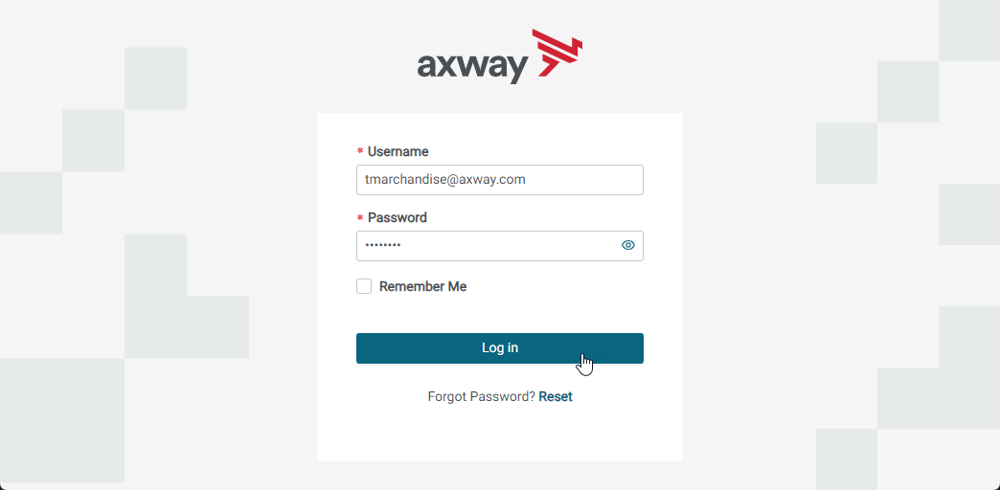

* Cliquer sur Designer

  

* Étendre le panneau du menu de gauche

  

* Sélectionner Projects

  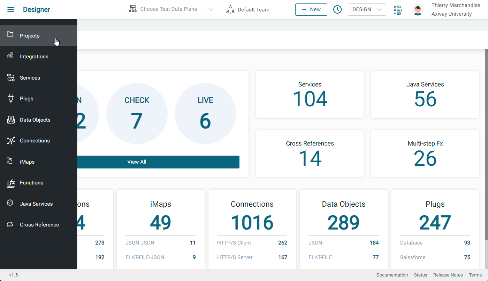

* Cliquer sur  Create pour commencer un nouveau projet

  

* C'est ici que nous ferons notre travail de conception (Design)

  

Les étapes ci-dessous ont pour but d'être exploratoires. Les instructions principales sont fournies mais vous devrez chercher vous même comment les réaliser.

## Étape 1

Dans cette étape, nous allons créer une intégration qui est déclenchée par un scheduler et la tester.

* Créer une integration
* Ajouter un Scheduler comme évènement déclencheur
  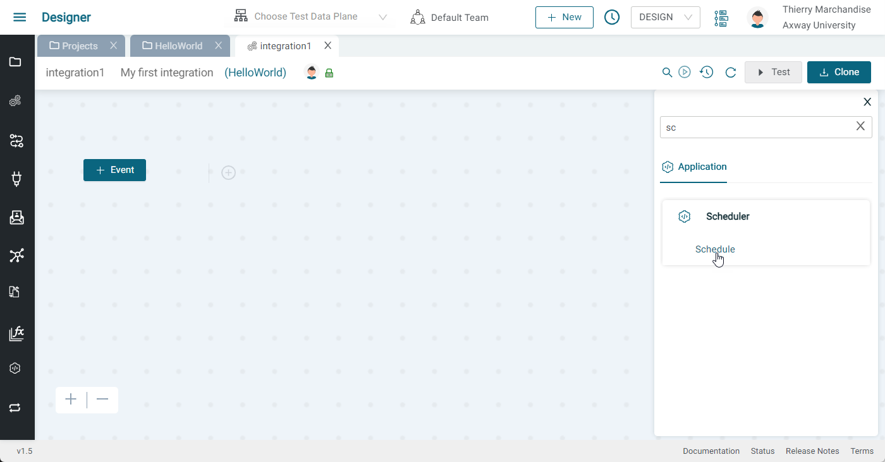
  
  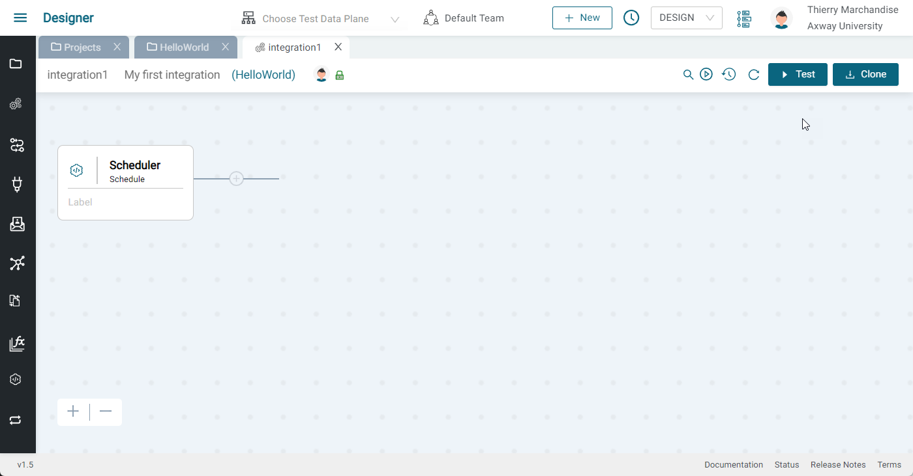
* Choisir un test data plane (si pas encore sélectionné dans la barre supérieure)
  
* Cliquer sur Test
* Visualiser la transaction dans le Monitor (ou actualiser jusqu'à la voir)
  
  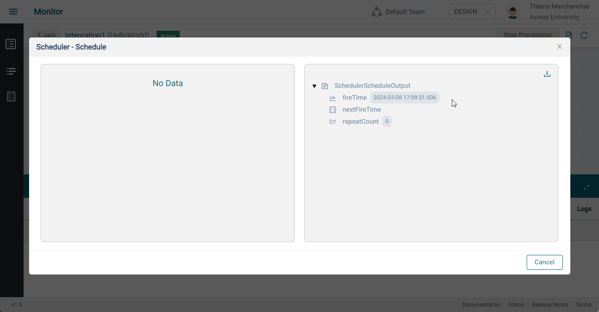

L'intégration finale doit ressembler à ceci:


## Étape 2

Dans cette étape, nous allons ajouter un composant HTTP/S Client (et la connexion associée) à notre intégration et la tester.

Continuer à partir de l'étape 1

* Ajouter un composant HTTP/S Client Post

  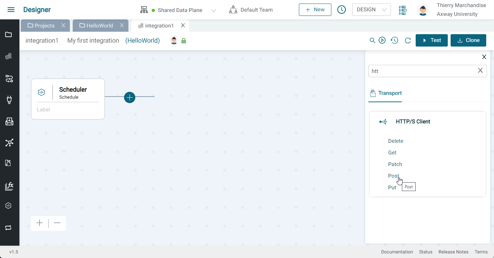
  
* Étiqueter le composant "Send to webhook.site"

  

* Étendre le panneau inférieur

  

* Cliquer sur Add dans Connection
  * Donner un nom et une description (par ex: webhook.site)
  * Sélectionner https pour le protocol
  * Coller l'url provenant de webhook.site (Sans le protocole `https://` )
  * Selectionner  Basic dans Client Authentication
  * Entrer un nom d'utilisateur et un mot de passe (par ex: abcd/1234)
  * Entrer `/` pour le safe ressource path
  * Cliquer sur update
  * Cliquer sur Test (une coche verte doit apparaître près du bouton Test)
  * Fermer l'onglet

  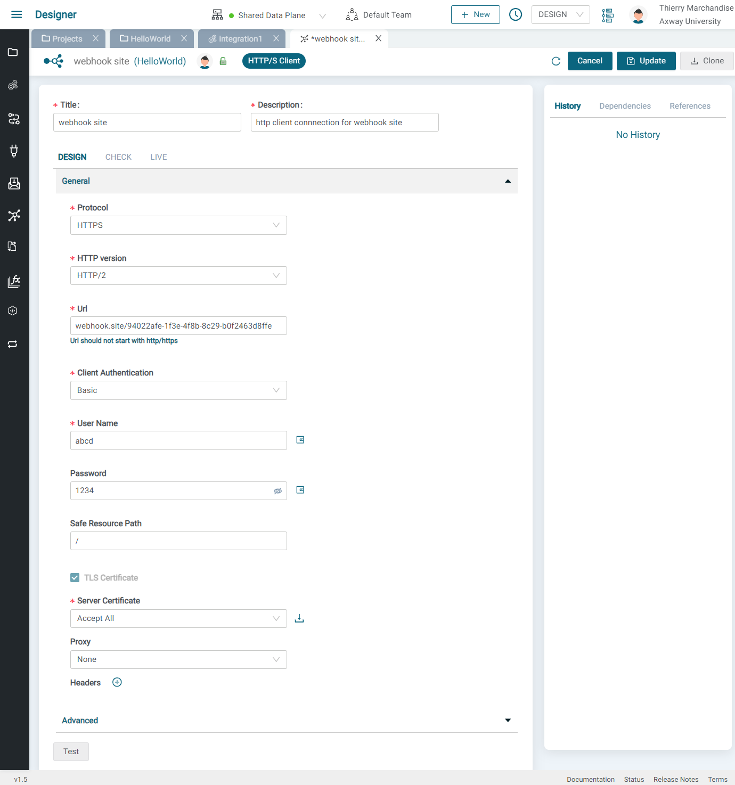

 
* Retourner à l'intégration -> HTTP/S Client POST Component, cliquer sur refresh dans le selecteur de connexion et choisir la connexion que nous venons de créer
* Développer HTTPSPostInput dans la section ACTION PROPRETIES
* Faire un clic droit sur body et sélectionner Set Value
* Entrer le texte JSON suivant et appuyer sur Save


  ```json
  {
    "text": "Hello world"
  ‌}
  ```

* Faire un clic droit sur basePath et sélectionner Set Value 
* Entrer n'importe quel base path (par ex: /v1/message)
  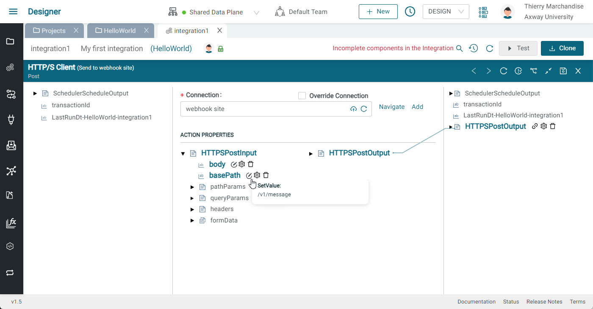
* Cliquer sur Save en haut à droite du panneau
* Cliquer sur Test pour tester votre flux
* Les résultats, le ressource path, le body et le Authorization Header sont visibles sur webhook.site
  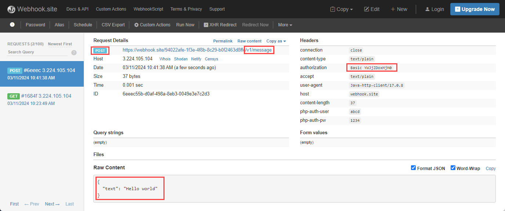

L'intégration finale doit ressembler à ceci:


## Étape 3

Dans cette étape, nous remplacerons l'évènement déclencheur Scheduler par un évènement déclencheur HTTP/S Server (et la connexion associée) puis nous le testerons.

Continuer à partir de l'étape 2 

* Supprimer l'évènement Scheduler (premier composant)
* Cliquer sur le bouton Event et sélectionner HTTP/S Server Get
  
  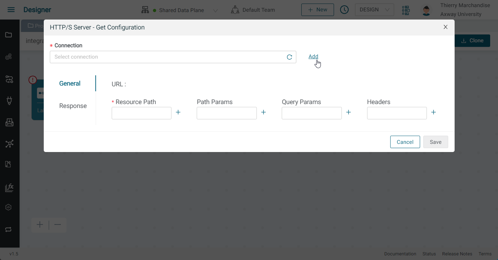
* Cliquer sur Add dans Connection
  * Donner un nom et une description (par ex: HTTPS Server) puis appuyer sur Create
  * Sélectionner HTTPS pour le protocole
  * Laisser None pour l'Authentication
  * Cliquer sur Update
  
  * Fermer l'onglet 
* Revenir à l'intégration et ouvrir le composant HTTP/S Server Get. Cliquer sur Refresh et sélectionner la connexion que nous venons de créer.
* Ajouter un resource path (par ex: checkvalue). Notez que le nom doit être unique, pour en être sûr entrez par exemple checkvalue suivi de vos initiales
* Ajouter un query parameter (par ex: value)
  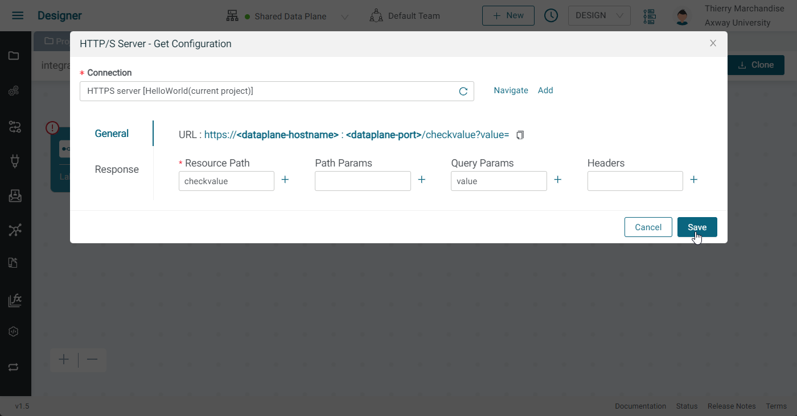
* Cliquer sur Save 
* Etiqueter le composant HTTP/S Server Get "Receive check request"
* Cliquer sur le composant HTTP/S Client Post ("Send to webhook.site") et développer le panneau inférieur
* Développer HTTPSPostInput dans la section ACTION PROPRETIES
* Cliquer sur le bouton Delete dans body pour supprimer l'ancienne valeur statqique 
* Développer HTTPSServerGetOutput et queryParams sur le côté gauche du panneau
* Tirer une ligne de value jusqu'à body et cliquer sur Save 
  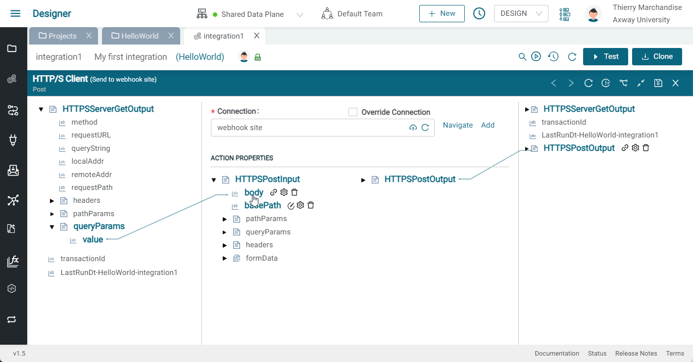
* Appuyez sur Test pour vérifier le flux. Nous constatons qu'il n'est pas possible de le faire pour le moment. Nous devrons activer notre intégration avec un appel d'API.
* Activer l'intégration sur le data plane avec l'interrupteur à bascule
  
  
* Copier l'URL de l'intégration sur le data plane 
  
* Dans un autre onglet du navigateur, coller l'URL et entrer une valeur pour value (par ex: 10)
* Consulter les résultats sur webhook.site, le body doit être égal à la valeur fournie en tant que query parameter 
  
* Aller sur le  Monitor, visualiser la transaction et explorer les informations utiles pour le débogage
  
  


L'intégration finale doit ressembler à ceci:


## Étape 4

Dans cette étape, nous allons ajouter une logique de contrôle de flux et des variables à notre intégration puis la tester

Continuer à partir de l'étape 3

* Désactiver l'intégration afin de pouvoir la modifier 
* Cliquer sur le signe `+`entre les deux composants et ajouter un If-else
  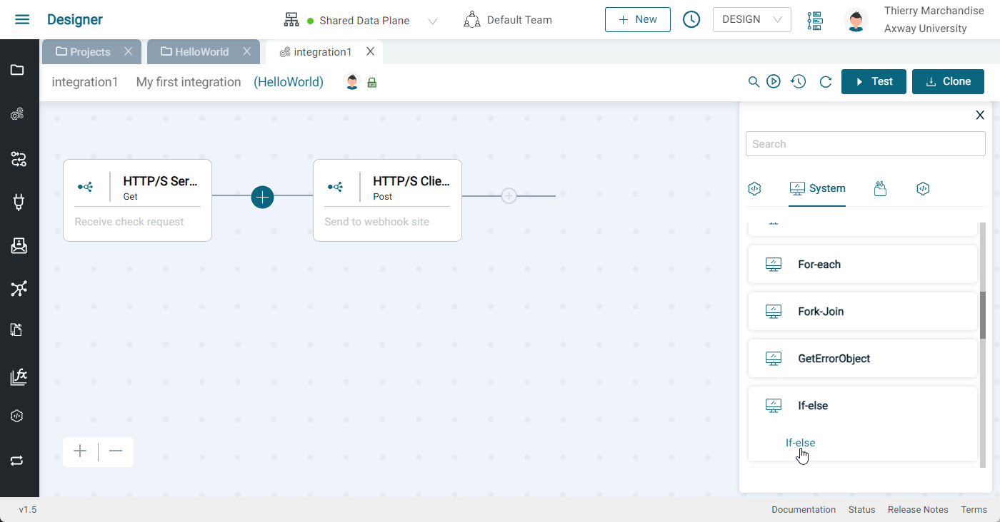
* Développer le If-else et l'étiqueter "check value"
  
* Cliquer sur Expression
  
* Ajouter une condition et configurer la condition afin qu'elle vérifie si `value` est supérieure à 10
  
  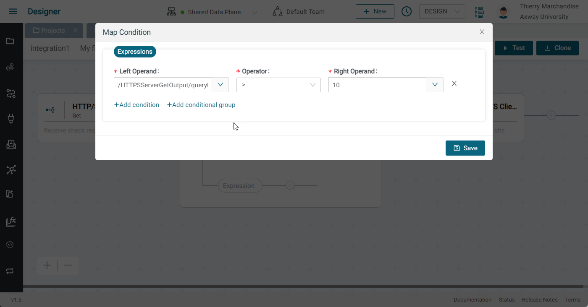
* Faire glisser le composant POST du webhook HTTP/S Client à l'intérieur du chemin « if true » (sur la ligne supérieure, après Expression)
  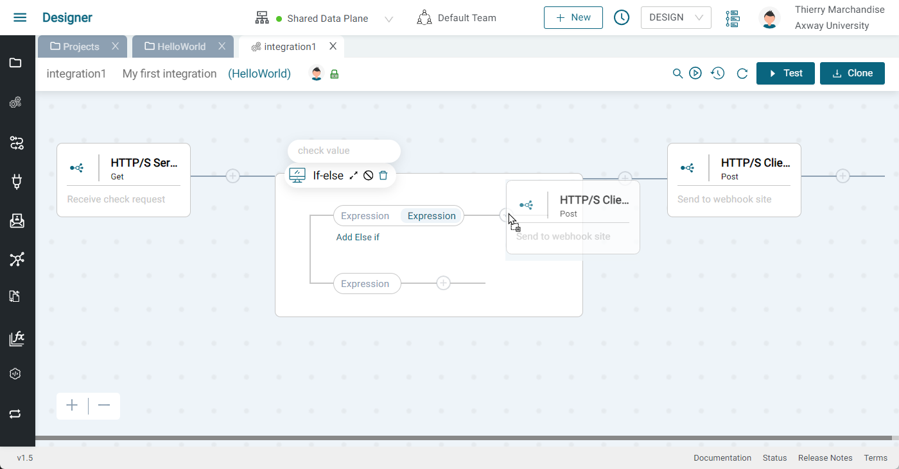
  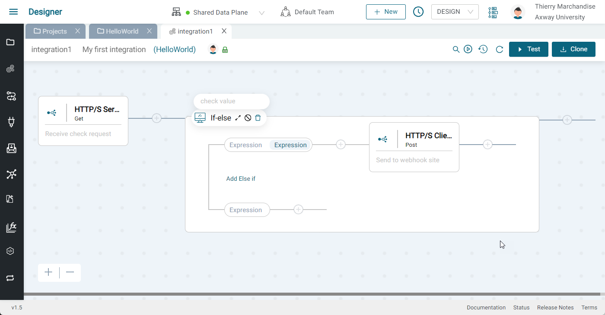
* Activez votre intégration et déclenchez-la avec des valeurs supérieures et inférieures à 10 afin de  vérifier que seules les valeurs supérieures à 10 sont envoyées à webhook.site. Vérifiez le en inspectant la transaction dans le moniteur.

L'intégration finale doit ressembler à ceci:

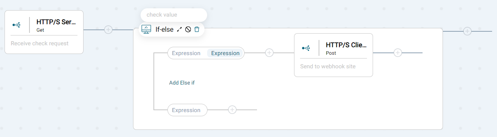
        
À noter qu'il est recommandé d'étiqueter chaque étape afin de faciliter la compréhension et le suivi de chaque intégration.