# Contact MCP Server Management Lab

## Introduction

In these labs, we'll create a Contact MCP Server to proxy a backend Contact API and expose some of the existing operations to an MCP client.

The MCP Server we are building will provide the following toom:

* Check email validity
* Find contact details
* Update Contact Information

This data flow is illustrated below:


In this set of labs, you will learn the following:

* How to create an MCP server
* How to add and implement MCP tools
* How to activate and test an MCP server

## Prerequisites

* Access to Amplify Fusion
  > If you do not have an account and need one, please send an email to **[amplify-fusion-training@axway.com](mailto:amplify-fusion-training@axway.com?subject=Amplify%20Fusion%20-%20Training%20Environment%20Access%20Request&body=Hi%2C%0D%0A%0D%0ACould%20you%20provide%20me%20with%20access%20to%20an%20environment%20where%20I%20can%20practice%20the%20Amplify%20Fusion%20e-Learning%20labs%20%3F%0D%0A%0D%0ABest%20Regards.%0D%0A)** with the subject line `Amplify Fusion Training Environment Access Request`

* An AI app with free subscription that supports adding custom MCP server or test MCP client:
  * Mistral:   https://chat.mistral.ai/ 
  * Claude Desktop: 
    * Make sure you have node.js installed, or install it from https://nodejs.org/en/download
    * Install Claude for Desktop from https://claude.ai/download     
  * Postman: use MCP request type

* The connection details to the [Wiremock Contact API](https://app.wiremock.cloud/mock-apis) from the completed [API Management lab](../api-management)

## Lab 1

In this lab, we will implement an MCP server with a first basic tool.

* Create a new Amplify Fusion project to manage this MCP server. Use a unique name in case you're not the only one doing this lab on your tenant (e.g., XX_MCPserver with XX being your name or initials).\
  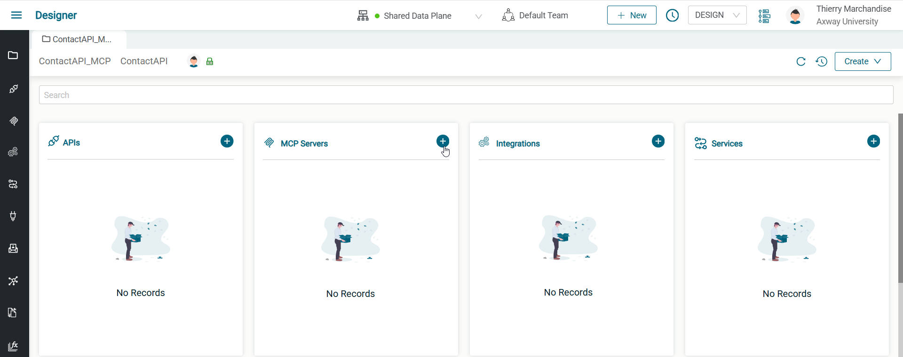

* Create a new MCP server (e.g., Contact Fusion MCP server) .

* Edit the MCP server configuration to set a front-end base path. Use a unique name in case you're not the only one doing this lab on your Amplify Fusion tenant (e.g., XX_mcp).
  

Let's add the "Check email" tool:

* Click on Add Tool.
  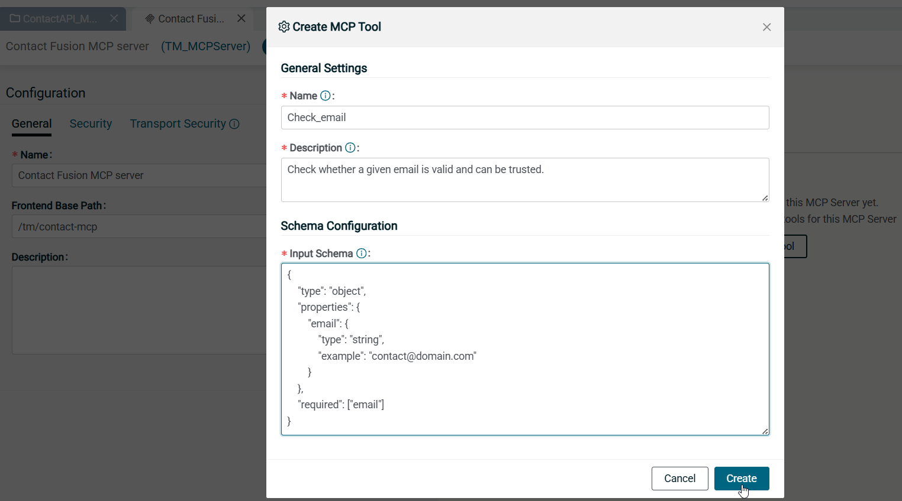
  * Give it a name "_Check_email_"
  * Provide a precise description like "_Check whether a given email is valid and can be trusted._"
  * Define the input Json schema using this example:
      ```json
      {
          "type": "object",
          "properties": {
              "email": {
                  "type": "string",
                  "example": "contact@domain.com"
              }
          },
          "required": ["email"]
      }
      ```
* Link the tool to an integration
  * Click on the Link icon to add an integration
  * Choose Create a new integration. Name it "_McpTool_CheckEmail_"
  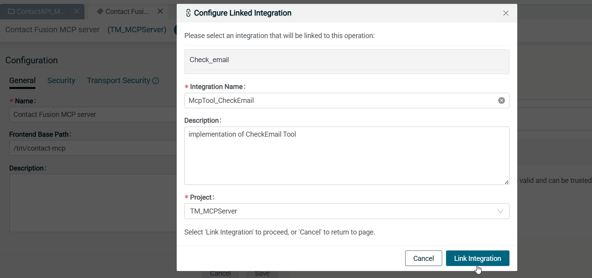

* The integration is ready to be implemented
  * Extand the Tools component
  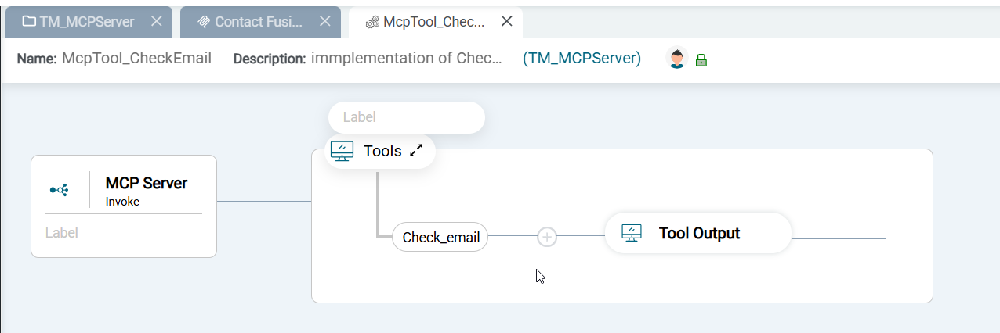
  * Add an if-else component
  * Set the expression with 2 conditions on the email received in the request\
      "/Check_emailMCPServerRequest/body/email" \<ends with\> "@axway.com" \
      OR \
      "/Check_emailMCPServerRequest/body/email" \<ends with\> "@74sofware.com"
  * Set a map component on the "if" routes, with
      * Set the value of output node "/toolResponseType" "TextContent"
      * Set the value of output node "/Check_emailMCPServerResponse/TextContent/result/content[]/text" to "This email can be trusted as its email domain is whitelisted"      
    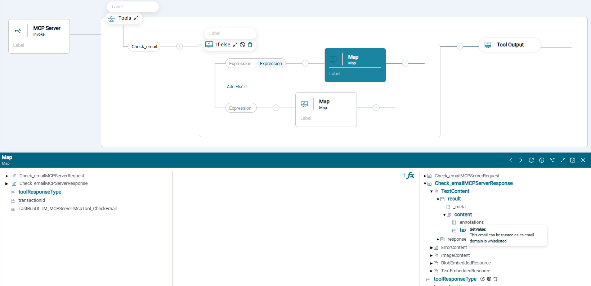
  * Set a map component on the "else" routes, with
      * Set the value of output node "/toolResponseType" "TextContent"
      * Set the value of output node "/Check_emailMCPServerResponse/TextContent/result/content[]/text" to "This email cannot be trusted as its email domain is unknown. Please contact the organization adminstrator if you think this should be trusted."
  * Add some labels to each step to ease the monitoring  
      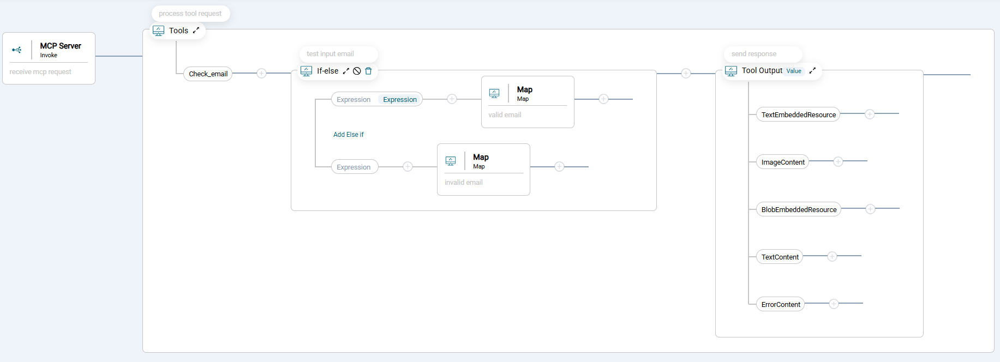
      
* Go back to your MCP server and activate it
* Copy the MCP server url 
      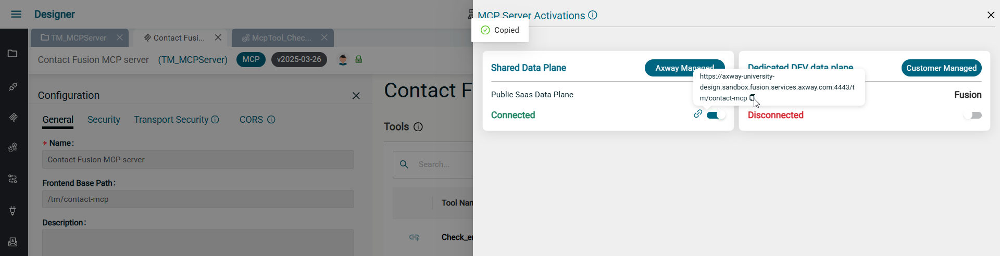

* Add the MCP in your client app
  * Mistral:  
      * Go to https://chat.mistral.ai/connections 
      * Click on "Add connector"
      * Select "Custom MCP connector"
      * Set the name to "Contacts-Fusion-MCP-Server"
      * Paste the coppied url in Connector Server
      * Click Create
      * You should see the MCP Server at the bottom of the app page, with the status "connected" and the list of tools.
      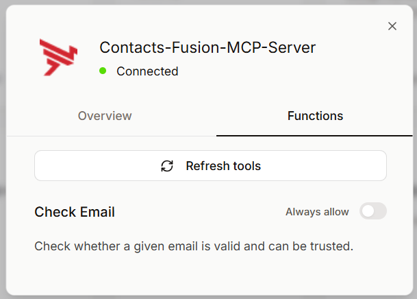
  * Claude Desktop: 
    * Edit the Config file from File Menu > Settings > Developpers
    * Add the MCP server details to the config file (claude_desktop_config.json)
      ``` json
        {
          "mcpServers": {
            "Contacts-Fusion-MCP-Server": {
              "command": "npx",
              "args": [
                "mcp-remote",
                "https://<your fusion-data-plane>:4443/<mcp-basepath>"
                ]
              }
          }
        }
      ```
      Replace the URL by the one you copied previously. 
    * Save the file changes
    * Restart Claude Desktop
    * Go back to File Menu > Settings > Developpers, and make sure the MCP server status is "running"
      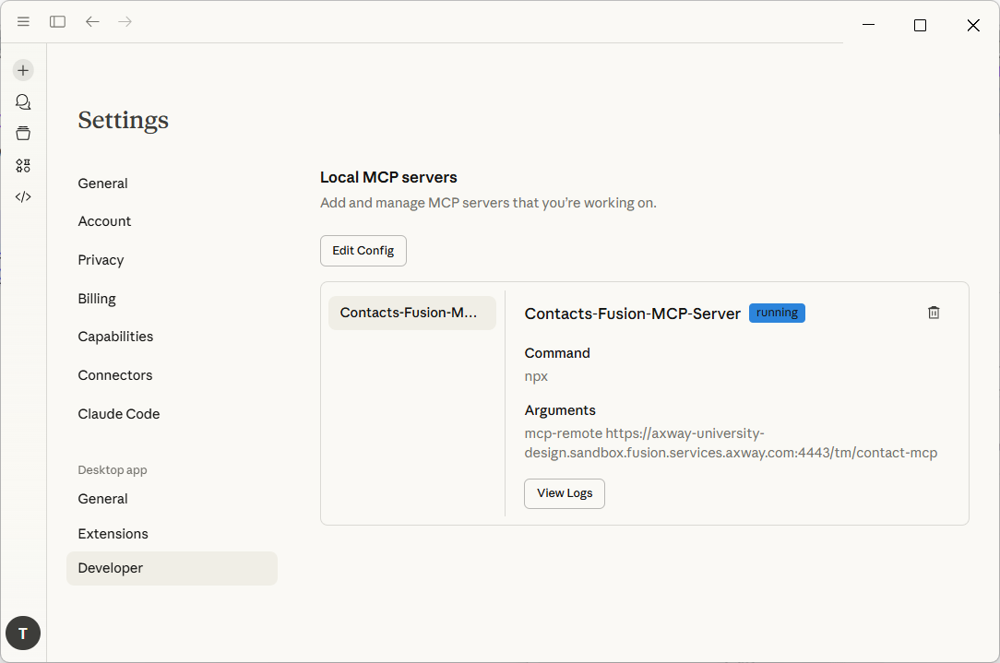
  * Postman: 
    * create a new request 
    * Change request type to MCP, if not done yet
    * Paste the url 
    * Click connect
    * You should see "connected" status
      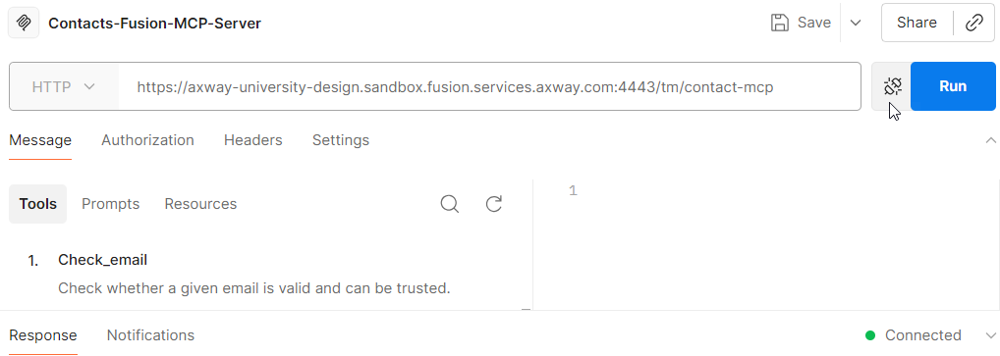

* Test the MCP server
  * with claude/mistral: start a new chat, make sure to enable the use of your MCP server in the chat and sent the prompt "Is "abc@test.com" a valid email?" or "Check "contact@axway.com"
  
      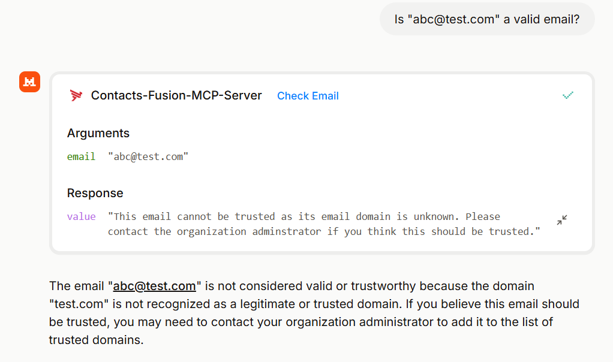      
      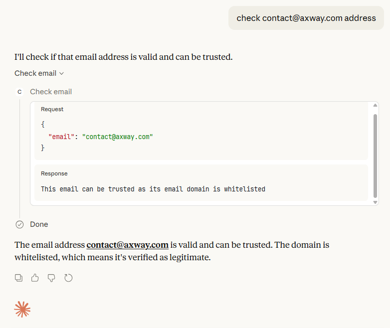
  * with postman: select the "check email" tool and test various email address
      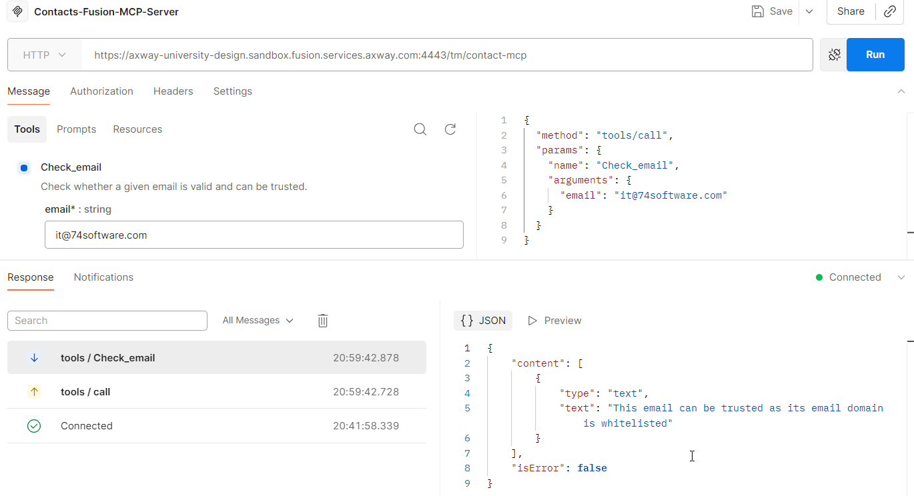

* Once you've checked one or 2 emails address, go the Monitoring module in Studio and find the details of the transactions
    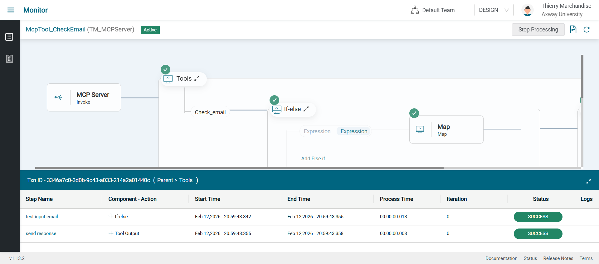

## Lab 2
* Go back to your MCP server in your Amplify Fusion project in the Designer
* Deactivate the MCP server from the data plane

* Click on Add Tool
  * Give it a name "_Update_contact_"
  * Provide a precise description like "_Change contact email. This can be done only by providing the contact ID and the new email address. The new email should be checked previously to ensure it can be trusted._"
  * Define the input Json schema using this example:
      ```json
      {
        "type": "object",
        "properties": {
          "id": {
            "type": "integer",
            "description": "Unique identifier of an existing contact"
          },
          "email": {
            "type": "string",
            "description": "New email that will replace the previous one",
            "format": "email",
            "examples": ["contact@axway.com"]
          }
        },
        "required": ["id", "email"]
      }
      ```
  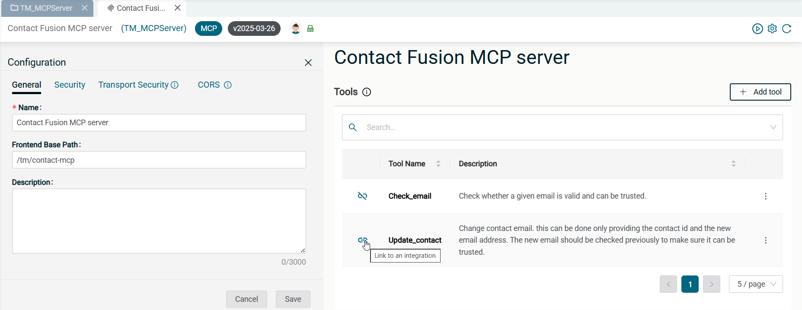
* Link the tool to an integration
  * Click on the Link icon to add an integration
  * Choose Create a new integration. Name it "_McpTool_UpdateContact_"

* The ingration is ready to be implemented
  * Extand the Tools component
  * Add an OpenAPI client step
    * Click "Add" next to Connection dropdown list
  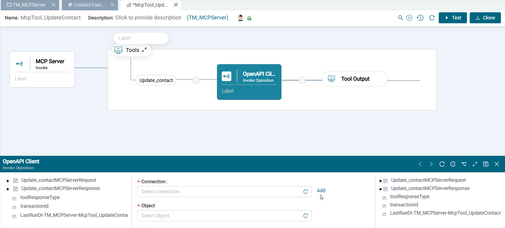
  * Create the "Contact API" connection
    * Upload the OpenAPI File: (ContactAPI.yaml)[../api-management/assets/ContactAPI.yaml]
    * Set Host the wiremock api base URL
    * Set Client Authentication to "API key". Choose Key location header, Key name="apikey" and Key value="Access2backend"
    * Set a Safe resource path to "/contacts"
    * Save and Test the connection
  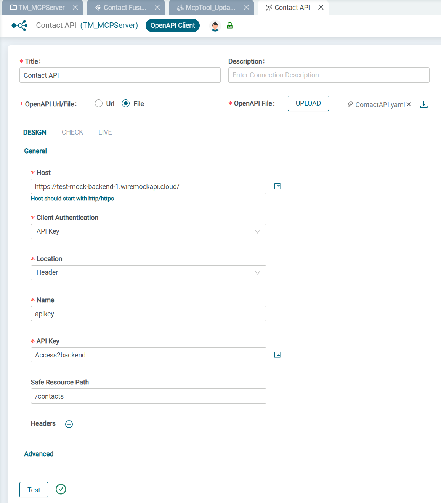    
  * Go back to OpenAPI client step of the tool integration
    * Expand the bottom panel
    * Choose the "Contact API" just created as connection
    * Choose "Contacts" as object
    * Choose "patch-contacts-contactId" as actions
      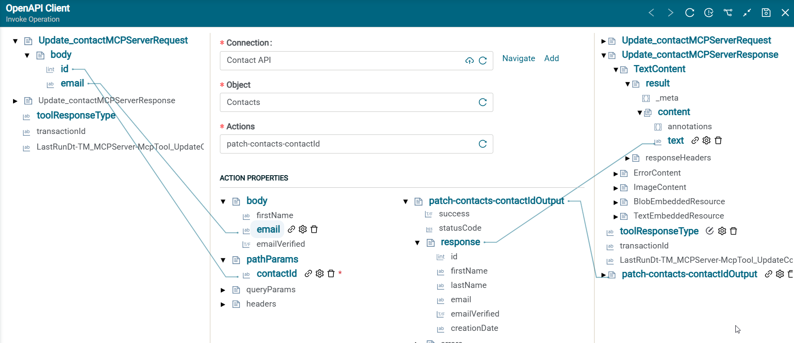  
    * Map the pipeline input to the action input:
      * /Update_contactMCPServerRequest/body/id to /pathParams/contactId
      * /Update_contactMCPServerRequest/body/email to /body/email
    * Map the action output to the pipeline output:
      * /patch-contacts-contactIdOutput/response to /Search_ContactsMCPServerResponse/TextContent/result/content[]/text
    * Set the value of the pipeline output variable /toolResponseType to "TextContent" 
    * Save the component configuration
      
* Go back to your MCP server and activate it

* Refresh the MCP connection from the client:
  * Mistral: Go to the connection and click refreh tools
  * Claude Desktop: Refresh with Ctrl+R or restart
  * Postman: Disconnect and Reconnect

* Test the update MCP server
  * with claude/mistral: sent a new prompt to update Alice's email 
      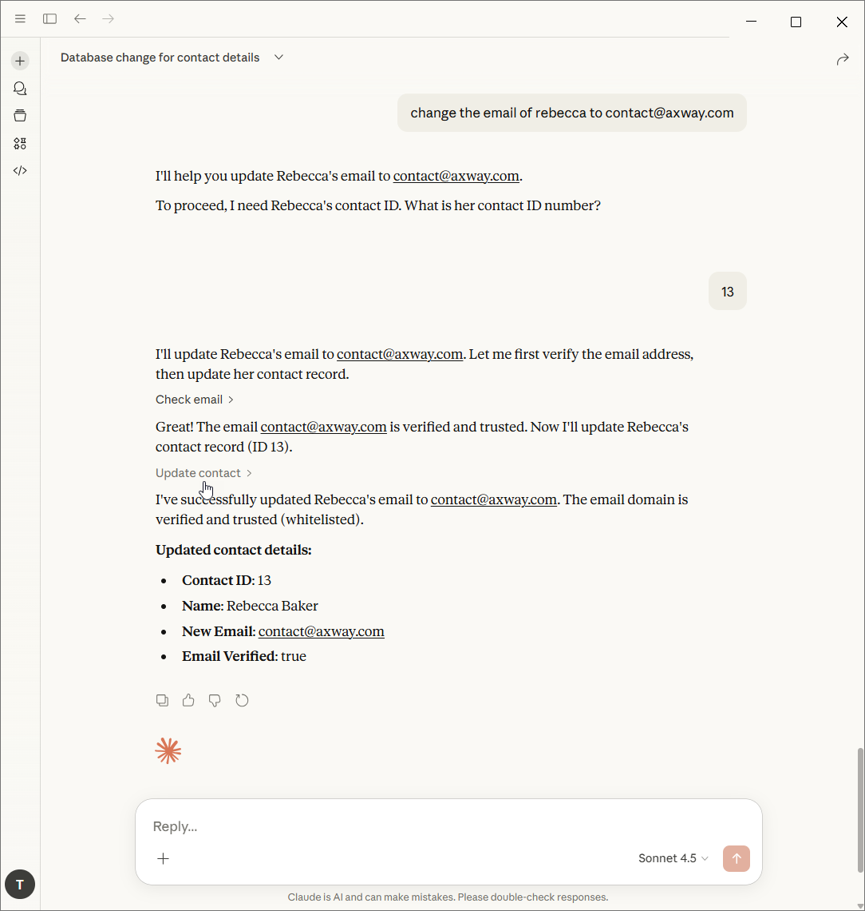  
  * with postman: select the "update email" and test with required parameters

* Once you've done a successful update, go the Monitoring module in Studio and find the details of the transaction
    

## Lab 3
* Go back to your MCP server in your Amplify Fusion project in the Designer
* Deactivate the MCP server from the data plane

* Click on Add Tool
  * Give it a name "_Search_Contacts_"
  * Provide a precise description like "_Find contact details based on either the first name, last name, or email address._"
  * Define the input Json schema using this example:
      ```json
      {
        "type": "object",
        "properties": {
          "firstName": {
            "type": "string",
            "description": "Search by first name. May return multiple results",
            "minLength": 1,
            "maxLength": 80,
            "pattern": "^[\\p{L}][\\p{L} '\\-]*[\\p{L}]$"
          },
          "lastName": {
            "type": "string",
            "description": "Search by last name. May return multiple results",
            "minLength": 1,
            "maxLength": 80,
            "pattern": "^[\\p{L}]+([\\p{L} '\\-]*[\\p{L}]+)?$"
          },
          "email": {
            "type": "string",
            "description": "Search by email. Usually returns a unique contact",
            "format": "email",
            "examples": ["contact@axway.com"]
          }
        }
      }
      ```
* Link the tool to an integration
  * Click on the Link icon to add an integration
  * Choose Create a new integration. Name it "_McpTool_SearchContacts_"
  

* The ingration is ready to be implemented
  * Extand the Tools component
  * Add an OpenAPI client step
    * Expand the bottom panel
    * Choose the "Contact API" created in the previous lab
    * Choose "Contacts" as object
    * Choose "find-contacts" as actions
  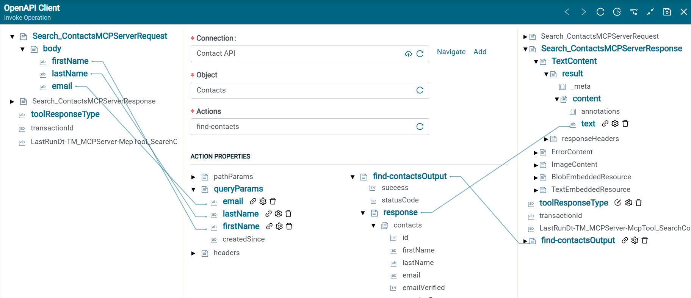
    * Map the pipeline input to the action input:
      * /Search_ContactsMCPServerRequest/body/firstName to /queryParams/firstName
      * /Search_ContactsMCPServerRequest/body/lastName to /queryParams/lastName
      * /Search_ContactsMCPServerRequest/body/email to /queryParams/email
    * Map the action output to the pipeline output:
      * /find-contactsOutput/response to /Search_ContactsMCPServerResponse/TextContent/result/content[]/text
    * Set the value of the pipeline output variable /toolResponseType to "TextContent" 
    * Save the component configuration
      
* Go back to your MCP server and activate it

* Refresh the MCP connection from the client:
  * Mistral: Go to the connection and click refreh tools
  * Claude Desktop: Refresh with Ctrl+R or restart
  * Postman: Disconnect and Reconnect

* Test the update MCP server
  * with claude/mistral: sent a new prompt to search for Rebecca's details. You can combine all tools in the same prompt.
      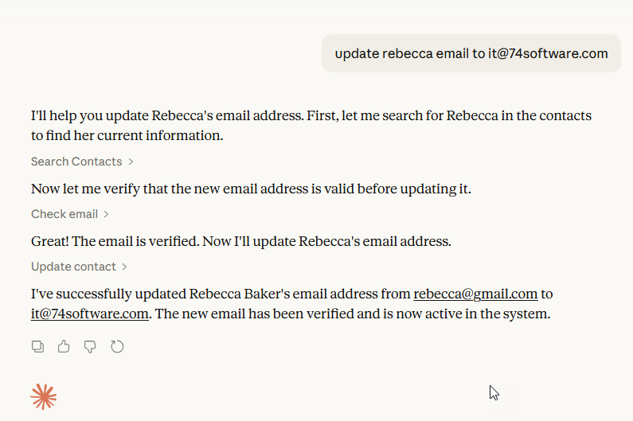  
  * with postman: select the "search contact" and test with various parameters combinations

* Once you've done a successful search, go the Monitoring module in Studio and find the details of the transaction