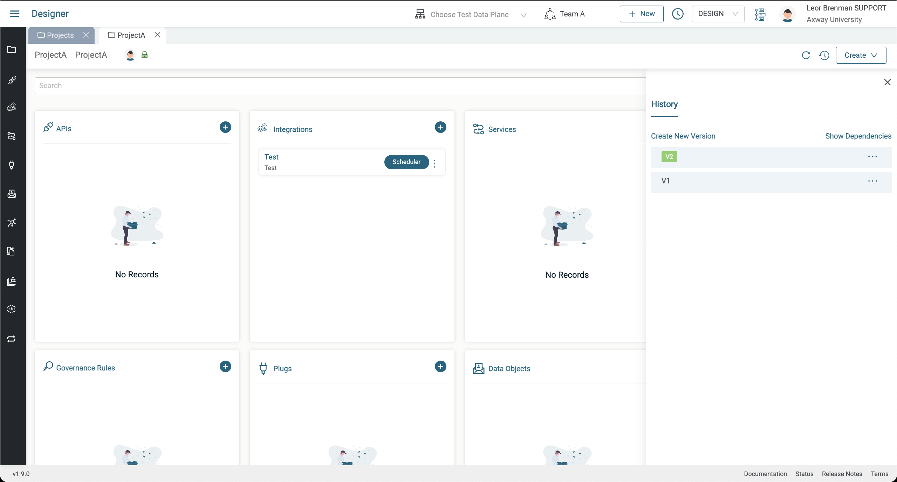
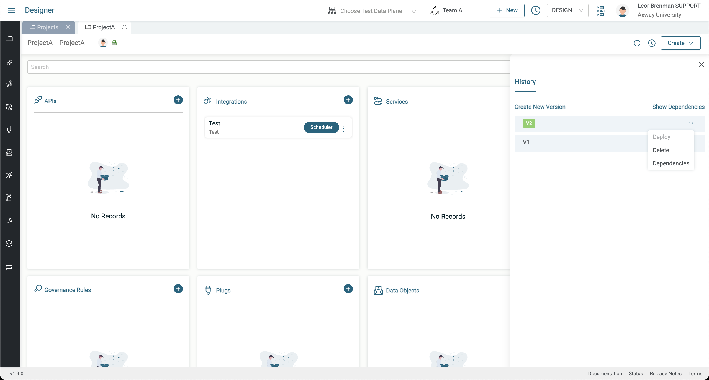
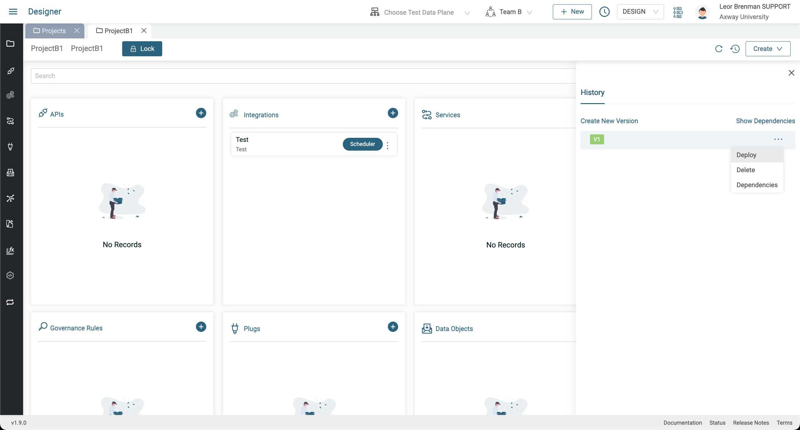
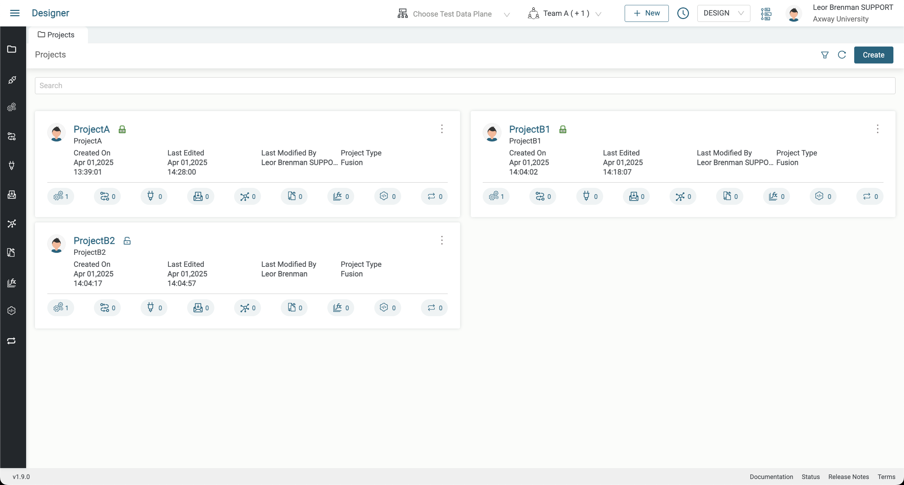

# User Management Lab

This lab demonstrates some of the user management aspects of the Manager module, namely managing Users, Roles and Teams. We will add a user with a limited default role and then add the user to two teams with different elevated team roles and see how roles and teams control visibility and capabilities of the user. You will use Incognito mode in your browser to login as the second user so you can be logged into the tenant as two different users, each with different roles at the same time. At the end of these labs, you will learn the following:

* How to invite a user to your tenant
* How user roles control access
* How to add a user to a team with specific team roles
* How to select your preferred Team

The following diagram illustrates what we will be doing in these labs.

## Pre-requisites

* Access to Amplify Fusion
  > If you do not have an account and need one, please send an email to **[amplify-integration-training@axway.com](mailto:amplify-integration-training@axway.com?subject=Amplify%20Fusion%20-%20Training%20Environment%20Access%20Request&body=Hi%2C%0D%0A%0D%0ACould%20you%20provide%20me%20with%20access%20to%20an%20environment%20where%20I%20can%20practice%20the%20Amplify%20Fusion%20e-Learning%20labs%20%3F%0D%0A%0D%0ABest%20Regards.%0D%0A)** with the subject line `Amplify Integration Training Environment Access Request`
* Familiarity with Amplify Fusion
* Suitable role to create a new user with Support Role in DESIGN, CHECK and LIVE
  
    > **Note**: You will need Super Admin role in order to add a new user; please reach out to your environment administrator to either set your role to Super Admin or create this new user for you
* Suitable role to add this user to multiple teams that you will create
    > **Note**: You will need an Admin role in order to create teams and add users to teams please reach out to your environment administrator to update your role to Admin, accordingly.
  
    > **Note**: You can ask the environment administrator to create a training environment to avoid modifications to your production environment

## Lab 1

In this lab we'll log in as a limited role user, your second user, and see how the user only has access to the Monitor module since they have the Support role.

* If your environment administrator made you Super Admin then do the following:
  * From the Manager module, Users tab, click the Invite User button add a second user with Support Role and click Send Invites
  
  
  
  
* When the invite email arrives, click the Register button in the email and complete the form (enter name, create a password, ..) and click the Sign Up button
  > **Note**: You will need to logout of Amplify Fusion prior to clicking the button or copy the button link and paste it into an a browser in Incognito mode. This will apply for all instructions related to the new user
  
  
* You will receive a second email confirming account creation with a link to the tenant
  
* Login as second user using your Browsers Incognito mode and see your limited role and confirm that you don’t have access to any projects and can’t even click on the Designer and Manager module as they are greyed out
  

## Lab 2

In this lab we'll create some projects and teams and add the second user to one of the teams, Team A, with an enhanced role of Designer in DESIGN mode. Then we'll log in as the second user and see that they have limited access to projects in Team A but not the other. Also, we'll see that while they can access the project they cannot deploy it based on their team role.

* As your main user in the Designer module, create three projects, ProjectA, ProjectB1 and ProjectB2, each with a test integration with a 60 scheduler event and version each project to V1
> Note: After creating ProjectA, you can clone it to ProjectB1 and again to ProjectB2. Then go into each cloned project and version it to V1
* In the Manager module, create Team A and add ProjectA to it and click the + Add User button to add your second user and add Designer in DESIGN mode role. Click Save and Save again.

* Logout your second user and log back in again and see that you now have access to Designer and can access projA but cannot create a deployment job as you don’t have manager role

## Lab 3

In this lab we'll add the second user to another team, Team B, with an enhanced role of Designer and Deployer in DESIGN mode. Then we'll log in as the second user and see that they have limited access to ProjectB1 and ProjectB2 in Team B in addition to ProjectA in Team A. This time, they can access the projects in Team B and they can also deploy them but they cannot run the deployment job into CHECK or LIVE since they don't have Deployer access to CHECK or LIVE.

We'll also see how to use the Set Preferred Teams picker.

* As your main user, create Team B and add ProjectB1 and ProjectB2 and click the + Add User button to add your second user with additional Designer and Deployer DESIGN roles. Click Save and Save again.

* Logout your second user and log back in again

* Notice that you still don't have access to the Manager module. This is because your preferred Team is Team A
* Click the Team picker at the top and deselect Team A and select Team B and click on the Set Preferred Teams button

* This will log you out.
* Log in again and see that now you have access to the Manager module

* Click on Designer and see that you can access ProjectB1 and ProjectB2 but not ProjectA and you can create deployment jobs for them

* Click the Team picker and add teamA and click on the Set Preferred Teams button

* Click on Designer and see that you can see both projA and projB but will have different roles for each
