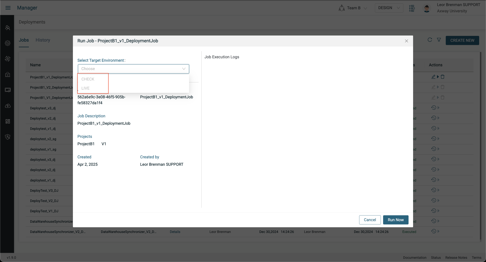

# User Management Lab

This lab demonstrates some of the user management aspects of the Manager module, namely managing Users, Roles and Teams. We will add a user with a limited default role and then add the user to two teams with different elevated team roles and see how roles and teams control visibility and capabilities of the user. You will use Incognito mode in your browser to login as the second user so you can be logged into the tenant as two different users, each with different roles at the same time. At the end of these labs, you will learn the following:

* How to invite a user to your tenant
* How user roles control access
* How to add a user to a team with specific team roles
* How to select your preferred Team

The following diagram illustrates what we will be doing in these labs.

## Pre-requisites

 * Access to Amplify Fusion
    > If you do not have an account and need one, please send an email to **[amplify-fusion-training@axway.com](mailto:amplify-fusion-training@axway.com?subject=Amplify%20Fusion%20-%20Training%20Environment%20Access%20Request&body=Hi%2C%0D%0A%0D%0ACould%20you%20provide%20me%20with%20access%20to%20an%20environment%20where%20I%20can%20practice%20the%20Amplify%20Fusion%20e-Learning%20labs%20%3F%0D%0A%0D%0ABest%20Regards.%0D%0A)** with the subject line `Amplify Fusion Training Environment Access Request`
* Familiarity with Amplify Fusion
* Your role must be Admin in DESIGN, CHECK and LIVE
* A second user with Support role in DESIGN, CHECK and LIVE.
  
  > **Note**: You can use a personal email (e.g. gmail) or a plus addresses/subaddressing using your work email (e.g. lbrenman+support@axway.com)
  
  > **Note**: You can ask the environment administrator to create a training environment to avoid modifications to your production environment

## Lab 1

In this lab we'll log in as a limited role user, your second user, and see how the user only has access to the Monitor module since they have the Support role.

* Login as second user using your Browsers Incognito mode and see your limited role and confirm that you don’t have access to any projects and can’t even click on the Designer and Manager module as they are greyed out
  

## Lab 2

In this lab we'll create some projects and teams and add the second user to one of the teams, Team A, with an enhanced role of Designer in DESIGN mode. Then we'll log in as the second user and see that they have limited access to projects in Team A but not other Projects. Also, we'll see that while they can access the project and collaborate on it, they cannot deploy it based on their team role.

You should prefix all Project and Team names with your initials (e.g. LB_ProjectA, LB_Teams A, ...) to avoid conflict when more than one user is performing this lab in the same tenant.

* As your main user in the Designer module, do the following:
  * Create ProjectA
  * Create a test integration
  * Add a scheduler as a trigger event and set it to 60 seconds
  * Clone ProjectA to ProjectB1 (deep clone not required)
  * Clone ProjectA to ProjectB2 (deep clone not required)
  * For each project, click on project history and create a new version (V1)
  * Unlock the 3 projects to enable collaboration
* In the Manager module, create Team A and add ProjectA to it and click the + Add User button to add your second user and add Designer in DESIGN mode role. Click Save and Save again.

* Logout your second user and log back in again and see that you now have access to Designer Module
* Go to the Designer Module and you should be able to see ProjectA
* Acquire the lock for Project A and do the following:
  * Open the integration and modify the Scheduler to 120 seconds
  * Version the project to V2

* See that you cannot create a deployment job as you don’t have Deployer role

## Lab 3

In this lab we'll add the second user to another team, Team B, with an enhanced role of Designer and Deployer in DESIGN and CHECK modes. Then we'll log in as the second user and see that they have limited access to ProjectB1 and ProjectB2 in Team B in addition to ProjectA in Team A. This time, they can access the projects in Team B too AND they can also create deployment jobs on Team B projects and run the deployment job into CHECK.

We'll also see how to use the Set Preferred Teams picker.

* As your main user, create Team B and add ProjectB1 and ProjectB2 and click the + Add User button to add your second user with additional Designer DESIGN and Deployer DESIGN and CHECK roles. Click Save and Save again.

* Logout your second user and log back in again

* Notice that you still don't have access to the Manager module. This is because your preferred Team is Team A
* Click the Team picker at the top and deselect Team A and select Team B and click on the Set Preferred Teams button

* This will log you out.
* Log in again and see that now you have access to the Manager module

* Click on Designer and see that you can access ProjectB1 and ProjectB2 but not ProjectA and you can create deployment jobs for them

* Click the Team picker and add teamA and click on the Set Preferred Teams button

* Click on Designer and see that you can see ProjectA, ProjectB1 and ProjectB2 but will have different roles for each
